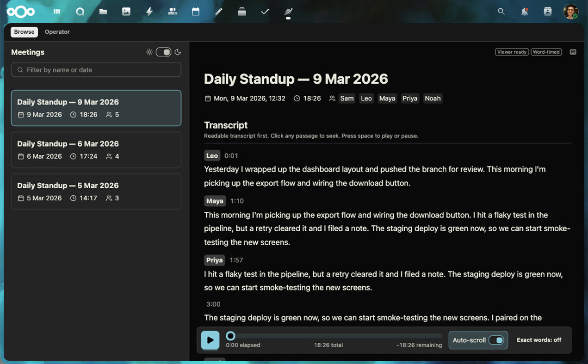

# Cassini

> [!WARNING]
> **Cassini is in beta.** We run it daily on our own Nextcloud, but expect rough edges. Read the [changelog](CHANGELOG.md) before you update, and please [open an issue](https://github.com/codemyriad/gocassini/issues) if something breaks.

**Cassini is a recording backend for Nextcloud Talk that puts you in control of your meeting data.**

- **Record and transcribe on your own infrastructure.** Cassini runs on the hardware you give
  it. Speech-to-text runs in-process with _sherpa-onnx_ and _NVIDIA Parakeet_
  models, from a CPU or a CUDA image.
- **AI is opt-in.** Summaries and LLM-powered insights run only once you configure a model -
  local or third-party - in the app.
- **A self-contained, portable meeting file**: audio, transcript, summary and
  tags are packed into one file, so you can take your meetings with you.

Meetings are where decisions get made, and these are easily lost unless someone writes it down afterwards. We believe voice is the most valuable context a team produces, and the least captured. In an LLM age you should be able to build on it without handing your meetings to a third party.

## What you get

Cassini is an ExApp which can be installed from the Nextcloud App Store. Once it's running, it shows up as a new app icon inside your Nextcloud suite:



- Works with any Nextcloud Talk room, group calls and 1:1 calls. Just press _Record_ and Cassini is listening.
- Transcripts and synced audio playback with speaker IDs.
- Configurable recording access: everyone with a Nextcloud account by default, or room-based permissions for private recordings when participant access is enabled. Public-room recordings remain visible to all signed-in accounts.
- One portable meeting file per meeting that can be opened without Cassini.
- Search and tags across meetings.
- Configure in-app AI providers for per-meeting summaries and cross-meeting insights.
- A CLI and an agent skill, to build workflows with an external harness.

## Limitations

- **No live transcription or captions.** Transcription starts after recording stops. The operator schedules processing around live recordings to protect capture.
- **Audio only.** Cassini records the video streams, but the meeting file, transcript and viewer are audio only for now.

Transcription starts off. [Configure a model with progress, or prepare and import it offline](docs/proposals/optional-transcription-model-storage/implementation.md). Models persist across application upgrades.

## What leaves your server

Recording and transcription run on your own hardware. No audio and no transcript leaves the host for those steps.

If you configure a language model, transcript text goes to it in two cases: automatically, to summarise each meeting, and on request, when someone asks a question about meetings they have access to.

There is no telemetry.

Full details are in [docs/privacy.md](docs/privacy.md).

## The meeting file

Each published meeting is one ordinary `.opus` file. Any audio player plays it.

The transcript, speaker names, summary and tags travel inside the same file, so a meeting you copy off your server is still a complete meeting, and it stays readable without Cassini.

The format is an open specification at [format.gocassini.com](https://format.gocassini.com).

What Cassini writes is described in [docs/portable-meeting-format.md](docs/portable-meeting-format.md).

## Requirements

- Nextcloud 32 to 35 with AppAPI and a HaRP deploy daemon.
- Talk with the High-performance backend (standalone signalling). Cassini joins
   calls as an internal signalling client, so it needs the signalling server's
   `internalsecret`. This is the one value you have to supply by hand.
- _Optional_: the [Team folders](https://apps.nextcloud.com/apps/groupfolders)
   and [Everyone Group](https://apps.nextcloud.com/apps/group_everyone) apps, which
   let Cassini restrict each recording to the people who were in the meeting.
   Without them, every account on the instance can see every recording.
- _Optional_: an NVIDIA GPU with the Container Toolkit (x86_64) for faster
   transcription. CPU is the default and runs on amd64 and arm64.

## Install

1. **Install Cassini from the [App Store](https://apps.nextcloud.com/apps/gocassini).**
   In the deploy options, paste your signalling server's `internalsecret`.  On Nextcloud _All-in-One_, print it with `docker exec nextcloud-aio-talk printenv INTERNAL_SECRET`. On a standalone signalling server, it is `internalsecret` under `[clients]` in `server.conf`.
   You can also save the secret later under **Operator › Publish pipeline › Talk authentication**. Every other option can stay empty.
2. **Open Cassini as an administrator.** It creates the `cassini` service
   account that owns the meeting archive. Nextcloud 34.0.2 and later ask you to
   confirm with your password first.
3. **Choose who can see recordings**, under Operator › Settings. A fresh install makes every recording visible to everyone with an account on your Nextcloud. To limit each recording to the people who were in that meeting, enable the "Team folders" and "Everyone Group" apps first, then change the setting to "meeting participants". Cassini sets up the folder and permissions itself.
4. **Point Talk at Cassini.** Back up Talk's current `recording_servers`
   value, then apply the one Cassini generates for you.
5. **Record a test call** in a private room and watch it arrive in Cassini.

New to external apps? Start with [Before installing](docs/before-installing.md) and the [first ExApp walkthrough](docs/first-exapp.md). After installation, use **Operator › Publish pipeline** to check the connection and follow the repair instructions.

Each step, with the commands, the verification checklist and GPU setup, is in
[docs/exapp-install.md](docs/exapp-install.md).

## CLI and skills

`cassini meetings` reads published recordings from outside Nextcloud, as a Nextcloud user with an app password. It sees exactly what that account can see in the app, and nothing more.

```bash
cassini meetings list --from 2026-08-01
cassini meetings search "offer" --tag hiring   # finds where it was said
cassini meetings context <meeting-id>          # transcript and summary, ready for an agent
cassini meetings fetch <meeting-id> --out standup.opus
```

An agent skill ships at [`.claude/skills/cassini-meetings/SKILL.md`](.claude/skills/cassini-meetings/SKILL.md). It teaches a coding agent when and how to use these commands. Claude Code loads it from a checkout; for other agents, point them at the file.

Setup and worked examples are in [docs/agent-meeting-access.md](docs/agent-meeting-access.md).

## Development

You need Go 1.24. From a checkout, `./bin/cassini` builds the CLI and runs it in your current directory:

```bash
./bin/cassini --help
./bin/cassini doctor     # checks your environment before a long build
```

- [docs/README.md](docs/README.md): the documentation index for contributors
- [docs/cli.md](docs/cli.md): record, build, publish, serve and inspect from a checkout
- [harness/README.md](harness/README.md): a local Nextcloud Talk lab, driven by `cassini dev`
- [deployment/README.md](deployment/README.md): a Docker Compose bundle for development and staging. To run Cassini on a Nextcloud, use the app install above.

## Contributing

Issues and pull requests are welcome. Read
[CONTRIBUTING.md](CONTRIBUTING.md) first; it covers the branch and changelog
conventions this repo uses.

- License: [GNU AGPLv3](LICENSE)
- Changelog: [CHANGELOG.md](CHANGELOG.md)
- Security reporting: [SECURITY.md](SECURITY.md)
