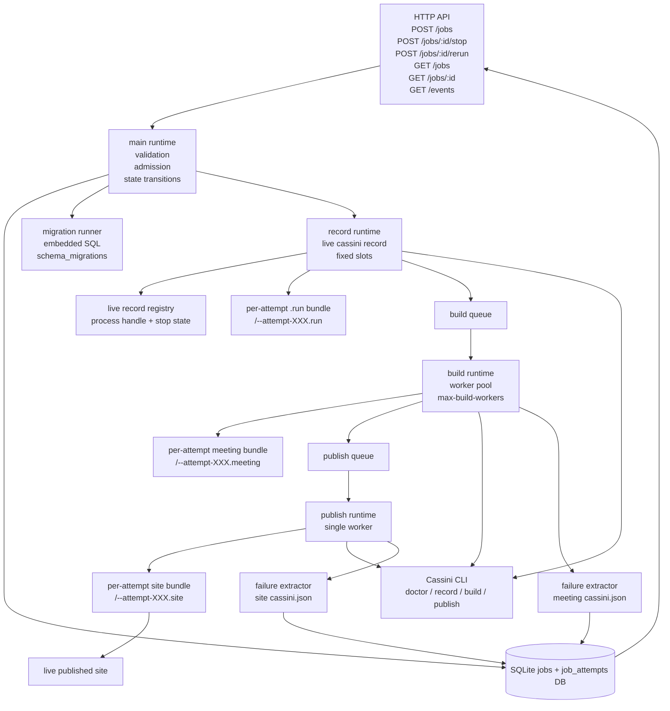
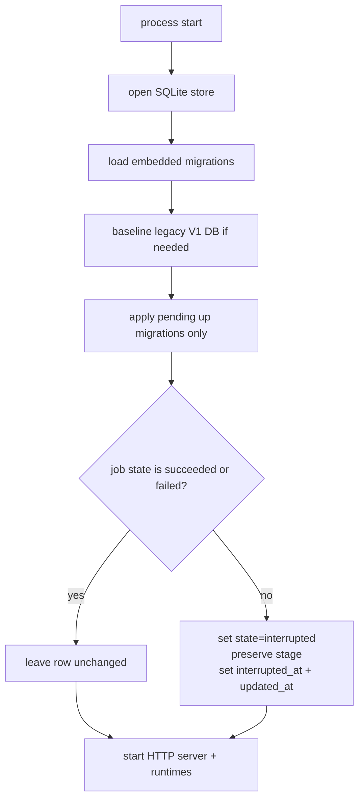
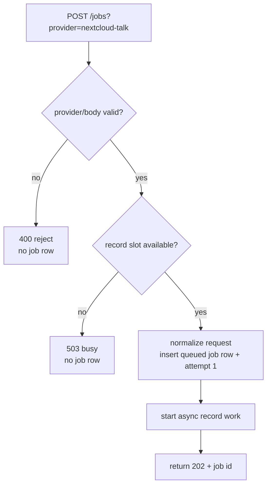
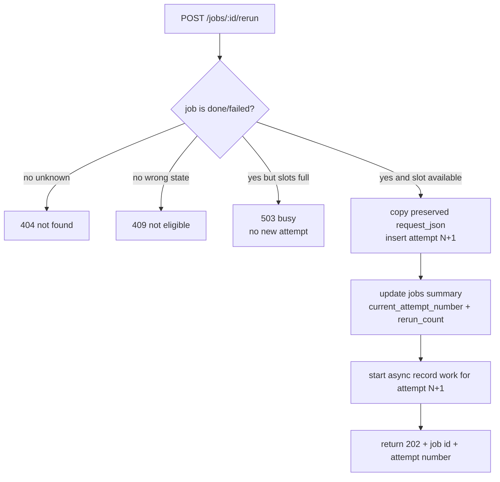
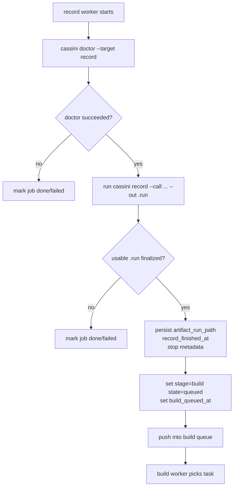
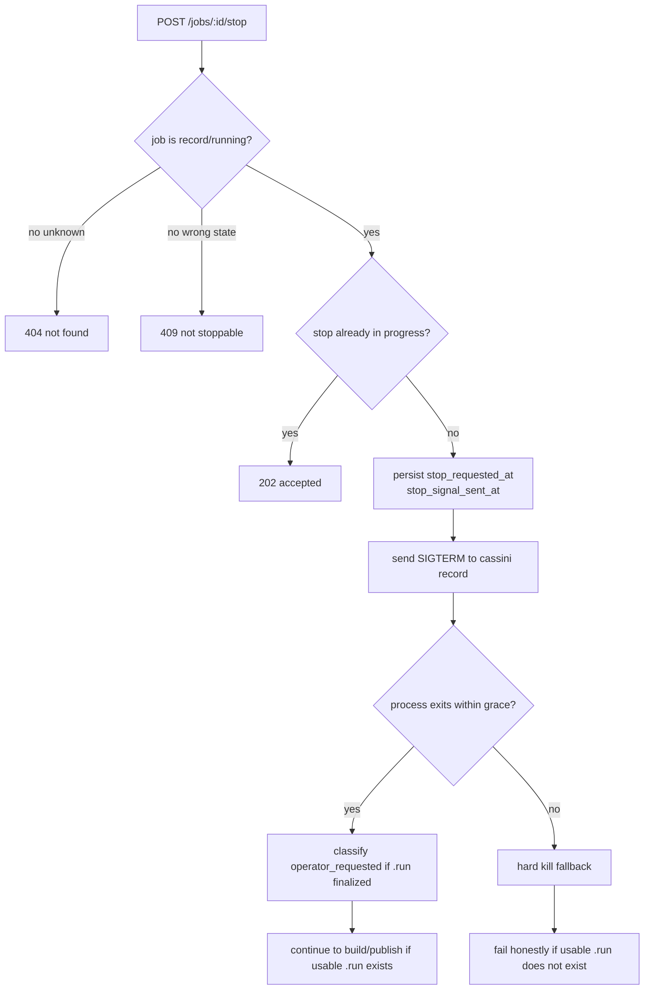
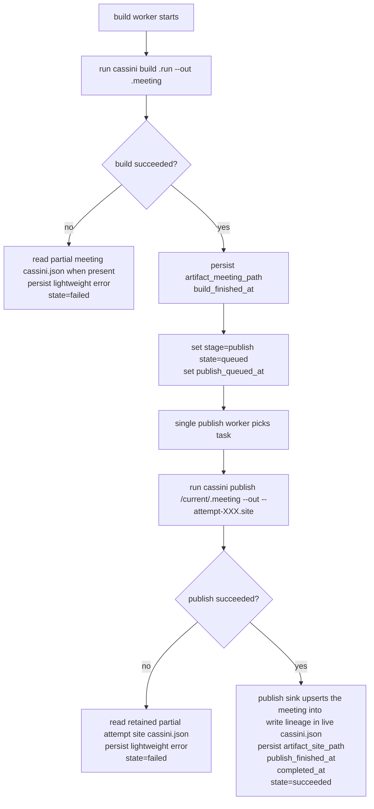

# Cassini Operator

`cassini-operator` is the long-running control-plane binary for Cassini's operator-backed meeting pipeline.

It is intentionally an orchestration and persistence wrapper around the existing Cassini CLI.
The operator does **not** implement live recording, build, or publish logic itself. Instead, it:
- accepts and persists jobs
- applies stage-specific concurrency rules
- runs `cassini doctor --target record`
- invokes `cassini record`, `cassini build`, and `cassini publish`
- persists logical job summaries, attempt history, and stop metadata
- reads downstream bundle manifests back on failure for lightweight error reporting

That boundary is deliberate. It keeps the operator focused on admission, lifecycle control, queueing, persistence, and observability while reusing the recorder/build/publish behavior already implemented in Cassini.

## Current scope (V5 runtime)

The current operator runtime supports:
- `POST /jobs?provider=nextcloud-talk` for live Nextcloud Talk recording jobs
- `POST /jobs/:id/stop` for intentional stop during the record stage
- `POST /jobs/:id/rerun` for explicit rerun of failed jobs
- `GET /jobs` for logical-job summaries
- `GET /jobs/:id` for logical-job summary plus attempt history
- `GET /events` for tagged SSE job/attempt state-change events emitted from successful persisted operator writes
- real live record via `cassini doctor --target record` then `cassini record`
- queued build via `cassini build`
- queued publish via `cassini publish`
- versioned SQLite schema migrations tracked in `schema_migrations`
- persisted stop metadata on both the current attempt summary and attempt history
- startup interruption marking for any non-terminal persisted job and attempt

This is the implemented V5 operator slice: real Talk capture, explicit stop happy path, migration-backed persistence, failure inspection, explicit rerun, and the existing build/publish backbone.

## Operator architecture

The runtime is still one process with one HTTP server and one in-process scheduler/runtime.



### Concurrency model

- **record runtime**
  - fixed-slot admission only
  - no durable queue
  - overflow returns busy and creates no job row
- **build runtime**
  - queue-backed
  - configurable worker pool
- **publish runtime**
  - queue-backed
  - intentionally flattened to one worker
  - every publish refreshes the shared site root serially

## Pipeline flowcharts

### Startup migration + interruption flow

On startup the operator first settles schema, then marks any non-terminal persisted job and current attempt as interrupted.



### Job admission flow



### Explicit rerun flow



### Live record happy path



### Explicit stop happy path



### Build + publish flow



## Current implementation

### Record stage

The V1 fixture-backed record placeholder is no longer used by the operator runtime.

The current record stage:
- validates and normalizes the V2 trigger body
- defaults `talkAuthMode` to `hpb-internal`
- keeps `guest-participant` as an explicit fallback mode only
- defaults `guestName` to `CassiniRecorder`
- defaults `stopWhenRoomEmpty` to `true`
- defaults `roomEmptyGrace` to `30`
- runs `cassini doctor --target record`
- runs `cassini record --talk-auth-mode <mode> --call <url> --out <job>--attempt-XXX.run --name <guestName>`
- forwards explicit `baseURL` / `roomToken` as the native Talk target when present
- forwards `--duration`, `--stop-when-room-empty`, and `--room-empty-grace` only when explicitly requested
- keeps one canonical `.run` bundle per attempt under `<work-root>`

### Stop model

The explicit stop path is now part of the happy path.

The operator:
- keeps an in-memory registry of live record subprocesses
- accepts stop only while the job is `record/running`
- records `stop_requested_at` and `stop_signal_sent_at`
- sends `SIGTERM` first
- waits a bounded grace period
- falls back to hard kill only if the subprocess does not exit
- continues into build/publish if the recorder finalized a usable `.run`

The operator persists stop metadata on the current attempt summary and attempt history rather than mutating recorder-owned filesystem artifacts.

### Stop classification

The persisted stop model currently distinguishes:
- `room_empty`
- `duration_limit`
- `operator_requested`
- `signaling_connection_error`
- `join_failed`
- `record_process_exit_nonzero`

`operator_requested` is intentionally operator-owned classification:
- if the operator accepted stop
- sent SIGTERM
- and the recorder finalized cleanly
- the job is still `done/succeeded`
- and `stop_reason=operator_requested` carries the distinction

### Build stage

Build still uses the Cassini CLI directly:

```bash
cassini build <work-root>/<job-id>--attempt-XXX.run --out <work-root>/<job-id>--attempt-XXX.meeting
```

That produces a meeting bundle at:

```text
<work-root>/<job-id>--attempt-XXX.meeting/
```

The operator persists that directory in the active attempt row and mirrors the current or winning attempt path onto `jobs.artifact_meeting_path`.

### Publish stage

Publish still uses the Cassini CLI directly, but now targets an attempt-scoped retained site bundle first:

```bash
cassini publish <work-root>/current/<job-id>.meeting --out <work-root>/runs/<job-id>--attempt-XXX.site
```

On success, the operator promotes a copy of that retained attempt site into the live shared site root:

```text
<site-root>/
```

Important details:
- the publish worker is still serialized to one worker
- every attempt keeps its own `.site` bundle for inspection
- failed publishes leave the current live `<site-root>` untouched
- successful publishes update the live `<site-root>` from the retained attempt-local `.site` bundle
- the live `cassini.json` gets optional lineage fields:
  - `published_by_job_id`
  - `published_by_attempt_number`
  - `published_at_utc`

The operator persists the retained attempt-local `.site` path on the attempt row and mirrors the live shared site path onto `jobs.artifact_site_path`.

## Why the operator shells out to Cassini CLI

The operator is intentionally an orchestration wrapper, not a second implementation of recorder/build/publish behavior.

That gives a few benefits:
- reuse existing Cassini orchestration as-is
- preserve current doctor/record/build/publish behavior
- avoid pulling recorder internals across the sibling-module boundary
- keep the operator focused on admission, queueing, persistence, and state transitions

This also works well on failure because the CLI already writes bundle manifests such as `cassini.json`.
The operator reads those manifests back from known output paths and uses them for lightweight failure reporting.

Examples:
- `build stage build: transcriber exploded`
- `publish stage publish: exporter exploded`

## Development vs prebuilt binaries

By default the operator resolves `CASSINI_BIN` to:

```text
<reporoot>/bin/cassini
```

That wrapper script currently builds a fresh temporary Cassini binary on each call before executing it.
In development this is helpful because:
- it simulates real stage latency
- it exercises the same shell boundary the operator will use in practice
- it avoids hiding integration assumptions behind an in-process shortcut

For production-style use, point `CASSINI_BIN` at a prebuilt executable:

```bash
export CASSINI_BIN=/abs/path/to/prebuilt/cassini
```

The same idea applies to launching the operator itself. The convenience path:

```bash
./bin/cassini operator start
```

ultimately resolves to `bin/cassini-operator`, which also builds a temporary binary when used from the repo checkout. That is fine for development. For a fixed binary path, set:

```bash
export CASSINI_OPERATOR_BIN=/abs/path/to/prebuilt/cassini-operator
```

## HTTP API

The operator API is intended to sit behind a same-origin UI proxy (for example the control panel Vite server or a deployment reverse proxy).
It does not need to emit browser CORS headers itself.

### Create a job

```http
POST /jobs?provider=nextcloud-talk
Content-Type: application/json

{
  "platform": "nextcloud-talk",
  "url": "https://example.test/call",
  "talkAuthMode": "hpb-internal",
  "guestName": "CassiniRecorder",
  "duration": 120,
  "stopWhenRoomEmpty": true,
  "roomEmptyGrace": 30
}
```

Behavior:
- accepts only `provider=nextcloud-talk`
- requires `platform="nextcloud-talk"`
- requires `url` or `baseURL + roomToken`
- supports optional `talkAuthMode`, `talkConnectURL`, `guestName`, `duration`, `stopWhenRoomEmpty`, and `roomEmptyGrace`
- normalizes defaults to `talkAuthMode=hpb-internal`, `guestName=CassiniRecorder`, `stopWhenRoomEmpty=true`, `roomEmptyGrace=30`
- `talkAuthMode=guest-participant` remains available as the explicit fallback
- returns `202` with a ULID job id
- returns `503` with no job row when record capacity is full

### Stop a running job

```http
POST /jobs/:id/stop
```

Behavior:
- returns `404` for unknown jobs
- returns `409` when the job is not in `record/running`
- returns `202` when stop is accepted or already in progress
- sends `SIGTERM` to the live `cassini record` subprocess
- continues to build/publish when the run finalizes cleanly

### Rerun a failed job

```http
POST /jobs/:id/rerun
```

Behavior:
- returns `404` for unknown jobs
- returns `409` when the job is not in `done/failed`
- returns `503` when record capacity is full and no new attempt is created
- returns `202` with the logical job id plus the new `attempt_number`
- reuses the preserved normalized `request_json`
- starts a fresh attempt from `record` again
- preserves older attempts rather than overwriting them

### List jobs

```http
GET /jobs
```

Returns full persisted job rows ordered newest first, including stop metadata such as `stop_reason`, `stop_requested_at`, `stop_signal_sent_at`, `record_exit_code`, and `record_stop_detail`.
These are logical-job summary rows, not full attempt-history payloads.

### Get one job

```http
GET /jobs/:id
```

Returns the full persisted row for that job, including any persisted stop metadata.
In V5 this response is wrapped as:

```json
{
  "job": { "... logical job summary ..." },
  "attempts": [
    { "... newest attempt ..." },
    { "... older preserved attempt ..." }
  ]
}
```

The `attempts` array is ordered newest first and includes attempt-scoped artifact paths, stop metadata, failure summaries, and log-path fields such as:
- `record_log_path`
- `build_log_path`
- `publish_log_path`

### Event stream

```http
GET /events
Accept: text/event-stream
```

Returns a broadcast SSE feed of tagged structured state-change events.

Current v1 event model:
- emitted after successful persisted job/attempt state writes
- uses event names such as `job.created`, `job.updated`, and `attempt.updated`
- payloads carry the current `job` summary row and, when relevant, the current `attempt`
- intended to be consumed together with snapshot reads from `GET /jobs` and `GET /jobs/:id`

## Runtime defaults

By default the operator keeps its runtime-owned state under:

```text
<reporoot>/cassini-operator/runtime/
```

| Path | Default |
|---|---|
| SQLite DB | `cassini-operator/runtime/jobs.sqlite3` |
| Work root | `cassini-operator/runtime/jobs` |
| Published site root | `cassini-operator/runtime/site` |

## Config surface

Flags:
- `--bind`
- `--db`
- `--work-root`
- `--site-root`
- `--cassini-bin`
- `--max-record-workers`
- `--max-build-workers`

Environment:
- `CASSINI_REPO_ROOT`
- `CASSINI_OPERATOR_BIN`
- `CASSINI_BIN`
- `WORK_ROOT`
- `SITE_ROOT`
- `MAX_RECORD_WORKERS`
- `MAX_BUILD_WORKERS`

## How to run locally

### Start the local Talk stack

From repo root:

```bash
./bin/cassini dev stack up
```

Create a room:

```bash
CALL_URL="$(./bin/cassini dev room create --name "Operator V2 validation" | tail -n1)"
echo "$CALL_URL"
```

### Start the operator

```bash
rm -rf cassini-operator/runtime
mkdir -p cassini-operator/runtime
./bin/cassini operator start --bind 127.0.0.1:19080
```

Startup logs should print lines like:
- `db -> ...`
- `work_root -> ...`
- `site_root -> ...`
- `cassini_bin -> ...`
- `max_record_workers -> ...`
- `max_build_workers -> ...`

### Trigger a live job

```bash
curl -s -X POST \
  'http://127.0.0.1:19080/jobs?provider=nextcloud-talk' \
  -H 'content-type: application/json' \
  -d "{\"platform\":\"nextcloud-talk\",\"url\":\"$CALL_URL\"}"
```

Join the meeting in the browser and speak normally.

### Stop a running job if needed

```bash
curl -s -X POST http://127.0.0.1:19080/jobs/<job-id>/stop
```

### What to observe

Read job state:

```bash
curl -s http://127.0.0.1:19080/jobs
curl -s http://127.0.0.1:19080/jobs/<job-id>
```

Watch for transitions such as:
- `record/queued`
- `record/running`
- `build/queued`
- `build/running`
- `publish/queued`
- `publish/running`
- `done/succeeded`

Inspect produced artifacts:

```bash
find cassini-operator/runtime/jobs -maxdepth 2 | sort
find cassini-operator/runtime/site -maxdepth 3 | sort
```

Serve the published site if you want to inspect the output:

```bash
./bin/cassini serve ./cassini-operator/runtime/site
```

## Schema migrations

On normal startup the operator:
- loads embedded numbered SQL migrations
- baselines pre-migration V1-shaped DBs onto the initial schema version when needed
- auto-applies pending **up** migrations only
- never auto-runs down migrations
- fails fast if migration history is inconsistent

The current migration set includes:
- `0001_initial_jobs.*.sql`
- `0002_record_stop_metadata.*.sql`
- `0003_job_attempts.*.sql`

## Job model

The operator now uses two persistence levels.

### `jobs` summary row

A logical job summary row stores:
- stable ULID `id`
- original `request_json`
- `provider`
- `stage`
- `state`
- `current_attempt_number`
- `rerun_count`
- artifact paths for `.run`, `.meeting`, and the live shared site output
- lightweight `error`
- stop metadata:
  - `stop_reason`
  - `stop_requested_at`
  - `stop_signal_sent_at`
  - `record_exit_code`
  - `record_stop_detail`
- per-stage timestamps
- `interrupted_at`
- `completed_at`

These fields describe the current or winning attempt for the logical job.

### `job_attempts` history row

An attempt row stores:
- `job_id`
- `attempt_number`
- `trigger_kind` (`initial` or `rerun`)
- preserved normalized `request_json`
- `stage`
- `state`
- attempt-scoped artifact paths for `.run`, `.meeting`, and retained `.site` output
- lightweight `error`
- stop metadata:
  - `stop_reason`
  - `stop_requested_at`
  - `stop_signal_sent_at`
  - `record_exit_code`
  - `record_stop_detail`
- attempt log-path fields:
  - `record_log_path`
  - `build_log_path`
  - `publish_log_path`
- per-stage timestamps
- `interrupted_at`
- `completed_at`

### Stage values

- `record`
- `build`
- `publish`
- `done`

### State values

- `queued`
- `running`
- `succeeded`
- `failed`
- `interrupted`

## Worker semantics

### Record stage

- capped by `max-record-workers`
- overflow returns busy and inserts no job row
- runs `cassini doctor --target record`
- runs `cassini record --talk-auth-mode <mode> --call <url> --out <job>--attempt-XXX.run --name <guestName>`
- forwards optional native Talk target fields `baseURL` / `roomToken` when present
- forwards optional `duration`, `stopWhenRoomEmpty`, and `roomEmptyGrace` only when explicitly requested
- keeps one canonical per-attempt `.run` bundle for downstream build

### Build stage

- queue-backed
- configurable worker count
- runs `cassini build <job>--attempt-XXX.run --out <job>--attempt-XXX.meeting`

### Publish stage

- queue-backed
- always processed by one publish worker
- runs `cassini publish <work-root>/current/<job-id>.meeting --out <work-root>/runs/<job-id>--attempt-XXX.site` (one meeting, not the library)
- on success, promotes a copy of that retained attempt site into `<site-root>`

## Failure reporting

The operator keeps logging on stdout/stderr.

For build/publish failures it also tries to recover lightweight failure detail from partial bundle manifests:
- build reads partial meeting `cassini.json`
- publish reads partial site `cassini.json`
- stored error shape prefers manifest `stage` + manifest `error`

For record-stage observability, the operator persists stop metadata and subprocess exit metadata on the job row.
For V5 inspection, the operator also persists attempt-scoped history and log-path fields on `job_attempts`.

## Restart semantics

On startup the operator marks every non-terminal job and attempt as interrupted before serving new work:
- queued jobs become `interrupted`
- running jobs become `interrupted`
- last `stage` is preserved
- completed `succeeded` and `failed` jobs are left unchanged

This is intentionally honest rather than resumptive. Automatic retry/resume is still not part of the operator scope; V5 adds explicit rerun instead.

## Testing

Repo-local automated checks:

```bash
cd cassini-operator
go test ./...
go build ./...

cd ../cassini-go-recorder
go test ./internal/cassini/...
```

CI also runs operator unit tests through `.github/workflows/ci.yml`.

For the operator runtime model — jobs, attempts, live recording, failure
inspection, and the rerun flow — see [../docs/operator-stack.md](../docs/operator-stack.md)
and the [operator API reference](../docs/reference/api.md).
