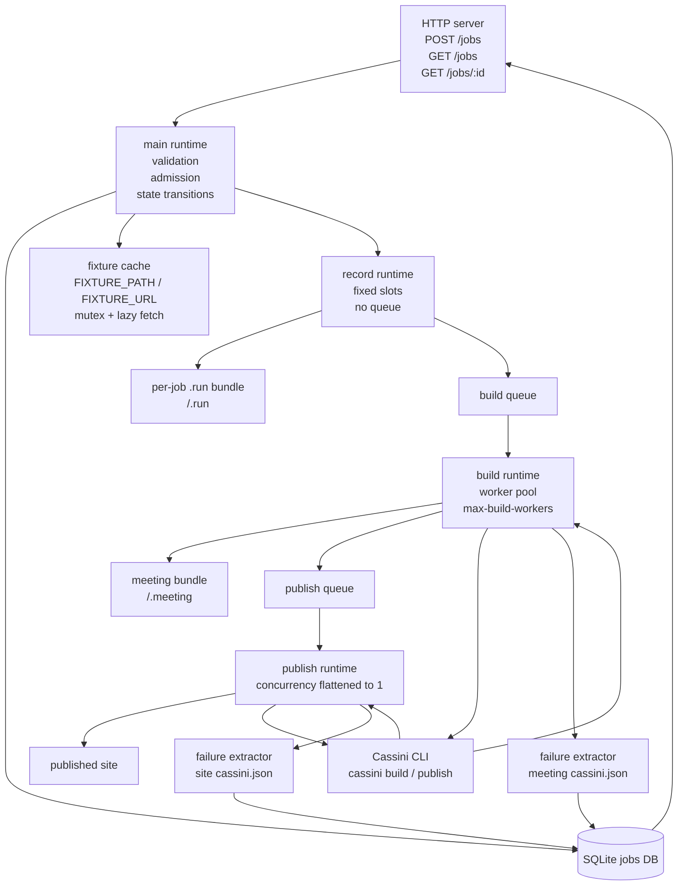
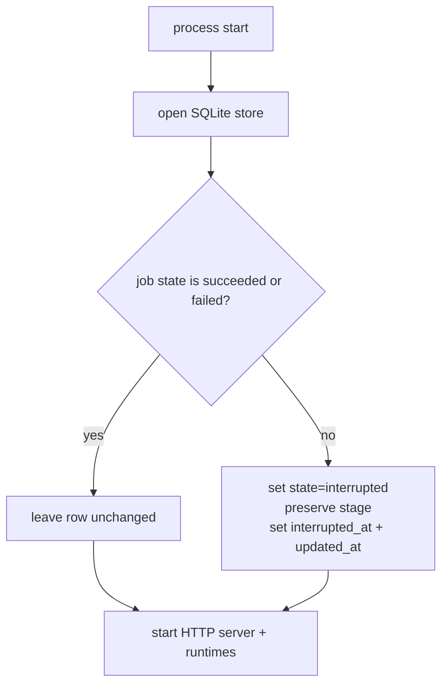
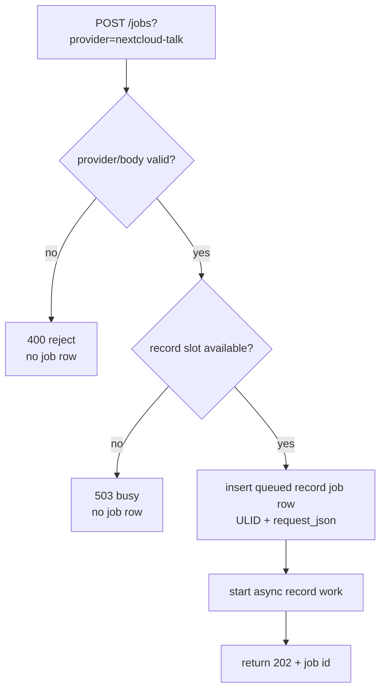
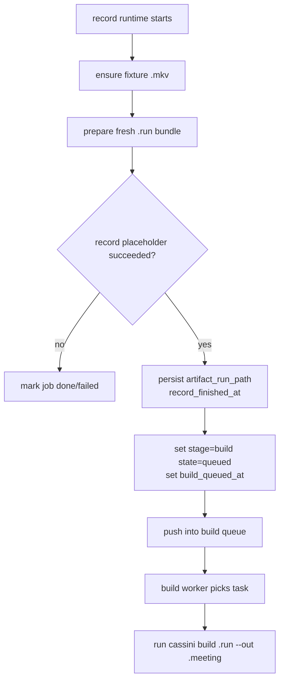
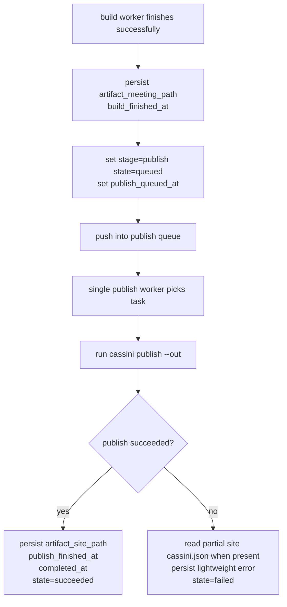

# Cassini Operator

`cassini-operator` is the separate long-running control-plane binary for the MVP job flow.

It is intentionally a scheduling and persistence wrapper around existing Cassini CLI behavior.
The operator does **not** reimplement build/publish orchestration itself. Instead, it:
- accepts and persists jobs
- applies stage-specific concurrency rules
- invokes `cassini build` and `cassini publish`
- reads persisted bundle manifests back on failure for lightweight error reporting

That boundary is deliberate. It lets the operator reuse the orchestration already baked into the Cassini CLI without a hard refactor of recorder internals.

## Current scope (V1)

- `POST /jobs?provider=nextcloud-talk` to accept work
- `GET /jobs` and `GET /jobs/:id` to inspect full persisted job rows
- SQLite persistence in one `jobs` table
- record placeholder from a fixture `.mkv`
- queued build stage via `cassini build`
- sequential publish stage via `cassini publish`
- startup interruption marking for any non-terminal persisted job

This is intentionally not real Nextcloud Talk capture yet. V1 proves the control-plane and artifact pipeline first.

## Operator architecture

The current runtime is a single process with one HTTP server and one in-process scheduler/runtime.



### Concurrency model

- **record runtime**
  - fixed-slot admission only
  - no queue
  - overflow returns busy and creates no job row
- **build runtime**
  - queue-backed
  - configurable worker pool
- **publish runtime**
  - queue-backed
  - concurrency intentionally flattened to one worker
  - every publish refreshes the shared site root serially

## Pipeline flowcharts

### Startup interruption check

Before the operator starts serving new traffic, it marks any non-terminal persisted job as interrupted.



### Job start / reject flow



### Build enqueue flow



### Publish flow



## Current demo implementation

### Record stage

The current record stage does **not** record a live meeting.

Instead it uses a fixture `.mkv`:
- if `FIXTURE_PATH` already exists, it is reused
- otherwise the operator lazily fetches `FIXTURE_URL`
- the download goes to `FIXTURE_PATH.part`
- then the file is atomically renamed into place
- one process-local mutex guards fixture acquisition

For each accepted job, record creates:
- `<work-root>/<job-id>.run/recording.mkv`
- `<work-root>/<job-id>.run/cassini.json`

The `.run` bundle is finalized as a normal talk-mode run bundle so downstream build sees a standard build-compatible input.

### Build stage

Build uses the Cassini CLI directly:

```bash
cassini build <work-root>/<job-id>.run --out <work-root>/<job-id>.meeting
```

That produces a meeting bundle at:

```text
<work-root>/<job-id>.meeting/
```

The operator persists that directory in `artifact_meeting_path`.

### Publish stage

Publish also uses the Cassini CLI directly:

```bash
cassini publish <work-root> --out <site-root>
```

Important detail: publish refreshes the site from the **whole work root**, not just the current job.
That means the published site includes all ready meeting bundles currently present under `<work-root>`.

The operator persists the shared site output path in `artifact_site_path`.

### Published site status today

The current published site output is still useful for pipeline work, but the UI is not in a healthy state yet.

Today:
- the publish step writes site data and manifests
- the site can still be served and inspected
- the viewer/UI is currently broken
- that UI issue is being looked at separately
- it should not block or change further operator-pipeline development

In other words: the data path is what matters for the operator effort, and that path is working.

## Why the operator shells out to Cassini CLI

The operator is intentionally a scheduling wrapper, not a second implementation of build/publish.

That gives a few benefits:
- reuse existing Cassini orchestration as-is
- preserve current doctor/build/publish behavior
- avoid pulling recorder internals across the sibling module boundary
- keep the operator focused on admission, queueing, persistence, and state transitions

This also works well on failure because the CLI already writes bundle manifests such as `cassini.json`.
The operator reads those manifests back from known output paths and uses them for lightweight failure reporting.

Examples:
- `build stage build: transcriber exploded`
- `publish stage publish: exporter exploded`

## Development vs prebuilt binaries

By default the operator resolves `CASSINI_BIN` to:

```text
<reporoot>/bin/cassini
```

That wrapper script currently builds a fresh temporary Cassini binary on each call before executing it.
In development this is actually helpful:
- it simulates real stage latency
- it exercises the same shell boundary the operator will use in practice
- it avoids hiding integration assumptions behind an in-process shortcut

For production-style use, point `CASSINI_BIN` at a prebuilt executable:

```bash
export CASSINI_BIN=/abs/path/to/prebuilt/cassini
```

The same idea applies to launching the operator itself. The convenience path:

```bash
./bin/cassini operator start
```

ultimately resolves to `bin/cassini-operator`, which also builds a temporary binary when used from the repo checkout. That is fine for development. For a fixed binary path, set:

```bash
export CASSINI_OPERATOR_BIN=/abs/path/to/prebuilt/cassini-operator
```

## HTTP API

### Create a job

```http
POST /jobs?provider=nextcloud-talk
Content-Type: application/json

{
  "platform": "nextcloud-talk",
  "url": "https://example.test/call"
}
```

Behavior:
- accepts only `provider=nextcloud-talk`
- requires `platform="nextcloud-talk"`
- requires `url`
- returns `202` with a ULID job id
- returns `503` with no job row when record capacity is full

### List jobs

```http
GET /jobs
```

Returns full persisted job rows ordered newest first, including stop metadata such as `stop_reason`, `stop_requested_at`, `stop_signal_sent_at`, `record_exit_code`, and `record_stop_detail`.

### Get one job

```http
GET /jobs/:id
```

Returns the full persisted row for that job, including any persisted stop metadata.

## Runtime defaults

By default the operator keeps its runtime-owned state under:

```text
<reporoot>/cassini-operator/.runtime/
```

| Path | Default |
|---|---|
| SQLite DB | `cassini-operator/.runtime/jobs.sqlite3` |
| Work root | `cassini-operator/.runtime/jobs` |
| Published site root | `cassini-operator/.runtime/site` |
| Fixture path | `cassini-operator/.runtime/operator-fixture.mkv` |

The database lives at:

```text
cassini-operator/.runtime/jobs.sqlite3
```

unless overridden with `--db`.

## Config surface

Flags:
- `--bind`
- `--db`
- `--work-root`
- `--site-root`
- `--fixture-path`
- `--fixture-url`
- `--cassini-bin`
- `--max-record-workers`
- `--max-build-workers`

Environment:
- `CASSINI_REPO_ROOT`
- `CASSINI_OPERATOR_BIN`
- `CASSINI_BIN`
- `WORK_ROOT`
- `SITE_ROOT`
- `FIXTURE_PATH`
- `FIXTURE_URL`
- `MAX_RECORD_WORKERS`
- `MAX_BUILD_WORKERS`

## How to run locally

### Requirements

For the current demo flow, you typically need:
- a repo checkout
- Go available locally if you use `./bin/cassini` and `./bin/cassini-operator`
- a reachable fixture `.mkv` URL for `FIXTURE_URL`, or a prewarmed local `FIXTURE_PATH`
- optional: a prebuilt Cassini binary if you do not want the default wrapper behavior

### Demo run with `FIXTURE_URL`

From repo root:

```bash
rm -rf cassini-operator/.runtime
mkdir -p cassini-operator/.runtime

ffmpeg -loglevel error -y \
  -f lavfi -i sine=frequency=440:duration=1 \
  -c:a pcm_s16le \
  cassini-operator/.runtime/source-fixture.mkv
```

Serve the fixture in one terminal:

```bash
cd cassini-operator/.runtime
python3 -m http.server 19081
```

Start the operator in another terminal:

```bash
cd <reporoot>
FIXTURE_URL="http://127.0.0.1:19081/source-fixture.mkv" \
./bin/cassini operator start --bind 127.0.0.1:19080
```

### Trigger a job

```bash
curl -s -X POST \
  'http://127.0.0.1:19080/jobs?provider=nextcloud-talk' \
  -H 'content-type: application/json' \
  -d '{"platform":"nextcloud-talk","url":"https://example.test/call"}'
```

### What to observe

Startup logs should print lines like:
- `db -> ...`
- `work_root -> ...`
- `site_root -> ...`
- `fixture_path -> ...`
- `fixture_url -> ...`
- `cassini_bin -> ...`
- `max_record_workers -> ...`
- `max_build_workers -> ...`

Read job state:

```bash
curl -s http://127.0.0.1:19080/jobs
curl -s http://127.0.0.1:19080/jobs/<job-id>
```

Watch for transitions such as:
- `record/queued`
- `record/running`
- `build/queued`
- `build/running`
- `publish/queued`
- `publish/running`
- `done/succeeded`

Inspect produced artifacts:

```bash
find cassini-operator/.runtime/jobs -maxdepth 2 -type f | sort
find cassini-operator/.runtime/site -maxdepth 3 -type f | sort
```

Serve the published site if you want to inspect the output:

```bash
./bin/cassini serve ./cassini-operator/.runtime/site
```

If the viewer looks broken, that is currently expected and is being investigated separately. The important thing for operator work is that the published data path exists and continues to update.

## Schema migrations

On normal startup the operator:
- baselines pre-migration V1-shaped DBs onto the initial schema version
- auto-applies pending **up** migrations only
- never auto-runs down migrations
- fails fast if migration history is inconsistent

## Job model

A job row stores:
- stable ULID `id`
- original `request_json`
- `provider`
- `stage`
- `state`
- artifact paths for `.run`, `.meeting`, and site output
- lightweight `error`
- stop metadata: `stop_reason`, `stop_requested_at`, `stop_signal_sent_at`, `record_exit_code`, `record_stop_detail`
- per-stage timestamps
- `interrupted_at`
- `completed_at`

### Stage values

- `record`
- `build`
- `publish`
- `done`

### State values

- `queued`
- `running`
- `succeeded`
- `failed`
- `interrupted`

## Restart semantics

On startup the operator marks every non-terminal job as interrupted before serving new work:
- queued jobs become `interrupted`
- running jobs become `interrupted`
- last `stage` is preserved
- completed `succeeded` and `failed` jobs are left unchanged

This is intentionally honest rather than resumptive. Automatic retry/resume is not part of V1.

## Testing

Repo-local automated checks:

```bash
cd cassini-operator
go test ./...

cd ../cassini-go-recorder
go test ./internal/cassini/...
```

CI also runs operator unit tests through `.github/workflows/ci.yml`.

For the shaped V1 validation flow, see:
- `planning/initiatives/mvp/slices/V1-job-scheduler-setup/implementation.md`
- `planning/initiatives/mvp/slices/V1-job-scheduler-setup/testing.md`
