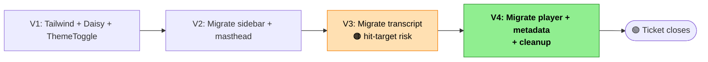

# Viewer Design-System Refactor — Slices

Companion to [viewer-refactor-shaping.md](viewer-refactor-shaping.md). Breaks **Shape D** (design system only, in-place CSS migration, no componentization) into 4 vertical slices.

## Note on "Vertical" for a Styling Refactor

This is a styling-only refactor — no new features, no DOM restructure, no source-layout changes. Each slice's "demo" is a visible visual change in the viewer (user-observable) with behavior preserved. That makes every slice naturally vertical: you can see the change and confirm nothing else broke in the same click.

## What Shape D does NOT touch

These are the invariants — changes here count as regressions, not features:

- DOM structure (element tree, nesting, attributes that drive behavior)
- Event handlers (no moves, no rewrites, no added wrappers that could swallow events)
- Source layout (App.svelte stays as one file; no new components, no `src/stores/viewer.ts`, no Svelte context)
- Playback state, seek path, auto-scroll lock, exact-words toggle, catalog selection — all unchanged
- Test suite structure (the 5 existing pure-logic vitest files stay unchanged)
- Viewer's responsive behavior (intentionally not improved in this ticket — follow-on work)

## Slice Summary

| # | Slice | Demo |
|---|-------|------|
| **V1** | Install Tailwind + DaisyUI; enable stock themes; add inline ThemeToggle; retire body gradient | Sidebar bottom-left has a new light/dark toggle. Clicking it flips `<html data-theme>`. Body background is Daisy-driven. Default follows `prefers-color-scheme`. Preference persists across reload. Rest of viewer still uses bespoke styles — coexists. |
| **V2** | Migrate sidebar + masthead CSS in place | Masthead, meeting catalog, and warning banner restyled with Tailwind utilities + Daisy `badge` / `menu` / `card` / `alert`. Corresponding rules removed from App.svelte's `<style>`. Sidebar visually coherent across light + dark. |
| **V3** | Migrate transcript pane CSS in place — 🟠 **highest risk** | Transcript header, segment list, speaker tags, tokens, scroll-lock indicator restyled. Click-to-seek preserved. Active-segment highlight preserved. Auto-scroll preserved. |
| **V4** | Migrate player footer + metadata CSS; final cleanup — **🟢 ticket ships** | Player card, transport button, timeline slider, auto-scroll switch, exact-words toggle, metadata `<details>` restyled. Remaining `<style>` block removed from App.svelte. `app.css` contains only Tailwind + Daisy directives. Zero bespoke CSS remaining. |

---

## Per-Slice Detail

### V1 — Install Tailwind + DaisyUI + ThemeToggle

**Adds:**
- `devDependencies`: `tailwindcss`, `@tailwindcss/vite` (or `postcss` + `autoprefixer`), `daisyui`
- `tailwind.config.js` with `daisyui` plugin configured for stock `light` + `dark` themes
- `postcss.config.js`
- `vite.config.ts` — Tailwind plugin registered
- `src/app.css` — body gradient replaced with `@tailwind base; @tailwind components; @tailwind utilities;` + daisyui config
- `<html data-theme={themeMode}>` binding in `index.html` (via tiny bootstrap script reading localStorage before Svelte mounts — avoids theme flash)
- **Inline ThemeToggle markup** in App.svelte, placed at the bottom of the sidebar `<aside>` after the Warning region. NOT a separate `.svelte` file. Suggested shape:

  ```svelte
  <button class="btn btn-ghost btn-sm" on:click={toggleTheme} aria-label="Toggle theme">
    {themeMode === 'dark' ? '☀ Light' : '🌙 Dark'}
  </button>
  ```
- `let themeMode: 'light' | 'dark'` binding in App.svelte's script
- `toggleTheme()` handler: flips `themeMode`, writes `localStorage['cassini-theme']`, updates `document.documentElement.dataset.theme`
- `onMount()`: read `localStorage['cassini-theme']`; if absent, fall back to `window.matchMedia('(prefers-color-scheme: dark)').matches ? 'dark' : 'light'`

**Affordances added:** U9 (toggle button) · N2 (`setTheme`), N14 (prefers-color-scheme read) · S7 (`themeMode` local let) · S8 (localStorage, external)

**Class-name audit** — 60-second confirmation grep. Pre-ticket scan already showed zero class-name dependencies in the 5 vitest files. Re-confirm with a quick `grep -r '\.panel\|\.info-pill\|\.meeting-card\|\.segment\|\.masthead\|\.player\|\.transcript' src/ --include='*.test.ts'` and move on.

**Demo**:
1. Open the viewer — note the body background is now Daisy's stock light theme (not the warm cream gradient).
2. Click the toggle in the sidebar bottom-left — background flips to Daisy dark.
3. Reload — preference persists.
4. Clear localStorage + reload — theme matches OS preference.

**Visual caveat**: after V1, the body is Daisy-themed but the existing sidebar panels, transcript, and player footer still use bespoke CSS (creamy backgrounds, Georgia serif, etc.). The viewer will look visually inconsistent until V2–V4 migrate each zone. That's expected and is the cost of slicing the work.

**No regression risk** on existing functionality — no event handler or DOM element is touched in V1.

---

### V2 — Migrate sidebar + masthead CSS in place

**Changes `class` attributes on existing elements:**

| Existing | Replaced with |
|---|---|
| `.shell` (max-width wrapper) | `max-w-screen-xl mx-auto px-4 pb-40` |
| `.masthead.panel` | `card bg-base-100 shadow` (Daisy card) |
| `.eyebrow` | `text-xs uppercase tracking-wider text-base-content/60` |
| `.masthead-copy` h1 | `text-3xl font-serif` (or drop the font class entirely → Daisy default) |
| `.masthead-meta` | `text-base-content/70 mt-2` |
| `.info-strip` | `flex flex-wrap justify-end gap-2` |
| `.info-pill` | `badge badge-outline` |
| `.info-pill-warning` | `badge badge-warning` |
| `.sidebar` panels — meeting list | `menu bg-base-100 rounded-box` (Daisy menu) |
| `.meeting-card` button | `menu-item` or `card card-compact bg-base-200 hover:bg-base-300` |
| `.meeting-title` / `.meeting-meta` | Tailwind spacing utilities |
| `.panel.warning` | `alert alert-warning` |

**Removes from the `<style>` block in App.svelte:**
- `.shell`, `.eyebrow`, `.panel`, `.masthead`, `.masthead-copy`, `.masthead-meta`, `.info-strip`, `.info-pill`, `.info-pill-warning`, `.info-pill-subtle`, `.sidebar`, `.meeting-list`, `.meeting-card`, `.active-meeting`, `.meeting-title`, `.meeting-meta`, `.warning`

**Verification checklist:**
- [ ] Masthead title renders and displays meeting title / library fallback / waiting fallback correctly
- [ ] All three info-pills render (artifact mode, precision, time/duration)
- [ ] Meeting catalog — selecting a meeting still loads it (no wiring changed)
- [ ] Active meeting's card shows selected state
- [ ] Warning banner renders on load failures
- [ ] Theme toggle visible below Warning region
- [ ] Both light and dark themes look coherent

**Risk**: low. Elements stay; only class attributes change. No event handlers affected. Keyboard focus-visible still works if Tailwind's `focus-visible:` utilities are applied.

---

### V3 — Migrate transcript pane CSS in place 🟠

**This is the risk slice.** The transcript has the densest interactive surface (speaker tag buttons, token buttons, scroll-lock detection). Most click-to-seek behaviors live here.

**Changes `class` attributes on existing elements:**

| Existing | Replaced with |
|---|---|
| `.transcript-panel` | `card bg-base-100 shadow` |
| `.transcript-header` | Tailwind flex utilities |
| `.transcript-summary` | Tailwind spacing + color |
| `.lock-pill` | `badge badge-neutral` |
| `.transcript-list` | Tailwind flex-column + gap utilities |
| `.segment` | Tailwind container + padding |
| `.segment.active` | Tailwind ring / background utilities for active highlight |
| `.continuation-segment` | Tailwind spacing |
| `.segment-meta` / `.speaker-tag` | `btn btn-ghost btn-xs` or `badge` (clickable) |
| `.token` / `.token-word` / `.token-word.active` | Tailwind utilities — hover state + active state |
| `.muted` | `text-base-content/50` |

**Removes from `<style>` block:**
- `.transcript-panel`, `.transcript-header`, `.transcript-summary`, `.transcript-list`, `.lock-pill`, `.segment`, `.segment.active`, `.continuation-segment`, `.segment-meta`, `.speaker-tag`, `.token`, `.token-word`, `.token-word.active`, `.muted`

**The V3 risk — hit-target drift**

The click-to-seek wiring itself doesn't change — event handlers stay on the same tokens and speaker-tag buttons. What *can* change is which DOM element is under the user's cursor when they click:

- Token whitespace / word-break → hit-target position drifts
- Line-wrap behavior with different font metrics → visual-to-data mapping shifts
- Any added wrapper (even innocuous `<span class="badge">`) could swallow the event

**Critical**: `npm run audit:portable-token` catches *data-path* timing drift but **not** hit-target drift. If the click routes to the wrong DOM element, the audit won't know. This is why rules 1 and 4 below are load-bearing.

**Mitigation stack:**

1. **Hard rule — "class-only first pass"**. The first commit in V3 swaps `class` attributes only on existing elements. No added wrappers. No changed element types. No moved event handlers. A second commit may restructure *only* if the audit and manual walkthrough both stay green after pass 1.
2. **Before/after `audit:portable-token` diff** — run the audit against the same meeting before V3 starts and after it's done; save both outputs; diff them. Any delta is a regression.
3. **Commit boundaries inside V3** — "swap transcript classes to Tailwind" as one commit; "remove corresponding scoped `<style>` rules" as a separate commit. Each bisectable.
4. **Manual walkthrough — primary defense.** Click 5–10 known tokens in a known sample meeting. Verify audio jumps to the intended word. Two minutes of manual testing catches hit-target drift that automated checks can't. Checklist recorded in PR description.
5. **Visual regression check** — active-segment highlight still appears on the active segment. Auto-scroll still scrolls the active segment into view. Speaker continuation spacing still groups consecutive same-speaker segments.

**Why no automated component test** — the viewer has zero component test infrastructure today. Adding `@testing-library/svelte` + a DOM environment for a pure CSS refactor is overkill scope. If hit-target drift becomes a recurring concern in future stylings, we'll add component tests then. For now: audit + manual walkthrough.

**Verification checklist:**
- [ ] `npm run audit:portable-token` diff clean against a known meeting
- [ ] Manual walkthrough of 5–10 tokens recorded in PR description
- [ ] Active-segment highlight appears/moves as playback progresses
- [ ] Wheel/touchmove engages the "Auto-scroll paused" indicator
- [ ] Speaker tag click seeks to segment start
- [ ] Both light and dark themes render the transcript coherently

---

### V4 — Migrate player footer + metadata CSS + final cleanup · **🟢 TICKET SHIPS**

**Changes `class` attributes on existing elements:**

| Existing | Replaced with |
|---|---|
| `.player-dock` (footer) | Tailwind fixed / sticky + container utilities |
| `.player-card.panel` | `card bg-base-100 shadow-lg` |
| `.player-meta` | Tailwind spacing |
| `.player-hint` | `text-base-content/60 text-sm` |
| `.player-shell` | Tailwind flex |
| `.player-controls` / `.player-buttons` | Tailwind flex |
| `.transport-button.transport-primary` | `btn btn-primary` |
| `.timeline-wrap` / `.timeline-stats` | Tailwind grid / flex |
| `.timeline-slider` | `range range-sm` (Daisy range) |
| `.switch-button` / `.switch-label` / `.switch-track` / `.switch-thumb` | `toggle` (Daisy toggle) + `label` |
| `.player-actions` | Tailwind flex |
| `.exact-words` button | `btn btn-ghost btn-sm` |
| `.metadata-sections` / `.metadata-section` | `collapse collapse-arrow bg-base-200` (Daisy collapse) |
| `.metadata-grid` / `.metadata-tags` / `.metadata-tag` / `.metadata-code` / `.metadata-raw` | Tailwind grid + `badge` |

**Removes:**
- All remaining rules from App.svelte's `<style>` block
- The `<style>` block itself (now empty — delete it)
- Any leftover selectors in `app.css` beyond `@tailwind` directives + daisyui plugin
- `:root` font / color declarations from `app.css`

**Final cleanup audit:**
- `grep '<style' src/**/*.svelte` — must return nothing
- `grep -E '#[0-9a-fA-F]{3,8}' src/**/*.svelte` — should return nothing (any hardcoded color that slipped through)
- Bundle size check: `npm run build` and note the CSS size in the PR description for regression tracking

**Exit checklist (ticket-closing):**
- [ ] Zero bespoke CSS selectors in `src/` (grep)
- [ ] `src/app.css` contains only `@tailwind` directives + daisyui plugin config
- [ ] No `<style>` block in App.svelte
- [ ] Light + dark mode both render coherently across masthead, sidebar, transcript, metadata, and player
- [ ] All existing vitest suites green (`core/timing`, `core/transcript`, `viewer/catalog`, `viewer/loadArtifact`, `viewer/portable`)
- [ ] `npm run audit:portable-token` still passes against a known sample meeting
- [ ] V3 before/after audit diff recorded in PR
- [ ] V3 manual walkthrough checklist recorded in PR
- [ ] `npm run build` produces a bundle; CSS size recorded for regression tracking
- [ ] Mobile/responsive behavior intentionally unchanged — follow-on work
- [ ] Interaction behaviors confirmed: click-to-seek, auto-scroll, scroll-lock, play/pause, timeline scrub, follow-playback toggle, exact-words toggle, meeting selection, warning banner, `prefers-color-scheme` default, theme persistence

**Merge as a single PR** (or split V3 into its own PR for review focus if reviewers prefer; V1/V2/V4 can stack under one PR).

---

## Slice Overview Mermaid



---

## Known Open Items Per Slice

- **V1** — bundle-size measurement is worth capturing before and after as a baseline for R4. Minor task.
- **V3** — the hit-target risk is the one real danger in this ticket. Rules 1, 2, and 4 of the mitigation stack should all be followed; rule 1 prevents the failure mode, rules 2+4 detect if it slips through anyway.
- **V4** — if the final cleanup audit surfaces any hardcoded values that slipped through (colors, radii, shadows), address them in a follow-up commit inside V4 rather than opening a new slice.

## Exit Criteria for the Whole Ticket

- Zero bespoke CSS remains in `src/` — Tailwind + stock DaisyUI only.
- No `<style>` blocks in any `.svelte` file.
- Light + dark mode render coherently across every zone of the viewer.
- Toggle lives in sidebar bottom-left, defaults to `prefers-color-scheme`, persists to localStorage.
- App.svelte's shape is **unchanged** (one file, same DOM structure, same event handlers, same script state) — only class attributes differ.
- All existing vitest suites pass; mechanical-timing audit passes; V3 before/after audit diff is clean; V3 manual walkthrough recorded.
- Follow-on work (componentization, component tests, mobile UX) remains untouched — separate tracks.
- V3 (summary panel — the downstream ticket) can start against this foundation by adding a new markup section inside App.svelte using the new Daisy primitives.
