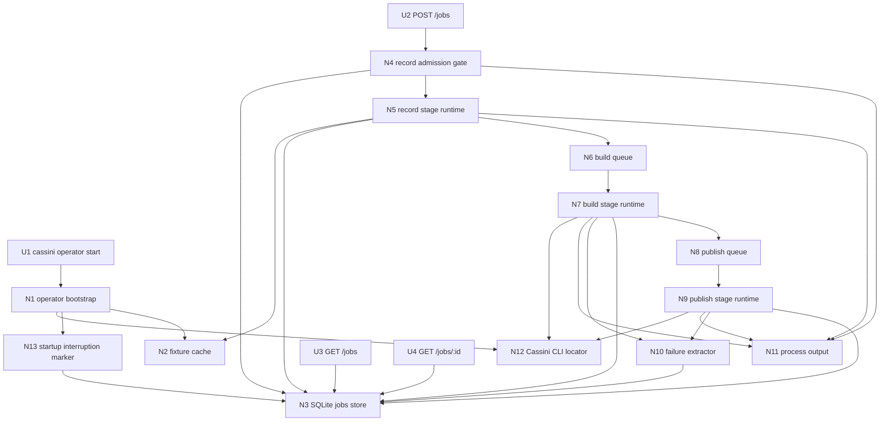
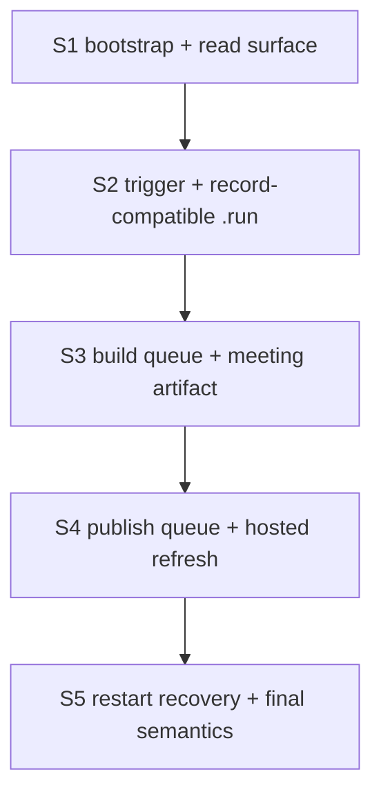

# V1 — Slices

Derived from `planning/initiatives/mvp/slices/V1-job-scheduler-setup/shaping.md`, selected shape **A: Single-process trigger service with SQLite jobs and staged worker pools**.

This document is the ground truth for the V1 breadboard and for the implementation slices that build it in testable increments.

## Current implementation status

The shaped V1 operator flow is now implemented through **S5**.

That means the current code path is the full runtime described by the later slices:
- `POST /jobs?provider=nextcloud-talk`
- record placeholder from a fixture `.mkv`
- queued build through `cassini build`
- queued sequential publish through `cassini publish`
- full persisted job rows through `GET /jobs` and `GET /jobs/:id`
- startup interruption marking for any non-terminal persisted job

The temporary slice cutlines below are still useful as implementation history, but they are now historical rather than current runtime behavior.

For the final implemented shape, see also:
- `implementation.md`
- `testing.md`
- `../../../../../cassini-operator/README.md`

## Breadboard

### UI Affordances

| Affordance | Place | User/Actor | Interaction | Wires Out |
|------------|-------|------------|-------------|-----------|
| **U1** | **Cassini CLI** | **Developer / operator host** | **`cassini operator start [args...]` launches the separate operator binary as a pure exec-style convenience command.** | **N1** |
| **U2** | **Operator HTTP API** | **Operator / caller** | **`POST /jobs?provider=nextcloud-talk` with minimal JSON body `{ "platform": "nextcloud-talk", "url": "..." }`.** | **N4, N3, N11** |
| **U3** | **Operator HTTP API** | **Operator / caller** | **`GET /jobs` returns newest-first full persisted job rows.** | **N3** |
| **U4** | **Operator HTTP API** | **Operator / caller** | **`GET /jobs/:id` returns one full persisted job row.** | **N3** |

### Non-UI Affordances

| Affordance | Place | Mechanism | Wires Out |
|------------|-------|-----------|-----------|
| **N1** | **Operator bootstrap** | **Resolve operator config, validate fixture / binary paths, and start HTTP server + worker runtime.** | **N2, N3, N12, N13** |
| **N2** | **Fixture cache** | **Fixture resolver/fetcher guarded by a process-local mutex: reuse `FIXTURE_PATH` when present, else download `FIXTURE_URL` to `FIXTURE_PATH.part` and atomically rename.** | **N5** |
| **N3** | **SQLite store** | **Single `jobs` table storing ULID id, request payload, stage/state, timestamps, artifact paths, and lightweight error text.** | |
| **N4** | **Record admission gate** | **Validate provider/body, reject when record capacity is full, otherwise create queued job row and enqueue record work.** | **N3, N5, N11** |
| **N5** | **Record stage runtime** | **Materialize a fresh `.run` bundle from the fixture MKV using `PrepareRunBundle(..., false)` + copy to `recording.mkv` + `FinalizeRunBundle(..., SourceMode: talk, RecorderName: CassiniOperatorFixture)`.** | **N3, N2, N6, N11** |
| **N6** | **Build queue** | **In-memory queue feeding configurable build workers after record success.** | **N7** |
| **N7** | **Build stage runtime** | **Invoke `cassini build` through the resolved Cassini CLI path, stream/capture stdout/stderr to the operator process output, and inspect partial meeting bundle manifest on failure.** | **N3, N8, N11, N10** |
| **N8** | **Publish queue** | **In-memory queue feeding the single publish worker after build success.** | **N9** |
| **N9** | **Publish stage runtime** | **Invoke `cassini publish` through the resolved Cassini CLI path, stream/capture stdout/stderr to the operator process output, and inspect partial site bundle manifest on failure.** | **N3, N11, N10** |
| **N10** | **Failure extractor** | **Read partial `cassini.json` manifests from known output paths and extract manifest `stage` + manifest `error` as lightweight failure detail.** | **N3** |
| **N11** | **Process output** | **Use operator stdout/stderr as the V1 logging default for admission, worker progress, and CLI output. Dedicated sink configuration and persisted log-path metadata are deferred.** | |
| **N12** | **Cassini CLI locator** | **Resolve `CASSINI_BIN` first, otherwise default to `<reporoot>/bin/cassini`; fail fast if missing or not executable.** | **N7, N9** |
| **N13** | **Startup interruption marker** | **On startup, mark every non-completed job, including queued jobs, as `interrupted` while preserving its last stage.** | **N3** |

### Wiring by Place

| Place | Wiring |
|-------|--------|
| **Cassini CLI** | **U1 → N1** |
| **Operator bootstrap** | **N1 → N12** (resolve Cassini CLI path) **; N1 → N13 → N3** (startup interruption pass) **; N1 → N2** (fixture validation / lazy fetch setup) |
| **Operator HTTP API** | **U2 → N4** (validate/admit) **; N4 → N3** (insert queued job) **; N4 → N5** (enqueue record work) **; N4 → N11** (write admission/busy logs to process output) **; U3 → N3** (list jobs) **; U4 → N3** (read one job) |
| **Record stage runtime** | **N5 → N2** (acquire fixture) **; N5 → N3** (record stage timestamps/state/artifact path) **; N5 → N6** (enqueue build after record success) **; N5 → N11** (record-stage logs to process output) |
| **Build stage runtime** | **N6 → N7** (dispatch build worker) **; N7 → N12** (resolve Cassini CLI) **; N7 → N11** (stream/capture stdout/stderr to process output) **; N7 → N10 → N3** (failure detail) **; N7 → N3** (build timestamps/state/artifact path) **; N7 → N8** (enqueue publish after build success) |
| **Publish stage runtime** | **N8 → N9** (dispatch single publish worker) **; N9 → N12** (resolve Cassini CLI) **; N9 → N11** (stream/capture stdout/stderr to process output) **; N9 → N10 → N3** (failure detail) **; N9 → N3** (publish timestamps/state/artifact path / terminal outcome) |

---

## Slice summary

These slices are ordered so each one is independently runnable and verifiable.

Two slices intentionally use temporary terminal cutlines so they can be tested before the full pipeline exists:

- **S2** ends the job after record success
- **S3** ends the job after build success
- **S4** replaces that temporary cutline with the final publish stage

| # | Slice | New affordances | Depends On | Verify after done |
|---|-------|------------------|------------|-------------------|
| **S1** | **Bootstrap and read surface** | **U1, U3, U4, N1, N3, N11** | **—** | **Implemented. Start the operator via direct binary and `cassini operator start`; `GET /jobs` returns `[]`; `GET /jobs/:id` returns not found.** |
| **S2** | **Trigger admission and record-compatible `.run` artifact** | **U2, N2, N4, N5** | **S1** | **Implemented. Accepted jobs persist ULID ids and materialize a fresh build-compatible `.run`.** |
| **S3** | **Build queue and meeting artifact generation** | **N6, N7, N10, N12** | **S2** | **Implemented. Accepted jobs now flow through build; `artifact_meeting_path` is populated and build failures persist lightweight error text.** |
| **S4** | **Publish queue and hosted output refresh** | **N8, N9** | **S3** | **Implemented. Accepted jobs now flow through publish; `artifact_site_path` is populated and the hosted library refreshes.** |
| **S5** | **Restart recovery and final operational semantics** | **N13** | **S4** | **Implemented. Restarting the operator marks queued/running jobs as `interrupted` while preserving stage; completed jobs stay unchanged.** |

## Affordance allocation by slice

| Affordance | Slice | Notes |
|------------|-------|-------|
| **U1** | **S1** | Launcher exists from the start. |
| **U2** | **S2** | First write path into the system. |
| **U3** | **S1** | Read-only verification baseline. |
| **U4** | **S1** | Read-only verification baseline. |
| **N1** | **S1** | Bootstrap grows later as more runtime pieces activate. |
| **N2** | **S2** | First needed when record workers materialize `.run` bundles. |
| **N3** | **S1** | Core persistent state, extended in every later slice. |
| **N4** | **S2** | Admission and validation begin with the first write path. |
| **N5** | **S2** | Record placeholder implemented before build/publish. |
| **N6** | **S3** | Activated once record success stops being terminal. |
| **N7** | **S3** | First Cassini CLI execution stage. |
| **N8** | **S4** | Activated once build success stops being terminal. |
| **N9** | **S4** | Final pipeline stage and hosted output refresh. |
| **N10** | **S3** | Shared by build first, then reused by publish in S4. |
| **N11** | **S1** | Process output is the default from the first runnable slice onward. |
| **N12** | **S3** | Needed when build/publish CLI execution begins. |
| **N13** | **S5** | Final operational recovery behavior. |

## Dependency tree

---

## Slice details

## S1: Bootstrap and read surface

### Objective

Stand up the separate `cassini-operator` package/module, the `cassini operator start` pure launcher, the SQLite `jobs` store, and the read-only API surface.

### Why this slice exists

This gives a runnable shell you can verify before any background job execution exists. It proves packaging, process startup, persistence wiring, and basic API shape.

### Includes

- **U1** `cassini operator start`
- **U3** `GET /jobs`
- **U4** `GET /jobs/:id`
- **N1** operator bootstrap
- **N3** SQLite store
- **N11** process output

### Activated wiring

- **U1 → N1**
- **U3 → N3**
- **U4 → N3**

### Verify

1. Start the operator directly.
2. Start it again through `cassini operator start`; the launcher prints one launch line and `exec`s the operator binary.
3. Call `GET /jobs`; receive an empty array from SQLite.
4. Call `GET /jobs/:id` with a missing id; receive a not-found response.
5. Restart the operator; the same SQLite file is reused and startup remains clean.

### Acceptance criteria

- separate `cassini-operator` package/module exists
- `cassini operator start` resolves `CASSINI_OPERATOR_BIN` or `<reporoot>/bin/cassini-operator` and fail-fast validates executability
- operator opens/creates the SQLite database and ensures the single `jobs` table exists
- operator defaults its SQLite/work/fixture artifacts into `<reporoot>/cassini-operator/.runtime/`
- `GET /jobs` and `GET /jobs/:id` are reachable and return JSON responses from SQLite
- operator emits logs to stdout/stderr by default

---

## S2: Trigger admission and record-compatible `.run` artifact

### Objective

Add the first write path: accept valid `nextcloud-talk` jobs, enforce record-stage admission limits, lazily acquire the fixture MKV, and materialize a fresh per-job `.run` bundle.

### Why this slice exists

This is the first end-to-end proof that the operator can accept a remote request, persist a job row, do asynchronous work, and leave behind a real artifact that later slices can build from.

### Includes

- **U2** `POST /jobs?provider=nextcloud-talk`
- **N2** fixture cache
- **N4** record admission gate
- **N5** record stage runtime
- **N3** SQLite row updates for request + record stage
- **N11** process output for admission and worker logs

### Activated wiring

- **U2 → N4**
- **N4 → N3**
- **N4 → N5**
- **N4 → N11**
- **N5 → N2**
- **N5 → N3**
- **N5 → N11**

### Temporary cutline

Until S3 exists, **record success is terminal** for the slice. A successful job is marked `stage=done`, `state=succeeded`, with `artifact_run_path` populated.

### Verify

1. `POST /jobs?provider=nextcloud-talk` with a valid `{ "platform": "nextcloud-talk", "url": "..." }` body returns a ULID immediately.
2. `GET /jobs/:id` shows the row transition through record timestamps/state and ends in `done/succeeded`.
3. `artifact_run_path` points to a fresh `.run` bundle containing `recording.mkv` and `cassini.json`.
4. `GET /jobs` returns the new row newest-first.
5. Submit an unknown provider or invalid body and verify rejection.
6. Saturate record concurrency and verify busy rejection returns no job row.

### Acceptance criteria

- only `provider=nextcloud-talk` is accepted
- valid requests are persisted with ULID ids and original `request_json`
- record worker count is capped; overflow returns busy without inserting a job row
- `FIXTURE_PATH` defaults to `<reporoot>/cassini-operator/.runtime/operator-fixture.mkv` and is lazily acquired via `.part` + atomic rename
- per-job `.run` creation uses `PrepareRunBundle(..., false)` + fixture copy + `FinalizeRunBundle(...)`
- successful jobs persist `artifact_run_path` and record-stage timestamps

---

## S3: Build queue and meeting artifact generation

### Objective

Extend successful record jobs into a queued build stage that invokes the real Cassini CLI, produces a meeting artifact, and persists lightweight failure detail on error.

### Why this slice exists

This is the first slice that proves the operator can drive existing Cassini orchestration rather than only preparing inputs for it.

### Includes

- **N6** build queue
- **N7** build stage runtime
- **N10** failure extractor
- **N12** Cassini CLI locator
- **N3** SQLite row updates for build state and outputs
- **N11** process output for CLI execution

### Activated wiring

- **N5 → N6**
- **N6 → N7**
- **N7 → N12**
- **N7 → N11**
- **N7 → N10 → N3**
- **N7 → N3**

### Temporary cutline

S2's temporary terminal behavior is removed. **Record success now enqueues build.** Until S4 exists, **build success is terminal** for the slice. A successful job ends `stage=done`, `state=succeeded`, with `artifact_meeting_path` populated.

### Verify

1. Submit a valid job.
2. `GET /jobs/:id` shows record timestamps, then build queued/running timestamps.
3. On success, `artifact_meeting_path` is populated and points to a usable meeting bundle.
4. `GET /jobs` still returns newest-first full rows.
5. Force a build failure in dev/test (for example with a wrapper `CASSINI_BIN`) and verify the job ends failed with lightweight error text persisted in `jobs.error`.

### Acceptance criteria

- record success enqueues build work instead of ending the job
- build worker concurrency is configurable and queue-backed
- operator resolves `CASSINI_BIN` first, otherwise `<reporoot>/bin/cassini`, and fail-fast validates executability
- build execution persists `build_queued_at`, `build_started_at`, `build_finished_at`, `artifact_meeting_path`, and terminal outcome
- when a partial meeting manifest exists on failure, manifest `stage` + manifest `error` are extracted into lightweight failure detail
- when no partial manifest exists, non-zero exit still produces a failed job with generic error text

---

## S4: Publish queue and hosted output refresh

### Objective

Add the final publish stage so successful builds are serialized through a single worker and refresh the hosted library output.

### Why this slice exists

This closes the full V1 pipeline. After this slice, a caller can trigger a job and get all the way to refreshed published output using the real build/publish path.

### Includes

- **N8** publish queue
- **N9** publish stage runtime
- **N10** failure extractor reused for site manifests
- **N3** SQLite row updates for publish state and outputs
- **N11** process output for CLI execution
- **N12** Cassini CLI locator reused for publish

### Activated wiring

- **N7 → N8**
- **N8 → N9**
- **N9 → N12**
- **N9 → N11**
- **N9 → N10 → N3**
- **N9 → N3**

### Verify

1. Submit a valid job.
2. `GET /jobs/:id` shows record → build → publish queued/running transitions.
3. On success, `artifact_site_path` and `completed_at` are populated.
4. The hosted/published library refreshes and exposes the newly produced output.
5. Force a publish failure in dev/test and verify the job ends failed with lightweight error text persisted in `jobs.error`.

### Acceptance criteria

- build success enqueues publish work instead of ending the job
- publish concurrency is fixed to one worker
- publish execution persists `publish_queued_at`, `publish_started_at`, `publish_finished_at`, `artifact_site_path`, and final terminal outcome
- when a partial site manifest exists on failure, manifest `stage` + manifest `error` are extracted into lightweight failure detail
- successful jobs end with `stage=done`, `state=succeeded`, and `completed_at` set

---

## S5: Restart recovery and final operational semantics

### Objective

Add the startup interruption pass and lock the last important operational semantics around restart behavior.

### Why this slice exists

The earlier slices prove the happy path. This slice makes the single-process design honest about what happens when the operator dies and comes back.

### Includes

- **N13** startup interruption marker
- **N1 → N13 → N3** startup wiring
- final verification of newest-first list ordering and completed-job stability

### Activated wiring

- **N1 → N13 → N3**

### Verify

1. Create at least one queued or running job.
2. Stop the operator mid-flight.
3. Restart it against the same SQLite database.
4. Verify every non-completed job is now `state=interrupted` with `interrupted_at` set and its last `stage` preserved.
5. Verify completed `succeeded`/`failed` jobs are unchanged.
6. Verify `GET /jobs` still returns newest-first full persisted rows.

### Acceptance criteria

- startup marks every non-completed job, including queued jobs, as `interrupted`
- the previous `stage` is preserved when marking interruption
- completed jobs (`succeeded` or `failed`) are left untouched
- interruption updates are persisted before new work starts
- list/detail endpoints continue to expose full persisted rows after restart
