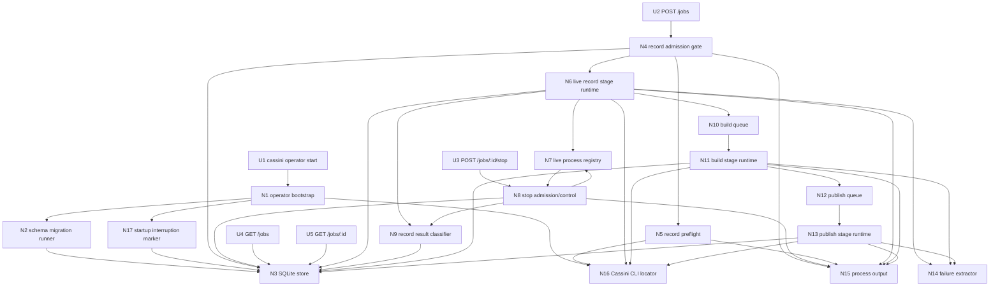
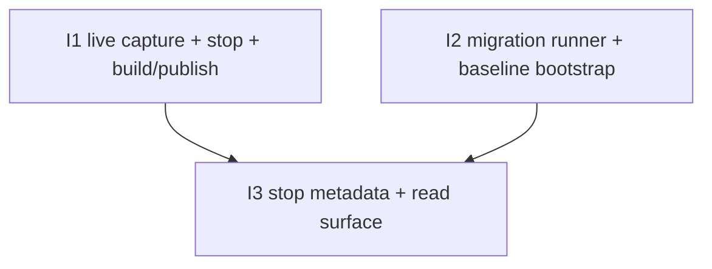

# V2 — Slices

Derived from `planning/initiatives/mvp/slices/V2-live-nextcloud-talk-recording/shaping.md`.

This document is the ground truth for the V2 breadboard and for the implementation slices that build the selected shape in testable increments.

The shaped V2 scope still rolls up to the same three workstreams selected in shaping:

1. **S1 — Live Talk capture happy path**
2. **S2 — Explicit stop happy path**
3. **S3 — Stop metadata + schema migration surface**

For implementation, the runtime behavior from S1 and S2 is intentionally clamped together into one end-to-end slice. S3 remains split into schema foundation first and persisted observability second.

## Carried-forward V1 baseline (not a V2 slice)

The following capabilities already exist from V1 and are reused rather than re-sliced as new V2 work:

| Affordance | Status |
|-----------|--------|
| `cassini operator start` launcher | ✅ Exists |
| `POST /jobs?provider=nextcloud-talk` admission backbone | ✅ Exists, request contract changes in V2 |
| `GET /jobs` | ✅ Exists, read shape extends in V2 |
| `GET /jobs/:id` | ✅ Exists, read shape extends in V2 |
| SQLite job store | ✅ Exists, schema evolves in V2 |
| build queue + `cassini build` runtime | ✅ Exists |
| publish queue + `cassini publish` runtime | ✅ Exists |
| failure extraction from partial manifests | ✅ Exists |
| startup interruption marking for non-terminal jobs | ✅ Exists |
| process stdout/stderr logging default | ✅ Exists |

---

## Selected workstreams

| # | Workstream | Final result |
|---|------------|--------------|
| S1 | Live Talk capture happy path | A real Talk URL can be recorded through the operator and fed through the existing build/publish backbone. |
| S2 | Explicit stop happy path | A running live recording can be stopped intentionally through the API and still continue through build/publish when finalization succeeds. |
| S3 | Stop metadata + schema migration surface | Honest stop metadata is persisted on operator job rows through a real migration system rather than ad hoc schema edits. |

---

## Breadboard

### UI Affordances

| Affordance | Place | User/Actor | Interaction | Wires Out |
|------------|-------|------------|-------------|-----------|
| **U1** | **Cassini CLI** | **Developer / operator host** | **`cassini operator start [args...]` launches the operator binary as the existing convenience entrypoint.** | **N1** |
| **U2** | **Operator HTTP API** | **Operator / caller** | **`POST /jobs?provider=nextcloud-talk` with `{ "platform": "nextcloud-talk", "url": "...", "guestName"?, "duration"?, "stopWhenRoomEmpty"?, "roomEmptyGrace"? }`.** | **N4, N3, N15** |
| **U3** | **Operator HTTP API** | **Operator / caller** | **`POST /jobs/:id/stop` requests intentional stop of a running record-stage job.** | **N8, N3, N15** |
| **U4** | **Operator HTTP API** | **Operator / caller** | **`GET /jobs` returns newest-first persisted job rows, including V2 stop metadata once S3 lands.** | **N3** |
| **U5** | **Operator HTTP API** | **Operator / caller** | **`GET /jobs/:id` returns one persisted job row, including V2 stop metadata once S3 lands.** | **N3** |

### Non-UI Affordances

| Affordance | Place | Mechanism | Wires Out |
|------------|-------|-----------|-----------|
| **N1** | **Operator bootstrap** | **Resolve config, locate the Cassini CLI, run schema migration startup behavior, mark interrupted jobs, and start HTTP + worker runtime.** | **N2, N3, N16, N17** |
| **N2** | **Schema migration runner** | **Discover numbered SQL migrations, maintain `schema_migrations`, baseline existing pre-migration DBs onto the extracted V1 schema version, and auto-apply pending up migrations only.** | **N3** |
| **N3** | **SQLite store** | **Persist job rows, stage/state timestamps, artifact paths, lightweight error text, and V2 stop metadata. Also stores `schema_migrations`.** | |
| **N4** | **Record admission gate** | **Validate provider/body/defaults, reject when record capacity is full, create the queued job row, and enqueue live record work.** | **N3, N5, N6, N15** |
| **N5** | **Record preflight** | **Run `cassini doctor --target record` before launching the live record subprocess.** | **N16, N15** |
| **N6** | **Live record stage runtime** | **Execute `cassini record --call <url> --out <job>.run --name <guestName>` plus optional stop flags, keep one canonical `.run` path, and rely on recorder-owned resilience rather than operator retry.** | **N3, N7, N9, N10, N14, N15** |
| **N7** | **Live process registry** | **Track the running record subprocess per job, including process handle, stop-in-progress marker, and stop timestamps kept in runtime memory.** | **N8, N9** |
| **N8** | **Stop admission/control** | **Accept stop only for `stage=record` + `state=running`, make repeat requests idempotent for the same in-flight stop, send `SIGTERM`, wait bounded grace, and fall back to hard-kill only if needed.** | **N3, N7, N9, N15** |
| **N9** | **Record result classifier** | **Classify the record outcome from exit status, finalized `.run` usability, and accepted stop intent so the operator can tell `operator_requested` apart from generic recorder cancellation.** | **N3, N10, N14** |
| **N10** | **Build queue** | **Reuse the existing in-memory build queue after a usable live `.run` is available.** | **N11** |
| **N11** | **Build stage runtime** | **Reuse the existing `cassini build` runtime against the live-produced `.run` bundle.** | **N3, N12, N14, N15** |
| **N12** | **Publish queue** | **Reuse the existing publish queue after build success.** | **N13** |
| **N13** | **Publish stage runtime** | **Reuse the existing `cassini publish` runtime so the new meeting appears in the hosted library.** | **N3, N14, N15** |
| **N14** | **Failure extractor** | **Read partial manifests / known failure surfaces to extract lightweight operator-visible error detail.** | **N3** |
| **N15** | **Process output** | **Use operator stdout/stderr as the default sink for admission, recorder, stop, build, and publish logs.** | |
| **N16** | **Cassini CLI locator** | **Resolve `CASSINI_BIN` first, otherwise reuse the existing repo-default Cassini CLI path.** | **N5, N6, N11, N13** |
| **N17** | **Startup interruption marker** | **After migrations are settled, reuse the existing startup pass that marks every non-terminal job as interrupted while preserving its last stage.** | **N3** |

### Wiring by Place

| Place | Wiring |
|-------|--------|
| **Cassini CLI** | **U1 → N1** |
| **Operator bootstrap** | **N1 → N16** (resolve Cassini CLI path) **; N1 → N2 → N3** (migration/bootstrap path) **; N1 → N17 → N3** (startup interruption marking) |
| **Operator HTTP API** | **U2 → N4** (validate/admit) **; N4 → N3** (insert queued job) **; N4 → N5** (record preflight) **; N4 → N6** (enqueue record work) **; N4 → N15** (admission logs) **; U3 → N8** (stop admission/control) **; N8 → N3** (persist stop-related state) **; N8 → N15** (stop logs) **; U4 → N3** (list jobs) **; U5 → N3** (read one job) |
| **Live record stage runtime** | **N5 → N16** (resolve Cassini CLI) **; N5 → N15** (doctor logs) **; N6 → N16** (resolve Cassini CLI) **; N6 → N3** (record stage timestamps/state/artifact path) **; N6 → N7** (register live process) **; N6 → N9** (classify live result) **; N6 → N10** (enqueue build after usable `.run`) **; N6 → N14 → N3** (failure detail) **; N6 → N15** (record logs) |
| **Stop control runtime** | **N7 → N8** (live process lookup) **; N8 → N7** (mark stop in progress / clear runtime state) **; N8 → N9** (classify post-stop result) **; N9 → N3** (persist stop_reason / exit metadata) |
| **Build stage runtime** | **N10 → N11** (dispatch build worker) **; N11 → N16** (resolve Cassini CLI) **; N11 → N15** (build logs) **; N11 → N14 → N3** (failure detail) **; N11 → N3** (build timestamps/state/artifact path) **; N11 → N12** (enqueue publish after build success) |
| **Publish stage runtime** | **N12 → N13** (dispatch publish worker) **; N13 → N16** (resolve Cassini CLI) **; N13 → N15** (publish logs) **; N13 → N14 → N3** (failure detail) **; N13 → N3** (publish timestamps/state/artifact path / terminal outcome) |

---

## Implementation slice summary

These are the concrete execution slices for V2.

| # | Slice | Workstream | New / changed affordances | Depends On | Verify after done |
|---|-------|------------|---------------------------|------------|-------------------|
| **I1** | **Live Talk capture end-to-end happy path** | **S1 + S2** | **U2, U3, N4, N5, N6, N7, N8, N9, N10, N11, N12, N13, N14** | **—** | **A real Talk job can be triggered, optionally stopped through the API, and still reach the hosted library through build/publish when finalization succeeds.** |
| **I2** | **Migration runner + baseline bootstrap** | **S3 foundation** | **N1, N2, N3, N17** | **—** | **Fresh DB bootstrap and upgrade from the old hardcoded-schema DB both work through versioned migrations.** |
| **I3** | **Stop metadata persistence + read surface** | **S3 persistence** | **N3, N9, U4, U5** | **I1, I2** | **Stopped and naturally-ended jobs expose honest persisted stop metadata through the job read APIs.** |

## Affordance allocation by slice

| Affordance | Slice | Notes |
|------------|-------|-------|
| **U1** | **Baseline** | Launcher already exists and is reused. |
| **U2** | **I1** | Request contract changes when live record becomes real. |
| **U3** | **I1** | New V2 stop surface ships with the end-to-end live runtime. |
| **U4** | **I3** | Existing read surface gains persisted stop metadata. |
| **U5** | **I3** | Existing read surface gains persisted stop metadata. |
| **N1** | **I2** | Bootstrap changes only when migrations become real. |
| **N2** | **I2** | Entirely new migration runner. |
| **N3** | **Baseline / extended in I2 and I3** | Existing store remains in use for I1 runtime behavior; schema and read model evolve in I2 and I3. |
| **N4** | **I1** | Admission validates the new V2 request body. |
| **N5** | **I1** | Preflight doctor first matters once live recording is real. |
| **N6** | **I1** | Core fixture-to-live record swap. |
| **N7** | **I1** | Needed because stop acts on a real live process. |
| **N8** | **I1** | Stop API/runtime control path. |
| **N9** | **I1, I3** | First classify outcomes for runtime behavior, then persist full metadata. |
| **N10** | **I1** | Existing queue is reactivated behind live record success. |
| **N11** | **I1** | Existing build runtime now consumes live `.run` output. |
| **N12** | **I1** | Existing queue is reactivated behind live build success. |
| **N13** | **I1** | Existing publish runtime now consumes the live-generated meeting artifact. |
| **N14** | **I1** | Failure extraction remains the shared downstream error path. |
| **N15** | **Baseline / touched in I1** | Logging stays process-output based throughout. |
| **N16** | **Baseline / touched in I1** | Existing CLI locator is reused for live record invocation. |
| **N17** | **I2** | Existing interruption marking must run after migrations settle. |

## Dependency tree

## Concurrency plan

- **Start immediately in parallel:** I1, I2
- **Start after I1 and I2:** I3

---

## Slice details

## I1: Live Talk capture end-to-end happy path

### Objective

Deliver the full V2 runtime behavior in one slice: trigger a live Talk recording, optionally stop it intentionally, and continue through the existing build/publish backbone when recording finalizes successfully.

### Why this slice exists

The runtime behavior is tightly coupled. Once the operator is truly running `cassini record`, the meaningful proof point is not just “can it record,” but “can it record, optionally stop, and still produce the published output we care about.”

### Includes

- **U2** `POST /jobs?provider=nextcloud-talk` with the V2 request body
- **U3** `POST /jobs/:id/stop`
- **N4** record admission + request validation/defaults
- **N5** record preflight via `cassini doctor --target record`
- **N6** live record subprocess runtime
- **N7** runtime process registry for the live record subprocess
- **N8** stop admission/control behavior
- **N9** record result classification needed for stop/runtime decisions
- **N10** existing build queue activated behind usable live `.run`
- **N11** existing `cassini build` runtime against live `.run`
- **N12** existing publish queue activated behind build success
- **N13** existing `cassini publish` runtime against the new meeting artifact
- **N14** existing downstream failure extraction reused for live-record jobs
- **N15** process output for admission / doctor / record / stop / build / publish logs

### Activated wiring

- **U2 → N4**
- **N4 → N3**
- **N4 → N5**
- **N4 → N6**
- **N4 → N15**
- **N5 → N16**
- **N6 → N3**
- **N6 → N7**
- **N6 → N9**
- **N6 → N10**
- **N6 → N14 → N3**
- **N6 → N15**
- **U3 → N8**
- **N7 → N8**
- **N8 → N7**
- **N8 → N9**
- **N9 → N10** on successful finalized `.run`
- **N10 → N11**
- **N11 → N3**
- **N11 → N12**
- **N11 → N14 → N3**
- **N12 → N13**
- **N13 → N3**
- **N13 → N14 → N3**

### Verify

1. Start the local stack and operator.
2. Create or open a real Talk room.
3. `POST /jobs?provider=nextcloud-talk` with `platform`, `url`, and optional V2 fields.
4. Join the room in the browser and speak normally.
5. Confirm the operator runs `cassini doctor --target record` and then `cassini record ...`.
6. Let one job end naturally and confirm it progresses through record → build → publish.
7. Run another job and call `POST /jobs/:id/stop` while it is recording.
8. Confirm the recorder stops cleanly and build/publish still run when the `.run` finalized successfully.
9. Confirm the new meeting appears in the hosted library output.

### Acceptance criteria

- request body accepts:
  - required `platform`
  - required `url`
  - optional `guestName`
  - optional `duration`
  - optional `stopWhenRoomEmpty`
  - optional `roomEmptyGrace`
- defaults are normalized to:
  - `guestName= CassiniRecorder`
  - `stopWhenRoomEmpty=true`
  - `roomEmptyGrace=30`
- record worker invokes `cassini doctor --target record` before `cassini record`
- record worker launches `cassini record --call <url> --out <job>.run --name <guestName>` plus optional stop flags only when present
- operator keeps one canonical `<job>.run` path per job
- operator keeps a per-job runtime handle to the live record subprocess
- `POST /jobs/:id/stop` returns:
  - `404` for unknown job
  - `409` for known but non-stoppable job state
  - `202` when stop is accepted or already in progress for the same running stop transition
- stop sends `SIGTERM`, waits bounded grace, and only hard-kills if needed
- a finalized usable `.run` after accepted stop is treated as happy-path and continues into build/publish
- if no usable finalized `.run` exists after stop escalation, the job fails honestly
- a usable live `.run` is treated the same as the old fixture-produced `.run` for downstream build/publish
- build runtime remains `cassini build` as subprocess boundary
- publish runtime remains `cassini publish` as subprocess boundary
- downstream failures still surface lightweight error detail through the existing failure extractor path
- operator adds no second retry/re-entry policy in this slice
- successful live jobs end in the same final terminal shape as V1: `done/succeeded`

---

## I2: Migration runner + baseline bootstrap

### Objective

Replace the hardcoded one-shot schema path with a real migration system before stop metadata fields are depended on.

### Why this slice exists

V2 needs schema evolution, not another special-case `ensureSchema()` edit. This slice lays the operational foundation once so later job-row changes are explicit and testable.

### Includes

- **N1** bootstrap changes around migration startup behavior
- **N2** versioned SQL migration runner
- **N3** `schema_migrations` persistence and baseline awareness
- **N17** startup interruption pass sequenced after migrations settle

### Activated wiring

- **N1 → N2 → N3**
- **N1 → N17 → N3**

### Verify

1. Start with no operator DB and confirm fresh bootstrap creates the expected schema through migrations.
2. Start with a DB created by the old hardcoded V1 schema and confirm it is baselined, then migrated up as needed.
3. Confirm pending up migrations auto-apply on normal startup.
4. Confirm inconsistent migration history fails fast.
5. Exercise down migration in a test-only/manual path.

### Acceptance criteria

- migration files use numbered SQL names:
  - `NNNN_name.up.sql`
  - `NNNN_name.down.sql`
- `schema_migrations` is the source of applied-version truth
- the current hardcoded V1 schema is extracted into the baseline SQL migration
- startup auto-applies pending **up** migrations only
- startup never auto-runs down migrations
- existing pre-migration DBs are deterministically marked at the baseline version before migrating up if needed

---

## I3: Stop metadata persistence + read surface

### Objective

Persist honest operator-visible stop metadata on job rows and expose it through the existing read APIs.

### Why this slice exists

I1 makes stop behavior work end-to-end. I3 makes the resulting stop reasons durable and inspectable without log scraping.

### Includes

- **N3** job-row stop metadata fields
- **N9** final stop-reason / exit classification persistence
- **U4** `GET /jobs` extended to surface persisted stop metadata
- **U5** `GET /jobs/:id` extended to surface persisted stop metadata

### Activated wiring

- **N9 → N3**
- **U4 → N3**
- **U5 → N3**

### Verify

1. Run one job that ends naturally because the room empties or duration expires.
2. Run one job that is explicitly stopped through `POST /jobs/:id/stop`.
3. Inspect `GET /jobs` and `GET /jobs/:id` for both jobs.
4. Confirm the stop metadata is honest and distinguishable without reading logs.
5. Confirm recorder-owned artifact files are unchanged by operator-owned stop metadata.

### Acceptance criteria

- job rows persist at least:
  - `stop_reason`
  - `stop_requested_at`
  - `stop_signal_sent_at`
  - `record_exit_code` (nullable)
  - `record_stop_detail` (nullable)
- selected V2 stop reasons are persisted as needed:
  - `room_empty`
  - `duration_limit`
  - `operator_requested`
  - `signaling_connection_error`
  - `join_failed`
  - `record_process_exit_nonzero`
- `operator_requested` is assigned by operator-owned classification, not by mutating recorder artifacts
- `GET /jobs` and `GET /jobs/:id` expose the new stop metadata fields
- operator-owned stop metadata stays on the job row; recorder `.run` / session artifacts are not mutated in V2

---

## Canonical manual validation path

This remains the final cross-slice validation path for completed V2 work.

1. `cassini dev stack up`
2. `cassini operator start`
3. create or open a Talk room and obtain its URL
4. `POST /jobs?provider=nextcloud-talk`
5. join the meeting in the browser and speak normally into the mic
6. optional `POST /jobs/:id/stop`
7. inspect manually:
   - `GET /jobs`
   - `GET /jobs/:id`
   - operator logs
   - `.run` output
   - meeting/site output

No player automation is required for this canonical manual path.

## Deferred from V2

- operator-level retry/re-entry as a separate recovery policy
- scheduled-end semantics beyond hard duration
- dedicated Nextcloud account/bootstrap as a required V2 path
- artifact-visible operator stop metadata in recorder FS outputs
- a separate terminal success state for intentionally stopped recordings

## Reassessment: where we are in the process

V2 is now breadboarded and cut into implementation slices.

That means this file is the planning ground truth until implementation happens. `implementation.md` should be written after the work is done, not before.
