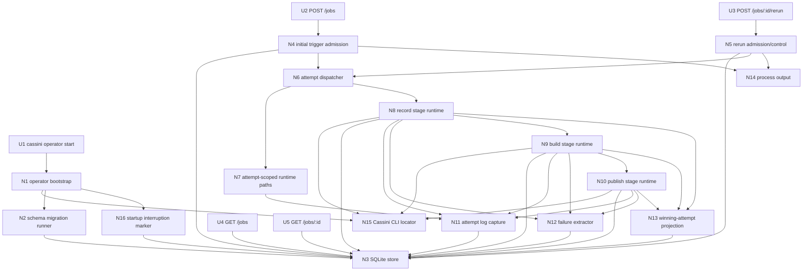
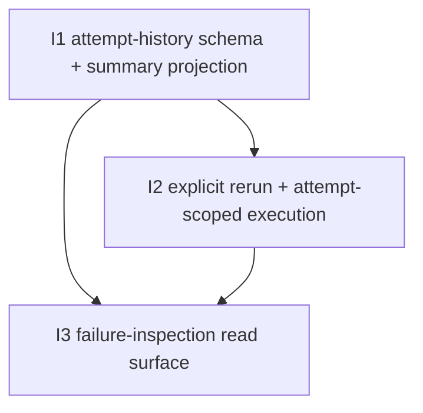

# V5 — Slices

Derived from `planning/initiatives/mvp/slices/V5-failure-inspection-and-rerun-flow/shaping.md`.

This document is the ground truth for the V5 breadboard and for the implementation slices that build the selected shape in testable increments.

The shaped V5 scope rolls up to three workstreams:

1. **S1 — Attempt-history persistence foundation**
2. **S2 — Explicit rerun execution path**
3. **S3 — Failure-inspection read surface**

## Carried-forward V2 baseline (not a V5 slice)

The following capabilities already exist from V2 and are reused rather than re-sliced as new V5 work:

| Affordance | Status |
|-----------|--------|
| `cassini operator start` launcher | ✅ Exists |
| `POST /jobs?provider=nextcloud-talk` | ✅ Exists |
| `POST /jobs/:id/stop` | ✅ Exists |
| `GET /jobs` | ✅ Exists, read shape extends in V5 |
| `GET /jobs/:id` | ✅ Exists, read shape extends in V5 |
| SQLite job store + migrations | ✅ Exists, schema evolves in V5 |
| record/build/publish stage runtimes | ✅ Exists |
| startup interruption marking | ✅ Exists |
| stop metadata on `jobs` row | ✅ Exists |
| process stdout/stderr logging default | ✅ Exists |

---

## Selected workstreams

| # | Workstream | Final result |
|---|------------|--------------|
| S1 | Attempt-history persistence foundation | One logical job keeps a stable summary row while individual attempts are durably persisted and queryable. |
| S2 | Explicit rerun execution path | `POST /jobs/:id/rerun` creates a fresh attempt for a failed job and runs it through the normal record/build/publish stages. |
| S3 | Failure-inspection read surface | `GET /jobs` stays a simple summary view while `GET /jobs/:id` exposes attempt history, failure context, and attempt-scoped artifact/log references. |

---

## Breadboard

### UI Affordances

| Affordance | Place | User/Actor | Interaction | Wires Out |
|------------|-------|------------|-------------|-----------|
| **U1** | **Cassini CLI** | **Developer / operator host** | **`cassini operator start [args...]` launches the existing operator binary.** | **N1** |
| **U2** | **Operator HTTP API** | **Operator / caller** | **`POST /jobs?provider=nextcloud-talk` creates the initial logical job and first persisted attempt.** | **N4, N3, N14** |
| **U3** | **Operator HTTP API** | **Operator / caller** | **`POST /jobs/:id/rerun` requests a fresh rerun attempt for an eligible failed job.** | **N5, N3, N14** |
| **U4** | **Operator HTTP API** | **Operator / caller** | **`GET /jobs` returns newest-first logical job summaries, including rerun summary fields.** | **N3** |
| **U5** | **Operator HTTP API** | **Operator / caller** | **`GET /jobs/:id` returns one logical job summary plus persisted attempt history and failure-inspection details.** | **N3** |

### Non-UI Affordances

| Affordance | Place | Mechanism | Wires Out |
|------------|-------|-----------|-----------|
| **N1** | **Operator bootstrap** | **Resolve config, locate the Cassini CLI, settle schema migrations, mark interrupted jobs, and start HTTP + worker runtime.** | **N2, N3, N15, N16** |
| **N2** | **Schema migration runner** | **Apply numbered migrations that extend the V2 `jobs` schema and add `job_attempts` plus any supporting indexes/constraints needed for per-job attempt history.** | **N3** |
| **N3** | **SQLite store** | **Persist top-level `jobs` summary rows and per-attempt `job_attempts` rows, including attempt-scoped artifact paths, log paths, failure summaries, and timestamps.** | |
| **N4** | **Initial trigger admission** | **Reuse the existing trigger path, but write both the logical job summary row and attempt `1` as the canonical initial attempt history entry.** | **N3, N6, N14** |
| **N5** | **Rerun admission/control** | **Validate rerun eligibility, reject non-failed jobs, create the next queued attempt for the same job id, and update job-summary state back to active queue semantics.** | **N3, N6, N14** |
| **N6** | **Attempt dispatcher** | **Route both initial attempts and rerun attempts into the existing record/build/publish pipeline while carrying `(job_id, attempt_number)` as the execution key.** | **N3, N7, N14** |
| **N7** | **Attempt-scoped runtime paths** | **Allocate isolated per-attempt `.run`, `.meeting`, site-reference, and log paths under the operator work root so no rerun overwrites prior failure evidence.** | **N8, N9, N10, N11** |
| **N8** | **Record stage runtime** | **Reuse the existing live record runtime, but persist all stage/state transitions and failures against the active attempt row while also updating the top-level job summary.** | **N3, N9, N13, N14** |
| **N9** | **Build stage runtime** | **Reuse the existing build runtime against the active attempt’s `.run` output and persist build results against both the attempt row and logical job summary.** | **N3, N10, N12, N14** |
| **N10** | **Publish stage runtime** | **Reuse the existing publish runtime so a successful attempt refreshes the shared hosted site and becomes the effective winning output for the logical job.** | **N3, N12, N14** |
| **N11** | **Attempt log capture** | **Capture subprocess stdout/stderr into attempt-scoped log files and store their paths for later inspection, while continuing to stream to process output by default.** | **N3, N14** |
| **N12** | **Failure extractor** | **Read partial manifests and known downstream failure surfaces, then persist concise failure summaries and detail pointers on the active attempt row and job summary.** | **N3** |
| **N13** | **Winning-attempt projection** | **Project the most relevant current attempt back onto the top-level job summary row: current attempt number, rerun count, latest failure summary, effective artifact pointers, and terminal state.** | **N3** |
| **N14** | **Process output** | **Use operator stdout/stderr as the default live sink for admission, rerun, record, build, publish, and log-capture progress.** | |
| **N15** | **Cassini CLI locator** | **Reuse the existing `CASSINI_BIN` resolution for record/build/publish subprocess execution.** | **N8, N9, N10** |
| **N16** | **Startup interruption marker** | **Reuse the existing startup pass, but mark any non-terminal active attempt as interrupted and keep the logical job summary honest about the last known stage/state.** | **N3** |

### Wiring by Place

| Place | Wiring |
|-------|--------|
| **Cassini CLI** | **U1 → N1** |
| **Operator bootstrap** | **N1 → N15** (resolve Cassini CLI path) **; N1 → N2 → N3** (migration/startup schema path) **; N1 → N16 → N3** (startup interruption marking) |
| **Operator HTTP API** | **U2 → N4** (initial job admission) **; N4 → N3** (insert job summary + attempt `1`) **; N4 → N6** (dispatch initial attempt) **; N4 → N14** (admission logs) **; U3 → N5** (rerun admission) **; N5 → N3** (insert next attempt + update summary state) **; N5 → N6** (dispatch rerun attempt) **; N5 → N14** (rerun logs) **; U4 → N3** (list job summaries) **; U5 → N3** (read job summary + attempts) |
| **Attempt execution runtime** | **N6 → N7** (allocate attempt paths) **; N6 → N8** (record stage) **; N7 → N11** (log file allocation) **; N8 → N15** (resolve Cassini CLI) **; N8 → N3** (record attempt state) **; N8 → N11 → N3** (record logs) **; N8 → N12 → N3** (record failure detail) **; N8 → N9** (advance to build on success) **; N8 → N13 → N3** (project attempt summary) |
| **Build stage runtime** | **N9 → N15** (resolve Cassini CLI) **; N9 → N3** (build attempt state) **; N9 → N11 → N3** (build logs) **; N9 → N12 → N3** (build failure detail) **; N9 → N10** (advance to publish on success) **; N9 → N13 → N3** (project attempt summary) |
| **Publish stage runtime** | **N10 → N15** (resolve Cassini CLI) **; N10 → N3** (publish attempt state) **; N10 → N11 → N3** (publish logs) **; N10 → N12 → N3** (publish failure detail) **; N10 → N13 → N3** (winning-attempt projection / terminal summary) |

---

## Implementation slice summary

These are the concrete execution slices for V5.

| # | Slice | Workstream | New / changed affordances | Depends On | Verify after done |
|---|-------|------------|---------------------------|------------|-------------------|
| **I1** | **Attempt-history schema and summary projection** | **S1 foundation** | **N2, N3, N4, N13, N16** | **—** | **Initial triggers now persist both a top-level job summary and attempt `1`, and startup interruption remains honest with the new schema.** |
| **I2** | **Explicit rerun execution path with attempt-scoped artifacts/logs** | **S2 runtime** | **U3, N5, N6, N7, N8, N9, N10, N11, N12, N14, N15** | **I1** | **A failed job can be rerun through `POST /jobs/:id/rerun`, producing a new isolated attempt that flows through record/build/publish without overwriting the failed attempt.** |
| **I3** | **Failure-inspection read surface** | **S3 reads** | **U4, U5, N3, N12, N13** | **I1, I2** | **`GET /jobs` exposes clean logical-job summaries and `GET /jobs/:id` exposes attempt history, failure summaries, log paths, and effective winning output after reruns.** |

## Affordance allocation by slice

| Affordance | Slice | Notes |
|------------|-------|-------|
| **U1** | **Baseline** | Existing launcher is reused. |
| **U2** | **Baseline / extended in I1** | Existing trigger path remains, but now writes attempt `1`. |
| **U3** | **I2** | New rerun API surface. |
| **U4** | **I3** | Existing list view gains rerun/failure summary fields. |
| **U5** | **I3** | Existing detail view gains attempt history. |
| **N1** | **Baseline** | Existing bootstrap remains the entrypoint. |
| **N2** | **I1** | New V5 migration for attempt history. |
| **N3** | **Baseline / extended in I1 and I3** | Existing store grows into summary + attempts. |
| **N4** | **I1** | Initial trigger path must write attempt `1`. |
| **N5** | **I2** | New rerun admission/control path. |
| **N6** | **I2** | Dispatcher lifts the pipeline key from just `job_id` to `(job_id, attempt_number)`. |
| **N7** | **I2** | Attempt-scoped path isolation lands with rerun. |
| **N8** | **I2** | Existing record stage becomes attempt-aware. |
| **N9** | **I2** | Existing build stage becomes attempt-aware. |
| **N10** | **I2** | Existing publish stage becomes attempt-aware. |
| **N11** | **I2** | Attempt log capture first matters when preserving rerun evidence. |
| **N12** | **I2, I3** | First capture failure detail for attempts, then expose it cleanly through reads. |
| **N13** | **I1, I3** | Summary projection starts in persistence, then becomes the read contract. |
| **N14** | **Baseline / touched in I2** | Process output remains the live sink while attempt logs are added. |
| **N15** | **Baseline / touched in I2** | Existing CLI locator is reused unchanged. |
| **N16** | **I1** | Startup interruption semantics must stay honest with attempt history. |

## Dependency tree

## Concurrency plan

- **Start first:** I1
- **Start after I1:** I2
- **Start after I1 and I2:** I3

The focused persistence spike backing I1 is now answered in:

- `planning/initiatives/mvp/slices/V5-failure-inspection-and-rerun-flow/spike-job-attempts-schema.md`

---

## Slice details

## I1: Attempt-history schema and summary projection

### Objective

Extend persistence so every logical job has a stable summary row plus explicit attempt history, starting with attempt `1` on the initial trigger.

### Why this slice exists

V5 needs a real data model before it needs a rerun endpoint. If attempts are not first-class persisted records, rerun semantics and failure inspection both stay too implicit.

### Includes

- **N2** schema migration runner changes for V5
- **N3** `jobs` + `job_attempts` persistence model
- **N4** initial trigger writes attempt `1`
- **N13** winning-attempt / current-attempt projection onto the top-level job summary
- **N16** startup interruption behavior against the new attempt model

### Activated wiring

- **N1 → N2 → N3**
- **U2 → N4 → N3**
- **N4 → N13 → N3**
- **N16 → N3**

### Verify

1. Start the operator on a fresh database and confirm the V5 migration path succeeds.
2. Upgrade from a V2-shaped database and confirm the new schema is applied cleanly.
3. Trigger one new job.
4. Inspect SQLite or API responses and confirm one logical job summary exists plus attempt `1`.
5. Confirm startup interruption still marks non-terminal active work honestly without corrupting attempt history.

### Acceptance criteria

- a numbered migration adds the `job_attempts` table and any needed summary fields/indexes
- initial trigger writes attempt `1` and associates it to the logical job id
- top-level `jobs` rows gain enough summary state to answer:
  - current attempt number
  - rerun count
  - latest failure summary
  - effective artifact pointers
- startup interruption marking remains honest for non-terminal work with the new attempt model
- existing V2 read/write paths keep working against the migrated schema

---

## I2: Explicit rerun execution path with attempt-scoped artifacts/logs

### Objective

Add the rerun API and make the existing record/build/publish runtime attempt-aware, with isolated artifact/log paths per attempt.

### Why this slice exists

This is the actual recovery loop V5 promises: a failed job can be rerun safely, without overwriting the failed attempt or inventing resumability rules that the system does not actually implement.

### Includes

- **U3** `POST /jobs/:id/rerun`
- **N5** rerun admission/control
- **N6** attempt dispatcher
- **N7** attempt-scoped runtime paths
- **N8** attempt-aware record stage
- **N9** attempt-aware build stage
- **N10** attempt-aware publish stage
- **N11** attempt log capture
- **N12** attempt failure extraction/persistence
- **N14** process-output logging continuity
- **N15** existing CLI locator reuse

### Activated wiring

- **U3 → N5**
- **N5 → N3**
- **N5 → N6**
- **N6 → N7**
- **N6 → N8**
- **N7 → N11**
- **N8 → N3**
- **N8 → N11 → N3**
- **N8 → N12 → N3**
- **N8 → N9**
- **N9 → N3**
- **N9 → N11 → N3**
- **N9 → N12 → N3**
- **N9 → N10**
- **N10 → N3**
- **N10 → N11 → N3**
- **N10 → N12 → N3**

### Verify

1. Trigger or force a job failure.
2. Confirm the failed attempt’s artifact paths, error summary, and log paths are preserved.
3. Call `POST /jobs/:id/rerun`.
4. Confirm a new queued attempt is created for the same job id.
5. Confirm the rerun writes to isolated attempt-scoped paths.
6. Confirm the rerun re-enters record → build → publish.
7. If the rerun succeeds, confirm the shared hosted output refreshes through the normal publish path.

### Acceptance criteria

- `POST /jobs/:id/rerun` exists and:
  - returns `404` for unknown job
  - returns `409` for jobs not eligible for rerun
  - returns `202` when rerun is accepted
- rerun is accepted only from the selected failed terminal contract
- rerun reuses preserved normalized request data rather than requiring the caller to resubmit it
- each attempt writes to isolated attempt-scoped paths for:
  - `.run`
  - `.meeting`
  - log files
- rerun starts from `record` again even if the prior failure was in `build` or `publish`
- existing record/build/publish subprocess boundaries remain intact
- failure summaries and log paths persist against the active attempt row without overwriting older attempts

---

## I3: Failure-inspection read surface

### Objective

Finish the operator-facing read contract so job summaries stay compact while detail reads expose the attempt history and failure evidence V5 adds.

### Why this slice exists

Without this slice, the data model and rerun behavior exist, but the operator still lacks the practical inspection surface that makes the recovery loop usable.

### Includes

- **U4** `GET /jobs` summary extension
- **U5** `GET /jobs/:id` detail extension
- **N3** summary + attempt read queries
- **N12** surfaced failure summaries/detail pointers
- **N13** winning-attempt projection as the read model

### Activated wiring

- **U4 → N3**
- **U5 → N3**
- **N12 → N3**
- **N13 → N3**

### Verify

1. Trigger a failure and inspect `GET /jobs`.
2. Confirm list rows stay one-per-logical-job and show concise rerun/failure summary fields.
3. Inspect `GET /jobs/:id`.
4. Confirm the detail response includes attempts newest-first with per-attempt:
  - stage/state
  - failure summary
  - artifact references
  - log paths
  - timestamps
5. Rerun the failed job and confirm the detail response now shows both the failed attempt and the rerun attempt.
6. If the rerun succeeds, confirm the top-level summary points to the winning attempt’s outputs.

### Acceptance criteria

- `GET /jobs` remains one row per logical job
- `GET /jobs` exposes compact rerun/failure summary fields without embedding full attempt history
- `GET /jobs/:id` exposes full attempt history newest-first
- attempt detail includes enough fields to inspect what failed and where to look next
- the top-level job summary reflects the effective current or winning attempt after rerun
- original failed attempts remain visible after later reruns succeed
