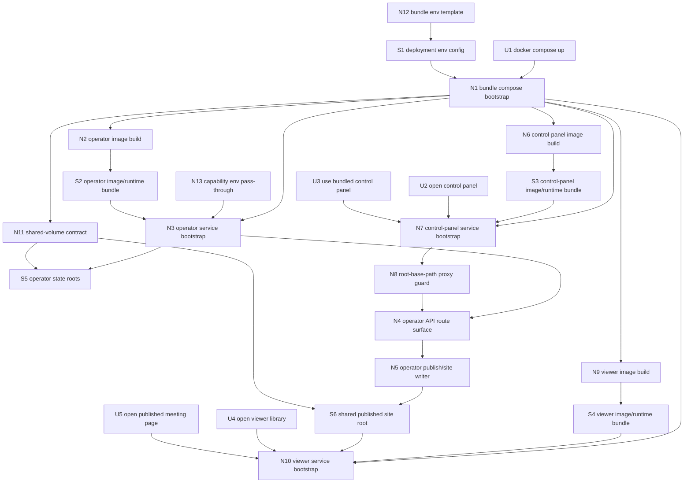

# Deployment bundle 1 — Breadboarding

Derived from `./shaping.md`, selected shape **B: packaged three-service bundle with fixed in-container defaults, host-bound public config, host-network-assisted control-panel proxying, and operator-owned published-site handoff**.

This document is the ground truth for the D-246 breadboard.

## Carried-forward baseline (not new work)

| Affordance | Status |
|-----------|--------|
| `cassini-operator` HTTP job runtime (`POST /jobs`, `POST /jobs/:id/stop`, `GET /jobs`, `GET /jobs/:id`, `GET /events`) | ✅ Exists |
| `cassini-control-panel` browser app for bundled job control/history | ✅ Exists |
| `cassini-viewer` static meeting-library app | ✅ Exists |
| operator-owned published site output (`catalog.json`, `meetings/*`, viewer assets) | ✅ Exists |
| control-panel same-origin proxy model in Vite dev/preview | ✅ Exists, deployment packaging extends it |

---

## Breadboard

### UI Affordances

| Affordance | Place | User/Actor | Interaction | Wires Out |
|------------|-------|------------|-------------|-----------|
| **U1** | **Bundle root / operator host** | **Operator / deployer** | **Run `docker compose up` from the deployment bundle and bring up the packaged services.** | **N1** |
| **U2** | **Control-panel browser** | **Operator** | **Open the bundled control panel at its host port and load the app shell from `/`.** | **N7** |
| **U3** | **Control-panel browser** | **Operator** | **Use the bundled control panel to browse job history, inspect jobs, start jobs, and stop eligible running jobs over the shared API base path.** | **N7, N8, N4** |
| **U4** | **Viewer browser** | **Meeting viewer** | **Open the bundled published library at the viewer host port and load the site root from `/`.** | **N10** |
| **U5** | **Viewer browser** | **Meeting viewer** | **Open a published meeting page from the shared site output served by the viewer service.** | **N10** |

### Non-UI Affordances

| Affordance | Place | Mechanism | Wires Out |
|------------|-------|-----------|-----------|
| **N1** | **Bundle compose** | **Read the bundle `.env`, start the three packaged services, apply host/public port bindings, and apply shared-volume wiring.** | **N2, N3, N6, N7, N9, N10, N11, S1** |
| **N2** | **Operator image build** | **Multi-stage-build `cassini-operator` and `cassini`, then ship the runtime dependencies needed by the existing shell boundary (`ffmpeg`, `ffprobe`, `node`, `npm`, exporter subtree).** | **S2** |
| **N3** | **Operator service bootstrap** | **Start the packaged operator with fixed in-container defaults, internal env wiring for `CASSINI_BIN` / `CASSINI_EXPORTER_RUNNER`, fixed runtime roots, public worker-count envs, and the shared API base path.** | **N4, N5, S5** |
| **N4** | **Operator API route surface** | **Mount `jobs`, `jobs/*`, and `events` under `CASSINI_OPERATOR_BASE_PATH`, defaulting to `/`, and dispatch requests into the existing operator runtime.** | **S5, N5** |
| **N5** | **Operator publish/site writer** | **Run the existing record/build/publish flow and refresh the operator-owned published site root for viewer consumption.** | **S6** |
| **N6** | **Control-panel image build** | **Build `cassini-control-panel` and ship the app plus the preview/proxy runtime used to serve it.** | **S3** |
| **N7** | **Control-panel service bootstrap** | **Serve the built app from `/` on the configured host port and proxy the shared same-origin operator API base path to the host-published operator port.** | **N8, N4** |
| **N8** | **Root-base-path proxy guard** | **When `CASSINI_OPERATOR_BASE_PATH=/`, proxy only the operator route set (`/jobs`, `/jobs/*`, `/events`) so the control-panel root/assets are not swallowed by a catch-all `/` proxy.** | **N4** |
| **N9** | **Viewer image build** | **Ship the viewer/static-serving runtime needed to expose the operator-published site root as a standalone service.** | **S4** |
| **N10** | **Viewer service bootstrap** | **Serve the shared published site root read-only at `/` on the configured viewer host port.** | **S6** |
| **N11** | **Shared-volume contract** | **Mount operator state roots writable and mount the published site root shared as operator read-write / viewer read-only, with named volumes by default and bind-mount override available at compose level.** | **S5, S6** |
| **N12** | **Bundle env template** | **Provide public bundle defaults for service ports, worker counts, and `CASSINI_OPERATOR_BASE_PATH`.** | **S1, N1** |
| **N13** | **Capability env pass-through** | **Pass optional readable-cleanup / summary-generation envs into the operator container without making them part of the narrow core deployment contract.** | **N3** |

### Stores

| Affordance | Place | Store | Description |
|------------|-------|-------|-------------|
| **S1** | **Bundle compose** | **deployment env config** | Public `.env` defaults for host ports, worker counts, and the shared operator API base path. |
| **S2** | **Operator service** | **operator image/runtime bundle** | Shipped `cassini-operator`, shipped `cassini`, media tools, Node runtime, exporter runner, and copied publish/export subtree. |
| **S3** | **Control-panel service** | **control-panel image/runtime bundle** | Built control-panel assets plus the bundled serve/proxy runtime. |
| **S4** | **Viewer service** | **viewer image/runtime bundle** | Bundled static-site serving runtime for the viewer service. |
| **S5** | **Operator service** | **operator state roots** | Fixed in-container DB/work/cache/temp roots backed by compose-managed writable storage. |
| **S6** | **Operator + viewer services** | **shared published site root** | Operator-written static site output mounted read-only into the viewer service. |

### Wiring by place

| Place | Wiring |
|-------|--------|
| **Bundle compose** | **N12 → S1 → N1** ; **U1 → N1** ; **N1 → N2/N6/N9** (image/runtime startup) **; N1 → N11** (shared volume contract) **; N1 → N3/N7/N10** (service bootstrap) **; N13 → N3** (capability env pass-through) |
| **Operator service** | **N2 → S2 → N3** ; **N3 → N4** (API route surface) **; N3 → S5** (fixed writable roots) **; N4 → existing operator runtime** (job/event handling) **; existing operator runtime → N5 → S6** (published site refresh) |
| **Control-panel service** | **N6 → S3 → N7** ; **U2/U3 → N7** ; **N7 → N8 → N4** (same-origin proxy to host-published operator port) |
| **Viewer service** | **N9 → S4 → N10** ; **N11 → S6 → N10** ; **U4/U5 → N10** |

