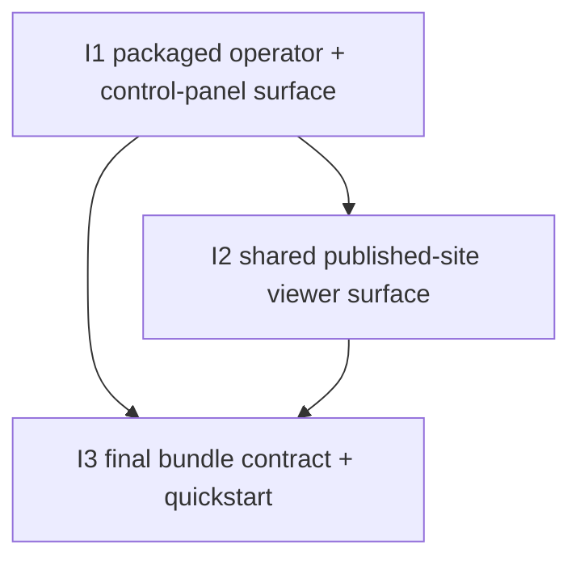

# Deployment bundle 1 — Slices

Derived from `./shaping.md` and `./breadboarding.md`, selected shape **B: packaged three-service bundle with fixed in-container defaults, host-bound public config, host-network-assisted control-panel proxying, and operator-owned published-site handoff**.

This document is the ground truth for the D-246 implementation slices.

## Carried-forward baseline (not a slice)

The following capabilities already exist and are reused:

| Affordance | Status |
|-----------|--------|
| `cassini-operator` job runtime and HTTP API | ✅ Exists |
| `cassini-control-panel` app with jobs history / start / stop / SSE behavior | ✅ Exists |
| `cassini-viewer` static app and published-site consumption model | ✅ Exists |
| operator publish output as static meeting library (`catalog.json`, `meetings/*`, viewer assets) | ✅ Exists |
| Vite-based same-origin control-panel proxy model in dev/preview | ✅ Exists, deployment packaging extends it |

## Selected workstreams

| # | Workstream | Final result |
|---|------------|--------------|
| **S1** | **Packaged control surface** | **Containerized operator + control-panel services expose the existing operator workflow through the deployment bundle.** |
| **S2** | **Published-site viewer surface** | **Containerized viewer service serves the operator-written published site root read-only from shared storage.** |
| **S3** | **Release bundle contract** | **One repo-root deployment bundle provides compose defaults, volume defaults/overrides, and the operator path from `docker compose up` to working browser surfaces.** |

## Breadboard source

The concrete breadboard for these slices lives in:

- `./breadboarding.md`

The slice allocation below references its affordance IDs directly.

---

## Slice summary

| # | Slice | Workstream | New / changed affordances | Depends On | Demo |
|---|-------|------------|---------------------------|------------|------|
| **I1** | **Packaged operator + control-panel surface** | **S1** | **U1, U2, U3, N1, N2, N3, N4, N6, N7, N8, N12, S1, S2, S3, S5** | **—** | **Bring up the packaged operator + control-panel services, open the control panel in the browser, load jobs over the shared API base path, and start/stop jobs against the bundled operator.** |
| **I2** | **Shared published-site viewer surface** | **S2** | **U4, U5, N5, N9, N10, N11, S4, S6** | **I1** | **With published site content present, open the bundled viewer service and browse the operator-written library/meeting pages from the shared site root.** |
| **I3** | **Final bundle contract + quickstart** | **S3** | **N1, N11, N12, N13** | **I1, I2** | **From the deployment bundle alone, a fresh operator follows the documented path, runs `docker compose up`, opens control panel + viewer, triggers a job, and opens the resulting published meeting page.** |

## Affordance allocation by slice

| Affordance | Slice | Notes |
|------------|-------|-------|
| **U1** | **I1, I3** | First lands as the packaged bring-up path; finalized in the release bundle/quickstart. |
| **U2** | **I1** | First visible packaged browser surface: bundled control panel at `/`. |
| **U3** | **I1** | Existing control-panel operator loop becomes containerized and base-path aware. |
| **U4** | **I2** | Viewer library root appears once the viewer service and shared site volume land. |
| **U5** | **I2** | Published meeting page appears once the shared published-site contract is live. |
| **N1** | **I1, I3** | Starts as minimal compose/service bring-up, then matures into the final release bundle contract. |
| **N2** | **I1** | Operator image assembly is foundational packaged-control-surface work. |
| **N3** | **I1** | Operator bootstrap, fixed internal env wiring, and public worker-count config land with the packaged operator. |
| **N4** | **I1** | Shared API base-path support must land before the packaged control surface works. |
| **N5** | **I2** | Viewer slice needs the operator-published site handoff to be live. |
| **N6** | **I1** | Control-panel image assembly lands with the packaged control surface. |
| **N7** | **I1** | Control-panel serve/proxy runtime lands with the packaged control surface. |
| **N8** | **I1** | Root-base-path guard is required to make default `/` work without swallowing app assets. |
| **N9** | **I2** | Viewer image assembly belongs to the published-site viewer slice. |
| **N10** | **I2** | Viewer service bootstrap belongs to the published-site viewer slice. |
| **N11** | **I2, I3** | First lands as the concrete site-volume contract; finalized as named-volume-default + bind-override release behavior. |
| **N12** | **I1, I3** | Minimal env defaults first, polished public `.env` contract in the release slice. |
| **N13** | **I3** | Optional capability env pass-through is release-bundle polish, not first-slice glue. |
| **S1** | **I1, I3** | Public env defaults first exist, then become the polished release contract. |
| **S2** | **I1** | Operator image/runtime bundle is the first packaged foundation. |
| **S3** | **I1** | Control-panel image/runtime bundle lands with the packaged control surface. |
| **S4** | **I2** | Viewer image/runtime bundle lands with the viewer slice. |
| **S5** | **I1, I2** | Operator writable roots are needed in I1 and then participate in the site handoff in I2. |
| **S6** | **I2, I3** | Shared published site root first becomes live in I2, then becomes part of the final operator quickstart contract in I3. |

## Dependency tree

---

## Slice details

## I1: Packaged operator + control-panel surface

### Objective

Bundle the existing operator runtime and the existing control-panel app into one browser-visible packaged control surface that works through the deployment bundle.

### Why this slice exists

This is the highest-risk integration slice because it proves four critical glue points at once:

- operator image packaging with shipped binaries
- operator API base-path support
- control-panel packaged serve/proxy behavior
- the root-base-path (`/`) special case without breaking the app shell

### Includes

- operator Dockerfile with multi-stage-built `cassini-operator` + `cassini`
- in-image runtime dependencies required by the current shell boundary (`ffmpeg`, `ffprobe`, `node`, `npm`, exporter subtree)
- in-container env wiring for `CASSINI_BIN` and `CASSINI_EXPORTER_RUNNER`
- fixed operator in-container defaults (`0.0.0.0:4000`, fixed runtime roots)
- shared API base-path support on the operator HTTP surface
- control-panel Dockerfile with built assets plus serve/proxy runtime
- same-origin proxy from control-panel service to host-published operator port
- special root-base-path guard so default `/` proxies only operator routes (`/jobs`, `/jobs/*`, `/events`)
- minimal bundle `.env` defaults for operator/control-panel ports, worker counts, and API base path

### Activated wiring

- **N12 → S1 → N1**
- **U1 → N1 → N2/N3/N6/N7**
- **N2 → S2 → N3**
- **N6 → S3 → N7**
- **U2/U3 → N7 → N8 → N4**
- **N3 → N4 → existing operator runtime**
- **N3 → S5**

### Verify

1. Bring up the packaged operator + control-panel services from the deployment bundle.
2. Open the control panel at its bundled host port.
3. Verify jobs/history loads over the shared API base path.
4. Verify start/stop actions work against the bundled operator.
5. Verify default `CASSINI_OPERATOR_BASE_PATH=/` does not swallow the control-panel app root/assets.
6. Change `CASSINI_OPERATOR_BASE_PATH` to `/operator` and verify the packaged control panel still works against the prefixed operator routes.

### Acceptance criteria

- packaged operator image ships `cassini-operator` + `cassini` directly
- packaged operator image ships the current shell-boundary runtime dependencies needed for `doctor` / `build` / `publish`
- bundled control panel loads from `/` and proxies operator traffic same-origin
- `CASSINI_OPERATOR_BASE_PATH` affects both the operator route prefix and the control-panel request/proxy path
- default `CASSINI_OPERATOR_BASE_PATH=/` works correctly by proxying only operator API routes, not the whole site root
- operator/control-panel packaged path does not require browser CORS or direct browser access to operator internals

---

## I2: Shared published-site viewer surface

### Objective

Add the viewer service and the shared published-site handoff so the bundle serves operator-written meeting-library output as a standalone browser surface.

### Why this slice exists

The deployment bundle is not complete if it only exposes operator control. It also needs the user-facing consumption surface for published meetings.

### Includes

- viewer Dockerfile and packaged serving runtime
- compose wiring for the shared published site root
- operator-mounted published site root as read-write
- viewer-mounted published site root as read-only
- viewer service exposed at `/` on its host port
- verify path where operator publish output becomes viewer-visible site content

### Activated wiring

- **N9 → S4 → N10**
- **N11 → S5/S6**
- **N3/N5 → S6**
- **U4/U5 → N10**

### Verify

1. Bring up operator, control panel, and viewer services.
2. Ensure published site content exists (from a triggered job or a seeded test site root).
3. Open the viewer at its bundled host port.
4. Verify the library page loads from `/`.
5. Open a meeting page and verify the viewer is serving the operator-written shared site root.
6. Confirm the viewer mount is read-only while the operator remains the only writer.

### Acceptance criteria

- viewer service exists as a separate packaged service with its own Dockerfile
- published site handoff is a shared volume contract: operator RW, viewer RO
- viewer serves the published library from `/` on its own host port
- published meetings become visible in the viewer through the shared site root, not through direct reads of operator DB/work internals

---

## I3: Final bundle contract + quickstart

### Objective

Finalize the repo-root deployment bundle so a fresh operator can use the deployment folder alone to bring up the stack, understand the defaults, and override storage behavior when needed.

### Why this slice exists

D-246 is not only about having the pieces somewhere in the repo — it is about turning them into one coherent operator path.

### Includes

- dedicated repo-root deployment folder with compose file and `.env` defaults
- final public `.env` contract for ports, worker counts, and API base path
- named-volume-default behavior for operator state and published site output
- clear compose-level pattern for bind-mount overrides when we need host-visible storage
- optional capability env pass-through for readable-cleanup / summary-generation support
- quickstart/operator docs for bring-up and verification

### Activated wiring

- **U1 → N1**
- **N12 → S1 → N1**
- **N11 → S5/S6**
- **N13 → N3**
- all I1/I2 browser-visible paths under the final bundle contract

### Verify

1. Start from a clean checkout/environment.
2. Use only the deployment bundle folder and its docs.
3. Run `docker compose up`.
4. Open the control panel and viewer from the documented host ports.
5. Trigger a job from the bundled control panel.
6. Open the resulting published meeting/library output from the bundled viewer.
7. Switch from named-volume defaults to the documented bind-mount override path and verify the contract still holds.

### Acceptance criteria

- one repo-root deployment bundle folder contains the compose file and `.env` defaults
- named volumes are the default shared-storage behavior
- bind-mount override path is documented and intentional rather than ad hoc
- optional capability envs can be passed to the operator without bloating the narrow core deployment contract
- a fresh operator can follow the bundle path without repo archaeology and end at both working browser surfaces
