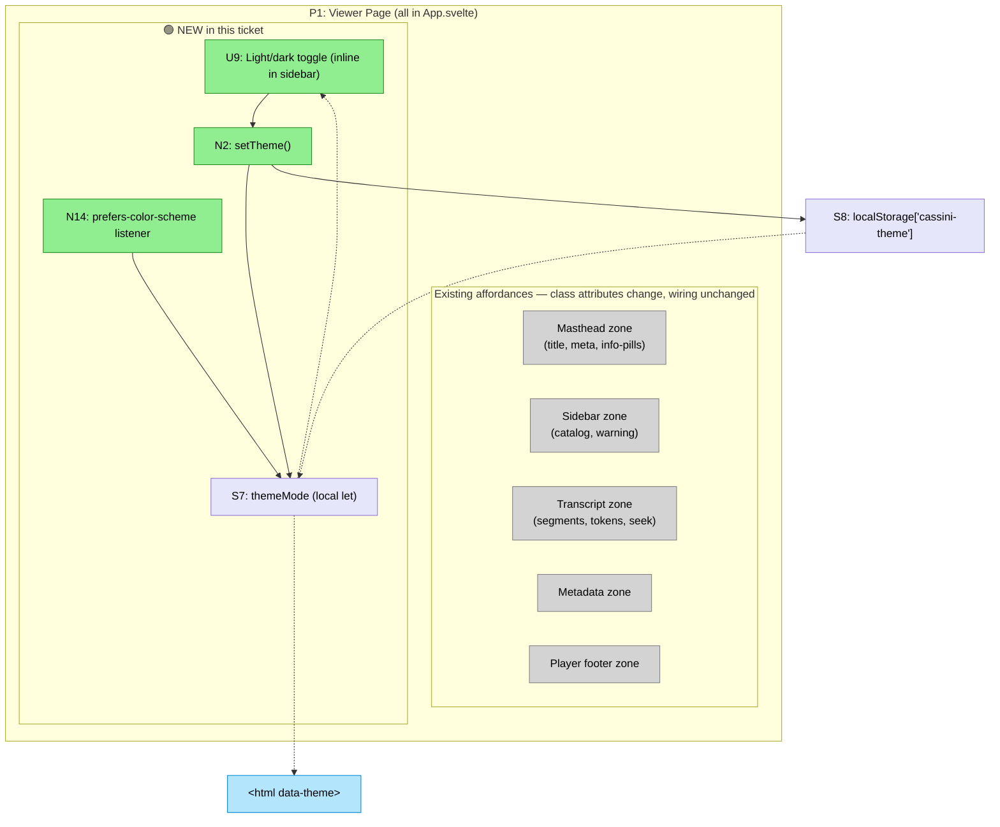

# Viewer Foundation Refactor — Shaping

Precursor to V3 (summary panel). **Selected scope: design system only** (stock DaisyUI + Tailwind + light/dark theming + in-place CSS migration). Componentization was considered and deliberately deferred — see [Scope Revision](#scope-revision).

## Source

Ticket provided by the team (V3 — summary panel rendering in the viewer):

> Summary
>
> Implement the summary panel and display UX in the viewer using V0's committed demo data and summary template. The designer focuses purely on rendering and interaction — the template shape and demo content are already in the repo.
>
> Why this matters
>
> This gives the viewer a polished summary presentation that backend generation (V4) can target without reopening design decisions.
>
> Problem statement
>
> The viewer has no summary rendering. The template and demo data exist (V0), but nothing displays them yet.
>
> Scope
>
> - Render the V0 summary template as a polished panel on the single meeting page
> - Design the summary display UX: layout, typography, section rendering
> - Handle missing-summary fallback gracefully
> - Polish the overall viewer UX as needed for summary integration
>
> Out of scope
>
> - Defining the summary template (done in V0)
> - Preparing demo/seed data (done in V0)
> - Real LLM summary generation
> - Worker/trigger integration
> - Building a new static server (existing one is verified working)
>
> Dependencies: V0
>
> Acceptance criteria
>
> - The single-meeting page renders the summary in a polished panel
> - Missing-summary behavior is handled gracefully
> - The rendering is faithful to the V0 template structure
> - The designer can work entirely against V0 pulled demo data with cassini serve or npm run dev
>
> Likely code areas
>
> - cassini-viewer/src/App.svelte
> - cassini-viewer/src/viewer/loadArtifact.ts
> - viewer-side summary/markdown rendering path
>
> Traceability: Slice V3, Affordances U8, N14

Concern raised before starting V3:

> i understand that this is currently a single page application [...] I think the goal is to keep it that way so its intentionally light. [...] before implementing the summary work we should probably do a rework of the way the frontend of the app is configured to use Daisy UI.

Assessment findings from codebase review:

> `App.svelte` is 1,694 lines in a single file — 605 lines of TS, 325 of markup, **760 of handwritten CSS**. No component directory. 67 class usages against ~100+ bespoke CSS selectors (`panel`, `info-pill`, `meeting-card`, `segment`, etc.). `app.css` is 46 lines (resets + warm radial-gradient palette). Visual language is deliberate (Georgia/Trebuchet, cream + soft shadows) but *unshared*.

Terminology clarification:

> SPA means one `index.html` entry, client-side rendering, static-hostable — that's about the shipped artifact, not the source layout. Svelte compiles all components into one bundle at build time. Componentization does not compromise the "light SPA" intent. The design-system side (Tailwind + Daisy) does add one compiled CSS file (~20–50 KB gzipped post-JIT purge).

---

## Problem

The viewer's styling layer has three specific issues that make future additions harder than they need to be:

- **Bespoke CSS vocabulary**: ~100 handwritten selectors for `panel`, `info-pill`, `meeting-card`, etc. A new summary panel either duplicates that vocabulary or drifts from it.
- **No theme layer**: colors, radii, typography are literal values scattered through the `<style>` block. Any visual change is a find-and-replace across ~760 lines.
- **No shared primitives**: every `.panel` / `.pill` instance is a fresh CSS block, even though they want to be the same thing.

The domain code in `cassini-viewer/src/core` and `cassini-viewer/src/viewer` is *fine* — cleanly factored, well-tested. The problem is strictly the styling layer.

---

## Outcome

Before V3 lands, the viewer's styling is on a shared design-system foundation so adding a summary panel (and future sections) means **using existing primitives**, not writing a new bespoke CSS vocabulary.

Concretely:
- `App.svelte` still holds the full UI — **not componentized in this ticket**.
- All bespoke CSS is gone: the `<style>` block in App.svelte and the radial-gradient in `app.css` are removed.
- Styling comes from Tailwind utilities + stock DaisyUI primitives (`card`, `badge`, `btn`, `alert`, `menu`, `toggle`, etc.).
- Theme tokens come from Daisy's stock themes — centralized by construction.
- Light and dark mode both work out of the box, with a user-visible toggle in the sidebar bottom-left.
- The viewer still builds and ships as a single static bundle — no server, no router, no framework bloat.

V3 (and any later addition) then adds its own markup section inside App.svelte using the shared Daisy primitives. This ticket does not reorganize source layout or pre-build any scaffolding.

---

## Requirements (R)

🟡 Updated after [Scope Revision](#scope-revision) — R2 (decomposition) and R4 (phasing) were dropped. R3 renumbered to R2.

| ID | Requirement | Status |
|---|---|---|
| 🟡 **R0** | V3 summary work can be added using shared design-system primitives rather than bespoke CSS | Core goal |
| **R1** | **Preservation** | |
| R1.1 | Viewer remains a static-build SPA — one `index.html`, one JS bundle, static-hostable | Must-have |
| R1.2 | Existing vitest suites (core, viewer) still pass | Must-have |
| R1.3 | Existing serve paths keep working — `cassini serve`, `npm run dev` + the viewer-demo assets plugin in `cassini-viewer/vite.config.ts` | Must-have |
| R1.4 | Current interaction behaviors preserved — active-segment highlight, auto-scroll lock, speaker continuation spacing, click-to-seek timing | Must-have |
| 🟡 **R2** | **Design system** | |
| R2.1 | Shared primitives (card/panel, badge/pill, button) replace bespoke per-feature CSS | Must-have |
| R2.2 | Theme tokens (colors, radii, typography, spacing) come from stock DaisyUI, not hardcoded in the component | Must-have |
| R2.3 | Visual identity resets to stock DaisyUI themes — no custom theme authoring, the warm cream/serif palette is deliberately retired | Must-have |
| R2.4 | Both light and dark mode supported — uses Daisy's built-in theme swap; default respects `prefers-color-scheme` | Must-have |
| R2.5 | All bespoke `<style>` blocks and `app.css` handwritten selectors are removed — zero bespoke CSS remaining | Must-have |
| 🟡 **R3** | **Componentization — explicitly deferred** (was a core goal pre-revision) | Out of scope |
| **R4** | Bundle size doesn't regress meaningfully after Tailwind JIT purge | Nice-to-have |

---

## Shapes

### CURRENT: Monolithic Svelte component with bespoke CSS

| Part | Mechanism |
|---|---|
| CURRENT.1 | Entire UI in `cassini-viewer/src/App.svelte` (1,694 lines) |
| CURRENT.2 | ~760 lines of handwritten scoped CSS, ~100 selectors |
| CURRENT.3 | No shared primitives; every `.panel` / `.info-pill` is an independent block |
| CURRENT.4 | Colors/radii/typography inline as literal values |
| CURRENT.5 | `app.css` (46 lines) for global resets + body gradient only |

---

### A: Componentize only (defer design system)

| Part | Mechanism | Flag |
|---|---|:---:|
| **A1** | **Decompose `App.svelte`** | |
| A1.1 | Extract `<Masthead />` — header panel, info pills, title logic | |
| A1.2 | Extract `<MeetingCatalog />` — sidebar catalog list, selection | |
| A1.3 | Extract `<TranscriptPane />` — segments, tokens, click-to-seek, scroll lock | |
| A1.4 | Extract `<PlayerBar />` — audio element, playback progress, follow toggle | |
| A1.5 | Extract `<MetadataSections />` — the artifact metadata rows | |
| A1.6 | Extract `<WarningBanner />` — error-message panel | |
| **A2** | **Carry existing styles** — move each feature's CSS into its owning component's `<style>` block (Svelte scoped) | |
| **A3** | **Shared state via props + a small store** — a `viewer.ts` store for playback + selection so components aren't deep-drilling props | |
| **A4** | **No new build dependencies** — Tailwind/Daisy not introduced | |

### B: Componentize + Tailwind + DaisyUI in one shot

| Part | Mechanism | Flag |
|---|---|:---:|
| **B1** | **Decompose `App.svelte`** — same as A1 | |
| **B2** | **Install Tailwind + DaisyUI + postcss** — wire into `cassini-viewer/vite.config.ts`, add `postcss.config.js`, `tailwind.config.js` | |
| **B3** | **Enable stock DaisyUI themes** — use Daisy's stock light + dark themes, no custom theme authoring | |
| **B4** | **Port each component's styles** — replace bespoke CSS with Tailwind utilities + Daisy `card`/`badge`/`btn` primitives during the same extraction | |
| **B5** | **Preserve interaction behaviors** — re-derive active-segment highlight, scroll-lock visuals, continuation spacing in Tailwind/Daisy | ⚠️ |
| **B6** | **Light/dark mode control** — wire Daisy's `data-theme` on `<html>`, default to `prefers-color-scheme`, add a user-visible toggle | |
| **B7** | **Shared state store** — same as A3 | |

### C: Phased — componentize first, design system second, same ticket *(superseded by D)*

| Part | Mechanism | Flag |
|---|---|:---:|
| **C1** | **Phase 1 — Componentize (= Shape A)** | |
| C1.1 | Execute A1–A4 as phase 1 — components extracted, existing CSS carried into scoped `<style>` blocks, no new build deps | |
| C1.2 | Phase 1 ships as its own PR/commit and is independently mergeable | |
| **C2** | **Phase 2 — Design system** | |
| C2.1 | Install Tailwind + DaisyUI + postcss | |
| C2.2 | Enable stock DaisyUI themes — wire Daisy's stock `light` and `dark` themes via `data-theme` on `<html>`, no custom theme authoring | |
| C2.3 | Light/dark mode control — default to `prefers-color-scheme`, add a user-visible toggle anchored **bottom-left of the sidebar**, persist the user's choice to localStorage | |
| C2.4 | **Pre-migration audit** — sweep existing vitest suites for assertions/snapshots that depend on bespoke class names (`.panel`, `.info-pill`, `.meeting-card`, `.segment`, etc.); update tests or plan migration path before C2.5 | |
| C2.5 | Migrate components one at a time from bespoke scoped CSS → Tailwind utilities + Daisy primitives | |
| C2.6 | Each component migration is independently reviewable | |
| C2.7 | Remove the emptied scoped `<style>` blocks once migrated | |
| **C3** | **Scope guardrail** — phase 2 changes visual appearance (stock Daisy themes replace the cream/serif palette) but does **not** change layout behavior, interaction patterns, affordance positions, or responsive breakpoints. UX polish (mobile, collapsible sidebar, etc.) is explicitly deferred to follow-on work so any regression in phase 1+2 is isolated to the refactor itself. | |
| **C4** | **Phase 2 ships as a second PR/commit** — same ticket, second milestone | |

### 🟡 D: Design system only — in-place CSS migration, no componentization *(selected)*

| Part | Mechanism | Flag |
|---|---|:---:|
| **D1** | **Install Tailwind + DaisyUI + postcss** — wire into `cassini-viewer/vite.config.ts`, add `postcss.config.js`, `tailwind.config.js` | |
| **D2** | **Enable stock DaisyUI themes** — `data-theme` binding on `<html>`, ship Daisy's stock `light` and `dark` themes, no custom theme authoring | |
| **D3** | **Light/dark control** — `prefers-color-scheme` default, inline `<ThemeToggle />` markup in App.svelte's sidebar bottom-left (not extracted as a component), localStorage persistence | |
| **D4** | **In-place CSS migration** — port App.svelte's `<style>` block (~760 lines) and `app.css` gradient to Tailwind utilities + Daisy primitives directly in existing markup. No element extraction, no DOM restructure. | |
| **D5** | **Retire bespoke vocabulary** — `.panel`, `.info-pill`, `.meeting-card`, `.segment`, `.masthead`, `.player-*`, etc. all disappear, replaced by Tailwind classes + Daisy primitives (`card`, `badge`, `menu`, `alert`, `toggle`, `btn`, `range`, `collapse`) | |
| **D6** | **Remove all `<style>` blocks + scrub `app.css`** — final state: `app.css` is just `@tailwind` directives + Daisy plugin config; `App.svelte` has no `<style>` block | |
| **D7** | **Scope guardrail** — layout, interaction patterns, affordance positions, DOM structure, and responsive breakpoints are **unchanged**. The only thing that changes is visual styling. No componentization. UX polish stays follow-on work. | |
| **D8** | **Single-ticket, single-phase** — ships as one body of work, sliced for incremental review (see slices doc). | |

---

## Fit Check

🟡 Re-evaluated against the updated R after [Scope Revision](#scope-revision). Shape D added.

| Req | Requirement | Status | A | B | C | 🟡 D |
|-----|-------------|--------|:---:|:---:|:---:|:---:|
| R0 | V3 summary can be added using shared design-system primitives rather than bespoke CSS | Core goal | ❌ | ✅ | ✅ | ✅ |
| R1.1 | Static-build SPA preserved | Must-have | ✅ | ✅ | ✅ | ✅ |
| R1.2 | Existing vitest suites pass | Must-have | ✅ | ✅ | ✅ | ✅ |
| R1.3 | Existing serve paths keep working | Must-have | ✅ | ✅ | ✅ | ✅ |
| R1.4 | Interaction behaviors preserved | Must-have | ✅ | ❌ | ✅ | ✅ |
| R2.1 | Shared primitives replace bespoke per-feature CSS | Must-have | ❌ | ✅ | ✅ | ✅ |
| R2.2 | Theme tokens from stock DaisyUI | Must-have | ❌ | ✅ | ✅ | ✅ |
| R2.3 | Visual identity resets to stock DaisyUI themes | Must-have | ❌ | ✅ | ✅ | ✅ |
| R2.4 | Light + dark mode supported | Must-have | ❌ | ✅ | ✅ | ✅ |
| R2.5 | All bespoke `<style>` + `app.css` handwritten selectors removed | Must-have | ❌ | ✅ | ✅ | ✅ |
| R3 | Componentization — **deferred** (not a requirement in the revised scope) | Out of scope | — | — | — | — |
| R4 | Bundle size doesn't regress meaningfully | Nice-to-have | ✅ | ✅ | ✅ | ✅ |

**Notes:**
- **A** fails every design-system requirement — doesn't match the revised core goal.
- **B** fails R1.4: porting bespoke CSS + decomposing simultaneously doubles the surface under review.
- **C** satisfies the revised requirements but carries componentization as extra scope that the revision removed. Strictly overkill for the current need.
- 🟡 **D** passes everything. Narrower risk surface than C: no component extraction → no V4 seek coordination, no new test infra, no cross-component coordination. Hit-target risk during transcript CSS port still applies (see slices doc).

**Recommendation:** 🟡 **Shape D**.

---

## Scope Revision

After Shape C was selected and fully breadboarded + sliced, we pressure-tested the justification for componentization and concluded it wasn't earned by current needs:

- **V3's acceptance criteria** don't require componentization — a new markup section in App.svelte using the new Daisy primitives satisfies them.
- **Componentization was scope I (the assistant) added**, grounded in general engineering principles rather than project-specific pain.
- **No concrete near-term viewer features** beyond V3 are queued. Designing for hypothetical future requirements violates "don't design for hypothetical future requirements."
- **The current App.svelte is big but coherent** — not spaghetti. Reading it is fine, editing it is fine.
- **Componentization adds real risk** that disappears when we don't do it: seek-path coordination (V4 in the old plan), new test infrastructure, cross-component reactive patterns.
- **DaisyUI + tokens + light/dark** — the *stated* concern — doesn't require componentization. Wire Tailwind + Daisy into the current monolithic App.svelte, strip bespoke CSS in place, add ThemeToggle, ship.

**Decision**: scope reduced from C to D. Componentization moves to follow-on work, to be revisited if/when a second feature actually wants to share UI with an existing concern.

## Decisions

1. 🟡 **Shape D selected** (superseding Shape C). Design system only, in-place CSS migration, no componentization. Single ticket, single phase.
2. ✅ **R2.3 resolved** — reset to stock DaisyUI. No custom theme authoring. The warm cream/serif palette is deliberately retired.
3. ✅ **R2.4 in scope** — both light and dark mode supported.
4. ✅ **Light/dark toggle UX** — system default (`prefers-color-scheme`) + explicit user toggle anchored **bottom-left of the sidebar**, persisted to localStorage. Rendered as inline markup in App.svelte (not a separate component).
5. 🟡 **Class-name audit** — resolved during shaping (pre-ticket scan of the 5 vitest files found zero class-name dependencies). Reduced to a 60-second confirmation grep inside the first migration slice.
6. ✅ **Summary work deferred entirely** — this ticket does not define any V3-facing contract, does not touch summary-related code paths. V3 adds its section later against this foundation.
7. 🟡 **Ticket structure** — one ticket, one phase. Internally sliced for incremental review.
8. 🟡 **Scope guardrail (D7)** — this is a styling-only refactor. Layout, interaction patterns, affordance positions, DOM structure, responsive breakpoints, and file organization all **unchanged**. The only thing that changes is visual styling. UX polish and componentization are follow-on work.

---

## Breadboard (Target State — Shape D)

Single place, single file. Nothing is extracted into components. The breadboard exists to name what's **added** on top of the current affordances.

### Places

| # | Place | Description |
|---|-------|-------------|
| P1 | Viewer Page | Single HTML page rendered by `App.svelte`. All affordances live inside this one Svelte component. |

### Existing affordances (unchanged)

Every UI and code affordance already present in `cassini-viewer/src/App.svelte` stays exactly where it is — same element, same event handler, same scope. Listed here for traceability. **None are extracted; none change wiring.** The only thing that changes is their `class` attributes (bespoke → Tailwind + Daisy) and scoped `<style>` rules (removed).

Zones: **Masthead** (title, meta summary, info-pills), **MeetingCatalog** (meeting list), **WarningBanner** (error panel), **TranscriptPane** (header, segments, speaker tags, tokens, scroll-lock indicator), **MetadataSections** (expandable details), **PlayerBar footer** (audio element, transport, timeline, auto-scroll switch, exact-words toggle).

Interactions that must survive the restyle (this is the live-wire list for the R1.4 check):

- Click on speaker tag / token → `seekTo(ms)` → sets `audioEl.currentTime`
- Wheel / touchmove on transcript list → `manualScrollLock = true`
- Active-segment highlight driven by `currentTimeMs` derived state
- Auto-scroll active segment into view when `followPlayback && !manualScrollLock`
- Audio `timeupdate` / `play` / `pause` / `durationchange` events update local state
- Play/pause button toggles `playing`
- Timeline slider `input` seeks audio
- Auto-scroll switch toggles `followPlayback`
- Exact-words toggle flips `showExactWords`

### Additions in this ticket

Only four new affordances arrive in Shape D — all theme-related.

| # | Affordance | Kind | Placement | Wires |
|---|---|---|---|---|
| U9 | Light/dark toggle button | UI | Inline markup in `<aside class="sidebar">`, after the existing WarningBanner region (bottom-left of the sidebar). Not a new component file. | click → N2 |
| N2 | `setTheme(mode)` handler | Code | Function in App.svelte's `<script>` | writes S7, S8, sets `<html data-theme>` |
| N14 | `prefers-color-scheme` listener | Code | `window.matchMedia(...)` subscribed in `onMount()` inside App.svelte | writes S7 if no S8 present |
| S7 | `themeMode` local binding | State | `let themeMode: 'light' \| 'dark' = …` in App.svelte | read by U9, `<html data-theme>` |
| S8 | `localStorage['cassini-theme']` | External store | Browser localStorage | read on init, written by N2 |

Note: S7 is a plain `let` binding in App.svelte's script, not a Svelte writable store. No `src/stores/viewer.ts` file. No cross-component wiring, because there are no other components.

### What leaves (the delete list)

| What | From | Replaced by |
|---|---|---|
| `<style>` block (~760 lines) | `cassini-viewer/src/App.svelte` (around line 932 at shaping time) | `class` attributes using Tailwind + Daisy primitives |
| Radial-gradient background | `cassini-viewer/src/app.css` (around lines 6–9 at shaping time) | Daisy theme body background |
| Bespoke selectors: `.panel`, `.info-pill`, `.masthead`, `.meeting-card`, `.segment`, `.speaker-tag`, `.transcript-list`, `.player-dock`, `.player-card`, `.transport-button`, `.timeline-slider`, `.switch-button`, `.metadata-section`, `.info-strip`, `.player-actions`, etc. | Tailwind utilities + Daisy `card` / `badge` / `alert` / `menu` / `btn` / `range` / `toggle` / `collapse` |
| Georgia / Trebuchet font stack | app.css `:root` | Daisy default fonts |
| Handcoded focus-visible outline | app.css | Daisy / Tailwind focus utilities |

### Minimal additions mermaid

Slicing of the breadboard into per-slice implementation lives in the companion [D248 - viewer-refactor-slices.md](D248 - viewer-refactor-slices.md).

---

## Follow-On Work (Out of Scope for This Ticket)

Captured here so it's visible in the shaping, but **not** part of this ticket. To be picked up iteratively by the user after phases 1+2 ship.

- 🟡 **Componentization of App.svelte** — extract Masthead, MeetingCatalog, WarningBanner, TranscriptPane, MetadataSections, PlayerBar, and ThemeToggle into dedicated files. Revisit when a second feature actually wants to share UI with an existing concern, or when App.svelte becomes actively painful to work in (not just "big"). The original Shape C breadboard and slicing in this doc's git history can be reused as the starting plan if that time comes.
- 🟡 **Component-level test coverage** — the viewer has zero component-level tests today (all existing vitest is pure-logic). A follow-on ticket could introduce `@testing-library/svelte` + a DOM environment and add tests for transcript click-to-seek, meeting selection, player transport, etc. Independent of componentization — the tests could exercise the current monolithic App.svelte.
- **Mobile usability** — responsive breakpoints, touch targets, viewport-aware layouts
- **Collapsible sidebar** — meeting catalog collapses into a drawer on small viewports
- **Responsive transcript pane** — readable line lengths and scroll behavior on mobile
- **Other UX polish** — surfaced as the user encounters needs against the new foundation

**Why defer:** phases 1+2 already touch every UI file. Folding layout/interaction changes into the same PRs would make regressions indistinguishable from refactor fallout. Shipping the refactor first gives a clean baseline (componentized + themed + tested) against which UX changes can be reviewed on their own merits.

---

## Next Steps

Shape D is selected. Slice breakdown and per-slice mitigation detail live in the companion [D248 - viewer-refactor-slices.md](D248 - viewer-refactor-slices.md).

Slice sketch (see slices doc for detail):

- **V1** — Install Tailwind + DaisyUI + postcss; wire Vite; set stock Daisy themes; `<html data-theme>` binding; inline ThemeToggle in sidebar bottom-left; `prefers-color-scheme` default + localStorage persistence; retire `app.css` gradient. Demo: toggle works, body background flips light↔dark.
- **V2** — Migrate sidebar + masthead CSS in place (Tailwind utilities + Daisy `badge`, `menu`/`card`, `alert`). Remove corresponding rules from App.svelte's scoped `<style>`.
- **V3** — Migrate transcript pane CSS. 🟠 Higher risk — hit-target drift. "Class-only first pass" rule + before/after `audit:portable-token` diff + manual walkthrough.
- **V4** — Migrate player footer + metadata CSS; remove the rest of the `<style>` block; remove remaining `app.css` handwritten rules; final audit for hardcoded literals. **Ticket closes.**

**Future tickets (not this one):** componentization, component-level test coverage, mobile/responsive UX polish.
