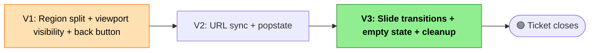

# Viewer UX Restructure — Slices

Companion to [D249 - viewer-ux-restructure-shaping.md](D249 - viewer-ux-restructure-shaping.md). Breaks **Shape A** (two-place master-detail, URL-synced, slide transitions) into 3 vertical slices.

## Note on "Vertical" for This Ticket

Each slice produces a visibly different viewer. Slice 1 is the biggest (structural layout change) but gives you "two-place navigation works"; slice 2 adds browser-back support; slice 3 adds polish. Every slice ends at a demo-able state you could ship on its own (if you wanted to).

## What Shape A Does NOT Touch

Invariants for this ticket — changes here count as regressions:

- Visual styling — V7's DaisyUI foundation is in place; this ticket uses those primitives, doesn't redefine them
- Transcript click-to-seek timing (audit + manual walkthrough still apply if anything structural changes near tokens)
- Catalog schema, artifact loader contract, transcript data shape
- Existing interaction patterns within a single meeting (play/pause, scroll-lock, auto-scroll, exact-words, metadata expand/collapse, theme toggle)
- The 5 existing vitest suites (`core/timing`, `core/transcript`, `viewer/catalog`, `viewer/loadArtifact`, `viewer/portable`)
- File layout — App.svelte stays as one file (consistent with V7's anti-componentization decision). Two `<section>` regions inside App.svelte, not separate component files.

## Slice Summary

| # | Slice | Demo |
|---|-------|------|
| **V1** | Region split + viewport visibility + back button (state-driven) | Desktop: side-by-side meeting list on left, meeting view on right with minimal empty state. Mobile: single column — list by default, selecting a meeting transitions to view, sticky top-left back button returns to list. All behaviors preserved. Back button works via direct state mutation (not URL-driven yet). |
| **V2** | URL sync + popstate (URL becomes the navigation source of truth) | Mobile browser back button returns to list. Deep linking works: refresh on `?meeting=<id>` lands on that meeting; `#t=<ms>` hash still applies initial seek. Forward button replays navigation. |
| **V3** | Slide transitions + polished desktop empty state — **🟢 ticket ships** | Mobile: list↔view uses slide/push animation. Desktop: empty state is a minimal centered "Select a meeting to view" card. Honors `prefers-reduced-motion`. Ticket closes. |

---

## Per-Slice Detail

### V1 — Region split + viewport visibility + back button

**This is the biggest slice** — it does the structural layout change. Bundled with viewport visibility + back button so the demo is coherent ("two-place navigation works"), not "internal refactor invisible to user."

**Structure changes:**

App.svelte's template gets reorganized. Two sibling `<section>` elements inside a Tailwind grid container:

```svelte
<div class="grid grid-cols-1 md:grid-cols-[340px_1fr] min-h-screen">
  {#if isDesktop || !selectedMeetingId}
    <section class="meeting-list …">
      <!-- heading, meeting catalog, warning banner, theme toggle -->
    </section>
  {/if}
  {#if isDesktop || selectedMeetingId}
    <section class="meeting-viewer …">
      <!-- back button (sticky, md:hidden), masthead, transcript, metadata, player -->
    </section>
  {/if}
</div>
```

**Moves (all inline, no component extraction):**

| From | To |
|---|---|
| `<aside class="sidebar">` children (catalog, warning) | `meeting-list` |
| Theme toggle (bottom of old sidebar, from V7) | `meeting-list` (stays at bottom-left) |
| `<header class="masthead panel">` + `<main class="panel transcript-panel">` + `<footer class="player-dock">` | All into `meeting-viewer` |
| The old "Select a meeting…" muted text inside transcript pane | Removed from transcript; becomes a separate empty-state block at top of `meeting-viewer` (improved in V3) |

**New code:**

- `isDesktop` reactive boolean from `window.matchMedia('(min-width: 768px)')` — read at mount, updated on a `change` listener. Removed on unmount.
- `handleBackToList()` — clears `selectedMeetingId = ""` directly (URL sync happens in V2)
- Back-to-list button: Daisy `btn btn-ghost btn-sm` with chevron-left icon, `sticky top-0 md:hidden`, placed as first child of `meeting-viewer`

**Affordances first assigned:** U7 (back button) · N3 (`handleBackToList`, state-only version; gets rewired to `history.back()` in V2)

**Player placement:** moves from global `<footer>` to inside `meeting-viewer`, pinned to the **bottom edge of the right column** (confirmed). Implementation options:

- **Sticky pattern** (preferred): `sticky bottom-0` on the player element, with `meeting-viewer` set as `overflow-y: auto` so the transcript + metadata scroll behind a pinned player. Cleanest for the column-scroll model.
- **Fixed pattern** (alternative): `fixed bottom-0` with width constrained to the column (e.g. `md:right-0 md:left-[340px]`). Works if the whole page scrolls instead of the column.

Pick one during implementation based on which scroll model is easier to make work — the user's intent is just "player stays visible at the bottom of the right column as content above scrolls." Audio element ref (`bind:this={audioEl}`) continues to bind normally — Svelte handles the DOM position change.

**Force-remount on meeting change:** wrap `{#key selectedMeetingId}` around the meeting-specific parts of `meeting-viewer` (or just the audio element) so switching meetings gives a clean audio state. This is the mechanism that makes R3.4 (player unmounts on return to list) work without extra cleanup code.

**Verification checklist:**
- [ ] Desktop (`≥md`): meeting list on left (340px), meeting view on right (remaining width), both always visible
- [ ] Desktop with no selection: meeting view shows current "Select a meeting…" text (kept as-is this slice; improved in V3)
- [ ] Desktop with selection: all meeting content renders exactly as before
- [ ] Mobile (`<md`): only meeting list visible on load; selecting a meeting replaces it with meeting view
- [ ] Mobile back-to-list button: visible in view, sticky top-left, clears selection on click
- [ ] Back-to-list button: NOT visible on desktop
- [ ] Player is inside meeting view region; on desktop it's at the bottom of the right column
- [ ] Warning banner still renders on load failures
- [ ] Theme toggle still works, still sits in the sidebar (now the list region) bottom-left
- [ ] Transcript click-to-seek, scroll-lock, auto-scroll, active highlight all preserved
- [ ] Playback: play/pause, timeline scrub, auto-scroll switch, exact-words toggle all preserved
- [ ] Meeting selection triggers artifact load, player mounts with correct audio src
- [ ] Switching meetings on desktop: audio for old meeting stops, new meeting loads (via `{#key}`)
- [ ] All existing vitest suites pass
- [ ] `npm run audit:portable-token` passes against a known sample meeting
- [ ] Browser back button currently does whatever it did before (not yet rewired — that's V2)

**Risk: structural churn.** This slice moves the majority of template markup. Two mitigations:
1. **Commit boundaries**: "Add grid wrapper + region sections (empty)" → "Move list content into meeting-list" → "Move masthead/transcript/metadata into meeting-viewer" → "Move player into meeting-viewer with `{#key}` remount" → "Add back-to-list button + isDesktop reactive" → "Wire conditional rendering". Each step small, each bisectable.
2. **Visual diff**: take screenshots of the viewer at `≥md` both themes before V1 starts; re-take after; ensure they're visually identical except for the player-position change (player now at bottom of right column instead of global footer).

---

### V2 — URL sync + popstate

Converts V1's direct state mutation to URL-driven navigation. Browser back now works on mobile; deep links work consistently.

**Changes in App.svelte:**

1. **Split the existing `replaceState` call** (currently around the URL write in `cassini-viewer/src/App.svelte`). Introduce two modes:
   - `replaceMeetingUrl(id)` — uses `replaceState`, called only during initial hydration to normalize the URL
   - `pushMeetingUrl(id | null)` — uses `pushState`, called on user-initiated selection OR back-to-list
2. **Update `loadCatalogMeeting(meeting)`**: replace the existing `replaceState` line with a call to `pushMeetingUrl(meeting.id)`
3. **Update `handleBackToList()`** (from V1): replace the direct `selectedMeetingId = ""` with `history.back()`. The popstate listener handles the state reconciliation.
4. **Add a `popstate` listener** in `onMount` (remove in `onDestroy`):

   ```ts
   function handlePopState() {
     const url = new URL(window.location.href);
     const urlMeetingId = url.searchParams.get("meeting") ?? "";
     if (urlMeetingId === selectedMeetingId) return; // no-op guard
     if (urlMeetingId) {
       const meeting = catalogMeetings.find((m) => m.id === urlMeetingId);
       if (meeting) {
         // re-apply pending seek from hash if present
         pendingSeekMs = parseTimeHash(window.location.hash);
         void loadCatalogMeeting(meeting); // note: will push URL again; guard below
       } else {
         errorMessage = `Meeting not found in catalog: ${urlMeetingId}`;
         selectedMeetingId = "";
       }
     } else {
       selectedMeetingId = "";
     }
   }
   ```

5. **Guard against double-push**: since `loadCatalogMeeting` now pushes URL, calling it from `popstate` would push a duplicate entry. Options:
   - Add a flag: `let suppressUrlWrite = false` — set before reload from popstate, unset after.
   - Or: split the meeting-load logic into `loadMeetingArtifact(meeting)` (no URL side effect) and have both `loadCatalogMeeting()` and `popstate` call it; URL write is only in `loadCatalogMeeting()`.
   - The second option is cleaner.

6. **Hash behavior on in-app selection**: when `loadCatalogMeeting` fires, clear `#t=<ms>` hash (timestamp is meeting-scoped). When hydrating or from popstate, re-read the hash.

**Affordances first assigned:** N16 (URL write split) · N17 (`popstate` listener) · S11 and S12 promoted to first-class state stores

**Verification checklist — deep-link matrix:**
- [ ] Open viewer with no URL params → lands on Meeting List (desktop: list + empty view; mobile: list only)
- [ ] Open viewer with `?meeting=<valid-id>` → lands on Meeting View for that meeting (desktop: list + view; mobile: view only)
- [ ] Open viewer with `?meeting=<valid-id>#t=30000` → lands on Meeting View with playhead at 30s after artifact loads
- [ ] Open viewer with `?meeting=<invalid-id>` → error banner "Meeting not found in catalog: X", stays on list
- [ ] Select a meeting in-app → URL updates to `?meeting=<id>` via `pushState`
- [ ] Browser back after selection → returns to `?` (or initial URL); state shows Meeting List
- [ ] Browser forward after back → returns to meeting; state shows Meeting View
- [ ] Refresh on Meeting View → stays on that meeting (URL-driven hydration)
- [ ] On mobile, back-to-list button still works (same as V1 visually, but now via `history.back()`)
- [ ] On desktop, selecting different meetings pushes history entries you can walk back through
- [ ] Hash `#t=<ms>` preserved on refresh, cleared on in-app selection change
- [ ] No double-loads (popstate-triggered reload doesn't double-push URL)
- [ ] All existing vitest suites pass (especially the 5 `loadArtifact.test.ts` cases that assert URL → artifact resolution)

**Risk: popstate race with in-flight artifact load.** If the user clicks a meeting, then hits back before the artifact finishes loading, popstate fires while a load is in flight. Mitigations:
- The existing catalog-hydration-generation counter in App.svelte (`catalogHydrationGeneration`) can be extended to track "load generation" — ignore load results whose generation is stale.
- Or simpler: let the stale load complete, then popstate's state change overwrites it. The user sees a brief flicker but no incorrect state.
- Pick the simpler option unless the flicker is visibly bad during manual testing.

---

### V3 — Slide transitions + desktop empty state + cleanup · **🟢 TICKET SHIPS**

Polish pass. Adds the slide/push animation between places on mobile, replaces the placeholder "Select a meeting…" text with the minimal empty-state card, and does a final audit.

**Slide transition (mobile list↔view):**

Use Svelte's `fly` transition inside each `{#if}` block:

```svelte
{#if !isDesktop && !selectedMeetingId}
  <section
    class="meeting-list …"
    in:fly={{ x: -400, duration: 300, easing: cubicInOut }}
    out:fly={{ x: -400, duration: 300, easing: cubicInOut }}
  >…</section>
{/if}

{#if !isDesktop && selectedMeetingId}
  <section
    class="meeting-viewer …"
    in:fly={{ x: 400, duration: 300, easing: cubicInOut }}
    out:fly={{ x: 400, duration: 300, easing: cubicInOut }}
  >…</section>
{/if}
```

- Forward (list → view): view slides in from the right; list slides out to the left.
- Backward (view → list): list slides in from the left; view slides out to the right.
- At `≥md` (desktop), both `{#if}` blocks bypass the transition (different conditions — they're always true when `isDesktop`). No animation on desktop.

**Direction based on navigation intent**: a simple heuristic — selection → forward (slide left-to-right); back button / popstate → backward (slide right-to-left). Track the last navigation action in a `let navDirection: 'forward' | 'backward' = 'forward'` variable, set before each state change. Use it to pick `fly` parameters.

**Honor `prefers-reduced-motion`**: wrap `fly` params in a check:

```ts
$: transitionConfig = window.matchMedia('(prefers-reduced-motion: reduce)').matches
  ? { duration: 0 }
  : { x: 400, duration: 300, easing: cubicInOut };
```

With `duration: 0` the element swaps instantly, matching accessibility preferences.

**Desktop empty state:**

Replace the current "Select a meeting to load its audio and transcript." muted text. New empty state: a minimal centered card in the Meeting View column at `≥md` when `!selectedMeetingId`.

```svelte
{#if !selectedMeetingId}
  <div class="grid place-items-center h-full">
    <div class="card bg-base-100 shadow-sm max-w-md">
      <div class="card-body items-center text-center">
        <p class="text-base-content/60">Select a meeting to view</p>
      </div>
    </div>
  </div>
{:else}
  <!-- actual meeting view content -->
{/if}
```

No welcome block, no masthead, no instructions — per decision 4.

**Cleanup:**

- Remove the old placeholder text from the transcript pane ("Select a meeting to load its audio and transcript.")
- Remove any remaining CSS from V7's migration that referenced the old layout zones
- Audit: `grep` for obsolete references to `.sidebar`, `.masthead`, `.player-dock` that might linger in any comments or test fixtures

**Affordances first assigned:** U8 (desktop empty state) · Transitions (rendering mechanism, not a first-class affordance)

**Exit checklist — ticket closing:**
- [ ] Desktop: empty state is a minimal centered "Select a meeting to view" card
- [ ] Mobile forward (list → view): slides left-to-right
- [ ] Mobile back (view → list): slides right-to-left
- [ ] `prefers-reduced-motion: reduce` → transitions instant (no animation)
- [ ] Desktop: no transitions on selection change (content just updates)
- [ ] All V1 and V2 verification items still pass
- [ ] Deep link matrix from V2 still works end-to-end
- [ ] `npm run audit:portable-token` still passes
- [ ] All vitest suites green
- [ ] Light + dark themes both render coherently across both places
- [ ] Manual walkthrough of 5–10 known tokens in a sample meeting — click-to-seek still hits the intended word (inherits V7/slice 1's hit-target-drift concern)
- [ ] Bundle size recorded for regression tracking

**Merge as a single PR (or three stacked PRs if reviewers prefer per-slice review).**

---

## Slice Overview Mermaid



V1 is highlighted because it's the largest slice; V3 is the ship slice.

---

## Known Open Items Per Slice

- **V1 — `{#key selectedMeetingId}` scope.** Wrap just the audio element, or the whole meeting-view content block? Wrapping the audio is sufficient for R3.4 (player unmounts); wrapping the whole block is cleaner conceptually but reloads more DOM on meeting change. Start with audio-only; widen if needed.
- **V2 — popstate race.** If it manifests as visible flicker in manual testing, add the load-generation counter. Otherwise leave it simple.
- **V3 — navigation direction heuristic.** Forward = slide left, back = slide right. The `popstate` case is "back"; the `loadCatalogMeeting` case is "forward". Track one `navDirection` variable, set before each state change. If the heuristic ever gets wrong (e.g., popstate driven by forward button), animation is slightly disorienting — flag it in manual testing.

## Exit Criteria for the Whole Ticket

- Meeting List and Meeting View are two distinct `<section>` regions in App.svelte.
- At `≥md`: side-by-side, both always visible; Meeting View shows empty state with no selection.
- At `<md`: one at a time; Meeting List is the default; selection transitions to Meeting View; sticky top-left back button returns.
- URL is the navigation source of truth: `pushState` on user-initiated selection, `replaceState` on initial hydration, `popstate` reconciles state.
- Deep linking works: `?meeting=<id>` lands on the meeting; `#t=<ms>` applies initial seek; refresh persists.
- Browser back on mobile returns to Meeting List (not exits the SPA).
- Mobile place swaps use slide/push transitions; `prefers-reduced-motion` honored.
- Player unmounts on return to Meeting List (audio stops, DOM cleaned).
- All existing vitest + `audit:portable-token` suites pass.
- Theme toggle (V7) still works; warning banner still renders; click-to-seek still accurate.
- App.svelte is still one file (no component extraction).
- V3 (summary panel) can land next against this foundation by adding its markup section inside `meeting-viewer`.
