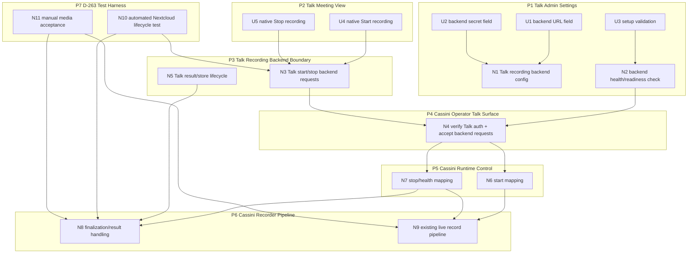

# D-263 — Breadboard

Derived from:

- `planning/initiatives/mvp/slices/D-263-nextcloud-app-recording/brief.md`
- `planning/initiatives/mvp/slices/D-263-nextcloud-app-recording/shaping.md`

This document is the ground truth for the D-263 affordance map under the selected architecture:

- native Talk recording UX
- Cassini as the Talk recording backend

## Places

| ID | Place | Description |
|----|-------|-------------|
| P1 | Talk Admin Settings | Admin configures the Talk recording backend URL and secret, validates backend readiness, and relies on a Talk deployment that already satisfies recording prerequisites. |
| P2 | Talk Meeting View | Moderator uses the native Talk recording controls. |
| P3 | Talk Recording Backend Boundary | Talk sends backend start/stop/store-related requests to the configured external backend. |
| P4 | Cassini Operator Talk Surface | The Talk-specific HTTP surface inside `cassini-operator` that accepts backend requests and verifies auth/signatures. |
| P5 | Cassini Runtime Control | `cassini-operator` orchestration that maps Talk backend lifecycle events into recording start/stop behavior. |
| P6 | Cassini Recorder Pipeline | Existing live recording path and downstream artifact pipeline. |
| P7 | D-263 Test Harness | Local automated integration harness that exercises real Nextcloud/Talk recording lifecycle while replacing only the media recorder with a deterministic fake/noop executor. |

## UI Affordances

| Affordance | Place | User/Actor | Interaction | Wires Out |
|------------|-------|------------|-------------|-----------|
| **U1** | **P1 Talk Admin Settings** | **Nextcloud admin** | **Recording backend URL field points Talk to the external Cassini backend, typically through reverse-proxy TLS.** | **N1** |
| **U2** | **P1 Talk Admin Settings** | **Nextcloud admin** | **Recording backend secret field stores the shared secret used by Talk and Cassini.** | **N1** |
| **U3** | **P1 Talk Admin Settings** | **Nextcloud admin** | **Admin setup check validates that the configured Cassini backend is reachable and record-ready.** | **N2** |
| **U4** | **P2 Talk Meeting View** | **Talk moderator** | **Native Talk `Start recording` action starts recording for the current room.** | **N3** |
| **U5** | **P2 Talk Meeting View** | **Talk moderator** | **Native Talk `Stop recording` action stops recording for the current room.** | **N3** |

## Non-UI Affordances

| Affordance | Place | Mechanism | Wires Out |
|------------|-------|-----------|-----------|
| **N1** | **P1 Talk Admin Settings** | **Talk-side recording backend configuration: persist Cassini backend URL and shared secret for an external HTTP recording backend.** | |
| **N2** | **P1/P4 Boundary** | **Backend health/readiness check for admin setup, proving backend reachability/auth and record readiness in a deployment that already satisfies Talk signaling prerequisites.** | **N4, N7** |
| **N3** | **P3 Talk Recording Backend Boundary** | **Talk-native recording lifecycle: emit signed backend start/stop requests when the moderator uses Talk recording controls.** | **N4, N5** |
| **N4** | **P4 Cassini Operator Talk Surface** | **Verify Talk backend auth/signatures and accept backend lifecycle requests.** | **N6, N7** |
| **N5** | **P3 Talk Recording Backend Boundary** | **Talk recording result/store lifecycle expectations: backend callbacks plus one uploaded allowed-format recording file.** | **N8** |
| **N6** | **P5 Cassini Runtime Control** | **Map Talk start requests into Cassini recording start for the target room.** | **N9** |
| **N7** | **P5 Cassini Runtime Control** | **Map Talk stop requests and health checks into Cassini-side readiness/finalization behavior.** | **N8, N9** |
| **N8** | **P6 Cassini Recorder Pipeline** | **Cassini-side finalization and result handling: produce the final meeting `.mkv` for Talk `/store` while preserving richer downstream Cassini outputs.** | |
| **N9** | **P6 Cassini Recorder Pipeline** | **Existing live recording subprocess flow: join the Talk room, capture media, and continue into Cassini's downstream artifacts.** | |
| **N10** | **P7 D-263 Test Harness** | **Automated Nextcloud integration test: create a real Talk room, start recording, observe Cassini job start, stop recording, and assert lifecycle/pipeline progression without requiring real media capture.** | **N3, N4, N6, N7, N8** |
| **N11** | **P7/P6 Manual Acceptance** | **Local manual media acceptance: browser participant, HPS/signaling, recorder media capture, remux, operator processing, and Cassini viewer visibility.** | **N9, N8** |

## Wiring by Place

| Place | Wiring |
|-------|--------|
| **P1 Talk Admin Settings** | **U1 → N1** (persist backend URL) **; U2 → N1** (persist shared secret) **; U3 → N2** (validate backend setup) |
| **P2 Talk Meeting View** | **U4 → N3** (native Talk start recording) **; U5 → N3** (native Talk stop recording) |
| **P3 Talk Recording Backend Boundary** | **N3 → N4** (signed start/stop requests to Cassini backend) **; N5 → N8** (recording result/store lifecycle) |
| **P4 Cassini Operator Talk Surface** | **N2 → N4** (health/auth validation) **; N4 → N6** (start request handling) **; N4 → N7** (stop/health handling) |
| **P5 Cassini Runtime Control** | **N6 → N9** (start existing live record path) **; N7 → N9** (stop/finalize live record path) **; N7 → N8** (health/finalization/result path) |
| **P6 Cassini Recorder Pipeline** | **N9** is the existing live recording path **; N8** is the result/finalization path that must remain compatible with both Talk and Cassini outputs. |
| **P7 D-263 Test Harness** | **N10** proves the real Nextcloud/Talk backend lifecycle with a fake/noop media executor **; N11** proves the full local media path manually. |

## Affordance notes

| Affordance | Note |
|------------|------|
| **U4 / U5 / N3** | The moderator interaction surface is Talk's own recording UX. D-263 should not add a parallel custom button path. |
| **N4** | The Talk adapter should be implemented inside `cassini-operator`, not as a separate façade service. |
| **N5 / N8** | The result/store seam is now narrowed: Talk should receive Cassini's final meeting `.mkv`, while portable `.opus` and viewer outputs remain downstream Cassini artifacts. |
| **N6 / N7 / N9** | Cassini should reuse as much of the existing live recording path as possible rather than inventing a second recording implementation. |
| **P1 / N1 / N2** | The official recording server docs imply recording UI is contingent on proper Talk backend configuration and broader Talk deployment prerequisites, especially signaling. |
| **N10 / N11** | Automated tests should validate the real Talk lifecycle without real media capture; manual acceptance should validate the full browser/WebRTC/remux/viewer path. |

## Main cutlines this breadboard implies

1. **Backend health and auth**
   - backend URL/secret setup
   - readiness check
   - request verification

2. **Start/stop lifecycle compatibility**
   - Talk start request
   - Cassini start mapping
   - Talk stop request
   - Cassini finalization mapping

3. **Result/store compatibility**
   - satisfy Talk's recording-backend lifecycle
   - preserve Cassini downstream artifact ownership

4. **Test strategy**
   - automated Nextcloud/Talk lifecycle test with fake/noop media executor
   - manual real-media acceptance test for browser/HPS/WebRTC/remux/viewer behavior

## Suggested next move

Use this breadboard to cut `slices.md` for D-263 around:

- backend health/auth foundation
- start/stop lifecycle compatibility
- result/store compatibility
