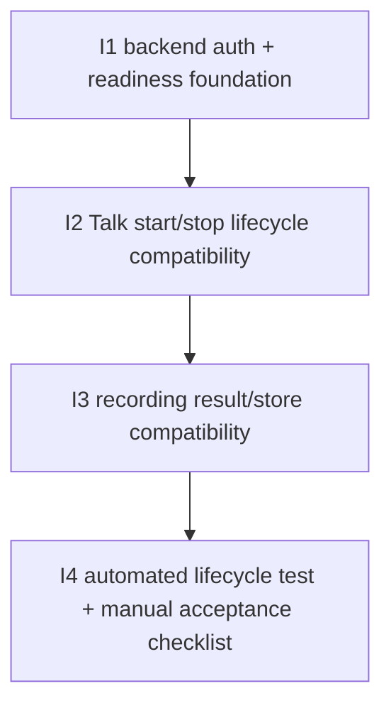

# D-263 — Slices

Derived from:

- `planning/initiatives/mvp/slices/D-263-nextcloud-app-recording/shaping.md`
- `planning/initiatives/mvp/slices/D-263-nextcloud-app-recording/breadboard.md`
- `planning/initiatives/mvp/slices/D-263-nextcloud-app-recording/test-strategy.md`

This document is the ground truth for the D-263 implementation slices.

The selected D-263 shape is:

- native Talk recording UX
- Cassini as the Talk recording backend
- Talk-specific adapter inside `cassini-operator`
- minimal admin setup around backend URL, secret, and readiness
- automated Nextcloud lifecycle coverage without requiring real media capture
- manual local acceptance for the full browser/WebRTC/remux/viewer path
- no custom Talk meeting button

The official `nextcloud-talk-recording` server is used as a reference for:

- Talk-facing auth and request shape
- callback and `/store` upload ordering
- deployment expectations for an external HTTP recording backend

It is not used as the recorder architecture template.

## Carried-forward baseline (not a D-263 slice)

The following capabilities already exist and are reused rather than re-sliced as new D-263 work:

| Affordance | Status |
|-----------|--------|
| existing Cassini live recording path for Talk rooms | ✅ Exists |
| `cassini-operator` control-plane/runtime | ✅ Exists |
| operator start of recording work from external input | ✅ Exists |
| downstream Cassini artifact pipeline after recording | ✅ Exists |

## Implementation note

D-263 should add the Talk recording-backend API as an additional HTTP layer
inside `cassini-operator`, not by mutating the existing generic `/jobs` API
into Talk protocol semantics.

So the implementation target is:

- preserve the current generic operator API for generic job control
- add Talk-specific routes beside it in the same binary/process
- share runtime/service primitives underneath both route families

## Selected workstreams

| # | Workstream | Final result |
|---|------------|--------------|
| S1 | Backend auth and readiness foundation | Talk can trust and reach the Cassini backend, and operators can validate readiness before using it. |
| S2 | Talk start/stop lifecycle compatibility | Native Talk recording actions start and stop Cassini recording correctly for the target room. |
| S3 | Recording result/store compatibility | Cassini finalization satisfies Talk backend expectations without losing Cassini's downstream artifact model. |
| S4 | D-263 test strategy | Automated integration proves Nextcloud/Talk lifecycle and manual acceptance proves real media capture/viewer behavior. |

## Breadboard

The D-263 affordance map lives in:

- `planning/initiatives/mvp/slices/D-263-nextcloud-app-recording/breadboard.md`

That document is the truth for:

- places
- UI affordances
- code affordances
- cross-system wiring

## Implementation slice summary

These slices are ordered so each one leaves behind a real, testable system increment.

| # | Slice | Workstream | New / changed affordances | Depends On | Verify after done |
|---|-------|------------|---------------------------|------------|-------------------|
| **I1** | **Backend auth + readiness foundation** | **S1** | **U1, U2, U3, N1, N2, N4** | **—** | **Talk/Cassini backend setup can be configured and a backend readiness/auth check succeeds without starting a recording.** |
| **I2** | **Talk start/stop lifecycle compatibility** | **S2** | **U4, U5, N3, N6, N7, N9** | **I1** | **Talk's native record controls start and stop the Cassini live recording flow for the correct room.** |
| **I3** | **Recording result/store compatibility** | **S3** | **N5, N8** | **I2** | **Cassini finalization satisfies Talk backend lifecycle expectations while preserving Cassini's downstream artifact path.** |
| **I4** | **Automated Nextcloud lifecycle test + manual acceptance checklist** | **S4** | **N10, N11** | **I1, I2, I3** | **A real local Nextcloud integration test validates start/stop/pipeline progression without real media, and a documented manual path validates browser/WebRTC/remux/viewer behavior.** |

## Affordance allocation by slice

| Affordance | Slice | Notes |
|------------|-------|-------|
| **U1** | **I1** | Admin configures backend URL in Talk-facing setup. |
| **U2** | **I1** | Admin configures backend secret. |
| **U3** | **I1** | Admin validates backend setup/readiness. |
| **U4** | **I2** | Native Talk `Start recording`. |
| **U5** | **I2** | Native Talk `Stop recording`. |
| **N1** | **I1** | Talk/Cassini backend configuration boundary. |
| **N2** | **I1** | Backend health/readiness check. |
| **N3** | **I2** | Talk backend start/stop request lifecycle. |
| **N4** | **I1** | Cassini backend auth/signature verification and request acceptance. |
| **N5** | **I3** | Talk recording result/store lifecycle. |
| **N6** | **I2** | Cassini start mapping from Talk backend request. |
| **N7** | **I2** | Cassini stop/health mapping from Talk backend request. |
| **N8** | **I3** | Cassini finalization/result handling compatible with Talk. |
| **N9** | **I2** | Existing Cassini live record pipeline reused behind Talk backend events. |
| **N10** | **I4** | Automated Nextcloud lifecycle test with fake/noop media executor. |
| **N11** | **I4** | Manual local media acceptance path. |

## Dependency tree

## Slice details

## I1: Backend auth + readiness foundation

### Objective

Create the Talk/Cassini backend foundation needed before any real native Talk recording can work:

- backend URL + secret configuration
- request verification/auth
- backend readiness validation

### Why this slice exists

Before Talk can drive Cassini, operators need one clear backend configuration story and one way to prove the backend is reachable and ready.

### Includes

- **U1** backend URL configuration
- **U2** backend secret configuration
- **U3** backend readiness check
- **N1** Talk/Cassini backend config boundary
- **N2** backend health/readiness check
- **N4** request verification/auth handling

### Activated wiring

- **U1 → N1**
- **U2 → N1**
- **U3 → N2**
- **N2 → N4**

### Verify

1. Configure Talk to point at the Cassini backend URL and secret.
2. Run the backend setup/readiness check.
3. Confirm invalid secret/auth is rejected clearly.
4. Confirm backend readiness can be checked without starting recording work.

### Acceptance criteria

- there is a clear operator-facing backend URL + secret setup story
- backend requests are authenticated/verified correctly
- readiness is validated separately from recording start
- the health/readiness path does not create recordings or jobs
- the slice documents the operational prerequisite that Talk recording UI depends on backend configuration and broader Talk deployment readiness

## I2: Talk start/stop lifecycle compatibility

### Objective

Make Talk's native recording controls drive Cassini's existing live recording path.

### Why this slice exists

This is the core user-visible goal of the revised D-263 architecture.

### Includes

- **U4** native Talk `Start recording`
- **U5** native Talk `Stop recording`
- **N3** Talk backend start/stop lifecycle
- **N6** Cassini start mapping
- **N7** Cassini stop mapping
- **N9** existing live recording pipeline reuse

The current spike conclusion for this seam is:

- Talk backend execution should target `baseURL + roomToken`
- a full call URL remains a CLI convenience shape, not the ideal backend contract
- the official recording server confirms this token-native execution model

### Activated wiring

- **U4 → N3**
- **U5 → N3**
- **N3 → N4**
- **N4 → N6**
- **N4 → N7**
- **N6 → N9**
- **N7 → N9**

### Verify

1. Open a Talk meeting as a moderator.
2. Click Talk's native `Start recording`.
3. Confirm Cassini receives the backend start request.
4. Confirm Cassini starts recording the correct room.
5. Click Talk's native `Stop recording`.
6. Confirm Cassini receives the backend stop request and finalizes the recording cleanly.

### Acceptance criteria

- native Talk recording start maps to Cassini recording start
- native Talk recording stop maps to Cassini recording stop/finalization
- the correct Talk room is recorded
- the backend execution path does not depend on a fabricated user-facing call URL as its core runtime identity
- Cassini reuses the existing live recording path rather than a second recording implementation

## I3: Recording result/store compatibility

### Objective

Define and implement the final backend lifecycle that lets Cassini satisfy Talk's recording expectations while preserving Cassini's own downstream artifact model.

### Why this slice exists

Start/stop compatibility alone is not enough. The revised architecture still has one hard backend seam:

- how Talk expects recording results to be handled
- how Cassini wants to keep its own artifact pipeline

The current spike conclusion for this seam is:

- Talk `/store` should receive Cassini's final meeting `.mkv`
- Cassini's portable `.opus` and richer meeting outputs remain downstream Cassini artifacts

### Includes

- **N5** Talk recording result/store lifecycle
- **N8** Cassini finalization/result handling

### Activated wiring

- **N5 → N8**
- **N7 → N8**

### Verify

1. Start and stop a native Talk recording through Cassini.
2. Confirm Cassini sends the expected backend callbacks in the right order.
3. Confirm Talk receives and stores the uploaded `.mkv`.
4. Confirm Cassini still preserves the outputs needed for its downstream artifact pipeline.

### Acceptance criteria

- the Talk recording-backend lifecycle is completed honestly after stop/finalization
- Talk receives one valid uploaded recording file in an allowed format
- that file is Cassini's final meeting `.mkv`, not the portable `.opus`
- Cassini does not lose the outputs needed for its artifact/transcription/viewer pipeline
- the result/store compatibility path is documented clearly enough for operators

## I4: Automated Nextcloud lifecycle test + manual acceptance checklist

### Objective

Make D-263 testable in two complementary ways:

- an automated local Nextcloud integration test that validates the real Talk recording-backend lifecycle without depending on WebRTC media capture
- a manual local acceptance checklist that validates the complete browser/HPS/WebRTC/remux/operator/viewer path

### Why this slice exists

The system can fail in two different places:

- Talk lifecycle integration can fail before Cassini starts or stops correctly
- real media capture can fail after Cassini has successfully joined the lifecycle

The observed `no remuxable streams found in session artifact` failure is in the second category. It should remain a blocker for full local acceptance, but it should not prevent automated tests from proving that Nextcloud can drive the Cassini Talk backend lifecycle.

### Includes

- **N10** automated Nextcloud lifecycle test
- **N11** manual local media acceptance checklist

The automated test should:

1. create a Talk room in a real local Nextcloud stack
2. start recording through Talk's recording integration
3. assert Cassini receives the signed backend start request
4. assert Cassini creates and starts the expected recording job
5. substitute only the media recorder with a fake/noop executor or deterministic synthetic artifact path
6. stop recording through Talk
7. assert Cassini receives stop, reports callbacks, and advances the operator pipeline

The manual checklist should:

1. start the local Nextcloud/HPS/signaling and Cassini services manually
2. join the room through a browser
3. start recording through Talk's native controls or automatic recording setting
4. leave the room or stop recording explicitly
5. verify recorder session events, offers/media packet capture, remux success, operator completion, and Cassini viewer visibility

### Activated wiring

- **N10 → N3**
- **N10 → N4**
- **N10 → N6**
- **N10 → N7**
- **N10 → N8**
- **N11 → N9**
- **N11 → N8**

### Verify

Automated:

1. Run the D-263 Nextcloud integration test.
2. Confirm a real Nextcloud Talk room is created.
3. Confirm recording start reaches Cassini and creates a job.
4. Confirm the fake/noop media executor starts and stays running until stop.
5. Confirm recording stop reaches Cassini.
6. Confirm the operator pipeline progresses without requiring real WebRTC media.

Manual:

1. Run the complete local browser recording flow.
2. Confirm the recorder joins the same HPS/backend identity as the browser participant.
3. Confirm session artifact contains participant/session and stream/packet evidence.
4. Confirm final remux succeeds.
5. Confirm the resulting meeting is visible in Cassini viewer.

### Acceptance criteria

- automated integration tests cover real Nextcloud/Talk recording start and stop against Cassini
- automated tests keep the Talk HTTP backend surface real
- automated tests replace only the media capture executor
- automated tests do not assert real viewer playback
- manual acceptance documents the full media path and catches `no remuxable streams found in session artifact`
- failures are classified clearly as either Talk lifecycle failures or real media capture/remux failures

## Suggested next move

Use these slices as the implementation plan for the revised D-263 architecture.

If you want a minimal build order:

1. **I1** backend auth + readiness foundation
2. **I2** Talk start/stop lifecycle compatibility
3. **I3** recording result/store compatibility
4. **I4** automated lifecycle test + manual acceptance checklist
