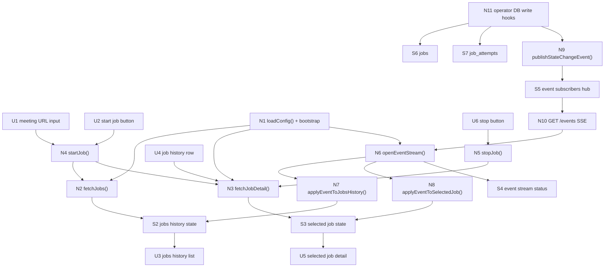
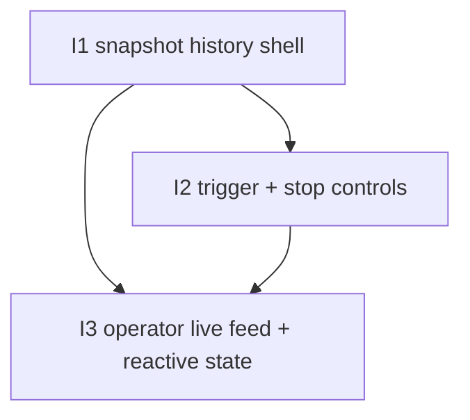

# Operator Control Panel — Slices

Derived from `./shaping.md`, selected shape **B: dedicated control panel + snapshot GETs + tagged SSE feed from operator DB writes**.

This document is the ground truth for the D-266 breadboard-to-implementation breakdown.

## Carried-forward baseline (not a slice)

The following operator capabilities already exist and are reused:

| Affordance | Status |
|-----------|--------|
| `POST /jobs?provider=nextcloud-talk` | ✅ Exists |
| `POST /jobs/:id/stop` | ✅ Exists |
| `GET /jobs` | ✅ Exists |
| `GET /jobs/:id` | ✅ Exists |
| persisted `jobs` summary rows | ✅ Exists |
| persisted `job_attempts` history | ✅ Exists |
| record/build/publish/done stage model | ✅ Exists |

The new work is the browser control panel plus the operator live-event surface.

---

## Breadboard

### UI Affordances

| Affordance | Place | User/Actor | Interaction | Wires Out |
|------------|-------|------------|-------------|-----------|
| **U1** | **Trigger bar** | **Operator** | **Enter meeting URL** | **N4** |
| **U2** | **Trigger bar** | **Operator** | **Click Start job** | **N4** |
| **U3** | **Jobs history** | **Operator** | **Browse GitHub-Actions-like run history list** | **N2, N7** |
| **U4** | **Jobs history** | **Operator** | **Click a run row to inspect it** | **N3** |
| **U5** | **Selected run detail** | **Operator** | **Inspect selected job summary + attempt history + current status** | **N3, N8** |
| **U6** | **Selected run detail** | **Operator** | **Click Stop for an eligible running record-stage job** | **N5** |
| **U7** | **Panel shell** | **Operator** | **See live connection/reconnect state** | **N6** |

### Non-UI Affordances

| Affordance | Place | Mechanism | Wires Out |
|------------|-------|-----------|-----------|
| **N1** | **Control panel bootstrap** | **Resolve `CASSINI_OPERATOR_URL`, initialize browser state, load first snapshots, then open live feed.** | **N2, N3, N6** |
| **N2** | **History list read model** | **Fetch `GET /jobs` and materialize local jobs-history state.** | **S2** |
| **N3** | **Selected-job read model** | **Fetch `GET /jobs/:id` and materialize local selected-job detail state.** | **S3** |
| **N4** | **Trigger action** | **POST new job to operator, then refresh/select the accepted job.** | **N2, N3, S2, S3** |
| **N5** | **Stop action** | **POST stop for eligible selected job, then refresh or await live update.** | **N3, S3** |
| **N6** | **Live event client** | **Open SSE feed from operator, track connected/reconnecting/disconnected state, and dispatch events into list/detail reducers.** | **N7, N8, S4** |
| **N7** | **History event reducer** | **Apply tagged job/attempt update events into local jobs-history state.** | **S2** |
| **N8** | **Selected-detail event reducer** | **Apply tagged events relevant to the selected job into local selected-job state.** | **S3** |
| **N9** | **Operator event broadcaster** | **Publish one structured event for every successful persisted job/attempt state change.** | **S5, N10** |
| **N10** | **Operator SSE endpoint** | **Expose `GET /events` and stream tagged structured state-change events to all subscribers.** | **N6** |
| **N11** | **Operator DB write hooks** | **Reuse existing store write paths as event emission boundaries.** | **S6, S7, N9** |

### Stores

| Affordance | Place | Store | Description |
|------------|-------|-------|-------------|
| **S1** | **Control panel bootstrap** | **panel config** | Resolved `CASSINI_OPERATOR_URL` and any transport/dev settings. |
| **S2** | **Jobs history** | **jobs history state** | Local run-history list derived from snapshots + live events. |
| **S3** | **Selected run detail** | **selected job state** | Local selected-job detail derived from snapshots + live events. |
| **S4** | **Panel shell** | **event stream status** | Live connection state for SSE. |
| **S5** | **Operator runtime** | **event subscribers hub** | In-process subscriber registry / broadcaster for SSE clients. |
| **S6** | **Operator runtime** | **jobs** | Existing logical-job summaries. |
| **S7** | **Operator runtime** | **job_attempts** | Existing attempt-history rows. |

### Wiring by place

| Place | Wiring |
|-------|--------|
| **Trigger bar** | **U1/U2 → N4 → N2/N3** |
| **Jobs history** | **N1 → N2 → S2 → U3** ; **U4 → N3 → S3 → U5** ; **N6 → N7 → S2 → U3** |
| **Selected run detail** | **N3 → S3 → U5** ; **U6 → N5 → N3** ; **N6 → N8 → S3 → U5** |
| **Operator runtime** | **N11 → S6/S7 → N9 → S5 → N10 → N6** |

---

## Slice summary

| # | Slice | New affordances | Depends On | Demo |
|---|-------|------------------|------------|------|
| **I1** | **Snapshot history shell** | **U1 (input only), U3, U4, U5, N1, N2, N3, S1, S2, S3** | **—** | Open the control panel, see the jobs history from `GET /jobs`, click a row, and inspect selected-job detail from `GET /jobs/:id`. |
| **I2** | **Trigger + stop controls** | **U2, U6, N4, N5** | **I1** | Paste a meeting URL, start a job, see it appear in the history list, select it, and stop it from the selected detail view when eligible. |
| **I3** | **Operator live feed + reactive panel state** | **U7, N6, N7, N8, N9, N10, N11, S4, S5** | **I1, I2** | With the panel open, trigger/stop jobs from this panel or elsewhere and watch the history list and selected detail update live without manual refresh. |

## Affordance allocation by slice

| Affordance | Slice | Notes |
|------------|-------|-------|
| **U1** | **I1** | Input field lands with the initial shell, even before submit is wired. |
| **U2** | **I2** | Start action becomes live in I2. |
| **U3** | **I1** | First visible artifact: jobs history list. |
| **U4** | **I1** | Row selection for detail view. |
| **U5** | **I1** | Selected run detail from snapshot reads. |
| **U6** | **I2** | Stop action added once actions are in scope. |
| **U7** | **I3** | Connection status only matters once live feed exists. |
| **N1** | **I1** | Bootstrap/config path. |
| **N2** | **I1** | History snapshot fetch. |
| **N3** | **I1** | Selected detail snapshot fetch. |
| **N4** | **I2** | Trigger action using existing operator endpoint. |
| **N5** | **I2** | Stop action using existing operator endpoint. |
| **N6** | **I3** | SSE client. |
| **N7** | **I3** | History reducer for live events. |
| **N8** | **I3** | Selected-detail reducer for live events. |
| **N9** | **I3** | Operator event broadcast. |
| **N10** | **I3** | Operator `GET /events` endpoint. |
| **N11** | **I3** | DB-write emission hook points. |
| **S1** | **I1** | Config state. |
| **S2** | **I1**, **I3** | First from snapshots, then kept warm live. |
| **S3** | **I1**, **I3** | First from snapshots, then kept warm live. |
| **S4** | **I3** | Stream connection state. |
| **S5** | **I3** | Operator subscriber hub. |
| **S6** | **Baseline / touched in I3** | Existing operator summary rows become event source. |
| **S7** | **Baseline / touched in I3** | Existing attempt rows become event source. |

## Dependency tree

---

## Slice details

## I1: Snapshot history shell

### Objective

Stand up `<root>/cassini-control-panel` as a Svelte app following `cassini-viewer` conventions, with enough snapshot-driven UI to browse jobs history and inspect one selected run.

### Why this slice exists

This gives a demoable operator UI immediately, before live SSE work lands. It also proves the shape of the GitHub-Actions-like history list and selected-detail view against the existing operator read surface.

### Includes

- app scaffold under `cassini-control-panel`
- `CASSINI_OPERATOR_URL` config resolution
- jobs history list from `GET /jobs`
- selected-job detail from `GET /jobs/:id`
- basic input field for meeting URL (not yet submitted)

### Activated wiring

- **N1 → N2 → S2 → U3**
- **U4 → N3 → S3 → U5**

### Verify

1. start `cassini-operator`
2. start the control panel locally
3. open the browser UI
4. see current/recent jobs in the history list
5. click a row and inspect selected-job detail and attempt history
6. unset `CASSINI_OPERATOR_URL` and verify the panel fails clearly

### Acceptance criteria

- `cassini-control-panel` exists as a Svelte/Vite app
- frontend config includes `CASSINI_OPERATOR_URL`
- jobs history is loaded from `GET /jobs`
- selected-job detail is loaded from `GET /jobs/:id`
- the first UI already presents many jobs in a run-history model rather than a single-job dashboard
- no direct browser reads of operator storage exist

---

## I2: Trigger + stop controls

### Objective

Add the operator actions that matter for the first cut: start a job from a meeting URL and stop a running record-stage job from the selected detail view.

### Why this slice exists

The highest-priority operator loop is not just browse history — it is start a job and see it play out, with stop available for the live record path.

### Includes

- submit meeting URL through `POST /jobs?provider=nextcloud-talk`
- select the accepted job after creation
- show operator-shaped errors from rejected create requests
- stop control for eligible selected jobs via `POST /jobs/:id/stop`
- snapshot refresh after create/stop until the live feed lands

### Activated wiring

- **U1/U2 → N4 → N2/N3**
- **U6 → N5 → N3**

### Verify

1. paste a valid Talk URL and click Start job
2. verify a new job appears in history and is selected
3. verify operator errors (bad request / busy) are shown clearly
4. while a job is `record/running`, click Stop
5. verify selected detail refreshes and reflects stop progress / result

### Acceptance criteria

- Start job button submits to the existing operator endpoint
- accepted create response selects the returned job id
- rejected create responses show operator-provided errors without inventing a second validation model
- Stop button is shown only when the selected job is eligible
- stop action calls the existing operator endpoint and refreshes selected detail

---

## I3: Operator live feed + reactive panel state

### Objective

Add the operator-owned SSE feed and wire the control panel to keep both the jobs history and selected-job detail live from the same tagged event stream.

### Why this slice exists

This is the slice that turns the control panel from a snapshot UI into the intended “see it play out” experience.

### Includes

- operator in-process event hub / broadcaster
- operator `GET /events` SSE endpoint
- event publication on every successful persisted job/attempt DB write
- browser SSE client and connection-status UI
- history-list reducer for incoming events
- selected-detail reducer for incoming events
- reconnect path: refresh snapshots then continue listening

### Activated wiring

- **N11 → N9 → S5 → N10 → N6**
- **N6 → N7 → S2 → U3**
- **N6 → N8 → S3 → U5**
- **N6 → S4 → U7**

### Verify

1. open the control panel and confirm connection status reaches connected
2. trigger a job from this panel and watch the list/detail update live through record/build/publish/done
3. trigger or stop a job from another client and verify this panel updates without manual refresh
4. disconnect/reconnect the SSE feed and verify snapshots refresh before live updates resume
5. confirm that selected-job detail can stay live from the same event feed; if not, fall back to snapshot refresh without changing the operator feed contract

### Acceptance criteria

- `cassini-operator` exposes one SSE feed endpoint
- successful persisted job/attempt writes emit structured tagged events
- event payloads stay shape-compatible with persisted job/attempt vocabulary
- control panel keeps jobs history live from the feed
- control panel keeps selected-job detail live from the same feed, or cleanly falls back to snapshot refresh if that one part proves awkward
- reconnect behavior is: refresh snapshots, then resume listening

---

## Suggested execution lane

1. **I1** — establish app shell and snapshot UX
2. **I2** — add operator actions
3. **I3** — add live SSE behavior

If I3 slips, the cutline is still clean:
- ship I1 + I2 as snapshot-driven UI
- keep I3 as the live-updates follow-up

That cutline preserves the selected operator contract and does not require rethinking the panel architecture.
