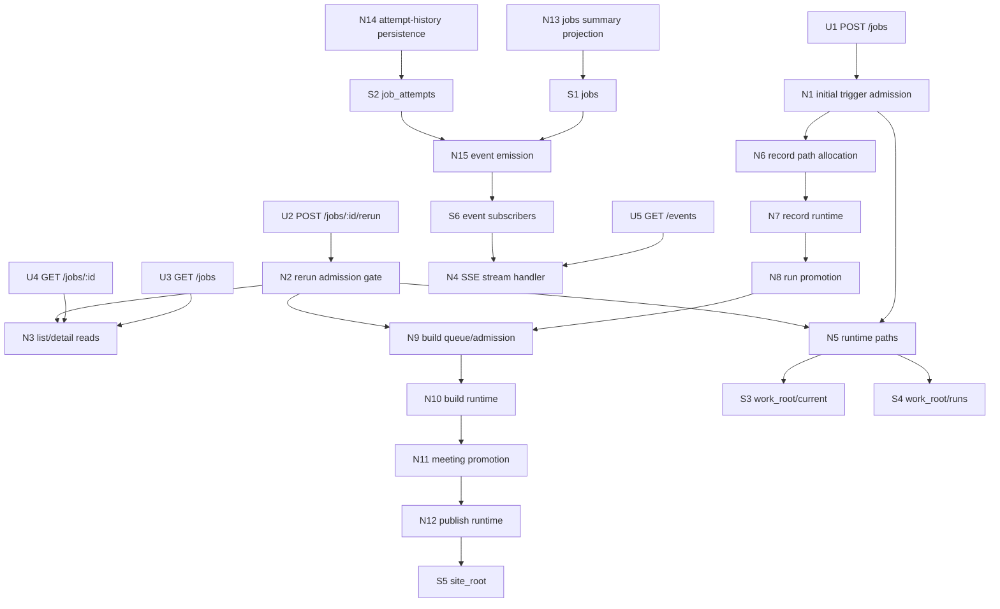
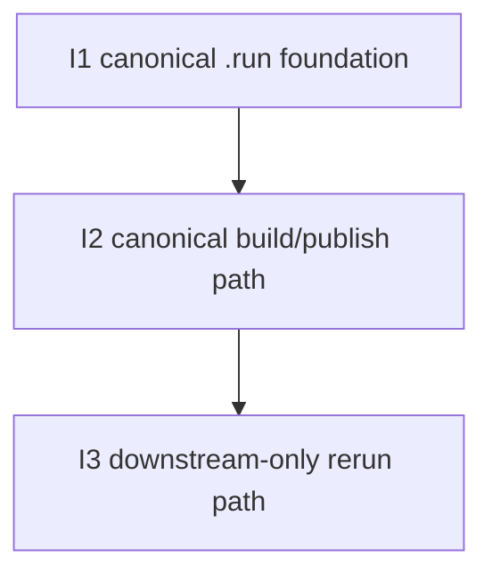

# Operator rerun from captured recording — Slices

Derived from `./shaping.md` and `./breadboarding.md`, selected shape **A: canonical ready-`.run` rerun with stable `current/` + `runs/`**.

This document is the ground truth for the WIP breadboard-to-implementation breakdown.

## Carried-forward baseline (not a slice)

The following operator capabilities already exist and are reused as the starting point:

| Affordance | Status |
|-----------|--------|
| `POST /jobs?provider=nextcloud-talk` | ✅ Exists |
| `POST /jobs/:id/rerun` | ✅ Exists, semantics change |
| `GET /jobs` | ✅ Exists |
| `GET /jobs/:id` | ✅ Exists |
| `GET /events` | ✅ Exists |
| persisted `jobs` summary rows | ✅ Exists |
| persisted `job_attempts` history | ✅ Exists |
| record/build/publish runtimes | ✅ Exists |
| attempt-scoped stage logs | ✅ Exists |
| build/publish failure extraction | ✅ Exists |

What changes in this WIP is not the existence of those surfaces, but their runtime pathing and rerun semantics:

- current code still uses one flat work root
- current rerun still re-enters `record`
- current publish still scans the whole old work root

The slices below reshape that behavior into the selected `current/` + `runs/` contract.

---

## Breadboard

### UI Affordances

| Affordance | Place | User/Actor | Interaction | Wires Out |
|------------|-------|------------|-------------|-----------|
| **U1** | **Caller / Control Panel** | **Operator / caller** | **`POST /jobs?provider=nextcloud-talk` triggers the initial job.** | **N1** |
| **U2** | **Caller / Control Panel** | **Operator / caller** | **`POST /jobs/:id/rerun` requests a rerun for a failed job.** | **N2** |
| **U3** | **Caller / Control Panel** | **Operator / caller** | **`GET /jobs` returns logical-job summaries.** | **N3** |
| **U4** | **Caller / Control Panel** | **Operator / caller** | **`GET /jobs/:id` returns one logical job plus attempt history.** | **N3** |
| **U5** | **Caller / Control Panel** | **Operator / caller** | **`GET /events` streams live updates for job and attempt changes.** | **N4** |

### Non-UI Affordances

| Affordance | Place | Mechanism | Wires Out |
|------------|-------|-----------|-----------|
| **N1** | **Operator HTTP API** | **Initial trigger admission that persists the job/attempt and starts the initial record path.** | **N5, N6, N7, N13, N14, N15** |
| **N2** | **Operator HTTP API** | **Rerun admission gate that accepts only eligible failed jobs with a canonical ready `.run`, then creates the next attempt at `build/queued`.** | **N3, N5, N9, N13, N14, N15** |
| **N3** | **Operator store reads** | **Existing `GET /jobs` and `GET /jobs/:id` read contract backed by canonical job summary plus attempt history.** | **S1, S2** |
| **N4** | **Operator event stream** | **Existing SSE handler that streams store-driven `job.updated` / `attempt.updated` events.** | **S6** |
| **N5** | **Runtime paths** | **Derive `currentRoot`, `runsRoot`, canonical artifact paths, and attempt-local paths from one stable `work_root`.** | **S3, S4** |
| **N6** | **Record runtime** | **Allocate the initial attempt-local `.run` and attempt-local record logs under `runs/`.** | **S4, N7, N14** |
| **N7** | **Record runtime** | **Run live record into `runs/<job-id>--attempt-001.run` and persist record-stage state/logs.** | **S4, N8, N13, N14, N15** |
| **N8** | **Run promotion** | **Promote a successful ready attempt-local `.run` into canonical `current/<job-id>.run` while retaining the attempt-local copy under `runs/`.** | **S3, S4, N9, N13, N14, N15** |
| **N9** | **Build queue/admission** | **Queue build from canonical `current/<job-id>.run` for both initial and rerun attempts.** | **S1, S2, N10, N13, N14, N15** |
| **N10** | **Build runtime** | **Build canonical `.run` into attempt-local `runs/<job-id>--attempt-00N.meeting` and persist build-stage state/logs.** | **S4, N11, N13, N14, N15** |
| **N11** | **Meeting promotion** | **Promote a successful attempt-local `.meeting` into canonical `current/<job-id>.meeting`.** | **S3, S4, N12, N13, N14, N15** |
| **N12** | **Publish runtime** | **Run `cassini publish <work_root>/current --out <site_root>` and persist publish-stage state/logs.** | **S3, S5, N13, N14, N15** |
| **N13** | **Jobs summary projection** | **Keep `jobs` as the canonical/effective summary row across initial attempts, failures, and reruns.** | **S1, N15** |
| **N14** | **Attempt-history persistence** | **Keep `job_attempts` as the execution history with attempt-local artifact/log paths and sparse skipped-stage fields.** | **S2, N15** |
| **N15** | **Event emission** | **Emit existing live events from the same store write boundaries so control-panel consumers keep working.** | **S6, N4** |

### Stores

| Affordance | Place | Store | Description |
|------------|-------|-------|-------------|
| **S1** | **Operator store** | **`jobs`** | Stable logical-job summary row. Artifact paths become canonical/effective `current/*` paths. |
| **S2** | **Operator store** | **`job_attempts`** | Attempt execution history. Initial attempt retains `.run` under `runs/`; rerun attempts have empty `record_*` fields and fresh `build_*` / `publish_*` fields. |
| **S3** | **Work-root filesystem** | **`<work_root>/current`** | Canonical successful artifacts only: `current/<job-id>.run`, `current/<job-id>.meeting`, and hidden staging workspace. |
| **S4** | **Work-root filesystem** | **`<work_root>/runs`** | Retained attempt-local artifacts and logs, including all `.run` artifacts and per-attempt `.meeting` outputs. |
| **S5** | **Publish output** | **`<site_root>`** | Published site output refreshed from `current/`. |
| **S6** | **Operator runtime** | **event subscribers** | Existing in-process SSE subscriber registry fed from store write boundaries. |

### Wiring by place

| Place | Wiring |
|-------|--------|
| **Caller / Control Panel** | **U1 → N1** ; **U2 → N2** ; **U3/U4 → N3** ; **U5 → N4** |
| **Operator HTTP API** | **N1 → N5/N6/N7** ; **N2 → N3** (eligibility read) **→ N5 → N9** ; **N3 → S1/S2** ; **N4 ↔ S6** |
| **Store + event hub** | **N13 → S1** ; **N14 → S2** ; **S1/S2 write boundaries → N15 → S6 → N4** |
| **Work-root filesystem** | **N5 derives S3/S4 paths** ; **N6/N7 write attempt-local `.run` under S4** ; **N8 promotes canonical `.run` into S3 while retaining S4** ; **N10 writes attempt-local `.meeting` under S4** ; **N11 promotes canonical `.meeting` into S3** |
| **Publish runtime** | **N12 runs `cassini publish <work_root>/current --out <site_root>` so only canonical successful meeting bundles are publish-visible** |

---

## Slice summary

These slices are ordered so each one is independently runnable and verifiable.

One slice intentionally uses a temporary terminal cutline so the new filesystem contract can be proven before the downstream path is rewired:

- **I1** ends the initial job after record success
- **I2** restores the full build + publish path on top of the new `current/` + `runs/` contract
- **I3** extends that downstream path to reruns without re-entering live `record`

| # | Slice | New / changed affordances | Depends On | Verify after done |
|---|-------|---------------------------|------------|-------------------|
| **I1** | **Canonical `.run` foundation in `current/` + `runs`** | **U1, U3, U4, U5, N1, N5, N6, N7, N8, N13, N14, N15** | **—** | **Trigger a job and verify retained attempt-local `.run` under `runs/`, canonical ready `.run` under `current/` on success, and unchanged list/detail/event surfaces reflecting the new path semantics.** |
| **I2** | **Canonical build/publish path on top of the new filesystem contract** | **U1, U3, U4, U5, N8, N9, N10, N11, N12, N13, N14, N15** | **I1** | **Trigger a job and verify full record → build → publish, with attempt-local `.run` / `.meeting` artifacts under `runs/`, canonical successful `.run` / `.meeting` under `current/`, and publish reading only from `current/`.** |
| **I3** | **Downstream-only rerun path with preserved read/event contract** | **U2, U3, U4, U5, N2, N3, N9, N10, N11, N12, N13, N14, N15** | **I2** | **Force a build or publish failure, rerun it without a new record pass, and verify attempt history, list/detail reads, and live events stay honest while publish still sees only canonical `current/` artifacts.** |

## Affordance allocation by slice

| Affordance | Slice | Notes |
|------------|-------|-------|
| **U1** | **I1, I2** | Existing trigger surface is reused while its semantics change underneath. |
| **U2** | **I3** | Rerun behavior changes only once the downstream-only path exists. |
| **U3** | **I1, I2, I3** | Read surface must remain usable throughout. |
| **U4** | **I1, I2, I3** | Detail surface must remain usable throughout. |
| **U5** | **I1, I2, I3** | Event feed must remain usable throughout. |
| **N1** | **I1** | Initial trigger path first needs the new filesystem contract. |
| **N2** | **I3** | Rerun admission changes only after canonical `.run` + downstream path exist. |
| **N3** | **I3** | Read semantics for rerun attempts land with the rerun slice. |
| **N4** | **Baseline / touched in all slices** | Existing SSE endpoint is preserved; event meaning stays aligned with store writes. |
| **N5** | **I1** | Derived `current/` + `runs/` roots are foundational. |
| **N6** | **I1** | Initial attempt-local `.run` allocation lands first. |
| **N7** | **I1** | Record runtime is first to adopt the new retained-path model. |
| **N8** | **I1, I2** | First promotes canonical `.run`, then feeds downstream build/publish. |
| **N9** | **I2, I3** | First rewired for initial jobs, then reused for reruns. |
| **N10** | **I2, I3** | First rewired for initial jobs, then reused for reruns. |
| **N11** | **I2, I3** | First promotes canonical `.meeting`, then does the same for rerun attempts. |
| **N12** | **I2, I3** | Publish switches to `current/` before rerun is enabled. |
| **N13** | **I1, I2, I3** | Summary semantics evolve in every slice. |
| **N14** | **I1, I2, I3** | Attempt-history semantics evolve in every slice. |
| **N15** | **I1, I2, I3** | Existing events remain aligned to the changed store semantics. |

## Dependency tree

---

## Slice details

## I1: Canonical `.run` foundation in `current/` + `runs`

### Objective

Introduce the stable `work_root/current` + `work_root/runs` filesystem contract and make the initial record pass retain its attempt-local `.run` under `runs/` while promoting only a successful ready copy into `current/`.

### Why this slice exists

The selected shape depends on one concrete truth before anything else: the initial successful record pass must create the only reusable recording boundary, and that boundary must be visible canonically under `current/` while all `.run` artifacts remain preserved under `runs/`.

### Includes

- derived `currentRoot` / `runsRoot` path helpers from one stable `WorkRoot`
- initial record attempt writes `runs/<job-id>--attempt-001.run`
- failed or partial `.run` stays retained under `runs/`
- successful ready `.run` is promoted into `current/<job-id>.run`
- `jobs.artifact_run_path` becomes the canonical `current/*` path
- initial `job_attempts.artifact_run_path` remains the retained attempt-local `runs/*` path
- existing `GET /jobs`, `GET /jobs/:id`, and `/events` remain usable with the new run-path semantics

### Activated wiring

- **U1 → N1 → N5 → N6 → N7 → N8**
- **N7/N8 → N13/N14/N15**
- **U3/U4 → N3**
- **U5 → N4**

### Temporary cutline

Until I2 exists, **record success is terminal** for the slice.
A successful initial job ends after canonical `.run` promotion so the new filesystem contract can be verified before build/publish rewiring begins.

### Verify

1. Trigger an initial job through `POST /jobs`.
2. Watch the attempt write `runs/<job-id>--attempt-001.run`.
3. On success, verify `current/<job-id>.run` exists as the canonical ready reusable boundary.
4. On failure, verify no `.run` appears under `current/`, while the retained failed/partial `.run` remains under `runs/`.
5. Verify `GET /jobs/:id` shows canonical `artifact_run_path` on the job summary and retained attempt-local `artifact_run_path` on attempt `1`.
6. Verify `/events` still streams updates from the same endpoint family.

### Acceptance criteria

- one configured `WorkRoot` is split internally into derived `current/` and `runs/`
- initial record output is written to attempt-local `runs/<job-id>--attempt-001.run`
- failed or partial `.run` bundles are never exposed under `current/`
- successful ready `.run` is promoted into `current/<job-id>.run` while the attempt-local `.run` remains retained under `runs/`
- top-level `jobs.artifact_run_path` becomes canonical/effective
- attempt `1` retains its own `artifact_run_path` under `runs/`
- existing read/event surfaces keep working

---

## I2: Canonical build/publish path on top of the new filesystem contract

### Objective

Restore the full initial job pipeline so build runs from canonical `current/<job-id>.run`, writes attempt-local meeting output under `runs/`, promotes canonical `current/<job-id>.meeting`, and publishes only from `current/`.

### Why this slice exists

Once the canonical `.run` boundary exists, the downstream pipeline must follow the same split-root contract or the rerun feature will still be blocked by duplicate publish inputs and mixed path semantics.

### Includes

- build queue uses canonical `current/<job-id>.run`
- build writes `runs/<job-id>--attempt-00N.meeting`
- successful build promotes `current/<job-id>.meeting`
- publish runs `cassini publish <work_root>/current --out <site_root>`
- top-level `jobs.artifact_meeting_path` becomes canonical/effective `current/*`
- attempt `artifact_meeting_path` remains attempt-local `runs/*`
- list/detail/event surfaces reflect the diverged summary vs attempt artifact paths

### Activated wiring

- **N8 → N9 → N10 → N11 → N12**
- **N10/N11/N12 → N13/N14/N15**
- **U3/U4/U5** continue unchanged at the surface level

### Verify

1. Trigger a fresh initial job.
2. Verify the full record → build → publish path completes.
3. Verify `runs/` contains retained attempt-local `.run`, attempt-local `.meeting`, and stage logs.
4. Verify `current/` contains only canonical successful `.run` / `.meeting` bundles.
5. Verify publish reads only from `current/` and never scans historical attempt artifacts under `runs/`.
6. Verify `GET /jobs/:id` shows canonical summary artifact paths on the job row and attempt-local paths on the attempt row.

### Acceptance criteria

- build reads only from canonical `current/<job-id>.run`
- build writes attempt-local `.meeting` output under `runs/`
- successful build promotes canonical `current/<job-id>.meeting`
- publish always runs from derived `<work_root>/current`
- no historical attempt-local `.meeting` bundle under `runs/` is publish-visible
- top-level `jobs` artifact paths become canonical/effective for both `.run` and `.meeting`
- attempt rows keep attempt-local `.run` / `.meeting` outputs and logs

---

## I3: Downstream-only rerun path with preserved read/event contract

### Objective

Change rerun from “start over at record” to “create a fresh downstream attempt at build”, while preserving the existing `GET /jobs`, `GET /jobs/:id`, and `GET /events` control-panel contract.

### Why this slice exists

This is the core product behavior change: once capture succeeded, failures in `build` or `publish` must not trigger a new live recording.

### Includes

- rerun eligibility requires a failed job **and** canonical ready `current/<job-id>.run`
- rerun inserts attempt `N+1` at `build/queued`, not `record/queued`
- top-level record fields and canonical `artifact_run_path` stay preserved across reruns
- rerun attempts keep empty `record_*` timestamps/logs and fresh `build_*` / `publish_*` state
- rerun build/publish reuse the same canonical `current/` + `runs/` path contract from I2
- `GET /jobs`, `GET /jobs/:id`, and `/events` keep the same endpoint family and remain control-panel compatible
- rerun is rejected if no canonical ready `.run` exists

### Activated wiring

- **U2 → N2 → N3 → N5 → N9 → N10 → N11 → N12**
- **N9/N10/N11/N12 → N13/N14/N15**
- **U3/U4/U5** continue as the same read/live surfaces

### Verify

1. Force a build or publish failure for a job that already has canonical `current/<job-id>.run`.
2. Call `POST /jobs/:id/rerun` and verify a new attempt is created at `build/queued`.
3. Verify no new live record starts and no new `.run` bundle is created.
4. Verify attempt `N+1` has empty `record_*` fields/logs and fresh `build_*` / `publish_*` fields/logs.
5. Verify rerun build writes a fresh attempt-local `.meeting` under `runs/`, promotes canonical `current/<job-id>.meeting`, and publishes from `current/`.
6. Verify `GET /jobs`, `GET /jobs/:id`, and `/events` remain readable and honest for callers/control-panel consumers.
7. Force a record failure with no canonical `current/<job-id>.run` and verify rerun is rejected.

### Acceptance criteria

- rerun never re-enters live `record`
- rerun is accepted only when canonical ready `current/<job-id>.run` exists
- rerun attempts begin at `build/queued`
- rerun attempts do not create new `.run` bundles
- top-level record timestamps and canonical `artifact_run_path` remain preserved across reruns
- rerun attempts have sparse skipped-record fields and fresh build/publish fields
- existing `/jobs` and `/events` surfaces remain the control-panel contract without a first-cut DB migration

---

## Out of scope for these slices

These are explicit follow-ups, not implementation blockers for the slices above:

- rerun from validated raw `recording.mkv`
- session-artifact-only salvage
- long-term artifact retention / movement to hard storage for retained `.run`, `.meeting`, and log artifacts
