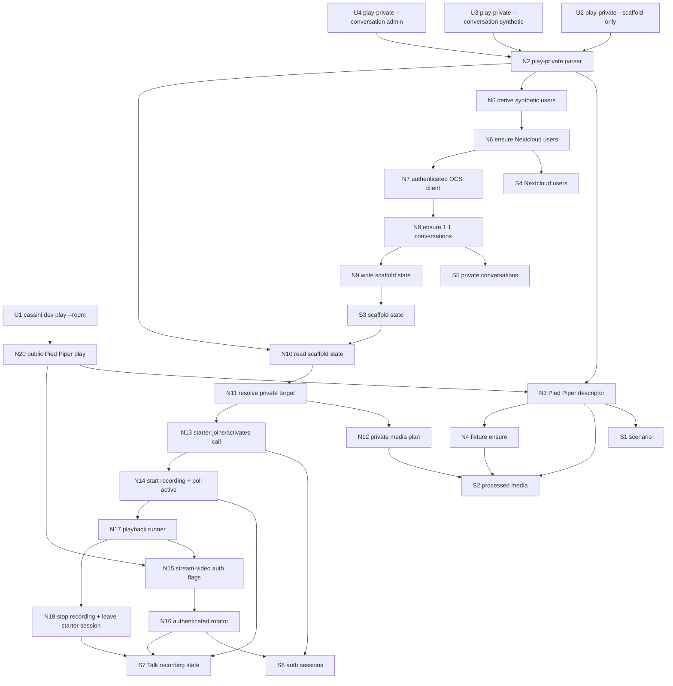

# D-288.1 — Private 1:1 Meeting Playback Breadboarding

Derived from `./shaping.md`, selected shape **A: `cassini dev play-private` with scaffolded private-conversation targets**.

This breadboard maps the implementation affordances needed to:

- replace Lantern Festival playback with the cached Pied Piper synthetic fixture,
- scaffold deterministic Nextcloud users and private Talk conversations,
- run private 1:1 playback through a dedicated `cassini dev play-private` surface,
- start and stop recording through Nextcloud Talk, not through direct operator API calls.

## Places

| # | Place | Description |
|---|-------|-------------|
| P1 | Developer CLI | The human-facing `bin/cassini` commands used for public playback, private scaffold, and private playback. |
| P2 | Cassini Go dev CLI | `internal/cassini` command parsing, target normalization, script dispatch, and test seams. |
| P3 | Pied Piper fixture | The scenario and cached/generated media under `harness/scenarios` and `harness/media/processed`. |
| P4 | Harness Nextcloud identity setup | Harness-only user creation and display-name/password setup for synthetic users. |
| P5 | Talk private conversation setup | Authenticated Talk OCS calls that create/reuse one-to-one conversations and resolve tokens. |
| P6 | Harness runtime state | Persisted state under `harness/runtime` that connects scaffold and play-private runs. |
| P7 | Private playback orchestration | Recording gate, private target resolution, media plan, script launch, and cleanup. |
| P8 | Authenticated media player | `stream-video.sh` and `harness/go-talk-rotator` publishing media as logged-in users instead of guests. |
| P9 | Nextcloud Talk recording backend | Nextcloud's integrated recording lifecycle, which may call Cassini operator as configured backend, but is only triggered through Nextcloud APIs. |

## Workflow guide

| Step | Action | Where to look |
|------|--------|---------------|
| **1** | Public `cassini dev play` uses Pied Piper instead of Lantern Festival. | U1 → N1 → N3/N4 → N20 |
| **2** | Developer runs scaffold-only setup. | U2 → N1/N2 → N3/N4 → N5/N6/N7/N8/N9 → S3/S4/S5 |
| **3** | Developer runs private synthetic conversation playback. | U3 → N10/N11/N12/N13/N14/N15/N16/N17/N18 |
| **4** | Developer runs private admin conversation playback. | U4 → N10/N11/N12/N13/N14/N15/N16/N17/N18 |
| **5** | Nextcloud starts/stops integrated recording and calls the configured backend. | N14/N18 → S7/P9 |

## UI Affordances

| # | Place | Component | Affordance | Control | Wires Out | Returns To | Status |
|---|-------|-----------|------------|---------|-----------|------------|--------|
| U1 | P1 | existing public playback command | `cassini dev play --room <name> [--mode single\|full] [--duration N]` now uses Pied Piper media. | call | → N1, → N3, → N4, → N20 | stdout/stderr, Talk room | Extended |
| U2 | P1 | private scaffold command | `cassini dev play-private --scaffold-only [--nextcloud-host <host-or-url>]` creates users/conversations and writes scaffold state. | call | → N1, → N2, → N3, → N4, → N5, → N6, → N7, → N8, → N9 | scaffold summary + runtime state | New |
| U3 | P1 | private synthetic playback command | `cassini dev play-private --conversation synthetic [--nextcloud-host <host-or-url>] [--duration N]` records and plays first two Pied Piper users. | call | → N1, → N2, → N10, → N11, → N12, → N13, → N14, → N15, → N16, → N17, → N18, → N20 | stdout/stderr, Nextcloud recording | New |
| U4 | P1 | private admin playback command | `cassini dev play-private --conversation admin [--nextcloud-host <host-or-url>] [--duration N]` records admin ↔ first speaker; admin is the recording starter and remains silent. | call | → N1, → N2, → N10, → N11, → N12, → N13, → N14, → N15, → N16, → N17, → N18, → N20 | stdout/stderr, Nextcloud recording | New |

## Code Affordances

| # | Place | Component | Affordance | Control | Wires Out | Returns To | Status |
|---|-------|-----------|------------|---------|-----------|------------|--------|
| N1 | P2 | dev command dispatch | Add `play-private` to `runDev` usage/dispatch while preserving `play` and `player`. | call | → N2 | U2, U3, U4 | New |
| N2 | P2 | play-private option parser | Parse `--nextcloud-host`, `--scaffold-only`, `--conversation synthetic\|admin`, and `--duration`; reject mixed/missing private targets. | call | → N3, → N8, → N10 | U2, U3, U4 | New |
| N3 | P3/P2 | fixture descriptor | Shared Pied Piper descriptor: scenario path, media dir, media label, first two participant ids/display names. | read | → S1, → S2, → N4, → N12 | N2, N20 | New/Extended |
| N4 | P3/P2 | fixture ensure | Verify `manifest.json` and required `.ivf`/`.ogg`; if incomplete, run `prepare-synthetic-meeting.sh` and rely on its cache check. | call | → S1, → S2 | N3, N12, N20 | New |
| N5 | P4 | synthetic user derivation | Read first two Pied Piper participants and derive deterministic harness users: `cassini-erlich`, `cassini-monica`, display names from manifest/scenario. | read | → S1, → N6 | N9 | New |
| N6 | P4 | user ensure helper | Ensure Nextcloud users exist with deterministic IDs/display names and password from `CASSINI_PLAY_SCAFFOLD_PASSWORD` or documented harness default. | call | → S4 | N9 | New |
| N7 | P5/P2 | authenticated OCS client | OCS helper with Basic Auth + cookie jar per actor; used for one-to-one creation, room/session join, call join, recording start/stop, and room polling. | call | → S5, → S6, → S7 | N8, N11, N14, N18 | New |
| N8 | P5 | one-to-one conversation ensure | Create/reuse Talk one-to-one rooms via `POST /api/v4/room roomType=1&invite=<user>` for `synthetic` and `admin` targets. | call | → N7, → S5 | N9 | New |
| N9 | P6 | scaffold state writer | Write `harness/runtime/play-private-scaffold.json` with fixture, user, credential-source, conversation token/call URL, and base URL metadata. | write | → S3 | U2, N10 | New |
| N10 | P6/P7 | scaffold state reader | Load scaffold state for selected `--conversation`; validate host/base URL compatibility and fail with an instruction to run `--scaffold-only` if missing. | read | → S3, → N11, → N12 | U3, U4 | New |
| N11 | P7 | private target resolver | Resolve selected target into room token, call URL, recording starter credentials, media publishers, and expected cleanup actions. | call | → N7, → N12, → N13 | N14, N16, N18 | New |
| N12 | P7/P3 | private media plan | Build media publisher plan from Pied Piper fixture: `synthetic` publishes `erlich` + `monica`; `admin` publishes only `erlich` while admin remains silent. | call | → N3, → N4, → S2 | N16 | New |
| N13 | P7 | recording starter preflight | As recording starter, join private conversation/session and activate the call with `flags=7`, `recordingConsent=true`. | call | → N7, → S6, → S7 | N14 | New |
| N14 | P7/P9 | Nextcloud recording gate | Start recording via `POST /api/v1/recording/{token} status=1`; poll `GET /api/v4/room/{token}` until `callRecording == 1` before media starts. | call | → N7, → S7 | N16 | New |
| N15 | P8 | stream-video auth flags | Extend `stream-video.sh` to accept per-user credentials and pass them to the Go rotator while preserving guest defaults. | call | → N16 | N20 | New |
| N16 | P8 | authenticated rotator | Extend `harness/go-talk-rotator` with per-bot Basic Auth + cookie jar behavior; skip guest-name API when authenticated. | call | → N7, → S6, → S7 | N17 | New |
| N17 | P7/P8 | playback runner | Launch `stream-video.sh` with authenticated users, selected media prefixes, display names, duration, and call URL; wait for completion. | call | → N15, → N16 | U3, U4, N18 | New |
| N18 | P7/P9 | recording cleanup | After playback exits or fails, stop recording through `DELETE /api/v1/recording/{token}` and leave the preflight call/session through Nextcloud APIs. | call | → N7, → S7 | U3, U4 | New |
| N19 | P2/P8 | tests and fakes | Add fake OCS/Talk handlers and captured script invocations for fixture selection, scaffold, authenticated args, recording gate, and cleanup behavior. | test | → N1-N18 | CI/local tests | New |
| N20 | P2/P8 | public play Pied Piper invocation | Update existing `cassini dev play` script invocation/tests to use Pied Piper label, scenario/output dir, and `erlich` single-speaker media. | call | → N3, → N4, → N15 | U1 | Extended |

## Data Stores

| # | Place | Store | Description |
|---|-------|-------|-------------|
| S1 | P3 | `harness/scenarios/synthetic-pied-piper.v1.json` | Source scenario and canonical participant order for first two speakers. |
| S2 | P3 | `harness/media/processed/synthetic-pied-piper-v1` | Cached/generated media fixture; used by public and private playback. |
| S3 | P6 | `harness/runtime/play-private-scaffold.json` | Runtime contract between scaffold and playback: base URL, users, fixture, conversations, call URLs, and credential-source metadata. |
| S4 | P4 | Nextcloud users | Harness users `cassini-erlich` and `cassini-monica`, plus existing `admin`. |
| S5 | P5 | Nextcloud Talk one-to-one conversations | Private conversation rows/tokens for `synthetic` and `admin` targets. |
| S6 | P7/P8 | transient auth sessions/cookie jars | Per-actor cookie jars used during preflight, recording, and authenticated rotator joins. |
| S7 | P9 | Nextcloud Talk recording state/backend lifecycle | `callRecording` state in Talk and the configured recording backend lifecycle triggered by Nextcloud. |

## Wiring by place

| Place | Wiring |
|-------|--------|
| P1 Developer CLI | U1 → N1/N20 ; U2 → N1/N2/N9 ; U3/U4 → N1/N2/N10/N17/N18 |
| P2 Cassini Go dev CLI | N1 dispatches to N2 ; N2 selects scaffold-only vs conversation ; N19 verifies command/parser/script behavior ; N20 preserves public play behavior with new fixture. |
| P3 Pied Piper fixture | N3 reads S1/S2 ; N4 ensures S2 from S1 ; N12 consumes S2 for private media plans ; N20 consumes S2 for public play. |
| P4 Identity setup | N5 derives user ids/display names from S1 ; N6 ensures S4 users before conversations are created. |
| P5 Talk conversation setup | N7 authenticates as creator users ; N8 creates/reuses S5 one-to-one conversations. |
| P6 Runtime state | N9 writes S3 after scaffold ; N10 reads S3 before private playback and gates missing/stale state. |
| P7 Playback orchestration | N11 resolves target ; N13 activates call ; N14 starts recording and waits active ; N17 runs media ; N18 stops recording/leaves call through Nextcloud. |
| P8 Authenticated media player | N15 maps script flags to per-bot credentials ; N16 joins Talk as authenticated users and publishes media. |
| P9 Recording backend lifecycle | N14/N18 call Nextcloud recording APIs ; Nextcloud calls its configured backend; no `play-private` code calls operator `/jobs`. |

## Wiring diagram

## What this breadboard clarifies

- `cassini dev play-private` is a separate private-command surface; the public `cassini dev play` command does not gain private conversation flags.
- Pied Piper fixture selection is shared, but private playback has its own scaffold/recording path.
- The scaffold/playback boundary is a concrete runtime state file, not implicit last-room state.
- Private playback requires authenticated media clients; guest-only rotator behavior is insufficient for one-to-one rooms.
- Recording is started and stopped through Nextcloud Talk APIs. Nextcloud may call the configured Cassini operator backend, but the simulator does not call the operator API directly.
- For `admin` conversation playback, admin is the recording starter and silent participant; `cassini-erlich` publishes the first Pied Piper speaker media.
- The recording gate intentionally creates a short silent pre-roll: call active → recording active → media starts. This is the concrete way to avoid clipping the fixture start.

Implementation slicing for this breadboard lives in `./slices.md`.
