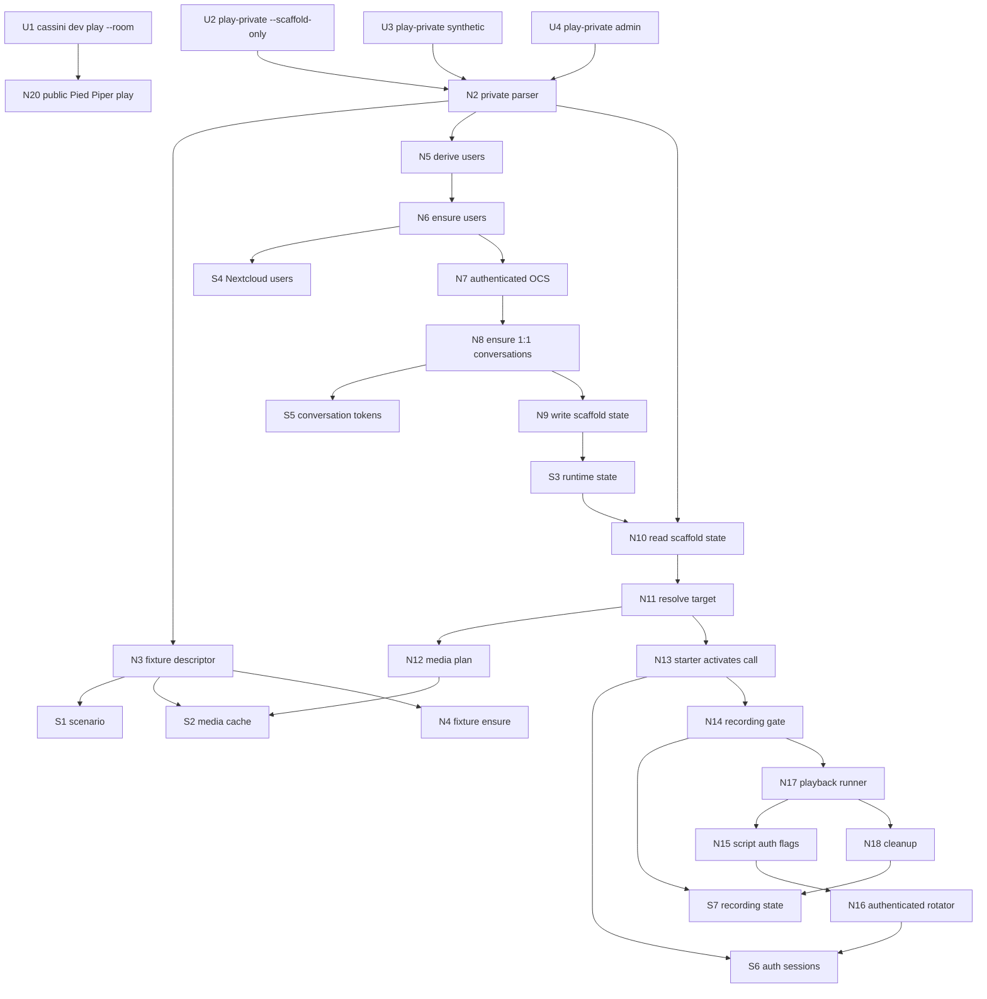
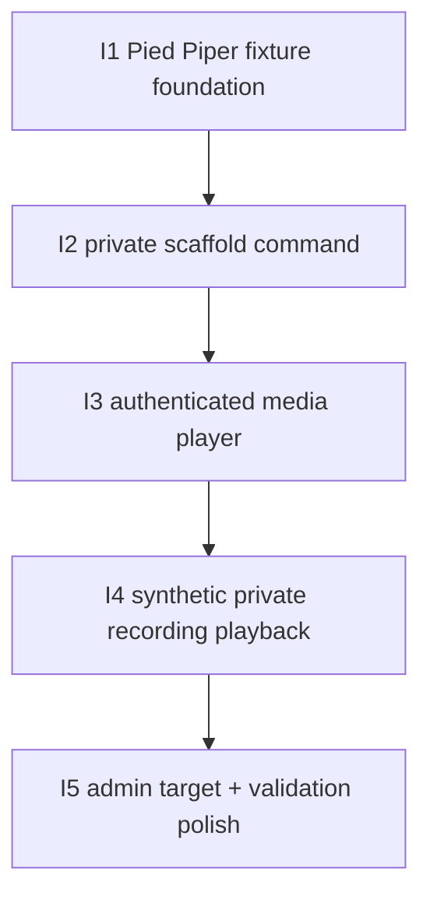

# D-288.1 — Private 1:1 Meeting Playback Slices

Derived from `./shaping.md` and `./breadboarding.md`, selected shape **A: `cassini dev play-private` with scaffolded private-conversation targets**.

This document is the implementation source of truth for the breadboard-to-build breakdown.

## Carried-forward baseline (not a slice)

The following capabilities already exist and are reused:

| Affordance | Status |
|-----------|--------|
| `cassini dev play --room ...` | ✅ Exists; fixture changes in I1 |
| `cassini dev player video` / `stream-video.sh` guest playback | ✅ Exists; auth support added in I3 |
| `harness/go-talk-rotator` guest WebRTC publishing | ✅ Exists; auth support added in I3 |
| `prepare-synthetic-meeting.sh` / `stream-synthetic-meeting.sh` Pied Piper defaults | ✅ Exists |
| `prepare-synthetic-meeting.py` cache check | ✅ Exists |
| harness Talk recording backend config in bootstrap | ✅ Exists |
| Nextcloud Talk recording backend route in operator | ✅ Exists; called only by Nextcloud |

The implementation should avoid direct operator API calls from `play-private`. Direct operator API calls remain valid for other validation flows, but not for this simulator.

---

## Breadboard reference

### UI Affordances

| Affordance | Place | User/Actor | Interaction | Wires Out |
|------------|-------|------------|-------------|-----------|
| **U1** | **Developer CLI** | **Developer** | **`cassini dev play --room <name> [--mode single\|full] [--duration N]` uses Pied Piper media.** | **N1, N3, N4, N20** |
| **U2** | **Developer CLI** | **Developer** | **`cassini dev play-private --scaffold-only [--nextcloud-host <host-or-url>]` prepares users/conversations and writes runtime state.** | **N1, N2, N3, N4, N5, N6, N7, N8, N9** |
| **U3** | **Developer CLI** | **Developer** | **`cassini dev play-private --conversation synthetic [--duration N]` records and plays `cassini-erlich` + `cassini-monica`.** | **N1, N2, N10, N11, N12, N13, N14, N15, N16, N17, N18** |
| **U4** | **Developer CLI** | **Developer** | **`cassini dev play-private --conversation admin [--duration N]` records admin ↔ `cassini-erlich`; admin is silent.** | **N1, N2, N10, N11, N12, N13, N14, N15, N16, N17, N18** |

### Non-UI Affordances

| Affordance | Place | Mechanism | Wires Out |
|------------|-------|-----------|-----------|
| **N1** | **Cassini Go dev CLI** | **Add `play-private` dispatch/usage while preserving existing `play` and `player`.** | **N2** |
| **N2** | **Cassini Go dev CLI** | **Parse private flags: `--nextcloud-host`, `--scaffold-only`, `--conversation synthetic\|admin`, `--duration`.** | **N3, N8, N10** |
| **N3** | **Pied Piper fixture** | **Shared fixture descriptor for scenario, media dir, media label, and first two participants.** | **S1, S2, N4, N12, N20** |
| **N4** | **Pied Piper fixture** | **Fixture ensure: verify cached media and run `prepare-synthetic-meeting.sh` only when incomplete.** | **S1, S2** |
| **N5** | **Harness identity setup** | **Derive deterministic users from first two Pied Piper participants.** | **S1, N6** |
| **N6** | **Harness identity setup** | **Ensure Nextcloud users `cassini-erlich` and `cassini-monica`.** | **S4** |
| **N7** | **Talk private setup / playback orchestration** | **Authenticated OCS client with Basic Auth + cookie jar per actor.** | **S5, S6, S7** |
| **N8** | **Talk private setup** | **Create/reuse one-to-one conversations for `synthetic` and `admin`.** | **N7, S5** |
| **N9** | **Harness runtime state** | **Write `harness/runtime/play-private-scaffold.json`.** | **S3** |
| **N10** | **Harness runtime state** | **Read/validate scaffold state for selected `--conversation`.** | **S3, N11, N12** |
| **N11** | **Private playback orchestration** | **Resolve room token, recording starter, media publishers, and cleanup plan.** | **N7, N12, N13** |
| **N12** | **Private playback orchestration / fixture** | **Build private media plan: synthetic=`erlich,monica`; admin=`erlich` with silent admin.** | **N3, N4, S2** |
| **N13** | **Private playback orchestration** | **Recording starter joins conversation/session and activates call with `flags=7`.** | **N7, S6, S7** |
| **N14** | **Nextcloud Talk recording** | **Start recording via Nextcloud; poll until `callRecording == 1`.** | **N7, S7** |
| **N15** | **Authenticated media player** | **`stream-video.sh` accepts credential lists and passes them to rotator.** | **N16, N17** |
| **N16** | **Authenticated media player** | **Go rotator joins/publishes as authenticated Nextcloud users; guest behavior remains default.** | **N7, S6, S7** |
| **N17** | **Private playback orchestration** | **Run authenticated media script and wait for completion.** | **N15, N16, N18** |
| **N18** | **Nextcloud Talk recording / cleanup** | **Stop recording and leave the preflight starter session through Nextcloud APIs.** | **N7, S7** |
| **N19** | **Tests and fakes** | **Fake OCS/Talk endpoints and captured script invocation tests.** | **N1-N18** |
| **N20** | **Public play path** | **Existing `cassini dev play` invokes Pied Piper scenario/media/single speaker.** | **N3, N4, N15** |

### Stores

| Affordance | Store | Description |
|------------|-------|-------------|
| **S1** | **`harness/scenarios/synthetic-pied-piper.v1.json`** | Source scenario and participant order. |
| **S2** | **`harness/media/processed/synthetic-pied-piper-v1`** | Cached/generated media files. |
| **S3** | **`harness/runtime/play-private-scaffold.json`** | Scaffold/playback runtime contract. |
| **S4** | **Nextcloud users** | `cassini-erlich`, `cassini-monica`, and existing `admin`. |
| **S5** | **Nextcloud Talk one-to-one conversations** | Tokens/call URLs for `synthetic` and `admin`. |
| **S6** | **transient cookie jars / auth sessions** | Per-actor HTTP session state. |
| **S7** | **Nextcloud Talk recording state/backend lifecycle** | `callRecording` and backend callbacks initiated by Nextcloud. |

### Wiring diagram



---

## Slice summary

These slices are ordered to prove one seam at a time while keeping each step independently runnable.

| # | Slice | New / changed affordances | Depends On | Verify after done |
|---|-------|---------------------------|------------|-------------------|
| **I1** | **Pied Piper fixture foundation** | **U1, N3, N4, N19, N20** | **—** | **`cassini dev play` uses `synthetic-pied-piper-v1`, `single` uses `erlich`, and fixture ensure reuses cache or prepares missing media.** |
| **I2** | **Private scaffold command and runtime state** | **U2, N1, N2, N5, N6, N7, N8, N9, N19** | **I1** | **`cassini dev play-private --scaffold-only` creates/reuses users and conversations, then writes valid scaffold state.** |
| **I3** | **Authenticated media player foundation** | **N7, N15, N16, N19** | **I2** | **Lower-level player can join a scaffolded private conversation as logged-in `cassini-erlich`/`cassini-monica` and publish media without guest access.** |
| **I4** | **Synthetic private recording playback** | **U3, N10, N11, N12, N13, N14, N17, N18, N19** | **I3** | **`cassini dev play-private --conversation synthetic --duration N` starts Nextcloud recording, waits active, plays two speakers, then stops recording through Nextcloud.** |
| **I5** | **Admin private recording target and validation polish** | **U4, N10, N11, N12, N13, N14, N17, N18, N19** | **I4** | **`cassini dev play-private --conversation admin --duration N` records admin ↔ `cassini-erlich` with admin silent, plus documented e2e validation for both targets.** |

## Affordance allocation by slice

| Affordance | Slice | Notes |
|------------|-------|-------|
| **U1** | **I1** | Public play keeps its command shape but swaps fixture. |
| **U2** | **I2** | Scaffold-only lands before private playback. |
| **U3** | **I4** | Synthetic private playback is the first full private e2e path. |
| **U4** | **I5** | Admin target lands after the synthetic path proves the recording gate. |
| **N1** | **I2** | `play-private` dispatch begins with scaffold-only. |
| **N2** | **I2, I4, I5** | Parser starts with scaffold-only, then conversation targets. |
| **N3** | **I1** | Shared fixture descriptor is foundational. |
| **N4** | **I1** | Fixture ensure is needed before scaffold/playback can rely on media. |
| **N5** | **I2** | User derivation from first two fixture speakers. |
| **N6** | **I2** | User ensure is scaffold-only work. |
| **N7** | **I2, I3, I4, I5** | First used for scaffold OCS; extended/reused for playback and recording. |
| **N8** | **I2** | One-to-one conversation ensure belongs to scaffold. |
| **N9** | **I2** | Runtime state is written by scaffold. |
| **N10** | **I4, I5** | Conversation playback reads scaffold state. |
| **N11** | **I4, I5** | Target resolution differs for synthetic/admin. |
| **N12** | **I4, I5** | Synthetic uses two media publishers; admin uses first speaker only. |
| **N13** | **I4, I5** | Recording starter preflight for each target. |
| **N14** | **I4, I5** | Recording gate for each target. |
| **N15** | **I3** | Script-level credential plumbing. |
| **N16** | **I3** | Rotator authenticated OCS behavior. |
| **N17** | **I4, I5** | Command-level playback runner. |
| **N18** | **I4, I5** | Stop/leave cleanup through Nextcloud. |
| **N19** | **I1-I5** | Each slice adds tests/fakes for its seam. |
| **N20** | **I1** | Public-play fixture swap. |

## Dependency tree



---

## Slice details

## I1: Pied Piper fixture foundation

### Objective

Replace Lantern Festival as the D-288 playback fixture with the cached/generated Pied Piper synthetic meeting, and centralize fixture metadata so public and private playback use the same source of truth.

### Includes

- introduce a Pied Piper fixture descriptor:
  - scenario: `harness/scenarios/synthetic-pied-piper.v1.json`
  - media dir: `harness/media/processed/synthetic-pied-piper-v1`
  - media label: `synthetic-pied-piper-v1`
  - first speaker: `erlich` / `Erlich Bachman`
  - second speaker: `monica` / `Monica Hall`
- update `cassini dev play` full mode to use the Pied Piper scenario/output dir
- update `cassini dev play --mode single` to use `erlich` media and `Erlich Bachman`
- add fixture ensure logic before playback:
  - if manifest and required media exist, do nothing
  - if incomplete/missing, run `harness/bin/prepare-synthetic-meeting.sh --scenario ... --output-dir ...`
  - keep final streaming calls on `--skip-prepare` after ensure
- update launch output and tests from `showcase-lantern-festival-v1` to `synthetic-pied-piper-v1`

### Excludes

- no private command yet
- no Nextcloud user/conversation scaffold
- no authenticated rotator changes

### Activated wiring

- **U1 → N20 → N3/N4**

### Verify

1. Run command/unit tests for dev play fixture selection and script argument construction.
2. With a complete local cache, verify fixture ensure does not invoke preparation.
3. With missing fixture files in a temp repo/test fixture, verify ensure invokes the preparation script.
4. Manual smoke on a harness room:

```bash
./bin/cassini dev play --room "D288 Pied Piper smoke" --mode single --duration 5
./bin/cassini dev play --room "D288 Pied Piper smoke" --mode full --duration 5
```

### Acceptance criteria

- public `cassini dev play` no longer references Lantern Festival paths/labels/names
- `single` mode uses `erlich` / `Erlich Bachman`
- `full` mode uses `synthetic-pied-piper.v1.json` and `synthetic-pied-piper-v1`
- fixture preparation is cache-aware and only runs when media is incomplete
- existing `cassini dev play --room ...` behavior remains otherwise compatible

---

## I2: Private scaffold command and runtime state

### Objective

Add `cassini dev play-private --scaffold-only` as an idempotent setup command that ensures synthetic users, creates private conversations, and writes a runtime state file consumed by later playback slices.

### Includes

- add `play-private` to `cassini dev` usage/dispatch
- parse `--nextcloud-host` and `--scaffold-only`
- reject `--scaffold-only` mixed with `--conversation`
- reuse D-288 host normalization behavior:
  - flag > `CASSINI_HARNESS_HOST` > `127.0.0.1`
  - bare host maps to `http://<host>:28080`
- derive users from first two Pied Piper participants:
  - `cassini-erlich` / `Erlich Bachman`
  - `cassini-monica` / `Monica Hall`
- ensure users exist using harness admin/occ mechanics, with password:
  - `CASSINI_PLAY_SCAFFOLD_PASSWORD`, else documented dev-only fallback
- create/reuse Talk one-to-one conversations:
  - `synthetic`: auth as `cassini-erlich`, `roomType=1&invite=cassini-monica`
  - `admin`: auth as `admin`, `roomType=1&invite=cassini-erlich`
- write `harness/runtime/play-private-scaffold.json` with:
  - Nextcloud base URL
  - fixture metadata
  - synthetic user ids/display names/speaker ids
  - conversation tokens/call URLs for `synthetic` and `admin`
  - credential-source metadata, not raw secret material if avoidable
- print a concise scaffold summary

### Excludes

- no media publishing as authenticated users yet
- no recording start yet
- no `--conversation` playback yet

### Activated wiring

- **U2 → N1/N2 → N3/N4 → N5/N6/N7/N8/N9**

### Verify

1. Unit-test option parsing and host normalization.
2. Unit-test scaffold state JSON serialization.
3. Unit-test OCS one-to-one create/reuse with fake responses:
   - existing room `200`
   - new room `201`
   - missing target user `404`
4. Manual scaffold on harness:

```bash
./bin/cassini dev play-private --scaffold-only
python3 -m json.tool harness/runtime/play-private-scaffold.json
```

5. Re-run scaffold and verify the same conversations are reused, not duplicated.

### Acceptance criteria

- `cassini dev play-private --scaffold-only` exits 0 on a configured local harness
- deterministic users exist with correct display names
- both one-to-one conversations exist and are not active calls by the end of scaffold
- runtime state contains valid tokens/call URLs for `synthetic` and `admin`
- missing/stale prerequisites produce clear errors and remediation instructions

---

## I3: Authenticated media player foundation

### Objective

Extend the lower-level media player path so bots can join private Talk rooms as authenticated Nextcloud users while preserving existing guest playback behavior.

### Includes

- add credential plumbing to `harness/bin/stream-video.sh`, e.g.:
  - `--auth-users user1,user2`
  - `--auth-passwords pass1,pass2`
- validate auth list counts:
  - zero auth entries means existing guest mode
  - if auth is provided, count must match `--users`
- add matching repeated flags to `harness/go-talk-rotator`, e.g.:
  - `--auth-user <user>` repeated
  - `--auth-password <password>` repeated
- extend rotator `ocsClient`/bot config with optional credentials
- when credentials are present:
  - set Basic Auth on every OCS request for that bot
  - keep a per-bot cookie jar
  - skip guest-only display-name API
  - still pass display names for logs/plan output
- keep existing guest path unchanged for public `stream-video.sh` and `cassini dev play`
- add tests for auth flag validation and Basic Auth request behavior

### Excludes

- no `play-private --conversation` command yet
- no recording gate yet
- no admin/synthetic target orchestration yet

### Activated wiring

- **N15 → N16**

### Verify

1. Go rotator unit tests assert Basic Auth is attached when credentials are configured.
2. Script-level validation tests or shellcheck-style smoke for auth list count errors.
3. Guest-mode tests still pass.
4. Optional manual low-level smoke after I2 scaffold:

```bash
./harness/bin/stream-video.sh \
  --call-url "$(jq -r '.conversations.synthetic.callURL' harness/runtime/play-private-scaffold.json)" \
  --users 2 \
  --media-prefixes "$PWD/harness/media/processed/synthetic-pied-piper-v1/erlich,$PWD/harness/media/processed/synthetic-pied-piper-v1/monica" \
  --names "Erlich Bachman,Monica Hall" \
  --auth-users "cassini-erlich,cassini-monica" \
  --auth-passwords "${CASSINI_PLAY_SCAFFOLD_PASSWORD:-<dev-default>},${CASSINI_PLAY_SCAFFOLD_PASSWORD:-<dev-default>}" \
  --duration 5 \
  --skip-prepare
```

### Acceptance criteria

- authenticated rotator clients can join private Talk rooms that guests cannot access
- public guest playback remains backward-compatible
- credential count mismatches fail before media starts
- tests cover Basic Auth and guest fallback behavior

---

## I4: Synthetic private recording playback

### Objective

Deliver the first full `play-private` e2e target: `cassini dev play-private --conversation synthetic` starts a private `cassini-erlich` ↔ `cassini-monica` call, starts Nextcloud-native recording, waits until recording is active, publishes both first-speaker media streams, and cleans up through Nextcloud.

### Includes

- add `--conversation synthetic` parsing and validation
- require scaffold state; if absent, fail with:
  - run `cassini dev play-private --scaffold-only`
- resolve synthetic target from scaffold state:
  - token/call URL from `conversations.synthetic`
  - recording starter: `cassini-erlich`
  - media publishers: `cassini-erlich`=`erlich`, `cassini-monica`=`monica`
- preflight as recording starter:
  - `POST /api/v4/room/{token}/participants/active`
  - `POST /api/v4/call/{token}` with `flags=7`, `recordingConsent=true`
- start recording through Nextcloud:
  - `POST /api/v1/recording/{token}` with `status=1`
- poll room state until `callRecording == 1` before media starts
- launch authenticated `stream-video.sh` with two media prefixes/users
- pass `--duration N` to playback when supplied; otherwise play until EOF
- defer cleanup:
  - `DELETE /api/v1/recording/{token}`
  - leave preflight call/session via Nextcloud APIs
- print an execution summary showing:
  - conversation target
  - call URL/token
  - recording gate status
  - media publishers
  - duration behavior

### Excludes

- `--conversation admin` target
- broad retry policy beyond bounded recording poll and clear errors
- direct operator API calls

### Activated wiring

- **U3 → N10 → N11 → N12 → N13 → N14 → N17 → N18**
- **N17 → N15/N16**

### Verify

1. Unit-test missing scaffold state and stale host/base URL handling.
2. Unit-test synthetic target resolution from scaffold JSON.
3. Unit-test recording gate behavior with fake OCS responses:
   - call join success
   - recording start success
   - `callRecording` transitions `3 → 1`
   - timeout/error paths
   - cleanup called on playback failure
4. Manual e2e on harness with recording backend configured:

```bash
./bin/cassini dev play-private --scaffold-only
./bin/cassini dev play-private --conversation synthetic --duration 20
```

5. Verify Nextcloud/Talk recording state and backend artifacts through existing operator/viewer surfaces if the backend is configured to Cassini.

### Acceptance criteria

- command starts recording through Nextcloud before media starts
- command does not call operator `/jobs`
- two authenticated media clients publish Erlich and Monica media into the private call
- command stops recording and leaves the preflight starter session at the end
- the resulting recording captures the beginning of the Pied Piper fixture without intentional clipping

---

## I5: Admin private recording target and validation polish

### Objective

Complete the second shaped target, `cassini dev play-private --conversation admin`, and document the final validation flow for both private conversations.

### Includes

- add `--conversation admin` target resolution
- resolve admin target from scaffold state:
  - token/call URL from `conversations.admin`
  - recording starter: `admin`
  - media publisher: `cassini-erlich`=`erlich`
- admin joins/activates the call and starts/stops recording through Nextcloud
- admin remains silent; no admin media fixture is published in this slice
- `cassini-erlich` joins as authenticated media client and publishes first-speaker Pied Piper media
- add validation notes or a validation section/file covering:
  - scaffold-only setup
  - synthetic target playback
  - admin target playback
  - expected Nextcloud recording/backend behavior
  - common failure modes: recording backend missing, stale scaffold host, auth mismatch, recording poll timeout
- polish command usage text and error messages

### Excludes

- synthesizing or assigning separate media to `admin`
- top-level `cassini play`
- automatic scaffold during playback; missing state remains an explicit error with remediation

### Activated wiring

- **U4 → N10 → N11 → N12 → N13 → N14 → N17 → N18**
- **N17 → N15/N16**

### Verify

1. Unit-test admin target resolution and media plan.
2. Unit-test admin recording starter credentials vs Erlich media publisher credentials.
3. Manual e2e:

```bash
./bin/cassini dev play-private --scaffold-only
./bin/cassini dev play-private --conversation admin --duration 20
```

4. Verify recording is owned/started through admin's Nextcloud/Talk permissions and includes Erlich media.
5. Re-run both targets to ensure scaffold idempotency and recording cleanup leave the system reusable.

### Acceptance criteria

- `--conversation admin` records via Nextcloud with admin as the starter
- Erlich media is published as `cassini-erlich` into the admin private conversation
- cleanup works for both success and failure cases
- validation docs make the two-target private playback flow reproducible
- all existing public playback tests remain green

---

## Final implementation acceptance

D-288.1 is implementation-ready when all slices pass these checks:

- `cassini dev play` uses Pied Piper and remains compatible for public rooms
- `cassini dev play-private --scaffold-only` idempotently creates users and private conversations
- `cassini dev play-private --conversation synthetic` starts/stops Nextcloud recording and plays two authenticated synthetic users
- `cassini dev play-private --conversation admin` starts/stops Nextcloud recording as admin and plays the first synthetic user
- the simulator never directly calls Cassini operator `/jobs`
- the recording gate waits for Talk to report active recording before fixture media begins
- tests cover fixture selection, scaffold state, authenticated OCS, recording gate, playback invocation, and cleanup
