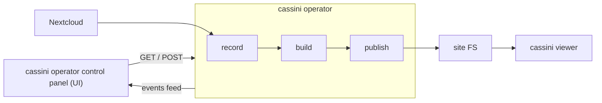

This is a TEMP instruction doc with happy path cassini-operator run.

## Architecture overview



## Setup

Clean up `cassini-operator/runtime/*` (`rm -rf` the whole dir).
**Limitation:** the publish (and so the entire pipeline) fails if `runtime/site` is non empty (this is being addressed, but for now, make sure nothing's there).

Start the `cassini-operator` at some port, I'll use `:4000` for this example:
```
./bin/cassini operator start --bind 127.0.0.1:4000
```

Start the control panel, providing the operator port:
```
cd cassini-control-panel
CASSINI_OPERATOR_URL=http://127.0.0.1:4000 npm run rev
```
_note: the control panel is not strictly needed, but it's 10x much convenient than spamming the operator API with curl_

Open the cassini control panel (default: `localhost:5173`) and check that it's connected (top right corner badge -- this indicates connection with the operator)

## Record

The local Nextcloud harness may or may not work properly (I'm still investigating), for quick and easy meeting (and one verified to be working), I'd:
- go to `meet.codemyriad.io`
- click `Talk` tab
- click `Start meeting now` (name the meeting, join the room)
- copy the meeting URL into cassini control panel and start recording
- the bot will join in some 10-15secs (after prep)
- talk a while (slowly and long-ish session -- I recommend reading a prewritten script)\*
- once done click `stop` on the control panel job -- this stops the recording, not the job
- if recording is fine, the job will continue

_\*sometimes I'd get a failing recording, saying there are no remuxable streams (this happened both with local Nextcloud and the production one), so my hunch is that the meeting was cut short too soon, that my mic was to quiet, or idk. so be advised_

## Post processing

Once the recording is done, the job will continue with post processing (inspect it in real time on the control panel)

**Limitation:** fingers crossed this works, as the rerun functionality currently doesn't work as it's supposed to (it starts everything again -- including the recording). See instructions on rerunning and additional jobs.

After the post processing is done, the artefact is published and can be observed in the viewer.

## Viewer

_note: the following can probably be done in a more integrated manner (using env vars -- and if not, we shold definitely sort that out), but for now I use the manual copy / paste_

The published artefact (site) for the job is found at `cassini-operator/runtime/site`. 
Before observing anything, make sure to clear the viewer's data `cassini-viewer/exports/viewer-demo`
Copy the site into viewer demo, and start the viewer:

```sh
# remove the existing demo data
rm -rf cassini-viewer/exports/viewer-demo
# copy the built artefacts into viewer's demo dir
cp -r cassini-operator/runtime/site cassini-viewer/exports/viewer-demo
# start the viewer
cd cassini-viewer && npm run dev
```

The viewer default is `localhost:5173` -> `:5174` if the control panel is already running.

**note:** the viewer data (`exports/viewer-demo`) can be changed while the viewer is already running (you'd just need to refresh).

## Rerunning jobs and running additional jobs

Due to the issue with publish, when running an additional job, it's best to `rm -rf cassini-operator/runtime/site` (else the publish will fail).

The same procedure should be employed if rerunning the job (current rerun functionality needs to be fixed, so retrying will require to take it from the top).
The existing jobs (in the DB and built out artefacts shouldn't interfere, but the `./site` is problematic rn).


