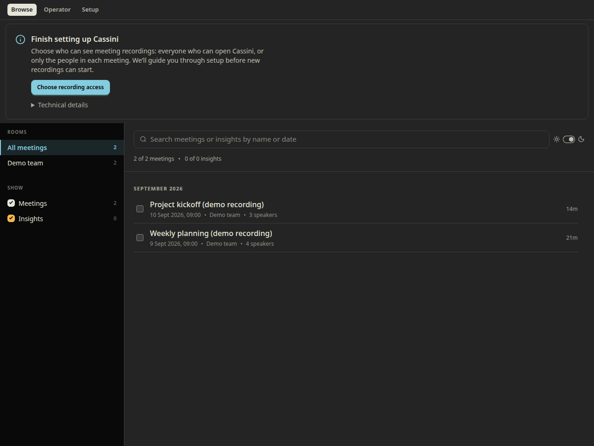
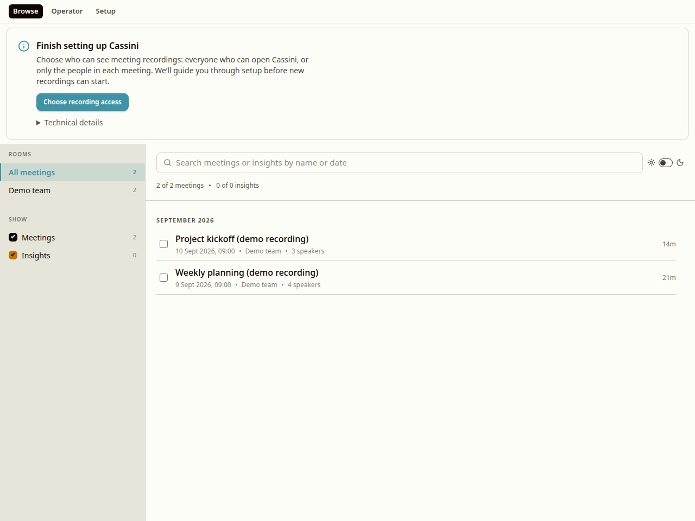
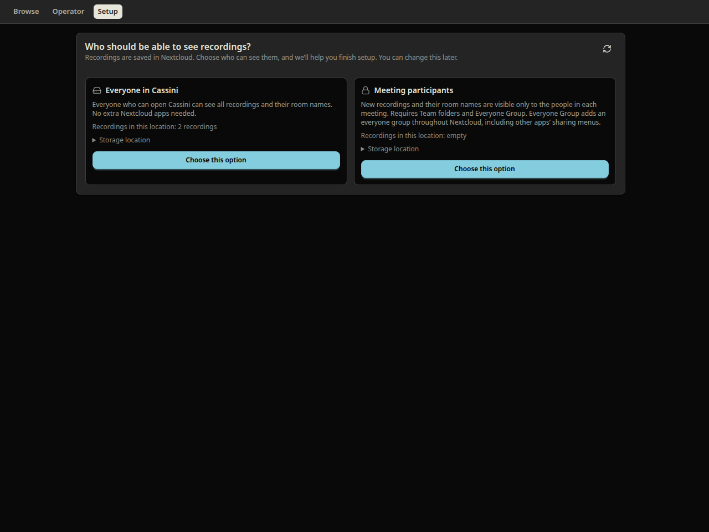
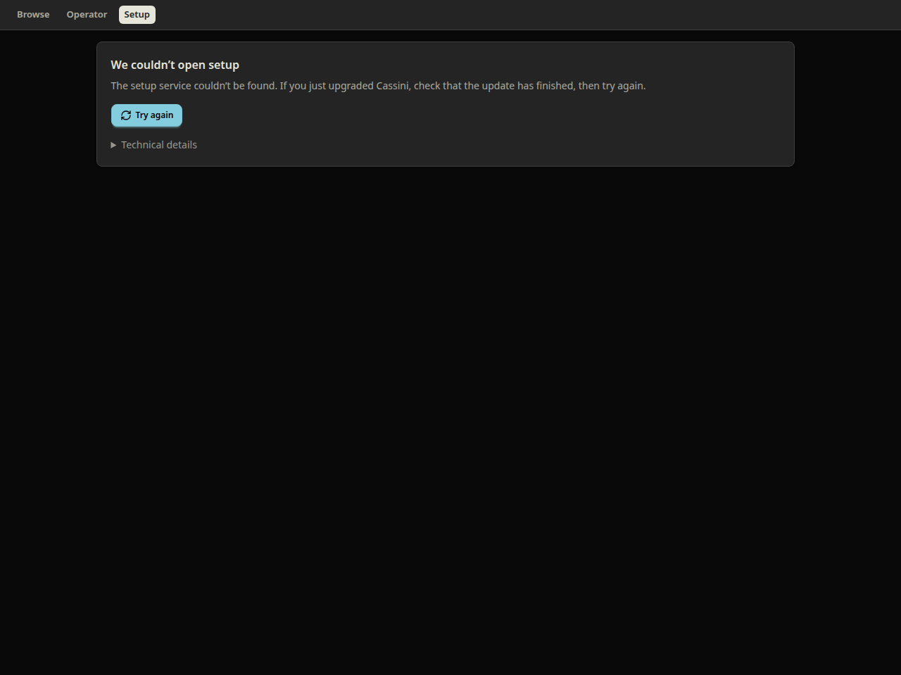
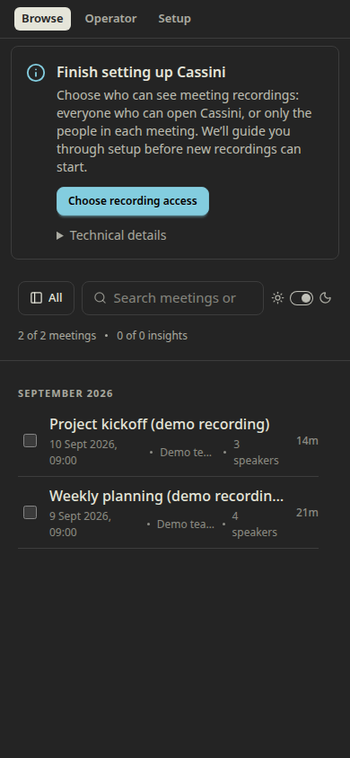

# Make the next step in Cassini setup clear

A contribution to [D-708](https://linear.app/code-myriad/issue/D-708/onboarding-turn-the-setup-tab-into-a-wizard-that-explains-what-each), for Ivan to review and use in the existing onboarding work. The broader goal is an administrator installing Cassini, making a short recording, and playing it back successfully. This change improves the entry into setup and its recovery path; the remaining work is listed below.

A running container is an intermediate result. In November 2023, a Talk user reported: “Container is running and on the admin panel backend is registered.” They still could not record and asked: “Am I missing an App?” ([forum post](https://help.nextcloud.com/t/how-to-setup-nextcloud-talk-recording-backend/159145/61), read from the community archive). In April 2025, another reported: “Nextcloud Talk itself worked fine this way, just not the recording backend.” That involved conflicting URL expectations ([issue #45](https://github.com/nextcloud/nextcloud-talk-recording/issues/45)). These historical reports identify failure patterns to avoid; they do not establish that those upstream bugs remain unfixed.

**What this contribution changes**

- A pending access choice becomes a neutral “Finish setting up Cassini” invitation with a visible “Choose recording access” button. Existing recordings remain visible while the choice is outstanding.
- Diagnostics, server commands and manual recovery remain accessible under a closed “Technical details” disclosure. Other signed-in users receive an explanation and an administrator handoff, without administrator controls or diagnostics.
- The invitation also works when only the public setup endpoint reports the pending choice and administrator diagnostics are absent. The older status-only response remains supported.
- Wizard and storage settings use the same audience-based names: “Everyone in Cassini” and “Meeting participants”. Both explain who can see recordings and room names. The participant option explains the additional apps and Everyone Group’s effect across Nextcloud before an administrator chooses it.
- An initial failure to load Setup gets a short explanation and a “Try again” action. The diagnostic remains available. A 404 is not treated as proof that reinstalling the app is necessary.

Storage selection, account creation, authentication, migration behavior and confirmation guards are unchanged. The operator’s migration consequences and overwrite warnings stay visible. Confirming storage is described as continuing setup, without promising that recording is already available.

**Screenshots**

These are screenshots of the actual app rendered in Chromium, using synthetic meeting data, controlled API responses, and a simulated Nextcloud host capability. They demonstrate UI behavior, not a live Nextcloud installation or recording test.











**Reproduce the UI checks**

From the repository root:

```bash
npm ci
npx playwright install chromium
npm test --workspace=cassini-app
npm run build:all --workspace=cassini-app
npm run test:setup-browser --workspace=cassini-app -- --screenshots /tmp/cassini-setup-review
```

The browser script starts a local Vite server and supplies synthetic API responses and a host-capability fixture. Native Nextcloud password confirmation is deliberately unavailable to the fixture and fails the check if invoked. It does not contact or change a Nextcloud deployment. It checks notice visibility, administrator and non-administrator paths, navigation into Setup, retry after a missing setup route, preservation of an existing recording in the list, and explicit confirmation before a storage write. It also checks narrow-screen layout and browser exceptions.

**Work to agree within the remaining onboarding plan**

1. Detect and explain recording prerequisites early. Cassini currently documents an HPB internal secret it cannot discover through an API. Explain where to obtain any required value and provide a way to check it; do not equate a configured value with a tested connection.
2. Guide preparation through to confirmation. When account/folder preparation finishes, present the remaining confirmation clearly. Make Nextcloud app-install handoffs and interrupted setup resumable.
3. Discuss whether saving the manual service-account password should block a first recording. Preserve the ability to save it and the reset route; reconcile any change with Ivan’s account-password requirements.
4. Tailor confirmation text to the actual preview. Fresh installs and confirmations that move nothing should not receive generic migration prose. Preserve all applicable access and overwrite consequences.
5. Add the persistent audience disclosure for healthy default-mode installations required by D-708. This contribution still leaves the healthy-state early return in place.
6. Lead to a user-initiated test recording, show processing/publication progress, and end at playback. Offer summaries and insights as optional follow-on configuration. Test both supported fresh installs and real Update-button upgrades, including their frontend bundle and manifest routes.

Measure required steps, server-console interventions, unexpected failures, and time to first playback. UI tests and successful builds support this contribution; they do not establish the full installation outcome. This contribution should not close D-708.
