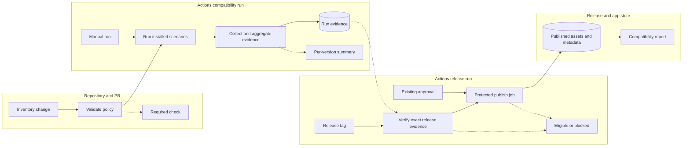

# Nextcloud compatibility — shaping

Status: the user selected B and authorized implementation. The user confirmed the
two-week/one-engineer appetite and maintained-major policy (33–35, retiring 32).
Fit checks describe design mechanisms, not test results or a claim that 35
already works. 🟡 marks requirements updated after those confirmations.

## Evidence and CURRENT

Audit: 2026-09-20. Local checkout: `9171979ce8e5d29fe2395093782b1d2f8466dc04`.
The previous investigation also checked live main at
`ba49a4c9b138676a25d8911b52c77868cb7c9452` and `v0.2.0-beta.7`.

| Part | Existing mechanism and observation |
|---|---|
| CURRENT1 | [Manifest](../../../appinfo/info.xml) advertises 32–35. Maximum 35 originated in commit `854ccdd6` on 19 May, merged on 21 May; this was a declaration, not a CI addition. |
| CURRENT2 | [Recorder CI](../../../.github/workflows/ci.yml) runs a basic Talk scenario on `nextcloud:33`; broader scenarios use [34.0.0](../../../harness/compose.yml). Both were configured on 12 June in `f874edf1`. |
| CURRENT3 | [Image CI](../../../.github/workflows/publish-exapp-image.yml) exercises the exact installed ExApp through AppAPI/HaRP, CPU recording/transcription/publication, restart and ACL checks. Other jobs cover manual-install/storage, ARM64, CUDA, and container lifecycle. Its Nextcloud jobs use the default 34.0.0. |
| CURRENT4 | [Bootstrap](../../../harness/bin/bootstrap.sh) installs Talk and ACL apps dynamically; [stack setup](../../../harness/bin/lib/stack.sh) installs AppAPI dynamically. HaRP uses a floating `release` image. Pinning Nextcloud alone does not freeze this dependency stack. |
| CURRENT5 | [Release workflow](../../../.github/workflows/release.yml) waits for image tags, then enters the protected signing/publishing job. It does not require compatibility evidence or successful completion of the image workflow. |
| CURRENT6 | Existing [manual-install coverage](../../../harness/bin/ci-e2e-install-exapp.sh) checks embedded UI wiring over HTTP. The standalone first-run browser check uses synthetic APIs; neither establishes that the app renders inside each supported Nextcloud version. |
| CURRENT7 | [Release documentation](../../release.md) says one Nextcloud major per release, contradicting the manifest. Main branch protection also names existing checks explicitly; refactoring must preserve their enforcement. |

The [20 September recorder run](https://github.com/codemyriad/gocassini/actions/runs/35502822395)
and [image run](https://github.com/codemyriad/gocassini/actions/runs/35502822474)
passed. In that single warm-cache image run, the installed CPU scenario took
about 5m29s and manual-install scenarios 4m35s. These are feasibility observations,
not runtime forecasts. Cold builds, downloads and runner queues must be measured.

The [upstream release schedule](https://github.com/nextcloud/server/wiki/Maintenance-and-Release-Schedule)
lists 33–35 as maintained, 32 under EOL, and the 36 date as TBA at this audit.
Support-policy changes happen in reviewed repository changes, never by silently
following the calendar.

## Requirements

The core goal and appetite are confirmed. The other in-bet requirements below
are the proposed acceptance contract for that goal.

| ID | Requirement | Status |
|---|---|---|
| R0 | Every advertised Nextcloud major has successful installed-product evidence for the Cassini release being published. | Core goal |
| R1 | A maintainer can identify and rerun the exact tested server, dependency stack and Cassini artifact. | Must-have, proposed |
| R2 | Compatibility checks exercise installation, embedded UI, recording, transcription, publication and recording-access restrictions. | Must-have, proposed |
| R3 | Routine PR feedback remains affordable without multiplying every existing scenario by every supported version. | Must-have, proposed |
| R4 | Upstream changes are discovered on a schedule, and an upcoming major can be qualified before it is advertised. | Must-have, proposed |
| R5 | Missing, skipped, cancelled or mismatched required evidence cannot authorize a release, and existing required checks remain enforced. | Must-have, proposed |
| R6 | Existing recordings, configuration and access restrictions survive Nextcloud and Cassini upgrades. | Out of this bet; required follow-on before claiming 36 upgrade coverage |
| R7 | The initial improvement fits a two-week appetite for one engineer by reusing the current harness. | 🟡 Must-have; appetite confirmed |

## A: Expand the existing version matrix

| Part | Mechanism |
|---|---|
| A1 | Add each advertised major to the current recorder and installed CPU job matrices. |
| A2 | Update version comments and release guidance manually when upstream ships. |

## B: Qualify releases from recorded compatibility runs

| Part | Mechanism | Flag |
|---|---|---|
| B1 | Add one checked-in compatibility inventory with support bounds, one exact tested minimum, per-major baseline stack locks, a reference stack and a separate preview list. Derive matrices and validate manifest/docs against it. | |
| B2 | Wrap the existing installed CPU scenario in a shared compatibility runner, add a small real embedded-browser assertion, and emit a versioned evidence record with actual versions, image identity and per-assertion outcomes. | |
| B3 | Run the reference and oldest supported stacks on relevant PRs; run all supported baselines on main and release tags. Preserve current named checks and aggregate only the jobs expected for that event. | |
| B4 | Make the image workflow publish a release-evidence index after required tests pass. Make release.yml verify that exact run, commit, tag, policy and image digests before offering publication, and recheck artifact identity after the existing approval. Attach compact evidence to the release. | |
| B5 | Add scheduled patch and preview checks using the same runner and an explicit Cassini digest. Show version differences and failures in Actions; promote passing stack updates through reviewed inventory changes. | |

Mechanics were investigated in [the handoff spike](spike-release-handoff.md).
Actual compatibility failures and runtime remain execution risks; neither is
treated as an already-passing result.

## C: Build a comprehensive compatibility lab

| Part | Mechanism |
|---|---|
| C1 | Maintain locked environments across server versions, databases, daemon topologies, storage modes, architectures and accelerators. |
| C2 | Run installed-product and persisted-upgrade suites across that combined matrix. |
| C3 | Add artifact-bound release enforcement and scheduled upstream qualification for the lab. |

## Fit check

| Req | Requirement | Status | A | B | C |
|---|---|---|:---:|:---:|:---:|
| R0 | Every advertised Nextcloud major has successful installed-product evidence for the Cassini release being published. | Core goal | ❌ | ✅ | ✅ |
| R1 | A maintainer can identify and rerun the exact tested server, dependency stack and Cassini artifact. | Must-have, proposed | ❌ | ✅ | ✅ |
| R2 | Compatibility checks exercise installation, embedded UI, recording, transcription, publication and recording-access restrictions. | Must-have, proposed | ❌ | ✅ | ✅ |
| R3 | Routine PR feedback remains affordable without multiplying every existing scenario by every supported version. | Must-have, proposed | ✅ | ✅ | ❌ |
| R4 | Upstream changes are discovered on a schedule, and an upcoming major can be qualified before it is advertised. | Must-have, proposed | ❌ | ✅ | ✅ |
| R5 | Missing, skipped, cancelled or mismatched required evidence cannot authorize a release, and existing required checks remain enforced. | Must-have, proposed | ❌ | ✅ | ✅ |
| R6 | Existing recordings, configuration and access restrictions survive Nextcloud and Cassini upgrades. | Out of this bet; required follow-on before claiming 36 upgrade coverage | ❌ | ❌ | ✅ |
| R7 | The initial improvement fits a two-week appetite for one engineer by reusing the current harness. | 🟡 Must-have; appetite confirmed | ✅ | ✅ | ❌ |

A leaves the release gate, dependency provenance, rendered UI and upstream
discovery gaps. B defers R6 explicitly. C expands the test surface beyond the
proposed appetite and PR cost constraint. B is the selected bet.

## Detail B: support and evidence contract

Confirmed policy: support upstream-maintained majors in a contiguous range, with
explicit review at each retirement. Target 33–35 for the next release and retire
32 explicitly. Do not edit already-published beta.7 metadata as part of this bet.

The inventory must separate these concepts:

- **Advertised minimum:** an exact version we run, reflected in `min-version`.
  Choose the actual patch during baseline qualification, not from a floating
  Docker alias. The proposed initial floor is 33.0.9, the maintained patch listed
  in the upstream schedule at this audit; qualify its actual image/dependency
  set before declaring it. That choice narrows the patch promise compared with
  today's major-only minimum and must be visible in the release notes.
- **Required baselines:** at least one explicit patch per advertised major,
  including the exact minimum. If the oldest major's current patch moves above
  the retained minimum, test both until the minimum is deliberately raised.
- **Reference:** the newest qualified stable baseline; the current 34.0.0
  reference remains in use while 35 is being qualified.
- **Preview:** an upstream candidate outside the advertised range. A green
  preview does not automatically widen the manifest.

Representative patch tests do not establish that every historical patch was
tested. The release report distinguishes the advertised range from exact tested
patches. The inventory validator rejects holes, a missing minimum baseline, a
reference outside the qualified range, or a manifest/inventory mismatch.

Lock Nextcloud and stack container digests, plus Talk, AppAPI and ACL-app archive
versions and checksums. Download the explicit archives through the harness's CI
bootstrap path and validate enabled versions; fail rather than silently falling
back to app-store latest. Reuse bundled apps when their identity matches the
lock. No package mirror or new registry service is needed for this bet.

Each result records commit SHA, workflow/run/attempt, event and tag, policy hash,
requested and observed Nextcloud version, container digests, installed app
versions, Cassini image index/platform/config identities, scenario, assertion
outcomes, timestamps, duration and diagnostic links. Collect observations before
teardown. Distinguish pass, product failure, environment failure, skipped and
cancelled; only pass qualifies a required row. Keep short diagnostic retention
for routine CI and attach compact JSON plus readable evidence to published
releases. Logs must redact credentials and authentication material.

## Detail B: execution tiers

| Trigger | Required work | Visible result |
|---|---|---|
| Every relevant PR | Existing fast and product checks; compatibility on reference and exact oldest baseline. Inventory, harness or integration-boundary changes exercise all supported baselines. | Stable required check names, explicit per-version results and applicability. |
| Docs-only PR | Explicit not-applicable status through the existing classifier; compatibility configuration must live outside ignored docs paths. | A reason for applicability, never reusable as release evidence. |
| Main push | Installed compatibility across all supported baselines, sharing the one built Cassini artifact. Existing specialized suites keep their current role. | Complete baseline matrix and evidence index. |
| Release tag | All supported baselines plus existing required image/product suites on the exact tag artifact; no relevance-based bypass. | Evidence eligible for release.yml verification. |
| Scheduled daily / manual canary | Latest patches for supported majors; a configured upcoming-major candidate when available. Freeze the Cassini digest so upstream drift can be isolated. | Dependency differences and results; advisory to PR merging. |

Dedicated hosted jobs isolate the harness's fixed Docker names. Set matrix
parallelism to cap runner use; do not run multiple installed stacks on one Docker
daemon. Replace duplicate reference work with the shared runner while retaining
the existing protected check name. GPU, ARM64, databases and manual-install
topologies do not become extra dimensions of the Nextcloud matrix.

The proposed PR budget is at most ten additional minutes on the warm-cache
critical path and two baseline stacks for ordinary relevant changes. Measure
both elapsed time and runner-minutes. Cold runs remain subject to explicit job
timeouts. This is a design target, not a measurement or an excuse to retry a
failing product test until it passes.

## Detail B: maintainer breadboard

The visible interface is GitHub PR checks, Actions summaries and release assets.
These are existing maintainer surfaces; this project does not add a dashboard.
Names marked “proposed” below are design affordances, not existing files.

| ID | Place | Description |
|---|---|---|
| P1 | Repository / PR | Edit and review the compatibility inventory. |
| P2 | Actions compatibility run | Run baselines and inspect results and evidence. |
| P3 | Actions release run | Inspect qualification and use the existing release approval. |
| P4 | GitHub release / app store | Obtain published assets and compatibility evidence. |

| ID | Place | Component | UI affordance | Control | Wires Out | Returns To |
|---|---|---|---|---|---|---|
| U1 | P1 | PR diff | Compatibility inventory change | Commit / push | N1 | — |
| U2 | P1 | Required check | Manifest/policy validation result | Render | — | — |
| U3 | P2 | Actions summary | Per-version results, observed stack and diagnostic links | Render | — | — |
| U4 | P2 | Workflow dispatch | Run baseline or preview qualification | Submit | N2 | — |
| U5 | P3 | Release input | Select existing tag or receive tag-push event | Submit / event | N4 | — |
| U6 | P3 | Release summary | Eligible or blocked, with evidence/reason | Render | — | — |
| U7 | P3 | Protected environment | Existing approve-release control | Approve | N5 | — |
| U8 | P4 | Release assets | Compatibility report and exact artifact identities | Render / download | — | — |

| ID | Place | Component | Code affordance | Control | Wires Out | Returns To |
|---|---|---|---|---|---|---|
| N1 | P1 | Proposed compatibility inventory validator | Compare inventory, manifest and supported baseline set | Call | N2 on valid relevant CI event | U2 |
| N2 | P2 | Proposed shared compatibility runner | Resolve requested stack; load exact Cassini image; run installed scenario and browser assertion | Call / schedule | N3 | — |
| N3 | P2 | Proposed evidence collector / aggregator | Observe versions; validate required rows and existing product jobs; write result/index even on failure | Call / job finalization | S1 | U3 |
| N4 | P3 | Proposed release evidence verifier | Select exact trusted tag run; check completion, artifact identities, policy and complete required evidence | Call | N5 preflight on success | U6 |
| N5 | P3 | Existing protected publish job, extended | Preflight exposes existing approval; after approval recheck tag/digests, then sign, validate, attach evidence and publish | Dependency success / approval | S2 | U6 |

| ID | Place | Store | Written by | Returns To |
|---|---|---|---|---|
| S1 | P2 | Actions evidence artifacts keyed by source run and attempt | N3 | N4 |
| S2 | P4 | GitHub release assets and app-store release metadata | N5 | U8 |

N4's positive output makes the existing environment approval available; the
approval action is still necessary for N5 to publish. A failure does not enter
that path. The diagram's node labels abbreviate the affordance names; the tables
are authoritative.

## Rabbit holes and scope boundaries

- **A broken major is a product finding.** Investigate a failing 35 baseline
  first. Fix bounded compatibility defects; if the work exceeds the appetite,
  bring back a concrete scope decision instead of weakening the assertions or
  leaving unsupported advertised rows green.
- **Exact image identity crosses several formats.** Index digest, platform
  manifest digest and Docker config/image ID are different. Retain their mapping
  and check what the running container uses; do not compare unlike hashes.
- **Tag workflow races must not authorize publication.** Pin source run/attempt
  and verify digests again after approval. A cancelled build or retagged image
  invalidates eligibility. No “latest successful run” fallback.
- **Harness cleanup conflicts with upgrades.** The installed scenario calls
  `--reset` and destroys volumes on exit. Upgrade work needs a separate retained
  fixture flow; do not bolt a version switch into that cleanup path.
- **App-store drift can masquerade as a product regression.** Locked baseline
  inputs and moving canaries have separate identities. Failures identify which
  dependency moved; a network failure never becomes a compatibility pass.
- **Avoid a new testing platform.** No Kubernetes fleet, dedicated dashboard,
  package mirror, full browser/device matrix, database matrix, new GPU fleet or
  general harness rewrite. Retain specialized tests without multiplying them.
- **Do not rewrite old releases.** Retiring a supported major affects a new
  version, documentation and its manifest. Do not delete images still referenced
  by store releases.

## Completion, cuts and circuit breaker

Finish the bet when an all-major baseline run produces inspectable evidence,
the exact minimum is enforced, a real embedded UI loads, and release dry runs
demonstrate both successful qualification and refusal of missing/wrong evidence.
The next authorized release must carry its evidence; no real store publication
is needed merely to test the gate.

Complete the riskiest proofs first: 35 installed-product execution and evidence
handoff. By the midpoint, both must have an end-to-end demonstration. If they do
not, re-shape the unfinished work. Cut automated update-PR generation, richer
report formatting and expanded canary frequency first; do not cut per-major
release coverage, image identity checks, access assertions or failure handling.

At the two-week boundary, stop expanding the bet and review demonstrated scopes.
Do not carry unfinished work automatically into another cycle. Any support-range
reduction is an explicit product decision, not an implementation shortcut.

## Nextcloud 36 qualification and the follow-on bet

The first bet creates the promotion mechanism. Actual 36 qualification waits
for upstream images and compatible dependencies; its release date is not assumed.

1. Add a configured 36 candidate to previews. Run it against a fixed Cassini
   image; record missing dependencies as unavailable, never as passed.
2. Review Nextcloud, Talk, AppAPI and HaRP release changes. Use a temporary
   test manifest for out-of-range preview installation, record its hash/diff,
   and prevent that result from qualifying the unchanged production manifest.
3. Qualify a fresh 36 installation through the same complete product scenario.
4. Complete the bounded upgrade work described in [the upgrade brief](spike-upgrades.md):
   retain a 35 fixture, upgrade to 36 through the supported server procedure,
   and demonstrate existing recordings, ACLs, configuration and new recordings.
   Develop the mechanism first using available 34→35 versions. Separately
   exercise a previous Cassini release upgrading to the candidate on one server.
5. In one reviewed change, add 36 to required baselines, update the production
   manifest maximum, update support documentation and select a new reference if
   appropriate. Rerun qualification using the actual production manifest.
6. Cut a new Cassini version through the evidence-enforced release path. Evaluate
   the minimum independently against upstream maintenance and user needs.

Proposed follow-on appetite: one additional two-week bet focused on one adjacent
server-upgrade path and one Cassini-upgrade path on the reference topology.
It is not included in the first bet or represented as already shaped for build.

## Implementation record

Shape B is implemented on `plan/nextcloud-compatibility`; hosted qualification
remains in progress. The inventory contains 33.0.9, 34.0.0 and 35.0.0, retaining
34 as the reference until 35 is qualified. AppAPI is bundled by these server
images: its metadata checksum and version replace an external archive lock.
The implementation is documented in [the compatibility runbook](../../nextcloud-compatibility.md).

The scheduled resolver advances the server and native apps while holding the
infrastructure images fixed. This deliberately isolates the upstream release
train; infrastructure lock updates remain reviewed changes. The preview list
starts empty until an appropriate 36 image/dependency set is available.
