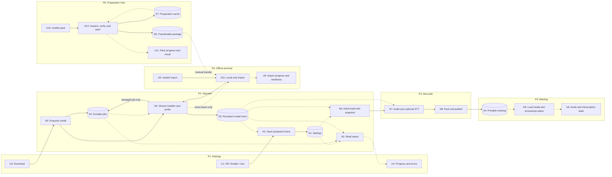

# Optional transcription and persistent models — Shaping

**Recommendation: a model-free application image, an explicit transcription switch, and one persistent model installer with Settings downloads and a terminal pack/import workflow.** Use recorder-side installation commands and existing AppAPI storage support. Keep model revisions independent of app versions. Connected installations acquire pinned, individually compressed files through `dist.gocassini.com`; air-gapped installations import a manually transferred model pack or copied files into the same store. A general blob cache is unnecessary for this scope.

Status: implemented in the working tree for [D-797](https://linear.app/code-myriad/issue/D-797/make-transcription-optional-and-persist-models-with-downloads-and), 2026-09-21. Shape B remains selected, adapted to the now-live per-file CDN while retaining a simple revision store. Silvio ruled out first-upgrade migration, asked for simplicity, specified the CDN, requires air-gapped provisioning, and suggested pack/import. See the [operator guide and validation record](implementation.md) for commands, evidence, and remaining deployment checks.

- [Frame and original request](frame.md)
- [Repository evidence, source links, HTTP probes, and release gates](spike-current-system.md)
- [Proposed vertical slices and acceptance scenarios](slices.md)

## Requirements (R)

“Must-have” rows come from Silvio's requested outcomes or his simplicity constraint. “Leaning yes” rows are proposed supporting behavior, not additional commitments attributed to him.

| ID | Requirement | Status |
|---|---|---|
| R0 | An installation can record, publish, and play meetings with transcription disabled and no speech-model files. | Core goal |
| R1 | An administrator can acquire a selected model during configuration and monitor progress before processing a meeting. | Must-have |
| R2 | Upgrading gocassini with the same configured model revision does not download that model again. | Must-have |
| R3 | Missing, downloading, or failed model installation does not prevent app initialization, recording, or access to playable meetings. | Leaning yes |
| R4 | A download remains observable after page reload and process restart, and interrupted transfers can recover without discarding reusable completed work. | Leaning yes |
| R5 | Only complete, validated models become selectable for transcription; configuration changes do not invalidate running builds. | Leaning yes |
| R6 | Portable meetings remain playable, and users can distinguish skipped transcription from a silent meeting or a transcription failure. | Leaning yes |
| R7 | 🟡 Administrators can provision complete, verified models both from the CDN and from manually copied files without internet access. | Must-have |
| R7.1 | 🟡 Downloads use dist.gocassini.com, respect supported CPU/CUDA choices and an administrator's no-download policy, and report actionable failures. | Must-have |
| R7.2 | 🟡 An air-gapped installation can import manually copied model files and dependencies, verify them locally, and enable transcription without internet access. | Must-have |
| R7.3 | 🟡 A connected machine can prepare a single transferable package containing a supported model and its dependencies for offline import. | Leaning yes |
| R8 | Favor a small extension of the existing operator and downloader; do not support migration of bundled models for existing users. | Must-have |

## CURRENT: Baseline before D-797 — models in images

| Part | Mechanism |
|---|---|
| CURRENT1 | CPU images bundle v3 int8; the CUDA base bundles v3 fp32. Both include Silero VAD under `/opt/cassini/cache`. |
| CURRENT2 | Persist quality/device settings and derive hardware-based defaults. There is no transcription-enabled setting. |
| CURRENT3 | `executeBuildCLI` admits a model/device and starts `cassini build`; `BuildMeetingArtifact` mixes audio, calls `EnsureModel`/`EnsureVAD`, transcribes, packs, and publishes. |
| CURRENT4 | Additional models download into the existing persistent cache with locking, staging, and completion markers. Downloads stream through archive extraction and report filenames in build logs. |
| CURRENT5 | Portable v1, static export, and the viewer require a transcript entry/index. Zero-word content is permitted, but skipped transcription is not represented. |

The supplied research is directionally right. Two corrections matter: persistent runtime model storage already exists, and Docker can reuse unchanged layers. This proposal guarantees model reuse independently of image layers; it does not claim every existing upgrade currently retransfers weights. See the [spike](spike-current-system.md#q1-storage-and-image-packaging).

## A: Retain models in stable image layers

| Part | Mechanism | Flag |
|---|---|:---:|
| A1 | Add an enabled switch and the audio-only output path described in B1/B2. | |
| A2 | Stabilize CPU and CUDA model layers and continue distributing a default model in each image. | |
| A3 | Keep first-build acquisition for models outside the image's default set, changing catalogue URLs to dist.gocassini.com. | |

This reduces some repeated image transfers, but does not provide configure-time acquisition or remove the default model download for installations that do not use transcription.

## B: Install verified model revisions into persistent storage

| Part | Mechanism | Flag |
|---|---|:---:|
| B1 | Add persisted transcription enablement and a pinned active model revision; snapshot the execution choice at build admission. New installs start with transcription off. | |
| B2 | Split media preparation/finalization from STT. When skipped, emit playable audio, participant metadata, explicit processing status, and a zero-word v1 compatibility payload; update viewer and text features. | |
| B3 | Extend Settings with installed/available model state, explicit Download, progress, Retry/Cancel, and enable/use actions that require a prepared model. | |
| B4 | Add one SQLite-backed installation queue, separate from meeting build workers. A recorder-side model-store command emits structured progress; the operator persists status and recovers jobs. | |
| B5 | 🟡 Ship a recorder catalogue pinning dist.gocassini.com URLs, source-revision plus compressed/decompressed per-file digests/sizes, required files, VAD dependency, and source/license metadata. Store validated revisions under the existing persistent cache root. | |
| B6 | 🟡 Use one verifier/publisher for downloaded and locally imported models: validate hashes and required files in staging, atomically publish, and probe under resource limits. The network path additionally retains partial compressed files and resumes safely. | |
| B7 | Remove weights and VAD from CPU/CUDA images, retain native runtimes, and update image tests, AppAPI ADMIN routes, health/doctor reporting, and deployment docs. | |
| B8 | 🟡 Add `cassini models pack` to acquire/verify files and VAD on a connected host and write one transferable package without an inference probe. Add local-only `models import` for that package, a supported archive, or extracted files, reusing B5/B6 and probing on the target. Settings discovers the receipt and activates normally. | |

## C: General content-addressed blob store

| Part | Mechanism | Flag |
|---|---|:---:|
| C1 | 🟡 Reuse B1–B4, B7, and B8's pack/local-file import for optional processing, configuration, jobs, model-free packaging, and offline provisioning. | |
| C2 | Use the same immutable per-file CDN as B, but store digest-addressed blobs and assemble revision snapshots from links. | |
| C3 | Adapt B6 to resume and validate individual files; manage blob references and snapshot cleanup. | |

B also copies matching verified files between installed revisions without a request. C would additionally deduplicate local storage through linked snapshots and reference management. Keep B for simplicity.

## Fit check

This is design coverage, not a claim that code or release tests already pass. All 12 production objects passed bounded nonzero-offset range checks; interrupted transfers and unsafe responses are also covered by fixture tests. Deployment release checks remain separate.

| Req | Requirement | Status | A | B | C |
|---|---|---|:---:|:---:|:---:|
| R0 | An installation can record, publish, and play meetings with transcription disabled and no speech-model files. | Core goal | ✅ | ✅ | ✅ |
| R1 | An administrator can acquire a selected model during configuration and monitor progress before processing a meeting. | Must-have | ❌ | ✅ | ✅ |
| R2 | Upgrading gocassini with the same configured model revision does not download that model again. | Must-have | ❌ | ✅ | ✅ |
| R3 | Missing, downloading, or failed model installation does not prevent app initialization, recording, or access to playable meetings. | Leaning yes | ❌ | ✅ | ✅ |
| R4 | A download remains observable after page reload and process restart, and interrupted transfers can recover without discarding reusable completed work. | Leaning yes | ❌ | ✅ | ✅ |
| R5 | Only complete, validated models become selectable for transcription; configuration changes do not invalidate running builds. | Leaning yes | ❌ | ✅ | ✅ |
| R6 | Portable meetings remain playable, and users can distinguish skipped transcription from a silent meeting or a transcription failure. | Leaning yes | ✅ | ✅ | ✅ |
| R7 | 🟡 Administrators can provision complete, verified models both from the CDN and from manually copied files without internet access. | Must-have | ❌ | ✅ | ✅ |
| R7.1 | 🟡 Downloads use dist.gocassini.com, respect supported CPU/CUDA choices and an administrator's no-download policy, and report actionable failures. | Must-have | ✅ | ✅ | ✅ |
| R7.2 | 🟡 An air-gapped installation can import manually copied model files and dependencies, verify them locally, and enable transcription without internet access. | Must-have | ❌ | ✅ | ✅ |
| R7.3 | 🟡 A connected machine can prepare a single transferable package containing a supported model and its dependencies for offline import. | Leaning yes | ❌ | ✅ | ✅ |
| R8 | Favor a small extension of the existing operator and downloader; do not support migration of bundled models for existing users. | Must-have | ✅ | ✅ | ❌ |

Notes:

- A fails R1/R4 because acquisition stays in a meeting build. It fails R2 because reuse depends on image-layer identity and retention, rather than the configured model revision. Missing non-bundled models still block builds, and settings can select models before validation, failing R3/R5.
- A fails R7/R7.2/R7.3 as drawn: copying the application image can carry its bundled default, but A has no supported model-package preparation or local-file import/verification path. It would need B8 to cover these requirements.
- C fails the selected simplicity constraint R8: it adds a blob/snapshot lifecycle for savings beyond routine application upgrades.

All compared shapes can use Silvio's specified distribution domain; this does not distinguish the storage approaches. B adds the required offline path through the same verifier and persistent store.

## Detail B: Product behavior

The app's `/init` and heartbeat complete without weights. Configuration offers **Transcription: Off / On**, the existing **Fast / Balanced / Best** labels, device information, and download/installed sizes. Off remains a valid finished configuration, never an incomplete-setup warning.

Recommended interaction:

1. Open Settings. A fresh install says “Transcription is off. Recordings are available as audio.” No download starts.
2. Select a quality/device option. Show which model it resolves to and whether it is installed. CUDA's three tiers resolve to the same fp32 revision; changing among them costs no model download. CPU Fast is the smaller English model, so show its language limitation.
3. Press **Download model**. The server creates or returns the existing installation job. Show bytes, total, percentage, reused bytes, current phase, and an actionable error if necessary. The app remains usable.
4. The job moves through **Queued → Downloading → Verifying → Unpacking → Checking → Ready**. Closing the browser does not cancel it. Retry and Cancel are explicit actions. Checking has no invented percentage; pinned downloads have known totals.
5. Once prepared for the selected device/runtime, press **Enable transcription** or **Use this model**. This is a separate settings write. A finished download does not silently change policy while the administrator is away.

Separating download from activation avoids a stale job enabling a model after the administrator changes their mind. A previously active model stays selected while another downloads. Off affects future build admissions; an already admitted build finishes with its immutable snapshot. Turning transcription off retains installed files for later reuse.

On an air-gapped server, the administrator replaces steps 3–4 with the [local import workflow](#detail-b8-air-gapped-model-provisioning). Settings discovers the imported receipt on refresh/poll, shows the same Ready state, and enables it through step 5. When downloads are disabled, show local-import instructions instead of treating the installation as unable to use transcription. An offline upload UI is not required.

| Effective condition at build admission | Meeting behavior | User-visible state |
|---|---|---|
| Transcription off | Prepare audio and publish; no model/VAD lookup, inference admission, captions, attribution, summary, or model network request. | “Transcription was turned off for this recording.” |
| On, prepared model available | Pin revision/device and run the existing transcription path. Resource pressure follows normal bounded admission/retry policy. | Normal processing/transcript. |
| On, selected model missing/corrupt/incompatible | Publish audio with skipped reason; show configuration problem. Never begin an implicit download. | “Recording available. Transcription needs attention in Settings.” |
| A model is downloading and none is active | Continue producing audio-only meetings. | Installation progress in Settings; recording says transcription was unavailable. |
| STT fails after audio preparation | Finalize available audio with failed status; do not claim a successful or silent transcript. Media preparation/integrity failures still fail the build. | “Recording available. Transcription failed.” |

No automatic backfill is included. Installing or enabling transcription affects future admitted builds. Any later request to reprocess older recordings must account for source retention and is separate work.

## Detail B1/B2: Keep the no-STT path bounded

Add `transcription_enabled` with a default of `false` to `STTSettings`, plus the active immutable model reference. The team's first deployment can configure once; do not implement old-image or old-cache migration. Preserve unrelated stored vocabulary, aliases, and LLM settings. Do not infer enablement from a model directory or from hardware auto-detection.

Add an explicit recorder build mode, for example `cassini build --transcription=off|on`, and a corresponding `BuildConfig` field. Resolve mode before backend validation and doctor STT checks. The operator passes a mode and installed revision explicitly and always disallows model acquisition in meeting-build subprocesses. Keep direct CLI model acquisition explicit through `cassini models install`; update legacy first-build-download instructions.

Extract the media-only branch around existing probe, mixdown, audio hash, duration, metadata, and finalization functions. Keep native sherpa/ONNX libraries in the image because the binary links them; “no model needed” does not require removing native library dependencies.

For v1 compatibility, write a zero-word `cassini.words.v1` body with descriptor ID `untranscribed`, duration/audio integrity and participants from the recording, and no STT provenance. Its existence is a file-format adapter, not an executed transcription stage. Add a propagated field such as:

```json
{"processing":{"transcription":{"status":"skipped","reason":"disabled"}}}
```

Other reasons include `model_unavailable`; an attempted failure uses `status: "failed"` and a bounded public error code. A successful run with zero words uses `status: "completed"`. Do not infer skipped status from word count alone. Do not write fake captions, recognition provenance, or timing guarantees.

Update the artifact writer, packer/wire structs, schema documentation, static exporter, and viewer together. The viewer renders an intentional empty state with audio controls and keeps metadata, tags, and marks usable. Old readers can still use the v1 audio/zero-word body, although they cannot explain the new status; verify this in V1. Preserve missing-transcript errors for genuinely corrupt files.

Search keeps the meeting's metadata/library entry but has no transcript text to index. Summary generation stays off for that artifact even if an LLM is configured. Insights should identify recordings without text and require the user to omit them before sending a request; a textless selection must not trigger a model call. Existing transcripts remain readable when the installation's switch is off.

## Detail B4–B6: One durable installer

Use the operator's existing SQLite database for a separate `model_install_jobs` table and one installation worker. Reuse the recorder's model knowledge through proposed structured commands, e.g. `cassini models list --json` and `cassini models install --progress-json`. The recorder and operator are separate Go modules; a subprocess boundary avoids duplicating model catalogues or importing recorder-internal packages.

The helper emits versioned JSON events. The operator owns job IDs, durable phase/error state, and process lifetime. Request handlers return promptly. Browser polling neither owns nor extends a transfer. On shutdown, stop/checkpoint the worker; on startup, reconcile nonterminal jobs against the files on disk and resume. Cancellation is terminal until an explicit retry, retains valid partial data, and never deletes an installed model.

Proposed API under the current ADMIN configuration surface:

| Method/path | Contract |
|---|---|
| `GET /operator/settings/models` | Catalogue, installed revisions, device readiness, sizes, current jobs, and whether downloads are allowed. |
| `POST /operator/settings/models/install` | Accept a catalogue model/revision and probe device, never an arbitrary URL/path. Return 202 with job ID/status URL, or the matching existing job/result. |
| `GET /operator/settings/models/jobs/{id}` | Persisted phase, current artifact, completed/total bytes, reused bytes, last update, state, and actionable error message. |
| `POST /operator/settings/models/jobs/{id}/cancel` | Stop that job; retain resumable bytes. |
| `POST /operator/settings/models/jobs/{id}/retry` | Resume/reconcile the same installation intent. |
| `PUT /operator/settings` | Save Off, or activate a prepared revision/device. Reject activation when not ready; no hidden download. |

Register actual subpath handlers and add POST to narrowly scoped ADMIN AppAPI route declarations. The existing wildcard GET/PUT declaration alone is insufficient. At release time, bump the manifest version under CONTRIBUTING so AppAPI refreshes route declarations. Standard users can see meeting status but cannot install models.

Persist at least model ID, source revision/digest, target device, job state, timestamps, byte counters, and public failure information. Enforce one live job for the same model revision/probe target and one filesystem writer; different target probes can share completed model data. Do not store URLs from client input. The terminal importer uses the same filesystem writer lock and verifier/publisher, but does not directly write the operator's SQLite jobs. Inventory reads verified filesystem receipts, so a local import does not need a synthetic download job or an operator restart.

Use the existing cache root unchanged:

```text
<model-cache-root>/                              # AppAPI: $APP_PERSISTENT_STORAGE/operator/models
  downloads/<revision>/<compressed-sha>.part     # retained compressed bytes
  downloads/<revision>/<compressed-sha>.part.json # URL/digest/ETag checkpoint
  downloads/<revision>/files/                   # verified staging files
  models/<model-id>/<source-sha>/               # immutable files + installation/probe receipts
  vad/<vad-sha>/silero_vad.onnx                  # model's pinned VAD dependency
  .import-.../                                  # local import staging
  .models.lock                                 # download/import/pack publication lock
  .inference.lock                              # serialize inference and target probes
```

The recorder embeds the live schema-v2 catalogue from `dist.gocassini.com/manifest.json`, with each model's VAD revision pinned explicitly. It contains source archive identity, immutable compressed-file URLs, both compressed and decompressed SHA-256/size, required files, source, and license metadata. The int8 revision has no `bpe.vocab`; fp32 includes it and `encoder.weights`. All listed files are installed. Runtime operations never fetch the remote manifest. App version and native-runtime fingerprint are excluded from weight paths. Retain old catalogue entries when adding new revisions so active pins remain resolvable.

### Download/install transaction

1. Check local receipts before any request. Reuse a valid revision and VAD without even a HEAD. Matching files in another verified installation can be copied locally by digest; there is no separate blob store.
2. Before each transfer, check space for remaining compressed bytes, that file's expanded bytes, and a 256 MiB reserve. Disk write failures never publish partial output. Pack/import account for their own additional staging/output space.
3. Download to `.part` with a cancellable, bounded client. Use actual file length after a crash and a strong ETag with `Range`/`If-Range`. Validate 206 offsets, total length, and validator. A 200 response truncates/restarts safely; 416 restarts. Missing/weak validators never authorize append.
4. Verify the compressed digest, decode bounded seekable Zstandard frames, and verify the decompressed digest/size. Keep completed staging files across interruptions. Publish a receipt and atomically rename the complete revision; fsync publication metadata. Compressed bytes are removed after successful decoding. A published revision is reused after a crash even if SQLite was not updated yet.
5. Run a CPU/CUDA load and execution probe in a recorder subprocess under admission limits. The inference lock serializes terminal probes with builds. Runtime/device readiness is a separate receipt; failed probes retain verified weights. Only Ready can activate.

Persist progress at a bounded cadence and poll every two seconds. Phases distinguish transfer, hashing, decompression, and runtime checks. A failed poll shows last-known status; it does not imply cancellation. Actionable errors distinguish network/policy refusal, size/hash/path failures, disk exhaustion, and runtime/resource problems.

`CASSINI_DISALLOW_MODEL_DOWNLOAD` is checked before every new or resumed network transfer, including recovered jobs. Local import, validation, probe, and activation remain permitted. No model operation uploads recordings.

### Distribution contract: dist.gocassini.com

Silvio's CDN is live. Its actual immutable path is:

```text
https://dist.gocassini.com/models/files/<compressed-sha256>/<filename>.zst
```

The same origin includes VAD. Keep immutable bytes and old pinned objects. Serve identity HTTP content encoding, accurate lengths, stable strong ETags, and correct nonzero-offset 206 responses; SHA-256 remains the integrity authority. All 12 unique shipped objects passed that bounded range/ETag check on 2026-09-21. Full Fast and Balanced downloads, decompression, hashing, and CPU probes also passed locally. Existing-origin probes in the historical spike are not evidence about this CDN.

The backend downloads from these fixed URLs; browser CORS is not required. No dynamic catalogue refresh, upstream fallback, CDN provisioning code, delta format, multipart downloader, linked snapshots, or garbage collector is introduced.

## Detail B8: Air-gapped model provisioning

Support installation with **no internet egress from the Cassini server from the start**, not only disconnecting a previously configured server. Local Nextcloud, browser, and deployment connectivity remain as required by the normal installation. Model provisioning must perform no DNS, HTTP, CDN metadata, catalogue-update, or missing-dependency request.

The following CLI is implemented; see the [operator guide](implementation.md) for the validated contract. Use the existing catalogue, acquisition, and validation code rather than another model-management service. The recommended handoff is **pack on a connected host → copy one file → import offline → enable locally**:

1. On a connected machine, use `cassini models list --json` from the target app version (or a compatible catalogue) to identify the supported revision. Run `cassini models pack` for that revision. It reuses verified local model/VAD files when available, otherwise downloads the required pinned assets from `dist.gocassini.com`, verifies them, and prepares one complete package. The preparation host does not need the target GPU; packing validates bytes and does not run inference or change its active transcription settings.
2. Copy the package via removable media or another approved transfer mechanism into a directory readable inside the target container, such as `/mnt/model-import`. Use `docker cp` or a read-only bind mount as appropriate. Transfer the correct application image/native runtime separately using the normal offline container-install process; neither model command bundles/pulls an application image or installs libraries on the target.
3. Run `cassini models import --from <package>` **inside the target runtime**, as the service user or with ownership that leaves the destination readable by the service. The package supplies the model identity; validate that identity against the target's shipped catalogue. Pass the operator's actual resolved cache root, including any override. In the default AppAPI case that is `$APP_PERSISTENT_STORAGE/operator/models`; use the mounted operator cache root for Compose/manual installations.
4. Import checks the local catalogue, validates/copies only the expected files into staging, verifies VAD, publishes atomically, and probes on the target CPU/CUDA runtime under the same resource limits. It prints phases and a final revision/readiness result, and returns a nonzero exit code with the exact missing/mismatched file if import fails. Keep source media untouched. No directory becomes Ready just because files or a copied completion marker exist.
5. Open the local Settings page and choose **Enable transcription** / **Use this model**. An imported model has the same active-revision and upgrade behavior as a downloaded one. Import itself does not change the saved transcription policy.

Example on the connected preparation machine; substitute the target catalogue's actual revision:

```sh
cassini models pack parakeet-tdt-0.6b-v3-int8 \
  --revision '<archive-sha256-from-the-target-catalogue>' \
  --out /media/transfer/parakeet.cassini-model.tar
```

After manually copying that file, run inside the offline AppAPI container using the default cache root:

```sh
cassini models import \
  --from /mnt/model-import/parakeet.cassini-model.tar \
  --cache-root "$APP_PERSISTENT_STORAGE/operator/models" \
  --device cpu
```

### Package contract

Define a small versioned tar format, `cassini.model-pack.v1`, with `manifest.json`, `model/` files, `vad/silero_vad.onnx`, and source/license notices. The manifest identifies the model, original catalogue revision, VAD revision, paths, sizes, and hashes. Use the same canonical extracted-file layout whether pack started from a verified cache or fresh CDN files; reuse of local model files must not require reacquiring the original compressed archive.

The target matches package identity and **every payload hash to its own shipped catalogue**, not merely to the manifest accompanying the package. A self-consistent package must not be able to redefine a known revision's hashes or introduce an unknown executable/runtime dependency. Unknown model/pack versions or unsupported revisions fail locally with guidance to use a matching catalogue/app release; import never fetches a new catalogue. The package's bytes/hash are distinct from the source model archive's revision digest.

Pack checks space for downloaded compressed files, decompression, and the output tar; emits download/verification/packing progress; writes a temporary output beside `--out`; and publishes it with a no-replace link only when the complete package is ready. A failed pack must not leave the final destination looking complete or alter active settings. It may retain reusable verified cache files. `CASSINI_DISALLOW_MODEL_DOWNLOAD=1` also applies to pack: packing locally available verified bytes is allowed; missing dependencies fail instead of downloading. No runtime-readiness receipt is exported as proof that a model will run on the destination.

### Direct manual-file import

Keep direct import as a supported alternative for administrators who already have the official archive or exact extracted model files and VAD. For example:

```sh
cassini models import \
  --model parakeet-tdt-0.6b-v3-int8 \
  --revision '<archive-sha256-from-the-shipped-catalogue>' \
  --from /mnt/model-import/parakeet.tar.bz2 \
  --vad /mnt/model-import/silero_vad.onnx \
  --cache-root "$APP_PERSISTENT_STORAGE/operator/models" \
  --device cpu
```

Here `--from` can instead name an extracted directory containing the catalogue's expected files; raw inputs require explicit `--model` and `--revision` because they have no pack manifest. For fp32 this includes `encoder.weights` as well as encoder/decoder/joiner graphs and tokens; include the vocabulary when that revision ships it. Original upstream archive input is checked against the archive digest before extraction. Directory and model-pack input are checked file-by-file against the shipped catalogue, with the same required-file/path/type checks. The resulting installed revision identity is the catalogue revision in all cases.

For raw inputs, `--vad` may be omitted only when that exact VAD digest is already verified in the target store; a model pack already includes VAD. Otherwise report the missing dependency and fail locally. Unknown revisions, missing files, bad hashes, unsupported runtimes, or insufficient space never trigger a download, including when the global no-download switch is unset. The import code path accepts local files only and does not construct a network client. A copied receipt from another host is not evidence of target-runtime readiness.

Serialize imports and downloads with the existing writer lock. Repeating an import revalidates/copies the local source into staging, retains valid published directories, and checks the target runtime again. On interruption, retry reconciles valid published data, discards only incomplete target staging, and can recopy/re-extract from the retained local source; no durable network job is needed. Protect an active model's immutable directory throughout. Local imports do not populate fake download progress in Settings; inventory reads the resulting install/probe receipts and shows readiness independently of download jobs.

Document `CASSINI_DISALLOW_MODEL_DOWNLOAD=1` for these deployments. It already exists in the AppAPI manifest and backend; retain it and extend the contract so it also suppresses automatic resumption of network jobs. Even without that setting, `models import` is unconditionally offline. The application image contains the catalogue, UI assets, and native runtime needed to validate, enable, and run the model without bootstrap downloads. For a fully offline meeting workflow, leave external LLM steps disabled or point them at an available local service.

This adds **manual provisioning of supported models**, not automatic recovery from a removed bundled-model image. No bridge release, old-container discovery, legacy cache migration, offline upload UI, or arbitrary custom-model support is introduced.

## Detail B7: Packaging and the first release

Delete model fetch/copy steps and stale bundled-model declarations from both CPU and CUDA Dockerfiles, including the CUDA base. Keep FFmpeg, sherpa/ONNX, and the device-specific runtime. Preserve the persistent cache default and the Compose volume. Initialization and health mean the app is running, not that a speech model has been installed.

Replace CI's “bundled model exists” contract with two real paths: an empty-store recording/publishing/playback smoke test, and an explicit install followed by CPU/arm64/CUDA transcription tests. CI can cache model directories independently from application images. Catalogue changes require compressed and decompressed checksum/size validation and recognizer smoke tests; an application-only release must reuse the installed catalogue revision.

Ship directly. The team's installation may make one explicit initial download or local import. There is no bridge release, automatic bundled-file copy routine, legacy cache migration, or public-user migration support. The supported offline import is ordinary provisioning, not an upgrade migration. Later updates reuse the persistent model directories. A genuinely new model revision is an explicit installation; matching verified files can be reused locally. A general blob store, delta updates, and automatic model replacement remain outside this proposal.

## Breadboard for B

The following affordances describe the implemented design; deployment checks are listed in the operator guide. Tables are the source of truth; the diagram is a subset view.

| ID | Place | Existing/new |
|---|---|---|
| P1 | Operator Settings, transcription section | Existing, extended |
| P2 | Operator API, installation worker, and durable stores | Existing, extended |
| P3 | Recorder build/pack process | Existing, extended |
| P4 | Library and meeting player | Existing, extended |
| P5 | 🟡 Offline administrator terminal inside the target runtime | New CLI surface |
| P6 | 🟡 Connected preparation terminal | New CLI surface |

| ID | Place | Component | UI affordance | Control | Wires out | Returns to |
|---|---|---|---|---|---|---|
| U1 | P1 | SettingsPanel | Off/On and Use this model | click/save | N1 | — |
| U2 | P1 | SettingsPanel | Quality/device and model size/readiness | select/render | N2 | — |
| U3 | P1 | SettingsPanel | Download model | click | N3 | — |
| U4 | P1 | SettingsPanel | Bytes, phase, last update, error | render | — | — |
| U5 | P1 | SettingsPanel | Cancel / Retry | click | N4 | — |
| U6 | P4 | MeetingView | Audio controls and transcript/skipped/failed state | play/seek/render | N10 | — |
| U7 | P4 | Library/text features | Meeting metadata and text availability | render | — | — |
| U8 | P5 | Model CLI | 🟡 Import transferred package, archive, or directory | command | N11 | — |
| U9 | P5 | Model CLI | 🟡 Import phases, errors, revision, and readiness | render | — | — |
| U10 | P6 | Model CLI | 🟡 Pack a catalogue model and its dependencies | command | N12 | — |
| U11 | P6 | Model CLI | 🟡 Download/packing progress, errors, and package path | render | — | — |

| ID | Place | Component | Code affordance | Control | Wires out | Returns to |
|---|---|---|---|---|---|---|
| N1 | P2 | Settings handler | Persist Off or activate prepared revision | request | S1 | U1, U2 |
| N2 | P2 | Model inventory handler | Resolve catalogue/device and read installed/probe/job state | request/poll | — | U1, U2, U3, U4, U5 |
| N3 | P2 | Installation handler | Deduplicate and enqueue installation intent | request | S2, N5 | U4 |
| N4 | P2 | Job action handler | Cancel or retry durable intent | request | S2, N5 | U4, U5 |
| N5 | P2 | Installation worker/helper | 🟡 Shared verify/extract/publish/probe; network jobs additionally transfer/resume and recover on startup | queue/startup/local import | S2 (managed jobs only), S3 | N11 (local import only) |
| N6 | P2 | Build admission | Snapshot Off/ready/unavailable and apply appropriate resource policy | recording finalized/build queued | N7 | — |
| N7 | P3 | Artifact builder | Prepare media; run optional STT; finalize completed/skipped/failed metadata | build | N8 | — |
| N8 | P3 | Packer/publisher | Write valid v1 portable meeting and publish using existing sink | call | S4 | — |
| N9 | P4 | Artifact/catalog loaders | Load media metadata, compatibility body, and processing status | open/list | — | U6, U7, N10 |
| N10 | P4 | Audio player | Play/seek recording independently of transcript content | user/media event | S5 | U6 |
| N11 | P5 | Local import command | 🟡 Validate local input and target catalogue, invoke shared installer without a network client | command | N5 | U9 |
| N12 | P6 | Pack command | 🟡 Reuse verified local files or acquire from CDN, verify dependencies, and atomically write package; no inference probe | command | S6, S7 | U11 |

| ID | Place | Store | Written by | Returns to |
|---|---|---|---|---|
| S1 | P2 | `settings.json`: enabled, active revision, existing quality/device/vocabulary settings | N1 | N1, N2, N6 |
| S2 | P2 | SQLite `model_install_jobs`: intent, phase, progress, errors | N3, N4, N5 | N2, N4, N5 |
| S3 | P2 | Persistent partial compressed files, immutable models/VAD, install/probe receipts | N5 | N1, N2, N5, N6, N7 |
| S4 | P4 | Published portable meetings and existing catalog metadata | N8 | N9 |
| S5 | P4 | Player time/playback state | N10 | N10, U6 |
| S6 | P6 | 🟡 Complete transferable model package | N12 | N11, after administrator manually copies it to the target |
| S7 | P6 | 🟡 Preparation host's verified files and temporary download/extraction data | N12 | N12 |

P5 invokes the installer code in the target runtime; it does not write operator SQLite job rows. P6 reuses catalogue/acquisition/verification code on the preparation host, with its own cache. It does not call the target operator or probe a target GPU. The S6 → N11 edge represents manual file transfer, not a network connection made by the offline importer.



## Scope boundaries and release gates

Do not add Ollama/LocalAI as services, a model marketplace, multiple download workers, automatic model updates, automatic historical backfill, file-level deduplication, or model deletion/garbage-collection UI. Turning transcription off does not erase models or old transcripts. Host administrators can manage storage; automatic cleanup is separate work.

Before release, obtain the missing catalogue hashes/footprints, verify public download/resume behavior on `dist.gocassini.com`, and prove the audio-only portable round trip. Measure zero model network requests across a new-model-store installation's application upgrade. Also demonstrate connected pack → manual transfer → offline import on a never-connected target, plus direct import of copied files and their dependencies. These are [G1–G5 in the spike](spike-current-system.md#remaining-evidence-before-release), with concrete scenarios in [slices.md](slices.md).

The main product choices left for review are defaults and behavior: fresh installs Off; explicit enable after download/import; publish audio with a visible warning if an enabled model becomes unavailable; no automatic backfill. They are fully specified here so implementation can proceed once this shape is adopted, without treating silence as user agreement.
