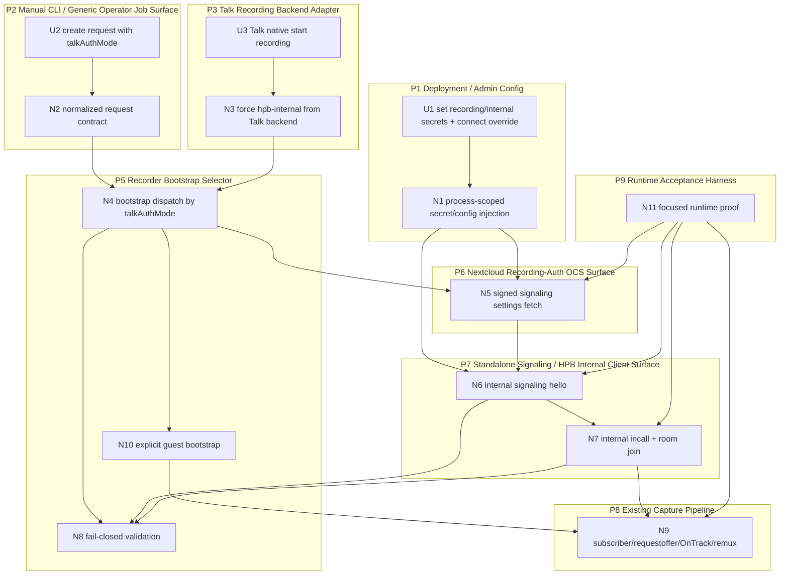

# D-283 — Breadboarding

Derived from:

- `planning/initiatives/mvp/D-283-nextcloud-internal-audio-capture/shaping.md`
- `planning/initiatives/mvp/D-283-nextcloud-internal-audio-capture/spike-subscriber-capture-under-internal-client.md`
- `planning/initiatives/mvp/D-283-nextcloud-internal-audio-capture/nextcloud_record_auth_gpt.md`

This breadboard details selected Shape A:

- dual-mode Talk bootstrap
- `hpb-internal` as the default
- explicit `guest-participant` fallback
- fail-closed behavior for unsupported/misconfigured deployments
- deployment-wide secrets for MVP
- reuse of the existing subscriber/requestoffer capture path

## Places

| ID | Place | Description |
|----|-------|-------------|
| P1 | Deployment / Admin Config | Trusted deployer-owned process config for operator/recorder secrets and alternate Nextcloud reachability. |
| P2 | Manual CLI / Generic Operator Job Surface | Existing Cassini entrypoints where a trusted caller can create a Nextcloud Talk recording job directly. |
| P3 | Talk Recording Backend Adapter | Existing Talk-backend-compatible surface in `cassini-operator` that receives native Talk recording lifecycle requests. |
| P4 | Operator Record Runtime | Normalizes requests, persists job intent, and launches `cassini record`. |
| P5 | Recorder Bootstrap Selector | `cassini-go-recorder` branch point that chooses guest bootstrap or HPB-internal bootstrap. |
| P6 | Nextcloud Recording-Auth OCS Surface | Nextcloud HTTP/OCS surface for fetching signaling settings as an allowed recording backend. |
| P7 | Standalone Signaling / HPB Internal Client Surface | Internal signaling `hello`, `internal/incall`, room join without `sessionid`, and MCU-backed subscription behavior. |
| P8 | Existing Capture Pipeline | Current room/participants discovery, subscriber creation, `requestoffer`, `OnTrack`, session-artifact writing, and remux. |
| P9 | Runtime Acceptance Harness | Later local proof path that enables internalsecret config and validates the internal bootstrap end to end. |

## UI Affordances

| Affordance | Place | User/Actor | Interaction | Wires Out |
|------------|-------|------------|-------------|-----------|
| **U1** | **P1 Deployment / Admin Config** | **Trusted deployer** | **Set `CASSINI_TALK_RECORDING_SECRET`, `CASSINI_TALK_SIGNALING_INTERNAL_SECRET`, and optional alternate Nextcloud reachability (`CASSINI_TALK_BACKEND_URL` / `--connect-url`).** | **N1** |
| **U2** | **P2 Manual CLI / Generic Operator Job Surface** | **Trusted caller** | **Create a Nextcloud Talk recording request with `talkAuthMode`, defaulting to `hpb-internal` and allowing explicit `guest-participant`.** | **N2** |
| **U3** | **P3 Talk Recording Backend Adapter** | **Talk moderator via native Talk recording UI** | **Start recording from Talk; operator builds an internal-mode Cassini job automatically.** | **N3** |

## Non-UI Affordances

| Affordance | Place | Mechanism | Wires Out |
|------------|-------|-----------|-----------|
| **N1** | **P1 Deployment / Admin Config** | **Process-scoped secret/config injection: reuse `CASSINI_TALK_RECORDING_SECRET`, add `CASSINI_TALK_SIGNALING_INTERNAL_SECRET`, and keep existing alternate-connect handling for Nextcloud HTTP reachability.** | **N5, N6, N8** |
| **N2** | **P2/P4 Manual CLI / Generic Operator Job Surface** | **Normalize/persist one request contract with `talkAuthMode`, target room identity, existing stop settings, and `guestName` retained only as local metadata in internal mode.** | **N4** |
| **N3** | **P3 Talk Recording Backend Adapter** | **Map Talk start requests into the same normalized contract, forcing `talkAuthMode=hpb-internal` and using `baseURL + roomToken` plus optional operator-only connect URL.** | **N4** |
| **N4** | **P5 Recorder Bootstrap Selector** | **Dispatch bootstrap by `talkAuthMode`: `hpb-internal` path by default, `guest-participant` only when explicitly selected.** | **N5, N10, N8** |
| **N5** | **P6 Nextcloud Recording-Auth OCS Surface** | **Fetch signaling settings through `GET /ocs/v2.php/apps/spreed/api/v3/signaling/settings?token=...` signed with recording-backend headers.** | **N6, N8** |
| **N6** | **P7 Standalone Signaling / HPB Internal Client Surface** | **Authenticate to standalone signaling with internal `hello` using `random` + HMAC over `internalsecret`.** | **N7, N8** |
| **N7** | **P7 Standalone Signaling / HPB Internal Client Surface** | **Send `internal/incall`, join the room without `sessionid`, and enter the same room/participants/message event stream used by the subscriber flow.** | **N9, N8** |
| **N8** | **P5/P7 Validation + Failure Surfacing** | **Fail closed when internal-mode prerequisites are missing or unsupported: missing secrets, missing signaling server, non-standalone signaling assumptions, or no MCU/HPB-capable path. No automatic guest fallback.** | |
| **N9** | **P8 Existing Capture Pipeline** | **Reuse current room/participants discovery, `ensureSubscriber`, `requestoffer`, `offer/answer`, `OnTrack`, session-artifact persistence, and remux output.** | |
| **N10** | **P5 Recorder Bootstrap Selector** | **Preserve the current guest bootstrap (`GetRoom`, `MarkParticipantActive`, `SetGuestName`, room join with `sessionid`, `JoinCall`) as an explicit fallback mode.** | **N9** |
| **N11** | **P9 Runtime Acceptance Harness** | **Later local/runtime proof path: add signaling `internalsecret` wiring to harness/deployment config and run a focused internal-bootstrap acceptance test.** | **N5, N6, N7, N9** |

## Wiring by Place

| Place | Wiring |
|-------|--------|
| **P1 Deployment / Admin Config** | **U1 → N1** (trusted process config provides secrets/connect overrides) |
| **P2 Manual CLI / Generic Operator Job Surface** | **U2 → N2** (trusted caller selects or accepts default `talkAuthMode`) |
| **P3 Talk Recording Backend Adapter** | **U3 → N3** (Talk-native recording lifecycle forces internal mode) |
| **P4 Operator Record Runtime** | **N2 → N4** (generic/manual path reaches bootstrap selector) **; N3 → N4** (Talk-backend path reaches the same selector) |
| **P5 Recorder Bootstrap Selector** | **N4 → N5** (internal settings fetch) **; N4 → N10** (explicit guest fallback) **; N4 → N8** (mode-specific validation/fail-closed behavior) |
| **P6 Nextcloud Recording-Auth OCS Surface** | **N1 → N5** (recording secret available) **; N5 → N6** (signaling URL/settings flow into internal signaling hello) |
| **P7 Standalone Signaling / HPB Internal Client Surface** | **N1 → N6** (internal secret available) **; N6 → N7** (internal signaling auth precedes room join) **; N7 → N9** (shared event/media path) **; N6/N7 → N8** (clear failure if signaling topology/support is wrong) |
| **P8 Existing Capture Pipeline** | **N10 → N9** (guest fallback enters the same media pipeline) **; N9** is the reusable subscriber/requestoffer/remux path for both modes |
| **P9 Runtime Acceptance Harness** | **N11 → N5/N6/N7/N9** (later focused proof of the internal bootstrap and reused media path) |

## Affordance notes

| Affordance | Note |
|------------|------|
| **N2** | `guestName` remains part of the request surface for compatibility, but in `hpb-internal` mode it should no longer drive Nextcloud guest/session lifecycle calls. |
| **N3** | The Talk-backend path should not require a caller-visible mode switch; it should force the selected default (`hpb-internal`) internally. |
| **N4 / N8 / N10** | Guest capture remains available, but only as an explicit mode choice. There is no silent retry from internal mode to guest mode. |
| **N1 / N2 / N3** | Internal-mode recording is a trusted/admin surface because process-scoped secrets allow privileged room access once the room token is known. |
| **N1 / N6** | MVP keeps one deployment-wide signaling internal secret; future signaling-URL→secret mapping can slot in behind the same config resolution seam. |
| **N7 / N9** | If runtime invalidation happens, the most likely repair area is event timing/payload handling between internal room join and subscriber creation, not the overall product shape. |
| **N11** | Harness work is intentionally deferred from shaping; it is now an acceptance/debugging concern rather than a pre-implementation blocker. |

## Main cutlines this breadboard implies

1. **Request/config surface**
   - add `talkAuthMode`
   - keep secrets in process config/env
   - keep alternate Nextcloud connect URL handling

2. **Internal bootstrap/auth path**
   - recording-auth signaling settings fetch
   - internal signaling `hello`
   - internal `incall` + room join without `sessionid`

3. **Shared media path + explicit fallback**
   - reuse subscriber/requestoffer capture pipeline
   - preserve guest mode as explicit fallback only
   - fail closed instead of auto-fallback

4. **Acceptance/debug path**
   - add harness `internalsecret` support later
   - run focused runtime proof against the internal bootstrap

## Implementation slicing

Implementation slicing for this breadboard now lives in:

- `planning/initiatives/mvp/D-283-nextcloud-internal-audio-capture/slices.md`

The resulting slice cutlines are:

- request/config surface
- internal bootstrap/auth implementation
- shared media-path integration + failure surfacing
- later harness/runtime acceptance
