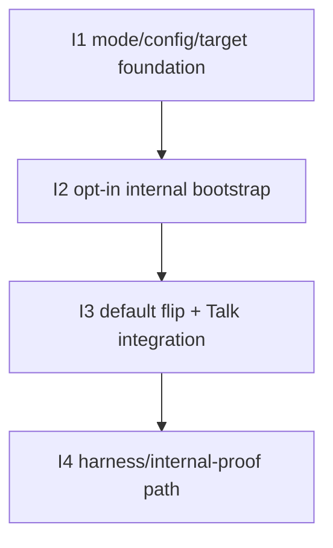

# D-283 — Slices

Derived from:

- `planning/initiatives/mvp/D-283-nextcloud-internal-audio-capture/shaping.md`
- `planning/initiatives/mvp/D-283-nextcloud-internal-audio-capture/breadboarding.md`
- `planning/initiatives/mvp/D-283-nextcloud-internal-audio-capture/spike-subscriber-capture-under-internal-client.md`
- `planning/initiatives/mvp/D-283-nextcloud-internal-audio-capture/nextcloud_record_auth_gpt.md`

This document is the ground truth for the D-283 implementation slices.

The shaped D-283 change is a **bootstrap/auth change**, not a new recorder architecture.
The selected shape is:

- dual-mode Talk bootstrap
- one cross-surface `talkAuthMode`
- `hpb-internal` as the final default
- explicit `guest-participant` fallback only
- process-scoped secrets with deployment-wide resolution in MVP
- native backend-triggered target identity of `baseURL + roomToken`
- reuse of the existing subscriber / `requestoffer` / `OnTrack` / remux path

## Carried-forward baseline (not a D-283 slice)

The following capabilities already exist and are reused rather than re-sliced as new D-283 work:

| Affordance | Status |
|-----------|--------|
| guest-participant Talk bootstrap in `cassini-go-recorder` | ✅ Exists |
| subscriber / `requestoffer` / `offer` / `answer` / `OnTrack` capture path | ✅ Exists |
| session-artifact persistence and multi-track MKV remux | ✅ Exists |
| direct `cassini record --call ...` entrypoint | ✅ Exists |
| generic operator `POST /jobs?provider=nextcloud-talk` flow | ✅ Exists |
| Talk recording-backend compatibility in `cassini-operator` | ✅ Exists |
| `CASSINI_TALK_RECORDING_SECRET` and `CASSINI_TALK_BACKEND_URL` deployment knobs | ✅ Exists |

What changes in D-283 is:

- how Talk recording bootstrap/auth is selected
- how the internal HPB path is configured and invoked
- where unsupported topology/auth failures surface
- when the default switches from guest capture to internal capture

## Implementation note

D-283 should extend the existing recorder/operator surfaces, not fork a second recording product path.

So the implementation direction is:

- keep `cassini record --call ...` as the user-facing CLI convenience shape
- add one internal/native Talk target representation for runtime work:
  - `baseURL`
  - `roomToken`
  - optional `callURL` for provenance/metadata
- let Talk-backend-triggered runs use that native target directly
- let `--call` parse into the same native target shape

## Selected workstreams

| # | Workstream | Final result |
|---|------------|--------------|
| S1 | Mode/config/target foundation | One honest cross-surface request/config contract exists for choosing Talk bootstrap mode and resolving the right secrets/room identity. |
| S2 | Internal HPB bootstrap | Cassini can join supported Nextcloud Talk rooms through recording-auth + internal signaling auth instead of guest lifecycle calls. |
| S3 | Shared media path + product integration | The internal bootstrap reuses the current subscriber/remux pipeline, becomes the default on the selected surfaces, and fails honestly without silent guest fallback. |
| S4 | Runtime acceptance/debug path | Local harness/deployment config and acceptance steps exist for focused proof and follow-up debugging if runtime invalidation appears. |

## Breadboard

The D-283 affordance map lives in:

- `planning/initiatives/mvp/D-283-nextcloud-internal-audio-capture/breadboarding.md`

That document is the truth for:

- places
- UI affordances
- non-UI affordances
- cross-system wiring

## Implementation slice summary

These slices are ordered so each one leaves behind a real, testable increment.

For MVP scope, **I4 is a validation/handoff slice rather than additional recorder/operator feature work**.
It is satisfied by harness/deployment wiring plus a runnable validation artifact:

- `planning/initiatives/mvp/D-283-nextcloud-internal-audio-capture/validation.md`

One slice intentionally uses a temporary cutline:

- **I1** introduces the internal-mode contract as an explicit opt-in while keeping guest mode as the effective default until the internal recorder path exists.
- **I3** flips the default to the selected final shape once the internal path is real.

| # | Slice | Workstream | New / changed affordances | Depends On | Verify after done |
|---|-------|------------|---------------------------|------------|-------------------|
| **I1** | **Mode/config/target foundation with explicit opt-in internal mode** | **S1** | **U1, U2, N1, N2, N4, N8, N10** | **—** | **CLI and operator requests can select `talkAuthMode=hpb-internal`, resolve the new secret/config surfaces, and fail clearly before guest join when internal prerequisites are missing.** |
| **I2** | **Opt-in internal HPB bootstrap on the shared capture pipeline** | **S2 + S3** | **N5, N6, N7, N9** | **I1** | **On an HPB-ready deployment, an explicit `hpb-internal` run joins through recording-auth + internal signaling auth and records through the existing subscriber/remux pipeline while explicit guest mode still works.** |
| **I3** | **Default flip + Talk-backend integration + honest failure surface** | **S1 + S3** | **U3, N3, N4, N8** | **I2** | **Direct CLI, generic operator jobs, and Talk-backend-triggered recordings all use `hpb-internal` by default or implicitly, with no silent fallback and with clear operator-visible failure reasons.** |
| **I4** | **Harness/internal-proof path + acceptance checklist** | **S4** | **N11** | **I3** | **The local harness/deployment path can supply an internal signaling secret and run a focused internal-bootstrap proof, with a documented checklist for debugging runtime invalidation.** |

## Affordance allocation by slice

| Affordance | Slice | Notes |
|------------|-------|-------|
| **U1** | **I1** | Trusted deployer adds the new secret/config surface. |
| **U2** | **I1** | Trusted caller gets explicit `talkAuthMode` selection before the default flips. |
| **U3** | **I3** | Talk-native start path should force the final default only after the internal path is real. |
| **N1** | **I1** | Process-scoped secret/config injection lands first. |
| **N2** | **I1** | Normalized request/target contract lands first. |
| **N3** | **I3** | Talk backend forces internal mode and uses native target identity. |
| **N4** | **I1, I2, I3** | First adds mode dispatch, then gains the real internal branch, then becomes default on the final surfaces. |
| **N5** | **I2** | Recording-auth signaling settings fetch is part of the real internal bootstrap. |
| **N6** | **I2** | Internal signaling `hello` lands with the internal bootstrap slice. |
| **N7** | **I2** | Internal `incall` + room join lands with the internal bootstrap slice. |
| **N8** | **I1, I3** | First lands as fail-closed validation, then expands to the final operator-visible failure surface after the default flip. |
| **N9** | **Baseline / reused in I2** | Existing subscriber/remux pipeline is reused, not redesigned. |
| **N10** | **Baseline / tightened in I1** | Guest bootstrap already exists; D-283 makes it explicit fallback only. |
| **N11** | **I4** | Harness/config proof is deliberately last and supports debugging rather than shaping. |

## Dependency tree

## Slice details

## I1: Mode/config/target foundation with explicit opt-in internal mode

### Objective

Create one honest cross-surface contract for D-283 without yet replacing the working guest default.

This slice introduces:

- `talkAuthMode`
- process-scoped secret/config resolution for internal mode
- native Talk target normalization for backend-triggered runs
- fail-closed validation for explicit internal-mode selection

### Why this slice exists

Before the internal bootstrap can work, Cassini needs one clean way to express:

- which Talk bootstrap mode is intended
- how the room is identified internally
- which secrets/config are required
- how misconfiguration is surfaced without silently dropping back to guest behavior

### Includes

- add `talkAuthMode` to direct `cassini record --call ...`
- add `talkAuthMode` to generic operator Nextcloud job requests and persisted request JSON
- introduce a native internal Talk target representation based on:
  - `baseURL`
  - `roomToken`
  - optional `callURL`
- keep `--call` as a wrapper that parses into that target representation
- add process-scoped internal-mode config resolution:
  - reuse `CASSINI_TALK_RECORDING_SECRET`
  - add `CASSINI_TALK_SIGNALING_INTERNAL_SECRET`
  - keep `--connect-url` / `CASSINI_TALK_BACKEND_URL`
- add bootstrap dispatch by `talkAuthMode`
- add fail-closed internal-mode validation before guest lifecycle calls begin
- tighten guest bootstrap to an explicit fallback mode rather than an implicit recovery path

### Activated wiring

- **U1 → N1**
- **U2 → N2**
- **N2 → N4**
- **N4 → N8**
- **N4 → N10** when explicit guest mode is chosen

### Temporary cutline

Until I2 lands:

- `hpb-internal` is an **explicit opt-in** mode
- existing guest mode remains the effective default on working execution surfaces
- selecting `hpb-internal` validates and fails honestly if the internal path is not yet runnable in the given deployment

The selected final default is deferred to I3 so we do not break the current working path before the internal bootstrap exists.

### Verify

1. Run `cassini record --call ... --talk-auth-mode hpb-internal` without the new internal secret and confirm a clear failure.
2. Run the same command with explicit `--talk-auth-mode guest-participant` and confirm the existing guest path is still selected.
3. Create a generic operator job with `talkAuthMode=hpb-internal` and confirm the normalized request JSON persists the selected mode and target identity honestly.
4. Confirm no internal-mode failure silently falls through into guest lifecycle calls.

### Acceptance criteria

- there is one named cross-surface selector for Talk bootstrap mode
- internal-mode secret/config resolution is process-scoped, not per-job
- backend-triggered runs no longer need to fabricate a user-facing call URL as their core runtime identity
- `--call` remains supported for direct CLI usage
- internal-mode selection fails clearly when required secrets/config are missing
- guest bootstrap remains available only by explicit selection

## I2: Opt-in internal HPB bootstrap on the shared capture pipeline

### Objective

Make explicit `hpb-internal` recording runs actually work on supported HPB deployments while reusing the existing capture pipeline.

### Why this slice exists

This is the core technical D-283 change.
The recorder must be able to:

- fetch signaling settings as a recording backend
- authenticate to standalone signaling as an internal client
- join without a Nextcloud participant session id
- then continue through the same subscriber/requestoffer/remux path Cassini already uses

### Includes

- signed Nextcloud signaling-settings fetch for recording-auth requests
- internal signaling `hello` request shape using the signaling internal secret
- internal `incall` request
- room join without `sessionid`
- recorder bootstrap split between guest and internal paths
- internal path skips guest OCS lifecycle calls:
  - `MarkParticipantActive`
  - `SetGuestName`
  - `JoinCall`
  - `LeaveCall`
  - `LeaveParticipantActive`
- internal path reuses the existing room/participants discovery and subscriber capture path
- explicit guest mode still uses the old bootstrap and the same downstream media path

### Activated wiring

- **N4 → N5 → N6 → N7 → N9**
- **N4 → N10 → N9** for explicit guest fallback

### Verify

1. On an HPB-ready deployment, start a direct CLI or generic operator run with `talkAuthMode=hpb-internal`.
2. Confirm Cassini fetches signaling settings through recording-auth headers.
3. Confirm Cassini authenticates to signaling as an internal client, sends `internal/incall`, and joins the room without `sessionid`.
4. Confirm the recorder discovers remote sessions and reuses the existing subscriber/requestoffer path.
5. Confirm per-participant session artifacts and final remux still work.
6. Confirm an explicit `guest-participant` run still follows the old bootstrap.

### Acceptance criteria

- internal mode no longer depends on guest/session lifecycle calls
- internal mode can reach standalone signaling through recording-auth + internal signaling auth
- internal mode joins rooms without a Nextcloud participant session id
- the existing subscriber/requestoffer/remux pipeline is reused rather than replaced
- explicit guest mode remains functional beside the internal mode
- any remaining runtime invalidation is narrowed to the internal bootstrap/event seam, not the overall product shape

## I3: Default flip + Talk-backend integration + honest failure surface

### Objective

Move from opt-in internal mode to the selected final product shape:

- internal mode is the default on the selected surfaces
- Talk-backend-triggered recordings force internal mode implicitly
- unsupported or misconfigured deployments fail honestly without silent fallback

### Why this slice exists

D-283 is not finished when internal mode merely exists.
The final product behavior is:

- `hpb-internal` is the normal path for supported Nextcloud Talk recordings
- Talk-native recording integration uses that path automatically
- guest capture survives only as an explicit fallback mode

### Includes

- flip direct CLI default to `talkAuthMode=hpb-internal`
- flip generic operator Nextcloud job default to `talkAuthMode=hpb-internal`
- make the Talk recording-backend adapter force `talkAuthMode=hpb-internal`
- ensure backend-triggered runs use native `baseURL + roomToken` identity plus optional call-URL provenance
- extend operator-visible error/failure surfacing for internal-mode failures, including clear distinction around:
  - missing internal secret/config
  - signaling settings fetch failure
  - internal signaling auth failure
  - missing signaling server / unsupported topology
  - no MCU/HPB-capable path
- keep explicit `guest-participant` available, but only when chosen intentionally
- preserve stop/finalization behavior when internal mode skips guest leave calls

### Activated wiring

- **U3 → N3 → N4**
- **N4 → N8** for fail-closed final behavior
- **N4 → N5 → N6 → N7 → N9** as the default path

### Verify

1. Run `cassini record --call ...` without specifying a mode and confirm it selects internal mode by default.
2. Create a generic operator Nextcloud job without specifying a mode and confirm it selects internal mode by default.
3. Start recording from Talk's native recording path and confirm the operator creates an internal-mode job automatically.
4. Intentionally misconfigure internal-mode prerequisites and confirm failures surface clearly without silently retrying guest mode.
5. Explicitly request `guest-participant` and confirm the legacy path still remains available.

### Acceptance criteria

- internal mode is the default for direct CLI and generic operator Nextcloud jobs
- Talk-backend-triggered recordings force internal mode implicitly
- no selected surface silently falls back from internal mode to guest mode
- explicit guest mode still works when intentionally selected
- operator-visible failures clearly identify internal-mode/bootstrap/topology problems
- the final D-283 behavior now matches the selected shaping decisions

## I4: Harness/internal-proof path + acceptance checklist

### Objective

Close D-283 with a focused validation/handoff artifact rather than more product-path implementation.

Add the focused local/runtime proof path and debugging checklist that D-283 will need if static assumptions are invalidated in practice.

### Why this slice exists

The user explicitly chose to proceed with shaping and implementation before a full local proof.
That means the implementation plan still needs one dedicated place for:

- harness/deployment config changes needed to exercise internal mode
- a focused acceptance path for supported HPB setups
- a debugging checklist for the likely runtime-invalidated seam

### Includes

- add harness/deployment support for signaling internal secret wiring
- publish the runnable handoff artifact in `planning/initiatives/mvp/D-283-nextcloud-internal-audio-capture/validation.md`
- document the minimal local proof path for internal-mode recording on HPB
- document the focused debugging checklist for runtime invalidation, especially around:
  - signaling settings fetch
  - internal `hello`
  - internal `incall`
  - room `join` / participants discovery events
  - subscriber creation / `requestoffer`
- keep the proof focused on supported HPB scope rather than broad local topology exploration

### Activated wiring

- **N11 → N5**
- **N11 → N6**
- **N11 → N7**
- **N11 → N9**

### Verify

1. Configure the local harness/deployment with an internal signaling secret.
2. Run the focused internal-mode proof path.
3. Confirm the recorder can at least be exercised through the full bootstrap sequence in a supported HPB setup.
4. If it fails, confirm the documented checklist identifies which bootstrap/event seam to inspect next.

### Acceptance criteria

- there is a documented and runnable local/internal proof path for D-283
- harness/deployment config can supply the internal signaling secret needed by the recorder
- the debugging checklist is narrow and aligned to the likely runtime-invalidated seam
- local proof work remains scoped to supported HPB deployments only
