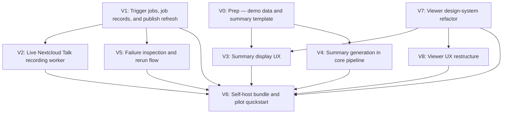

# MVP — Slices

Derived from `planning/initiatives/mvp/initiative.md`, selected shape **B: Webhook worker around the existing Cassini pipeline**.

This document breaks the remaining MVP work into delegable implementation slices. The existing viewer/library flow is a verified baseline, but V7 and V8 intentionally refactor the viewer shell in place before/alongside summary UX work.

## Verified baseline (not a slice)

The following affordances exist and are verified working in the current repo. They do not require a dedicated slice.

| Affordance | Status |
|-----------|--------|
| U1 meeting list | ✅ Exists |
| U2 meeting row | ✅ Exists |
| U3 empty library state | ✅ Exists |
| U4 audio player | ✅ Exists |
| U5 transcript search input | ✅ Exists |
| U6 transcript panel | ✅ Exists |
| U7 transcript segment | ✅ Exists |
| N10 `servePublishedFiles()` | ✅ Exists |
| N13 `fetchCatalog()` | ✅ Exists |
| N14 `loadMeetingArtifact()` | ✅ Exists (extended in V3 and V8) |
| N15 `filterTranscript(query)` | ✅ Exists |
| N16 `seekAudio(time)` | ✅ Exists |
| S3 `published site root` | ✅ Exists |

---

## Slice summary

| # | Slice | Mechanism | Depends On | Demo |
|---|-------|-----------|------------|------|
| V0 | Prep: summary template and dev demo data pull | — | — | Summary `.md` template committed; developer sets `DEMO_DATA_URL` in gitignored `.env`/`.envrc`; pull script fetches two full meetings; dev server starts against pulled data. |
| V1 | Trigger jobs, job records, and publish refresh | B2.1, B2.2, B3.3, B6.1 (partial) | — | `POST /jobs` creates a background job, `GET /jobs/:id` shows status, and a seeded artifact set is published into the library. |
| V2 | Live Nextcloud Talk recording worker | B3.1, B3.2 | V1 | Trigger a real Talk meeting job, let it finish, and see the new meeting appear in the hosted library. |
| V3 | Summary display UX | B5.2 | V0, V7 | Open a seed meeting in the viewer and see the summary rendered in a polished panel; open a meeting without a summary and see a clean fallback. |
| V4 | Summary generation in core pipeline | B5.1, B5.3, B5.4 | V0 | Run `cassini build` (or equivalent post-processing) on a meeting artifact and get a generated summary in the agreed template format alongside the transcript. |
| V5 | Failure inspection and rerun flow | B6.1, B6.2 | V1 | A failed job preserves logs/status, `POST /jobs/:id/rerun` requeues it, and a successful rerun updates the hosted output. |
| V6 | Self-host bundle and pilot quickstart | B1.1, B1.2, B7.1, B7.2 | V1, V2, V3, V4, V5, V7, V8 | A fresh operator can deploy the stack, trigger a meeting, and open the hosted library by following the docs only. |
| V7 | Viewer design-system refactor | B8.1, B8.2, B8.3 | — | Viewer runs on stock DaisyUI/Tailwind, light/dark themes both render coherently, and bespoke CSS is removed. |
| V8 | Viewer UX restructure | B9.1, B9.2, B9.3, B9.4 | V7 | Viewer becomes Meeting List + Meeting View, mobile swaps places cleanly, and URL/back/forward navigation works. |

---

## Dependency tree

### Hard dependencies

### Dependency table

| Slice | Depends on | Blocks |
|-------|-----------|--------|
| V0 | — | V3, V4 |
| V1 | — | V2, V5, V6 |
| V2 | V1 | V6 |
| V3 | V0, V7 | V6 |
| V4 | V0 | V6 |
| V5 | V1 | V6 |
| V6 | V1, V2, V3, V4, V5, V7, V8 | — |
| V7 | — | V3, V8, V6 |
| V8 | V7 | V6 |

### Concurrency plan

- **Start immediately in parallel:** V0, V1, V7
- **Start after V0:** V4
- **Start after V1:** V2, V5 (in parallel)
- **Start after V0 and V7:** V3
- **Start after V7:** V8
- **Start last:** V6

### Recommended delegation lanes

- **Lane A — Backend orchestration:** V1 → V2 → V5
- **Lane B — Viewer shell:** V7 → V8
- **Lane C — Summary track:** V0 → V3 (after V7) and V4 (after V0)
- **Lane D — Packaging/release:** V6 after all stabilize

---

## New affordances by slice

| Affordance | Slice |
|-----------|-------|
| U8 summary panel | V3 |
| U9 theme toggle | V7 |
| U10 back-to-list button | V8 |
| U11 desktop empty meeting-view state | V8 |
| N1 `POST /jobs` handler | V1 |
| N2 `validateTriggerRequest()` | V1 |
| N3 `job state` write | V1 |
| N4 job runner subscription | V1 |
| N5 `cassini doctor` | V2 |
| N6 `cassini record/build artifact` | V2 |
| N7 `buildMeetingSummary()` | V4 |
| N8 summary model/API call | V4 |
| N9 `refreshPublishedLibrary()` | V1 |
| N11 `GET /jobs/:id` | V1 |
| N12 `POST /jobs/:id/rerun` | V5 |
| N14 `loadMeetingArtifact()` | Extended in V3 and V8 |
| N17 `setTheme()` | V7 |
| N18 `syncThemeFromSystem()` | V7 |
| N19 `writeMeetingSelectionUrl()` | V8 |
| N20 `reconcileMeetingSelectionFromUrl()` | V8 |
| S1 `job records` | V1 |
| S2 `meeting artifacts` | V0 (seed), V1 (job state), populated live in V2, extended in V4 |
| S4 `theme mode` | V7 |
| S5 `localStorage['cassini-theme']` | V7 |
| S6 `browser URL/history` | V8 |

---

## Slice details

## V0: Prep — summary template and dev demo data pull

### Objective

Commit the summary markdown template that defines the MVP summary contract, and create a pull script that fetches two full meeting artifacts from a URL configured via `DEMO_DATA_URL` into a gitignored local path for dev/demo use.

### Why this slice exists

Meeting recordings and transcripts are too large to commit to the repo, but every downstream slice needs representative demo data to develop against. A committed summary template ensures the designer (V3) and the generation engineer (V4) target the same contract. V0 removes both blockers.

### Depends on

- None

### Delegate brief

**Prep slice: commit the summary template, host the demo data, build a pull script.**

Deliver:

- one summary markdown template (`.md`) committed to the repo with stable section headings that define the MVP summary shape — this is the contract that V3 renders and V4 generates against
- host two full meeting artifacts somewhere accessible (they may already be hosted) — each containing: recording (`.opus` or source audio), transcript (`transcript.words.v1.json`), readable transcript, captions, manifest, and a published static site output
- one hand-authored demo summary per meeting, written against the template, included with the hosted data
- the pull script reads `DEMO_DATA_URL` from the environment (e.g. set in a gitignored `.env` or `.envrc`) and **fails with a clear error if the variable is not set** — the URL is never committed to the repo
- the pull script fetches the hosted `catalog.json` and meeting data into a gitignored local path (e.g. `demo/` or `fixtures/meetings/`)
- an `.env.example` or `.envrc.example` is committed showing `DEMO_DATA_URL=` as a placeholder
- gitignore rules for the pulled data directory and for `.env`/`.envrc`
- a brief README or inline doc explaining: how to set `DEMO_DATA_URL`, how to pull, and the summary template sections

### Demo

- set `DEMO_DATA_URL` in `.env` or `.envrc`
- run the pull script
- `cassini serve` can be pointed at the pulled demo data and opens a working meeting library
- the summary template is a readable `.md` file in the repo
- the demo summaries are valid instances of that template, present in the pulled data
- running the pull script without `DEMO_DATA_URL` set prints a clear error and exits non-zero

### Likely code areas

- summary template file (committed)
- `.env.example` or `.envrc.example` (committed, with `DEMO_DATA_URL=` placeholder)
- pull script or `cassini dev` subcommand
- gitignore updates for pulled demo data path and `.env`/`.envrc`
- hosted meeting artifacts (identify or set up hosting)

### Acceptance criteria

- summary `.md` template committed with clear section structure
- `.env.example` or `.envrc.example` committed with `DEMO_DATA_URL=` placeholder
- two complete meeting artifacts are hosted and pullable
- the pull script reads `DEMO_DATA_URL` from the environment and fails clearly if unset
- the pull script fetches `catalog.json` and two meetings into a gitignored local path
- at least one hand-authored summary per meeting is included in the pulled data
- `cassini serve` works against the pulled data
- the pulled data directory and `.env`/`.envrc` are gitignored
- no meeting recordings, transcripts, or data URLs are committed to the repo

---

## V1: Trigger jobs, job records, and publish refresh

### Objective

Create the backend control surface: a small trigger API, persistent job records, and a worker that can publish seeded meeting artifacts into the hosted library.

### Why this slice exists

This establishes the operator flow and all the state we need for later live recording, summary, and reruns.

### Depends on

- None

### Added affordances

#### Code affordances

| # | Place | Component | Affordance | Control | Wires Out | Returns To |
|---|-------|-----------|------------|---------|-----------|------------|
| N1 | P1 | trigger-api | `POST /jobs` handler | call | → N2, → N3 | — |
| N2 | P1 | trigger-api | `validateTriggerRequest()` | call | — | → N1 |
| N3 | P1 | jobs | `job state` write | write | → S1 | → N4, → N11 |
| N4 | P1 | worker | job runner subscription | observe | → N3, → N9 | — |
| N9 | P1 | publisher | `refreshPublishedLibrary()` | call | → S2, → S3 | → N4 |
| N11 | P1 | trigger-api | `GET /jobs/:id` | call | → S1 | — |

#### Data stores

| # | Place | Store | Description |
|---|-------|-------|-------------|
| S1 | P1 | `job records` | Request payload, status, logs, and artifact paths for each trigger job. |
| S2 | P1 | `meeting artifacts` | Publish inputs available to the worker; initially this slice may use seeded artifacts rather than live-recorded ones. |

### Delegate brief

**Build the operator/backend skeleton.** For this slice, it is acceptable to seed `S2` from V0 demo data so the worker can prove background execution and publish refresh before live recording is wired in.

### Demo

- `POST /jobs` creates a job record and returns a job id
- worker picks up the job asynchronously
- `GET /jobs/:id` shows status transitions
- seeded meeting artifacts are published into the hosted library

### Likely code areas

- new trigger/worker surface in repo root or under a new package
- `cassini-go-recorder/internal/cassini/publish.go`
- persistent job state/log handling

---

## V2: Live Nextcloud Talk recording worker

### Objective

Replace the seeded-artifact shortcut with the real meeting capture path: the worker should run the existing Cassini pipeline against a real Talk URL.

### Why this slice exists

This is the step that proves the venture brief's core promise: trigger a real meeting, capture it, and have it land in the library without manual stitching.

### Depends on

- V1

### Added affordances

#### Code affordances

| # | Place | Component | Affordance | Control | Wires Out | Returns To |
|---|-------|-----------|------------|---------|-----------|------------|
| N5 | P1 | worker | `cassini doctor` | call | — | → N4 |
| N6 | P1 | worker | `cassini record/build artifact` | call | → S2 | → N4 |

### Delegate brief

**Wire the background job runner to the real Cassini capture/build path.** The endpoint contract from V1 stays the same; only the worker behavior changes from seeded artifact publishing to live meeting processing.

### Demo

- trigger a real Nextcloud Talk meeting job
- worker runs preflight and capture/build commands
- finished meeting artifact appears in `S2`
- publish refresh makes the new meeting appear in the hosted library

### Likely code areas

- worker orchestration around `./bin/cassini doctor` and `./bin/cassini record`
- artifact path management / resumable-state handling
- harness-backed E2E verification

---

## V3: Summary display UX

### Objective

Build the summary display UX in the viewer using the V0 demo data and summary template, on top of the V7 design-system foundation. The designer focuses purely on rendering and interaction — the template shape and demo content are already committed.

### Why this slice exists

This lets the designer focus on UX/UI without also having to define the summary format or prepare seed data — V0 already provides both, and V7 provides the styling/theming foundation.

### Depends on

- V0
- V7

### Added and changed affordances

#### UI affordances

| # | Place | Component | Affordance | Control | Wires Out | Returns To |
|---|-------|-----------|------------|---------|-----------|------------|
| U8 | P3 | viewer | summary panel | render | — | — |

#### Code affordances

| # | Place | Component | Affordance | Control | Wires Out | Returns To |
|---|-------|-----------|------------|---------|-----------|------------|
| N14 | P3 | viewer | `loadMeetingArtifact()` | call | → N10 | → U4, → U6, → U8, → N15 |

### Delegate brief

**Designer slice: build the summary display UX against V0 pulled demo data.**

Deliver:

- render the V0 summary template as a polished panel on the single meeting page
- design the summary display UX: layout, typography, section rendering
- handle the missing-summary fallback state gracefully
- keep the implementation compatible with the V7 DaisyUI/Tailwind foundation and the V8 Meeting View shell

### Demo

- open the viewer against V0 demo data
- open a meeting with a summary and see it rendered in a polished panel
- open a meeting without a summary and see a clean fallback state
- the rendering is faithful to the committed template structure

### Likely code areas

- `cassini-viewer/src/App.svelte`
- `cassini-viewer/src/viewer/loadArtifact.ts`
- viewer-side summary/markdown rendering path

---

## V4: Summary generation in core pipeline

### Objective

Extend the core Cassini post-processing pipeline to generate a summary artifact from a finished transcript, using the V0 template as the target format.

### Why this slice exists

Summary generation is a pipeline capability, not a jobs/worker concern. By targeting the core pipeline directly, this slice can be built and tested against any meeting artifact without needing the trigger/worker infrastructure.

### Depends on

- V0

### Added and changed affordances

#### Code affordances

| # | Place | Component | Affordance | Control | Wires Out | Returns To |
|---|-------|-----------|------------|---------|-----------|------------|
| N7 | P1 | pipeline | `buildMeetingSummary()` | call | → N8, → S2 | — |
| N8 | P1 | summary-provider | summary model/API call | call | — | → N7 |

#### Data stores

| # | Place | Store | Description |
|---|-------|-------|-------------|
| S2 | P1 | `meeting artifacts` | Extended so generated summaries use the same markdown template introduced in V0. |

### Delegate brief

**Extend the core Cassini pipeline with summary generation.** Generate a summary artifact from a finished transcript using an API-first LLM backend and the V0 template format. Do not redesign the template here — conform to the V0 contract.

Deliver:

- a summary generation step that takes a transcript and produces a summary in V0 template format
- API-first LLM backend (frontier model for MVP)
- the summary artifact is written alongside transcript artifacts in the meeting output
- clear fallback when summary generation is disabled or fails (no summary file, pipeline still succeeds)
- the generated summary is compatible with V3's viewer rendering without special-case handling

### Demo

- run `cassini build` (or equivalent post-processing) on a meeting artifact
- a summary file is generated in the V0 template format alongside the transcript
- the summary file can be opened by the V3 viewer and renders correctly
- disabling summary generation does not break the pipeline

### Likely code areas

- summary generation path near `cassini-readable` / post-processing pipeline
- artifact manifest/schema updates
- LLM API integration

---

## V5: Failure inspection and rerun flow

### Objective

Make failed jobs inspectable and recoverable without manual artifact repair.

### Why this slice exists

Without this slice, the system is demoable but not operator-friendly. This is the slice that turns the backend from "fire and forget" into something pilotable.

### Depends on

- V1

### Added and changed affordances

#### Code affordances

| # | Place | Component | Affordance | Control | Wires Out | Returns To |
|---|-------|-----------|------------|---------|-----------|------------|
| N12 | P1 | trigger-api | `POST /jobs/:id/rerun` | call | → N3, → N4 | — |
| N3 | P1 | jobs | `job state` write | write | → S1 | → N4, → N11, → N12 |
| N4 | P1 | worker | job runner subscription | observe | → N5, → N3, → N6, → N7, → N9 | — |

#### Data stores

| # | Place | Store | Description |
|---|-------|-------|-------------|
| S1 | P1 | `job records` | Extended to preserve failure reason, logs, and rerun inputs. |

### Delegate brief

**Harden the operator loop.** Assume the trigger/status surface already exists; extend it so failures preserve enough context for safe reruns.

### Demo

- force or reproduce a failing job
- inspect its persisted status/log path through the API
- rerun the same job via `POST /jobs/:id/rerun`
- verify that the recovered run updates the hosted output

### Likely code areas

- job persistence schema
- worker state machine / retry model
- API handlers for status and rerun

---

## V6: Self-host bundle and pilot quickstart

### Objective

Package the slices above into a deployable self-host story with docs that a real pilot operator can follow. This includes any final viewer/design polish needed for the packaged product.

### Why this slice exists

This is the MVP release slice: it turns working pieces into a reproducible deployment and a credible pilot artifact.

### Depends on

- V1
- V2
- V3
- V4
- V5
- V7
- V8

### Added affordances

No new product affordances. This slice packages and documents the existing P1/P2/P3 system as a deployable MVP.

### Delegate brief

**Produce the self-host bundle and quickstart docs.** The output should be good enough that a new operator can deploy and run the system without needing repo archaeology. Include any final viewer/design polish or branding needed for the packaged release.

### Demo

- start from a clean environment
- deploy the stack using the documented bundle
- trigger a meeting job
- open the hosted library and see the resulting meeting page
- confirm the split Meeting List / Meeting View shell and theme behavior are present in the packaged release
- docs clearly state hardware expectations, auth/reverse-proxy responsibility, storage ownership, and out-of-scope items

### Likely code areas

- deployment bundle / compose files / service definitions
- root docs and operator quickstart docs
- environment/config templates
- any final viewer polish for the packaged release

---

## V7: Viewer design-system refactor

### Objective

Refactor the viewer from bespoke CSS to stock DaisyUI + Tailwind, add light/dark theming with a persisted user toggle, and preserve existing interaction behavior while keeping `App.svelte` as one file.

### Why this slice exists

The viewer is still small enough to refactor in place. Doing the design-system swap now gives the rest of MVP a stable styling/theming foundation instead of compounding bespoke CSS.

### Depends on

- None

### Added and changed affordances

#### UI affordances

| # | Place | Component | Affordance | Control | Wires Out | Returns To |
|---|-------|-----------|------------|---------|-----------|------------|
| U9 | P2 | viewer | theme toggle | click | → N17 | — |

#### Code affordances

| # | Place | Component | Affordance | Control | Wires Out | Returns To |
|---|-------|-----------|------------|---------|-----------|------------|
| N17 | P2 | viewer | `setTheme(nextTheme)` | call | → S4, → S5 | → U9 |
| N18 | P2 | viewer | `syncThemeFromSystem()` | observe | → S4 | → U9 |

#### Data stores

| # | Place | Store | Description |
|---|-------|-------|-------------|
| S4 | P2 | `theme mode` | Active theme state for the viewer. |
| S5 | P2 | `localStorage['cassini-theme']` | Persisted explicit user theme preference. |

### Delegate brief

**Refactor the viewer shell to stock DaisyUI/Tailwind without changing its behavior.**

Deliver:

- install Tailwind + DaisyUI + postcss/vite wiring
- replace bespoke CSS in `App.svelte` with stock DaisyUI primitives and Tailwind utilities, in place
- add a sidebar theme toggle that defaults to `prefers-color-scheme` and persists explicit user choice to `localStorage['cassini-theme']`
- remove the bespoke `<style>` block(s) and retire the old radial-gradient / serif palette
- preserve the DOM structure, event handlers, and script state as much as possible so this remains a styling/theming refactor, not a product redesign

### Demo

- open the viewer and confirm stock DaisyUI visual identity replaces the older bespoke palette
- switch light/dark theme from the sidebar toggle
- reload and confirm explicit preference persists
- clear `localStorage['cassini-theme']`, reload, and confirm system theme is respected
- verify existing interaction behaviors still work: catalog selection, transcript click-to-seek, player controls, auto-scroll, exact-words toggle, warnings, metadata disclosure

### Likely code areas

- `cassini-viewer/src/App.svelte`
- `cassini-viewer/src/app.css`
- `cassini-viewer/vite.config.ts`
- `cassini-viewer/tailwind.config.js` (new)
- `cassini-viewer/postcss.config.js` (new)
- `cassini-viewer/package.json`
- `cassini-viewer/index.html`

---

## V8: Viewer UX restructure

### Objective

Split the viewer into Meeting List and Meeting View places, make the URL the navigation source of truth, and add a mobile-friendly back-to-list flow while keeping `App.svelte` as one file.

### Why this slice exists

The current single sidebar/content layout works on desktop but degrades on narrow screens. Separating list and viewing contexts makes the mobile flow natural and fixes browser back/deep-link behavior.

### Depends on

- V7

### Added and changed affordances

#### UI affordances

| # | Place | Component | Affordance | Control | Wires Out | Returns To |
|---|-------|-----------|------------|---------|-----------|------------|
| U10 | P3 | viewer | back-to-list button | click | → N19 | → U1 |
| U11 | P3 | viewer | desktop empty meeting-view state | render | — | — |

#### Code affordances

| # | Place | Component | Affordance | Control | Wires Out | Returns To |
|---|-------|-----------|------------|---------|-----------|------------|
| N19 | P2/P3 | viewer | `writeMeetingSelectionUrl()` | call | → S6 | → N14, → U1 |
| N20 | P2/P3 | viewer | `reconcileMeetingSelectionFromUrl()` | observe | → S6, → N14 | → U1, → P3 |
| N14 | P3 | viewer | `loadMeetingArtifact()` | call | → N10 | → U4, → U6, → U8, → N15 |

#### Data stores

| # | Place | Store | Description |
|---|-------|-------|-------------|
| S6 | P2/P3 | `browser URL/history` | `?meeting=<id>` + optional `#t=<ms>` and browser history state used to reconcile list/view navigation. |

### Delegate brief

**Restructure the viewer shell in place around Meeting List and Meeting View.**

Deliver:

- split `App.svelte` into two sibling regions: `meeting-list` and `meeting-viewer`
- keep them side-by-side on desktop and render one at a time on mobile
- add a sticky mobile back-to-list affordance inside Meeting View
- move URL writes to `pushState` for user selections, keep `replaceState` for initial hydration, and reconcile on `popstate`
- preserve deep linking with `?meeting=<id>` and `#t=<ms>`
- anchor the player to the bottom edge of Meeting View and show a minimal desktop empty state when nothing is selected
- keep everything inline in `App.svelte`; this is not a componentization slice

### Demo

- on desktop, confirm side-by-side Meeting List + Meeting View with a clean empty state when nothing is selected
- on mobile, confirm Meeting List is the default, selecting a meeting transitions into Meeting View, and back-to-list returns cleanly
- refresh on a meeting URL and confirm the same meeting loads
- use browser back/forward after in-app selection and confirm it navigates between list/view states instead of exiting the SPA
- verify audio stops when returning to list and the player remounts cleanly for a different meeting

### Likely code areas

- `cassini-viewer/src/App.svelte`

---

## Suggested developer assignment plan

| Developer | Start with | Then take |
|-----------|------------|-----------|
| Lead / PM | V0 | — |
| Dev A | V1 | V2 → V5 |
| Designer / FE | V7 | V8 → V3 (after V0) |
| Dev B | V4 (after V0) | V6 |

If only two engineering developers plus a designer are available:

- **Dev A:** V1 → V2 → V5
- **Dev B:** V0 → V4 → V6
- **Designer / FE:** V7 → V8 → V3 (after V0)

---

## Notes on slice boundaries

- The publish/serve/browser baseline is still verified and valuable, but V7 and V8 are now active viewer-shell slices rather than “already done” work.
- V0 is a small prep slice that unblocks both the designer (V3) and the summary generation engineer (V4) with a committed summary template and pullable demo data. No meeting data is committed to the repo.
- V1 intentionally uses **seeded artifacts** (from V0) as an intermediate step so the job/control plane can be built before live capture is ready.
- V7 is the design-system foundation and blocks V3. It preserves App.svelte structure/behavior while swapping styling and theming onto DaisyUI/Tailwind.
- V8 reshapes the viewer shell after V7 by splitting Meeting List / Meeting View and making the URL/history the navigation source of truth.
- V3 is focused purely on **summary display UX** — the template definition and demo data are provided by V0, and the styling/theming foundation is provided by V7.
- V4 extends the **core Cassini pipeline** with summary generation. It does not depend on the jobs/worker infrastructure (V1/V2) because summary generation is a pipeline capability, not a worker concern.
- V5 depends on V1 because rerun/status semantics belong to the job system. It can be exercised with synthetic failures before live recording is fully stable.
- V6 is intentionally last because packaging too early would freeze unstable boundaries. It includes the final viewer shell state from V7/V8 plus any final release polish.
