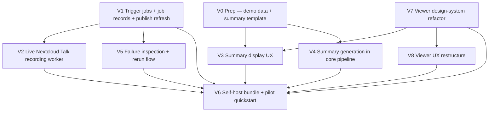

# MVP — Tickets

Source of truth for slice definitions: `planning/initiatives/mvp/slices.md`

This document extracts delegable tickets from the slices doc and rewrites them in a tracking-friendly format. V7 and V8 are included verbatim from Linear.

## Dependency overview

## Dependency table

| Slice | Depends on | Blocks |
|-------|-----------|--------|
| V0 | — | V3, V4 |
| V1 | — | V2, V5, V6 |
| V2 | V1 | V6 |
| V3 | V0, V7 | V6 |
| V4 | V0 | V6 |
| V5 | V1 | V6 |
| V6 | V1, V2, V3, V4, V5, V7, V8 | — |
| V7 | — | V3, V8, V6 |
| V8 | V7 | V6 |

## Suggested execution lanes

- **Backend lane:** V1 → V2 → V5
- **Viewer shell lane:** V7 → V8
- **Summary lane:** V0 → V3 (after V7) and V4 (after V0)
- **Release lane:** V6

## Verified baseline (no ticket needed)

The publish/serve/browser baseline is verified working: meeting list, single-meeting page, audio playback, transcript click-to-seek, transcript search. The next viewer updates are the summary display UX (V3), design-system/theme refactor (V7), and Meeting List / Meeting View restructure (V8).

---

## Ticket V0 — Prep: summary template and dev demo data pull

**Title**
- Commit MVP summary template and create demo data pull mechanism

**Type**
- Prep / Foundation

**Summary**
- Commit a summary markdown template to the repo and create a pull script that fetches two full meeting artifacts from a URL configured via `DEMO_DATA_URL` into a gitignored local path. Downstream slices (V3 designer UX, V4 summary generation, V1 seeded jobs) all work against the same pulled data.

**Why this matters**
- Meeting recordings and transcripts are too large to commit, but every downstream slice needs representative demo data. A committed summary template ensures the designer and the generation engineer target the same contract. V0 removes both blockers.

**Problem statement**
- The repo has no committed summary artifact shape and no convenient way to get representative demo meeting data for local development.

**Scope**
- Define and commit one summary markdown template (`.md`) with stable section headings that define the MVP summary shape
- Host two full meeting artifacts somewhere accessible (they may already be hosted), each containing: recording (`.opus` or source audio), transcript (`transcript.words.v1.json`), readable transcript, captions, manifest, and published static site output
- Include one hand-authored demo summary per meeting (written against the template) in the hosted data
- Create a pull script (e.g. `cassini dev pull-demo` or a shell script) that reads `DEMO_DATA_URL` from the environment and fetches the hosted `catalog.json` and meeting data into a gitignored local path (e.g. `demo/` or `fixtures/meetings/`)
- The pull script **fails with a clear error if `DEMO_DATA_URL` is not set** — the URL is never committed
- Commit an `.env.example` or `.envrc.example` with `DEMO_DATA_URL=` as a placeholder
- Add gitignore rules for the pulled data directory and for `.env`/`.envrc`
- Add a brief README or inline doc explaining: how to set `DEMO_DATA_URL`, how to pull, and the summary template sections

**Out of scope**
- LLM-generated summaries
- Viewer UI changes
- Trigger/worker infrastructure
- Deployment packaging

**Dependencies**
- None

**Acceptance criteria**
- A summary `.md` template is committed with clear, stable section structure
- An `.env.example` or `.envrc.example` is committed with `DEMO_DATA_URL=` placeholder
- Two complete meeting artifacts are hosted and pullable
- The pull script reads `DEMO_DATA_URL` from the environment and fails clearly if unset
- The pull script fetches `catalog.json` and two meetings into a gitignored local path
- At least one hand-authored summary per meeting is included in the pulled data
- `cassini serve` works against the pulled data
- The pulled data directory and `.env`/`.envrc` are gitignored
- No meeting recordings, transcripts, or data URLs are committed to the repo
- The pull instructions are documented

**Demo / QA checklist**
- Clone the repo or check out the branch
- Copy `.env.example` to `.env` and set `DEMO_DATA_URL`
- Run the pull script
- Run `cassini serve` against the pulled demo data path
- Open the meeting library and verify both meetings load correctly
- Inspect the summary template (committed) and demo summaries (pulled)
- Run the pull script without `DEMO_DATA_URL` set and verify it fails with a clear message

**Likely code areas**
- Summary template file (committed)
- `.env.example` or `.envrc.example` (committed)
- Pull script or `cassini dev` subcommand
- Gitignore updates for pulled demo data path and `.env`/`.envrc`
- Hosted meeting artifacts (identify or set up hosting)
- README or doc for the demo data

**Implementation notes**
- Use real production meeting data if available and appropriate, otherwise use harness-generated meetings
- Keep the summary template deliberately simple — stable headings, no complex nested structures
- This is intentionally a small, fast slice that unblocks two parallel tracks

**Traceability**
- Slice: V0
- Blocks: V3, V4

---

## Ticket V1 — Trigger jobs, job records, and publish refresh

**Title**
- Build trigger API, background job records, and publish refresh flow

**Type**
- Feature

**Summary**
- Create the backend control surface for MVP: accept a meeting trigger request, persist job state, run work asynchronously, and refresh the published site from seeded artifacts.

**Why this matters**
- This establishes the operator flow and state model needed by later live recording and rerun/recovery work.

**Problem statement**
- Right now there is no lightweight operator-facing control surface that starts work in the background and exposes job state.

**Scope**
- Implement a trigger API endpoint to create jobs
- Validate incoming requests
- Persist job records with request payload, state, and artifact references
- Implement background worker pickup of queued jobs
- Refresh the published site from seeded meeting artifacts (V0 demo data or equivalent)
- Implement job status retrieval endpoint

**Out of scope**
- Real Nextcloud Talk capture
- Summary generation
- Rerun endpoint
- Deployment packaging

**Dependencies**
- None

**Acceptance criteria**
- A `POST /jobs` request creates a background job and returns a job identifier
- The system persists job state transitions
- A background worker picks up created jobs asynchronously
- Seeded meeting artifacts can be published into the hosted library through this job flow
- A `GET /jobs/:id` endpoint returns current job status and relevant metadata

**Demo / QA checklist**
- Submit a trigger request
- Observe a persisted job record
- Confirm the worker processes the job asynchronously
- Confirm status transitions are visible through the status endpoint
- Confirm seeded artifacts appear in the published library after refresh

**Likely code areas**
- trigger/worker service code (new)
- `cassini-go-recorder/internal/cassini/publish.go`
- persistent job state/log handling

**Implementation notes**
- Use seeded artifacts deliberately so this slice can ship before live recording
- Keep the worker thin and orchestration-focused
- Preserve enough job metadata now so later rerun/recovery work has a clean foundation

**Traceability**
- Slice: V1
- Affordances: N1, N2, N3, N4, N9, N11, S1, S2

---

## Ticket V2 — Live Nextcloud Talk recording worker

**Title**
- Wire background jobs to real Nextcloud Talk capture

**Type**
- Feature

**Summary**
- Replace the seeded-artifact shortcut in the worker with the real Cassini meeting capture/build path for Nextcloud Talk.

**Why this matters**
- This is the first slice that proves the core product promise: trigger a real meeting, process it, and get it into the library without manual stitching.

**Problem statement**
- The job/control plane can exist with seeded artifacts, but MVP needs the same flow to work against real Talk meetings.

**Scope**
- Run preflight validation before expensive work starts
- Run the existing Cassini recording/build path from the worker
- Persist resulting meeting artifacts in the publish input area
- Ensure publish refresh makes new meetings appear in the viewer library
- Validate the full path against a real Talk room / harness-backed environment

**Out of scope**
- Summary generation
- Rerun/recovery enhancements beyond basic job completion/failure
- Packaging/docs work

**Dependencies**
- V1

**Acceptance criteria**
- A queued job can target a real Nextcloud Talk meeting URL
- The worker runs the existing Cassini preflight and capture/build path
- The resulting meeting artifact is stored in the publish input area
- Publish refresh makes the newly processed meeting appear in the hosted library
- The flow is demonstrable against a real or harness-backed Talk meeting

**Demo / QA checklist**
- Trigger a real meeting job
- Observe worker preflight and capture/build execution
- Confirm a new meeting artifact lands in storage
- Confirm the published library shows the new meeting
- Open the new meeting in the viewer

**Likely code areas**
- worker orchestration around `./bin/cassini doctor` and `./bin/cassini record`
- artifact path management / resumable-state handling
- harness-backed E2E verification

**Implementation notes**
- Keep the endpoint contract from V1 stable; only the worker internals should shift from seeded to live processing
- Reuse the existing Cassini CLI/artifact flow instead of rebuilding it in-process

**Traceability**
- Slice: V2
- Affordances: N5, N6, S2

---

## Ticket V3 — Summary display UX

**Title**
- Build the summary display UX in the viewer

**Type**
- Feature / Design

**Summary**
- Implement the summary panel and display UX in the viewer using V0's committed demo data and summary template. The designer focuses purely on rendering and interaction — the template shape and demo content are already in the repo, and V7 provides the design-system foundation.

**Why this matters**
- This gives the viewer a polished summary presentation that backend generation (V4) can target without reopening design decisions.

**Problem statement**
- The viewer has no summary rendering. The template and demo data exist (V0), but nothing displays them yet.

**Scope**
- Render the V0 summary template as a polished panel on the single meeting page
- Design the summary display UX: layout, typography, section rendering
- Handle missing-summary fallback gracefully
- Polish the overall viewer UX as needed for summary integration
- Keep the implementation compatible with the V7 DaisyUI/Tailwind foundation

**Out of scope**
- Defining the summary template (done in V0)
- Preparing demo/seed data (done in V0)
- Real LLM summary generation
- Worker/trigger integration
- Building a new static server (existing one is verified working)

**Dependencies**
- V0
- V7

**Acceptance criteria**
- The single-meeting page renders the summary in a polished panel
- Missing-summary behavior is handled gracefully
- The rendering is faithful to the V0 template structure
- The designer can work entirely against V0 pulled demo data with `cassini serve` or `npm run dev`

**Demo / QA checklist**
- Start the viewer against V0 demo data
- Open a meeting that contains a summary
- Confirm the summary renders in the intended UI
- Confirm fallback behavior when a meeting has no summary

**Likely code areas**
- `cassini-viewer/src/App.svelte`
- `cassini-viewer/src/viewer/loadArtifact.ts`
- viewer-side summary/markdown rendering path

**Implementation notes**
- The summary contract is owned by V0 — render it faithfully, do not redefine the structure
- The existing static serve path works — use `cassini serve` or `npm run dev` against V0 data
- Treat V7 as the styling/theming foundation for this ticket

**Traceability**
- Slice: V3
- Affordances: U8, N14

---

## Ticket V4 — Summary generation in core pipeline

**Title**
- Extend the Cassini pipeline to generate meeting summaries

**Type**
- Feature

**Summary**
- Add summary generation to the core Cassini post-processing pipeline. Given a finished transcript, produce a summary artifact in the V0 template format using an API-first LLM backend. This is a pipeline capability — it does not depend on the jobs/worker infrastructure.

**Why this matters**
- This completes the summary generation capability so that any processed meeting can include a summary, whether triggered manually or through the worker.

**Problem statement**
- The pipeline produces transcripts but not summaries. We need generation that conforms to the agreed V0 template so the V3 viewer just works.

**Scope**
- Generate summary artifacts from finished meeting transcripts
- Use the V0 summary template as the target format
- API-first LLM backend (frontier model for MVP)
- Write the summary artifact alongside transcript artifacts in meeting output
- Clear fallback when summary generation is disabled or fails (no summary file, pipeline succeeds)
- Generated summaries must be compatible with V3 viewer rendering

**Out of scope**
- Redesigning the summary template or viewer UX
- Building a general chat/RAG interface
- Multiple summary formats
- Worker/trigger integration (that's V1/V2 territory)

**Dependencies**
- V0

**Acceptance criteria**
- Running the pipeline on a meeting artifact produces a summary in V0 template format
- The generated summary renders correctly in the V3 viewer
- Disabling summary generation does not break the pipeline
- The summary is written alongside existing transcript artifacts

**Demo / QA checklist**
- Run `cassini build` (or equivalent) on a V0 demo meeting artifact
- Confirm a summary file is generated in the agreed format
- Open the result in the V3 viewer and confirm rendering
- Disable summary generation and confirm the pipeline still succeeds

**Likely code areas**
- summary generation path near `cassini-readable` / post-processing pipeline
- artifact manifest/schema updates
- LLM API integration

**Implementation notes**
- Treat V0 as the contract owner for summary structure
- This is a pipeline extension, not a worker feature — it should work with `cassini build` directly
- Keep the LLM integration simple: one model, one prompt, one format

**Traceability**
- Slice: V4
- Affordances: N7, N8, S2

---

## Ticket V5 — Failure inspection and rerun flow

**Title**
- Add failed-job inspection and rerun capability

**Type**
- Feature

**Summary**
- Extend the job system so failed runs preserve enough state for inspection and can be rerun safely through an operator-facing API.

**Why this matters**
- Without this, the system remains a demo pipeline rather than a pilotable operator workflow.

**Problem statement**
- The trigger/job surface needs a recovery loop: failure details, persisted logs, and a safe rerun path.

**Scope**
- Persist failure reason, logs, and rerun inputs in job records
- Add a rerun endpoint for existing jobs
- Ensure rerun updates status transitions cleanly
- Ensure successful reruns refresh hosted output correctly

**Out of scope**
- New UI dashboards beyond the API/status surface
- Packaging/release work
- Summary design/generation changes except where needed for retry safety

**Dependencies**
- V1

**Acceptance criteria**
- Failed jobs persist enough detail for inspection through the API
- A rerun endpoint can requeue a failed job safely
- Rerun status transitions are visible in persisted job state
- A successful rerun updates the hosted output as expected

**Demo / QA checklist**
- Force or reproduce a failing job
- Inspect its failure details via persisted job state/API
- Trigger a rerun
- Confirm the rerun completes and updates hosted output

**Likely code areas**
- job persistence schema
- worker state machine / retry model
- API handlers for status and rerun

**Implementation notes**
- Keep rerun semantics explicit: reuse preserved context where safe, avoid hidden behavior
- This is operator hardening, not just backend plumbing

**Traceability**
- Slice: V5
- Affordances: N12, N3, N4, S1

---

## Ticket V6 — Self-host bundle and pilot quickstart

**Title**
- Package the MVP for self-hosting and write pilot quickstart docs

**Type**
- Feature / Release

**Summary**
- Turn the completed slices into a reproducible self-hosted MVP with a documented operator path from deployment to triggered meeting to hosted library consumption. Includes any final viewer/design polish needed for the packaged release.

**Why this matters**
- This is the release slice that makes the MVP credible for pilots rather than only usable by repo insiders.

**Problem statement**
- The repo may contain all the ingredients, but operators need one deployable bundle and one documented quickstart path.

**Scope**
- Produce the self-host deployment bundle
- Define service configuration and environment templates
- Document the operator quickstart from clean environment to usable hosted library
- Document hardware expectations and model/runtime requirements
- Document auth/reverse-proxy responsibility and storage ownership
- Document MVP exclusions and operational boundaries
- Final viewer/design polish for the packaged release

**Out of scope**
- New product features
- Major architecture changes to stabilize packaging
- Marketplace/store packaging beyond what is required for a self-host pilot

**Dependencies**
- V1
- V2
- V3
- V4
- V5
- V7
- V8

**Acceptance criteria**
- A fresh operator can deploy the MVP from a clean environment using the documented bundle
- The operator can trigger a meeting job and open the resulting hosted library
- Docs clearly state hardware/runtime expectations
- Docs clearly state auth/reverse-proxy responsibility, storage ownership, and out-of-scope items
- The packaged release includes the V7/V8 viewer shell state

**Demo / QA checklist**
- Start from a clean environment
- Deploy the stack using the documented steps only
- Trigger a meeting job
- Open the hosted library and meeting page
- Verify that no hidden repo archaeology is required

**Likely code areas**
- deployment bundle / compose files / service definitions
- root docs and operator quickstart docs
- environment/config templates

**Implementation notes**
- Keep this ticket last so packaging reflects stable boundaries
- Favor one clean operator path over documenting many equivalent internal paths

**Traceability**
- Slice: V6
- Affordances: packaging/docs slice, no new product affordances

---

## Ticket V7 — Viewer design-system refactor: stock DaisyUI + light/dark theme

Source: Linear D-248

## Summary

Migrate the viewer from bespoke CSS + scoped `<style>` blocks to stock DaisyUI (on Tailwind), add light + dark mode with a user toggle. In-place migration — no componentization, no DOM restructure.

## Why this matters

The viewer is still small. Setting a solid styling foundation now is cheaper than retrofitting it later as the app grows. V3 ships fine either way — this isn't a blocker, it's groundwork.

## Problem statement

The viewer's styling is handwritten CSS in one scoped `<style>` block — ~100 bespoke selectors, no theme layer, no shared primitives, no light/dark mode. It works today, but every new feature will either extend the bespoke vocabulary or drift from it. Replacing it with a shared design system while the surface is still small is the opportunity.

## Scope

* Install Tailwind + DaisyUI + postcss; wire Vite.
* Enable stock DaisyUI `light` + `dark` themes via `<html data-theme>`.
* Inline theme-toggle markup in `App.svelte`'s sidebar (**bottom-left**) — not a new component.
* Default to `prefers-color-scheme`; persist explicit user choice to `localStorage['cassini-theme']`.
* Migrate all bespoke CSS in App.svelte's `<style>` block to Tailwind utilities + Daisy primitives (`card`, `badge`, `btn`, `alert`, `menu`, `range`, `toggle`, `collapse`), **in place** — no DOM restructure.
* Retire `app.css` radial-gradient background + Georgia/Trebuchet font stack in favour of Daisy defaults.
* Remove the `<style>` block from App.svelte entirely.
* Retire the warm cream palette; viewer adopts stock DaisyUI visual identity.

## Out of scope

* Componentization — Masthead, MeetingCatalog, TranscriptPane, etc. stay inside App.svelte. Deferred to future work.
* Component-level test infrastructure (`@testing-library/svelte`, jsdom/happy-dom).
* Custom DaisyUI theme authoring.
* Mobile / responsive UX improvements.
* Collapsible sidebar / drawer patterns.
* Any interaction or layout changes — all existing behaviours must be preserved exactly.

## Dependencies

None. **Blocks V3** (summary panel).

## Acceptance criteria

* Zero bespoke CSS selectors remain in `src/` — Tailwind + stock DaisyUI only (verified by grep).
* No `<style>` blocks in any `.svelte` file.
* `src/app.css` contains only `@tailwind` directives + DaisyUI plugin config.
* Light and dark themes both render coherently across masthead, sidebar, transcript, metadata, and player.
* Theme toggle present in sidebar bottom-left; default respects `prefers-color-scheme`; user preference persists across reload.
* App.svelte's DOM structure, event handlers, and script state are unchanged — only `class` attributes differ.
* All existing vitest suites pass (`core/timing`, `core/transcript`, `viewer/catalog`, `viewer/loadArtifact`, `viewer/portable`).
* `npm run audit:portable-token` passes against a known sample meeting; before/after diff for the transcript migration step is clean.
* `npm run build` produces a bundle; CSS bundle size recorded in PR for regression tracking.

## Demo / QA checklist

- [ ] Open viewer; confirm stock DaisyUI visual identity (no cream/serif palette).
- [ ] Click theme toggle in sidebar bottom-left → theme flips light↔dark.
- [ ] Reload → user theme preference persists.
- [ ] Clear `localStorage['cassini-theme']` + reload → theme matches OS `prefers-color-scheme`.
- [ ] Click 5–10 known tokens in a sample meeting; confirm click-to-seek jumps to the intended word (manual walkthrough — results attached to PR description).
- [ ] Play / pause / seek via timeline slider all function.
- [ ] Auto-scroll switch engages / disengages; wheel scroll shows "Auto-scroll paused" indicator.
- [ ] Exact-words toggle flips readable vs. exact transcript mode.
- [ ] Meeting catalog selection loads the selected meeting; active meeting shows selected state.
- [ ] Warning banner renders on load failures.
- [ ] Metadata `
` sections expand / collapse.

## Likely code areas

* `cassini-viewer/src/App.svelte` — the whole file: class attributes changed, `<style>` block removed, theme-toggle markup added in sidebar.
* `cassini-viewer/src/app.css` — rewritten as `@tailwind` directives + DaisyUI plugin config.
* `cassini-viewer/vite.config.ts` — Tailwind plugin registered.
* `cassini-viewer/tailwind.config.js` (new).
* `cassini-viewer/postcss.config.js` (new).
* `cassini-viewer/package.json` — devDeps: `tailwindcss`, `daisyui`, `@tailwindcss/vite` (or `postcss` + `autoprefixer`).
* `cassini-viewer/index.html` — bootstrap script to set `<html data-theme>` before Svelte mounts (avoids theme-flash on load).

## Implementation notes

* **Scope guardrail (invariant)**: no DOM restructure, no event-handler moves, no file-layout changes. The only thing that changes is `class` attributes (+ the theme-toggle addition). Changes that violate this are regressions, not features.
* **Breakdown**: 4 sequential slices — (1) install + toggle, (2) sidebar + masthead CSS, (3) transcript CSS, (4) player + metadata CSS + final cleanup. Each ships as its own commit. See `cassini-viewer/docs/viewer-refactor-slices.md` for per-slice class-mapping tables.
* **Transcript migration risk (slice 3)**: click-to-seek can regress via hit-target drift even when wiring is unchanged. `audit:portable-token` catches data-path drift but **not** hit-target drift. Mitigations: hard rule "class-only first pass" (no DOM wrapping, no element swaps, no moved handlers), before/after audit diff saved to PR, manual walkthrough of 5–10 known tokens recorded in PR description.
* **No new component-test infra** — keeps scope minimal. The 5 existing vitest files (pure logic) stay untouched. Component-test coverage is a separate follow-on.
* **Class-name audit** — pre-ticket scan confirmed zero dependency on bespoke class names in the existing vitest suites, so the audit reduces to a 60-second confirmation grep inside slice 1.

## Reference docs

* Shaping: `cassini-viewer/docs/viewer-refactor-shaping.md`
* Slices (per-slice class mappings, risks, mitigations): `cassini-viewer/docs/viewer-refactor-slices.md`

## Traceability

* Slice: **V7**
* Blocks: **V3**
* New affordances: **U9** (theme toggle), **N2** (`setTheme`), **N14** (prefers-color-scheme listener), **S7** (`themeMode`), **S8** (`localStorage['cassini-theme']`)

---

## Ticket V8 — Viewer UX restructure: split Meeting List / Meeting View

Source: Linear D-249

## Summary

Split the viewer's layout into two distinct places — **Meeting List** and **Meeting View** — that sit side-by-side on desktop and transition one-at-a-time on mobile with slide animations. URL becomes the navigation source of truth, so browser back and deep linking both work. App.svelte stays as one file; no component extraction.

## Why this matters

The current layout works on desktop but degrades badly as the viewport narrows — the meeting catalog always takes priority space from the content it supports, and there's no separation between "browsing meetings" and "viewing a meeting." Splitting them into two places lets the mobile experience cascade naturally and fixes deep linking (today, `pushState` isn't used for selection, so browser back does nothing useful within the SPA).

## Problem statement

* Meeting catalog lives in `<aside class="sidebar">` and is always visible at every viewport width.
* No separation between "browsing the library" and "viewing a meeting" as contexts.
* `?meeting=<id>` is read on initial load, but subsequent in-app selections use `replaceState`, so browser back doesn't navigate between meetings. Back exits the SPA.
* No mobile-aware layout at all — sidebar on top, content below, both eat screen vertically.

## Scope

* Split App.svelte's template into two sibling `<section>` regions — `meeting-list` (left) and `meeting-viewer` (right).
* Outer Tailwind grid: `grid-cols-1 md:grid-cols-[340px_1fr]` — side-by-side at `≥md`, single column at `<md`.
* Viewport-reactive visibility at `<md`: render one region at a time based on `selectedMeetingId`.
* Sticky top-left **back-to-list** button in Meeting Viewer, visible only at `<md`.
* Move masthead + transcript + metadata + player out of their current locations into `meeting-viewer`.
* Player anchored to the **bottom edge of the** `meeting-viewer` (sticky or fixed, implementation detail).
* Warning banner + theme toggle (from V7) stay in the sidebar — now `meeting-list`.
* URL-driven navigation: `pushState` on user-initiated selection, `replaceState` on initial hydration, `popstate` listener reconciles state with URL.
* Clear `#t=<ms>` hash when selection changes in-app; preserve on refresh.
* Slide/push transitions for `<md` place swaps; honor `prefers-reduced-motion`.
* Desktop empty state: a minimal centered "Select a meeting to view" card.
* `{#key selectedMeetingId}` wraps the audio element so it unmounts on return to list (satisfies the "player unmounts" behavior).

## Out of scope

* Component extraction — everything stays inline in App.svelte (consistent with V7's anti-componentization decision).
* Custom drawer patterns (Daisy drawer considered and rejected — wrong mental model).
* Keyboard shortcuts (Esc to back, etc.).
* Accessibility pass (ARIA landmarks for the two places, focus management across transitions) — follow-on.
* Multi-meeting split view / comparison.
* Meeting search/filter within the catalog.
* Persistent player that keeps playing across contexts — deliberately chose the unmount behavior.
* Redesign of the zero-meeting-catalog empty state.

## Dependencies

**Blocked by V7** (design-system foundation — this ticket uses Daisy primitives for back button, empty state card, and layout utilities).

## Acceptance criteria

* Meeting List and Meeting Viewer are two distinct `<section>` regions in App.svelte (classes `meeting-list` and `meeting-viewer`).
* At `≥md`: both visible side-by-side (left column 340px, right column fills remaining); Meeting Viewer shows minimal empty state when nothing selected.
* At `<md`: one visible at a time; Meeting List is default; selecting a meeting transitions to Meeting Viewer; sticky top-left back-to-list returns.
* URL source of truth: `pushState` on user selection, `replaceState` on initial hydration, `popstate` reconciles.
* Deep linking: `?meeting=<id>` lands on that meeting; `#t=<ms>` applies initial seek; invalid ID shows error banner "Meeting not found in catalog: X" and stays on list.
* Browser back on mobile returns to Meeting List, not exits the SPA.
* Mobile place swaps use slide/push transitions; `prefers-reduced-motion: reduce` → instant swap.
* Player anchored `meeting-viewer` bottom edge; unmounts on return to list (audio stops, not just paused).
* App.svelte stays as one file — no component extraction.
* All existing vitest suites pass (`core/timing`, `core/transcript`, `viewer/catalog`, `viewer/loadArtifact`, `viewer/portable`).
* `npm run audit:portable-token` passes against a known sample meeting; before/after diff for slice 1 is clean.
* All V7 interaction behaviors preserved — theme toggle, warning banner, click-to-seek timing, scroll-lock, auto-scroll, exact-words toggle.

## Demo / QA checklist

- [ ] Desktop (`≥md`): side-by-side layout; empty state is a minimal centered card when no selection.
- [ ] Mobile (`<md`): only list visible on initial load; selecting a meeting transitions to viewer; back-to-list (sticky top-left) returns.
- [ ] Deep link: open `?meeting=<valid-id>` → lands directly on that meeting.
- [ ] Deep link with hash: `?meeting=<id>#t=30000` → lands with playhead at 30s after load.
- [ ] Invalid deep link: `?meeting=nonsense` → error banner, stays on Meeting List.
- [ ] Refresh on Meeting Viewer URL → same meeting persists.
- [ ] Browser back after in-app selection → returns to Meeting List.
- [ ] Browser forward → restores Meeting Viewer.
- [ ] OS `prefers-reduced-motion: reduce` → transitions are instant (no animation).
- [ ] Mobile back-to-list: audio stops (not just paused).
- [ ] Switching between two meetings: audio for old meeting stops, new meeting loads cleanly.
- [ ] Transcript click-to-seek still hits the intended word (manual walkthrough 5–10 tokens, inherited risk from slice 1 restructure).
- [ ] Theme toggle still works; light + dark both render coherently across both places.
- [ ] Warning banner still renders on load failures.

## Likely code areas

* `cassini-viewer/src/App.svelte` — majority of changes: template restructure into two regions, new reactive state (`isDesktop`, `navDirection`), `popstate` handler, URL write split, `handleBackToList`, `{#key}` wrapper, Svelte `fly` transitions.
* No other files expected — everything scoped to App.svelte.

## Implementation notes

* **Scope guardrail**: App.svelte stays as one file — no component extraction. Styling comes from V7's DaisyUI + Tailwind; not extended in this ticket.
* **Breakdown**: 3 sequential slices — (1) region split + viewport visibility + state-driven back button, (2) URL sync + popstate, (3) slide transitions + desktop empty state + cleanup. See `cassini-viewer/docs/viewer-ux-restructure-slices.md` for per-slice detail, commit boundaries, and risk mitigations.
* **Slice 1 is the largest** — does the structural layout change (region split + player relocation + viewport visibility + back button). Mitigate with tight commit boundaries (6 sub-commits inside V1) and a visual diff before/after on desktop.
* **Slice 2 adds** `popstate` handling with a guard against double-pushes and a potential race with in-flight artifact loads. Start simple (let stale loads complete, popstate overwrites); add a load-generation counter only if flicker is visibly bad in testing.
* **Slice 3 is polish** — Svelte `fly` transitions with a simple forward/backward heuristic; minimal empty state card; final cleanup.
* **Deep-linking mechanics verified during shaping**: current code already reads `?meeting=<id>` and `#t=<ms>` on load and writes URL via `replaceState` on selection. This ticket splits the write into `pushState` (user selection) vs `replaceState` (hydration) and adds a `popstate` listener. The 5 existing `loadArtifact.test.ts` URL-resolution tests will continue to pass.
* **Click-to-seek hit-target risk inherited from slice 1** — moving the transcript DOM could shift click targets. Apply the "class-only where possible" discipline, run `audit:portable-token` before and after slice 1, and include a 5–10-token manual walkthrough in the slice 1 PR description.
* `{#key selectedMeetingId}` pattern wraps the audio element so it unmounts on return to list. Start with audio-only scope; widen to whole meeting-viewer content block if needed.

## Reference docs

* Shaping: `cassini-viewer/docs/viewer-ux-restructure-shaping.md`
* Slices (per-slice detail, commits, risks): `cassini-viewer/docs/viewer-ux-restructure-slices.md`

## Traceability

* Slice: **V8**
* Blocked by: **V7**
* New affordances: **U7** (back-to-list button), **U8** (desktop empty state), **N3** (`handleBackToList`), **N16** (URL write — `pushState`/`replaceState` strategy split), **N17** (`popstate` listener)
* Stores elevated: **S11** (Browser URL), **S12** (history stack)
